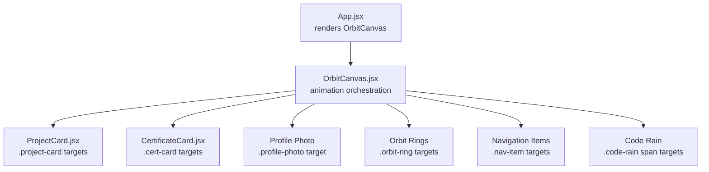
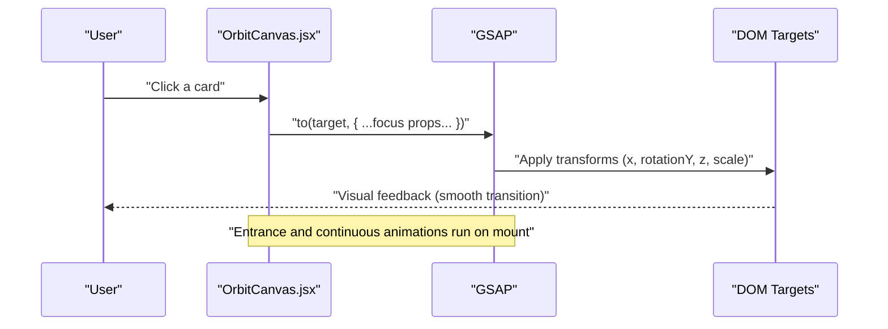
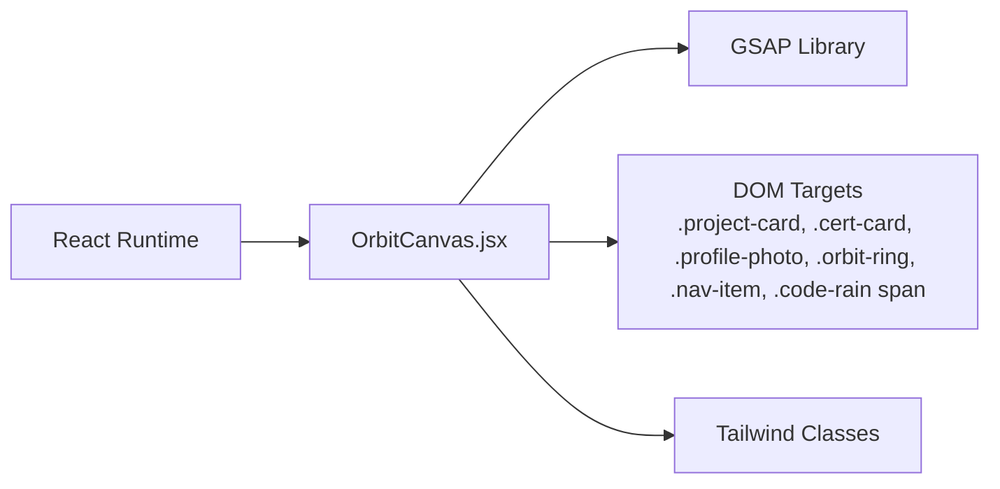

# Animation System

<cite>
**Referenced Files in This Document**
- [OrbitCanvas.jsx](file://src/components/OrbitCanvas.jsx)
- [App.jsx](file://src/App.jsx)
- [CertificateCard.jsx](file://src/components/CertificateCard.jsx)
- [ProjectCard.jsx](file://src/components/ProjectCard.jsx)
- [desain.md](file://desain.md)
</cite>

## Table of Contents
1. [Introduction](#introduction)
2. [Project Structure](#project-structure)
3. [Core Components](#core-components)
4. [Architecture Overview](#architecture-overview)
5. [Detailed Component Analysis](#detailed-component-analysis)
6. [Dependency Analysis](#dependency-analysis)
7. [Performance Considerations](#performance-considerations)
8. [Troubleshooting Guide](#troubleshooting-guide)
9. [Conclusion](#conclusion)
10. [Appendices](#appendices)

## Introduction
This document explains the animation system built with GSAP for an orbital layout. It focuses on how 3D transforms, perspective, and orbital positioning are orchestrated to produce smooth, interactive experiences. The system blends entrance animations, continuous floating and orbital motion, and responsive click-to-focus transitions. It also covers timing, easing, lifecycle management, and performance optimization strategies.

## Project Structure
The animation system centers around a single canvas component that orchestrates multiple animated layers: project cards, certificate cards, a central profile photo, orbit rings, navigation items, and a code rain effect. The app’s entry renders this canvas component.

**Diagram sources**
- [App.jsx:1-7](file://src/App.jsx#L1-L7)
- [OrbitCanvas.jsx:96-192](file://src/components/OrbitCanvas.jsx#L96-L192)
- [ProjectCard.jsx](file://src/components/ProjectCard.jsx)
- [CertificateCard.jsx](file://src/components/CertificateCard.jsx)

**Section sources**
- [App.jsx:1-7](file://src/App.jsx#L1-L7)
- [OrbitCanvas.jsx:96-192](file://src/components/OrbitCanvas.jsx#L96-L192)

## Core Components
- OrbitCanvas: The primary animation controller. It sets up entrance animations, continuous motions, and per-card focus transitions. It uses a scoped GSAP context to automatically clean timelines on unmount.
- ProjectCard and CertificateCard: Presentational components whose DOM nodes are targeted by GSAP selectors (.project-card and .cert-card).
- App: Renders the OrbitCanvas as the top-level view.

Key animation roles:
- Entrance: Cards fade and rotate into place with staggered delays.
- Continuous: Profile floats vertically; orbit rings rotate at different speeds.
- Interaction: Clicking a card triggers a focus animation to bring it forward and enlarge it.

**Section sources**
- [OrbitCanvas.jsx:96-192](file://src/components/OrbitCanvas.jsx#L96-L192)
- [ProjectCard.jsx](file://src/components/ProjectCard.jsx)
- [CertificateCard.jsx](file://src/components/CertificateCard.jsx)
- [App.jsx:1-7](file://src/App.jsx#L1-L7)

## Architecture Overview
The animation pipeline is structured around a single orchestration component that coordinates multiple GSAP timelines. It leverages:
- GSAP context scoping for lifecycle safety
- Transform properties for 3D positioning and perspective
- Staggered and repeated tweens for layered motion
- Event-driven transitions for interactivity

**Diagram sources**
- [OrbitCanvas.jsx:101-192](file://src/components/OrbitCanvas.jsx#L101-L192)

## Detailed Component Analysis

### OrbitCanvas: Animation Orchestration
Responsibilities:
- Mount-time entrance animations for cards, profile, rings, and nav items
- Continuous floating and orbital rotations
- Interactive focus transitions via click handlers
- Lifecycle cleanup using GSAP context

Entrance animations:
- Project and certificate cards enter from off-screen with rotation and opacity changes, staggered for rhythm.
- Profile photo enters with a playful bounce-like ease and slight delay.
- Orbit rings scale and fade in sequence.
- Navigation items slide down with a light stagger.

Continuous animations:
- Profile photo floats up/down infinitely with a smooth sine ease.
- Two orbit rings rotate continuously in opposite directions at different speeds.

Interaction handling:
- On card click, the selected card animates to a centered position with increased z-depth and scale, while reducing rotationY to face the camera.

Lifecycle and cleanup:
- A GSAP context scopes all animations to the canvas ref. On unmount, the context reverts all timelines, preventing leaks and stale callbacks.

Practical customization tips:
- Adjust durations and easings to match brand personality.
- Modify stagger timings to emphasize group dynamics.
- Tune z-depth and scale to balance depth perception and readability.

**Section sources**
- [OrbitCanvas.jsx:96-192](file://src/components/OrbitCanvas.jsx#L96-L192)

### 3D Transforms, Perspective, and Orbital Positioning
Concepts demonstrated:
- Perspective: A strong transform perspective is applied to give realistic 3D appearance during rotation.
- Rotation around Y-axis: Cards tilt toward or away from the center to simulate orbital depth.
- Z-axis translation: Moves cards closer or farther to create a layered depth effect.
- X-axis placement: Distributes cards evenly along the horizontal axis, often indexed for symmetry.

How it relates to visuals:
- Cards orbit around the central profile by combining rotationY and positional offsets.
- Focus mode elevates the selected card’s z-index and removes tilt for emphasis.

Mathematical intuition:
- Orbital positions can be modeled as angular offsets around a central point. While explicit trigonometry is not shown here, the resulting layout mimics radial distribution.
- Perspective and z-depth combine to simulate depth without full 3D matrices.

**Section sources**
- [desain.md:229-359](file://desain.md#L229-L359)

### Animation Timing, Easing, and Staggering
- Entrances use power-based easings for natural deceleration.
- Profile float uses a sine ease for smooth oscillation.
- Rings rotate with linear easing for steady angular velocity.
- Stagger controls the cadence of multi-target animations, enhancing rhythm.

Customization examples:
- Replace power3.out with elastic.out for playful entrances.
- Increase/decrease stagger to tighten or loosen group pacing.
- Swap sine.inOut with expo.inOut for different float energy.

**Section sources**
- [OrbitCanvas.jsx:101-192](file://src/components/OrbitCanvas.jsx#L101-L192)

### Relationship Between State and Visual Animation
State variables:
- Active card tracking enables precise targeting of focus animations.
- Navigation state can drive subtle visual cues but is not directly animated in the referenced code.

Behavior:
- Click handler identifies the target card and applies a focused transform.
- Non-focused cards remain in their orbital positions, preserving spatial context.

Extensibility:
- Add hover states for subtle pre-focus hints.
- Introduce micro-interactions (e.g., glow or border changes) during focus.

**Section sources**
- [OrbitCanvas.jsx:96-192](file://src/components/OrbitCanvas.jsx#L96-L192)

### Animation Lifecycle Management and Cleanup
- GSAP context ensures all timelines are scoped to the component lifetime.
- Revert on unmount guarantees no lingering callbacks or DOM mutations.
- Overwrite policies prevent conflicts when rapid interactions occur.

Best practices:
- Always wrap dynamic animations in a scoped context.
- Use overwrite modes appropriate to your UX (e.g., auto for interactive overrides).
- Avoid global timeline leaks by scoping aggressively.

**Section sources**
- [OrbitCanvas.jsx:101-192](file://src/components/OrbitCanvas.jsx#L101-L192)

### Performance Optimization Techniques
- Prefer transform and opacity for GPU-accelerated animations.
- Minimize DOM reads during animation loops; batch updates when possible.
- Use repeats judiciously; infinite repeats are fine for background effects.
- Keep z-depth changes modest to avoid heavy compositing.
- Scope animations tightly to reduce unnecessary work outside the canvas area.

[No sources needed since this section provides general guidance]

## Dependency Analysis
The animation system depends on:
- GSAP for all tweening and timeline orchestration
- React for component lifecycle and state
- Tailwind classes for baseline styles and masks

**Diagram sources**
- [OrbitCanvas.jsx:1-10](file://src/components/OrbitCanvas.jsx#L1-L10)
- [OrbitCanvas.jsx:96-192](file://src/components/OrbitCanvas.jsx#L96-L192)

**Section sources**
- [OrbitCanvas.jsx:1-10](file://src/components/OrbitCanvas.jsx#L1-L10)
- [OrbitCanvas.jsx:96-192](file://src/components/OrbitCanvas.jsx#L96-L192)

## Performance Considerations
- Use transform3d-friendly properties (x, y, z, rotationY, scale) for hardware acceleration.
- Limit simultaneous long-running animations; stagger or sequence where possible.
- Avoid animating layout-affecting properties frequently.
- Test on lower-powered devices and adjust durations/easings accordingly.

[No sources needed since this section provides general guidance]

## Troubleshooting Guide
Common issues and remedies:
- Animations not stopping on unmount: Ensure the GSAP context is reverted in the component’s cleanup function.
- Stuttering on mobile: Reduce the number of simultaneous transforms or switch to simpler easings.
- Elements not animating: Verify selector specificity and that elements are rendered before animations run.
- Conflicting animations: Use overwrite policies or separate contexts to avoid collisions.

**Section sources**
- [OrbitCanvas.jsx:101-192](file://src/components/OrbitCanvas.jsx#L101-L192)

## Conclusion
The animation system combines GSAP’s robust tweening with React’s declarative lifecycle to deliver a polished, interactive orbital experience. By scoping animations, leveraging 3D transforms thoughtfully, and tuning timing and easing, the system achieves both beauty and performance. Extending it involves adjusting parameters, adding new targets, and maintaining lifecycle discipline.

[No sources needed since this section summarizes without analyzing specific files]

## Appendices

### Practical Customization Playbook
- Change entrance cadence: Adjust stagger and delays for project and certificate cards.
- Tweak focus feel: Modify duration, easing, and z/scale thresholds for the selected card.
- Background motion: Fine-tune ring rotation speeds and float amplitude.
- Brand alignment: Swap easings to match brand personality (e.g., elastic, back, expo).

[No sources needed since this section provides general guidance]