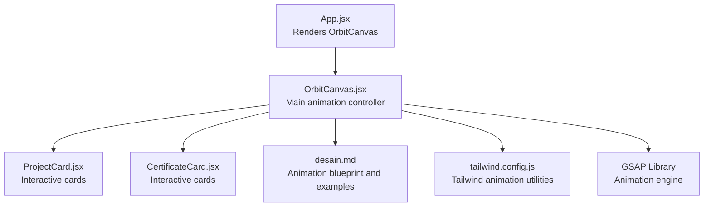
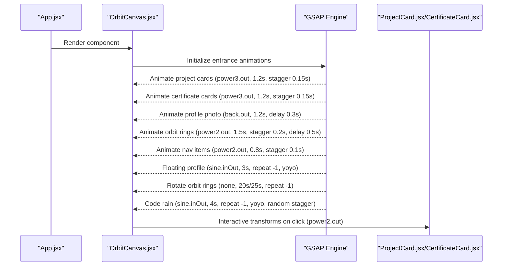
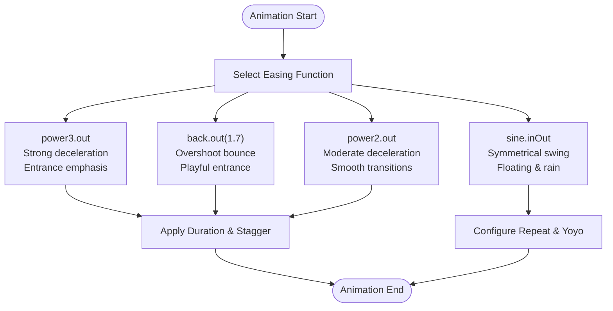
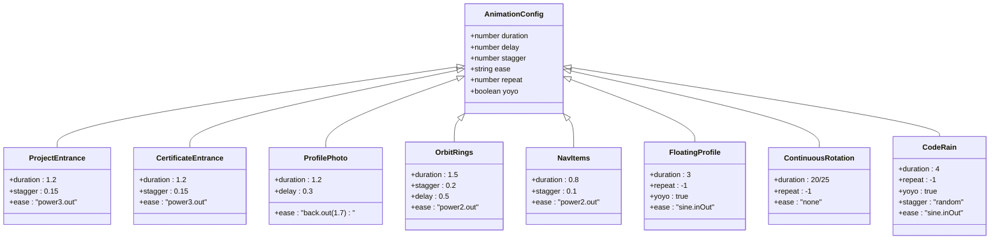
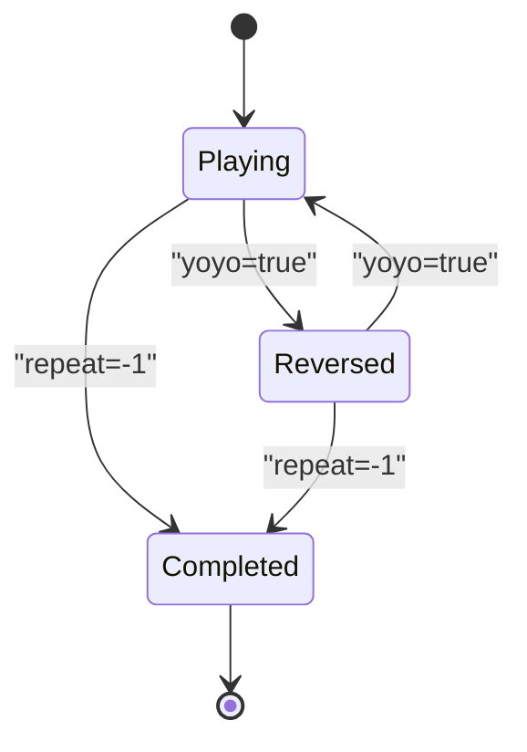
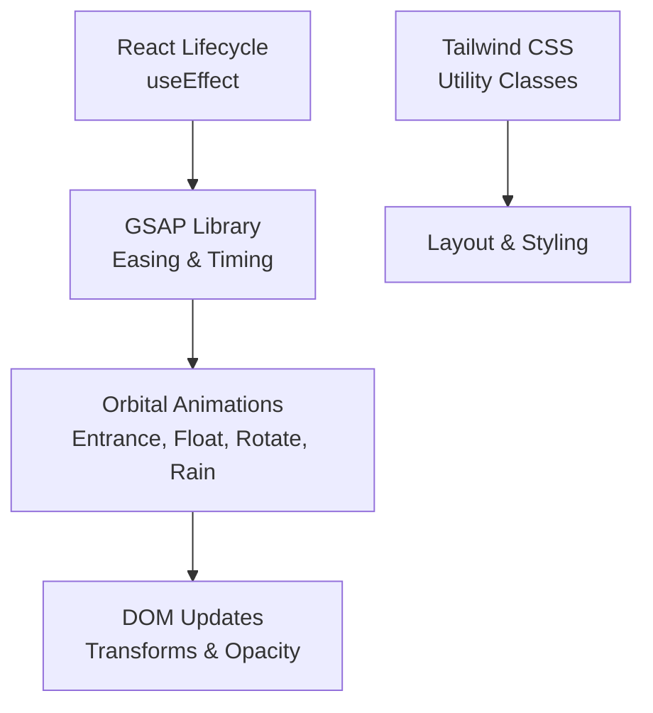

# Animation Timing and Easing

<cite>
**Referenced Files in This Document**
- [OrbitCanvas.jsx](file://src/components/OrbitCanvas.jsx)
- [CertificateCard.jsx](file://src/components/CertificateCard.jsx)
- [ProjectCard.jsx](file://src/components/ProjectCard.jsx)
- [App.jsx](file://src/App.jsx)
- [desain.md](file://desain.md)
- [tailwind.config.js](file://tailwind.config.js)
- [package.json](file://package.json)
</cite>

## Table of Contents
1. [Introduction](#introduction)
2. [Project Structure](#project-structure)
3. [Core Components](#core-components)
4. [Architecture Overview](#architecture-overview)
5. [Detailed Component Analysis](#detailed-component-analysis)
6. [Dependency Analysis](#dependency-analysis)
7. [Performance Considerations](#performance-considerations)
8. [Troubleshooting Guide](#troubleshooting-guide)
9. [Conclusion](#conclusion)

## Introduction
This document provides comprehensive animation timing and easing documentation for the orbital animation system built with GSAP. It covers the temporal aspects of animations including timing functions (power3.out, back.out, sine.inOut, power2.out), duration controls, stagger delays, repeat patterns, yoyo functionality for floating animations, and continuous rotation effects. It also includes performance optimization strategies and practical examples for customizing animation timing across different card types and interaction scenarios.

## Project Structure
The animation system centers around the OrbitCanvas component, which orchestrates entrance animations, floating effects, and continuous rotations. Supporting components include ProjectCard and CertificateCard, while the main App component renders the canvas. Design documentation provides additional context for animation behavior and timing choices.

**Diagram sources**
- [App.jsx](file://src/App.jsx)
- [OrbitCanvas.jsx](file://src/components/OrbitCanvas.jsx)
- [ProjectCard.jsx](file://src/components/ProjectCard.jsx)
- [CertificateCard.jsx](file://src/components/CertificateCard.jsx)
- [desain.md](file://desain.md)
- [tailwind.config.js](file://tailwind.config.js)

**Section sources**
- [App.jsx](file://src/App.jsx)
- [OrbitCanvas.jsx](file://src/components/OrbitCanvas.jsx)
- [ProjectCard.jsx](file://src/components/ProjectCard.jsx)
- [CertificateCard.jsx](file://src/components/CertificateCard.jsx)
- [desain.md](file://desain.md)
- [tailwind.config.js](file://tailwind.config.js)

## Core Components
This section outlines the primary animation elements and their timing configurations:

- Entrance animations for project and certificate cards use power3.out easing with durations of 1.2 seconds and stagger delays of 0.15 seconds.
- Profile photo entrance uses back.out(1.7) easing with a 0.3-second delay and a 1.2-second duration.
- Orbit ring entrance employs power2.out easing with a 1.5-second duration, 0.2-second stagger, and a 0.5-second delay.
- Navigation items use power2.out easing with a 0.8-second duration and 0.1-second stagger.
- Floating effect for the profile photo utilizes sine.inOut easing with a 3-second duration, infinite repeat, and yoyo toggled on.
- Continuous rotation effects for orbit rings use none easing with infinite repeats; one rotates clockwise and the other counterclockwise.
- Code rain animation applies sine.inOut easing with 4-second duration, infinite repeat, yoyo enabled, and randomized stagger.

These configurations demonstrate how timing functions, durations, and repeats shape user-perceived motion and engagement.

**Section sources**
- [OrbitCanvas.jsx](file://src/components/OrbitCanvas.jsx)
- [desain.md](file://desain.md)

## Architecture Overview
The animation architecture integrates React lifecycle hooks with GSAP timelines to coordinate multiple concurrent animations. The OrbitCanvas component initializes animations on mount and cleans up on unmount. Card components receive interactive transforms triggered by click handlers, leveraging power2.out easing for responsive feedback.

**Diagram sources**
- [App.jsx](file://src/App.jsx)
- [OrbitCanvas.jsx](file://src/components/OrbitCanvas.jsx)
- [ProjectCard.jsx](file://src/components/ProjectCard.jsx)
- [CertificateCard.jsx](file://src/components/CertificateCard.jsx)

**Section sources**
- [App.jsx](file://src/App.jsx)
- [OrbitCanvas.jsx](file://src/components/OrbitCanvas.jsx)
- [ProjectCard.jsx](file://src/components/ProjectCard.jsx)
- [CertificateCard.jsx](file://src/components/CertificateCard.jsx)

## Detailed Component Analysis

### Timing Functions and Their Effects
This section explains the selected easing functions and their impact on perceived motion:

- power3.out: Provides a strong deceleration curve suitable for entrance animations, emphasizing arrival and stability. Used for project and certificate card entries.
- back.out(1.7): Introduces overshoot for a playful bounce effect during profile photo entrance, enhancing visual delight.
- power2.out: Offers moderate deceleration for smoother transitions, applied to orbit rings and navigation items.
- sine.inOut: Produces symmetrical acceleration-deceleration for fluid oscillation, ideal for floating and code rain effects.

**Diagram sources**
- [OrbitCanvas.jsx](file://src/components/OrbitCanvas.jsx)

**Section sources**
- [OrbitCanvas.jsx](file://src/components/OrbitCanvas.jsx)

### Duration Controls and Stagger Delays
Duration controls define the pacing of animations, while stagger delays create rhythmic sequencing:

- Entrances: 1.2-second duration balances visibility and snappiness for project and certificate cards.
- Profile photo: 1.2-second duration with 0.3-second delay establishes a layered reveal.
- Orbit rings: 1.5-second duration with 0.2-second stagger creates a cascading effect.
- Navigation: 0.8-second duration with 0.1-second stagger ensures quick, responsive feedback.
- Floating: 3-second duration produces a gentle, noticeable oscillation.
- Code rain: 4-second duration with randomized stagger adds organic variation.

**Diagram sources**
- [OrbitCanvas.jsx](file://src/components/OrbitCanvas.jsx)

**Section sources**
- [OrbitCanvas.jsx](file://src/components/OrbitCanvas.jsx)

### Repeat Patterns and Yoyo Functionality
Repeat patterns enable continuous motion, while yoyo toggles reverse playback for seamless loops:

- Floating profile: Infinite repeat with yoyo creates a natural up-and-down motion.
- Continuous orbit rings: Infinite repeat with none easing produces steady rotation.
- Code rain: Infinite repeat with yoyo and randomized stagger generates dynamic, organic movement.

**Diagram sources**
- [OrbitCanvas.jsx](file://src/components/OrbitCanvas.jsx)

**Section sources**
- [OrbitCanvas.jsx](file://src/components/OrbitCanvas.jsx)

### Practical Examples: Customizing Animation Timing
Tailor animation timing for different card types and interaction scenarios:

- Project cards: Use power3.out with 1.2-second duration and 0.15-second stagger for a bold entrance.
- Certificate cards: Mirror project card timing for consistency.
- Profile photo: Apply back.out(1.7) with 1.2-second duration and 0.3-second delay for a playful reveal.
- Orbit rings: Use power2.out with 1.5-second duration, 0.2-second stagger, and 0.5-second delay for a cascading effect.
- Navigation items: Use power2.out with 0.8-second duration and 0.1-second stagger for quick feedback.
- Floating animation: Configure sine.inOut with 3-second duration, infinite repeat, and yoyo for subtle motion.
- Continuous rotation: Set none easing with 20/25-second duration and infinite repeat for steady orbits.
- Code rain: Use sine.inOut with 4-second duration, infinite repeat, yoyo, and randomized stagger for organic flow.

**Section sources**
- [OrbitCanvas.jsx](file://src/components/OrbitCanvas.jsx)
- [desain.md](file://desain.md)

## Dependency Analysis
The animation system relies on GSAP for advanced timing and easing capabilities. Dependencies and integrations include:

- GSAP library: Provides easing functions, timeline control, and performance optimizations.
- React lifecycle: useEffect manages animation initialization and cleanup.
- Tailwind CSS: Supplies utility classes for layout and optional animation helpers.

**Diagram sources**
- [OrbitCanvas.jsx](file://src/components/OrbitCanvas.jsx)
- [tailwind.config.js](file://tailwind.config.js)
- [package.json](file://package.json)

**Section sources**
- [OrbitCanvas.jsx](file://src/components/OrbitCanvas.jsx)
- [tailwind.config.js](file://tailwind.config.js)
- [package.json](file://package.json)

## Performance Considerations
Optimize animation performance through efficient timing calculations and smooth curves:

- Prefer hardware-accelerated properties (transform and opacity) to minimize layout thrashing.
- Use appropriate easing functions that match the motion intent without excessive computation.
- Control frame rates by selecting sensible durations and avoiding overly complex stagger sequences.
- Leverage infinite repeats judiciously; monitor memory and CPU usage for long-running animations.
- Consolidate animations into timelines where possible to reduce redundant updates.

[No sources needed since this section provides general guidance]

## Troubleshooting Guide
Common issues and resolutions for animation timing and easing:

- Easing mismatch: If animations feel abrupt or sluggish, adjust easing functions (e.g., switch from power2.out to power3.out for stronger deceleration).
- Stagger conflicts: Reduce stagger values or increase durations to prevent overlapping and visual chaos.
- Repeat anomalies: Verify repeat and yoyo settings for continuous loops; ensure consistent easing for seamless reversals.
- Performance drops: Simplify easing complexity, reduce the number of animated elements, or lower animation frequencies.
- Cleanup issues: Ensure GSAP context is reverted on component unmount to prevent lingering animations.

**Section sources**
- [OrbitCanvas.jsx](file://src/components/OrbitCanvas.jsx)

## Conclusion
The orbital animation system demonstrates thoughtful timing and easing choices that enhance user experience through rhythm, continuity, and responsiveness. By aligning easing functions with motion intent, carefully tuning durations and staggertime, and leveraging repeat and yoyo patterns, the system achieves smooth, engaging animations. Adhering to performance best practices ensures optimal delivery across devices and browsers.

[No sources needed since this section summarizes without analyzing specific files]