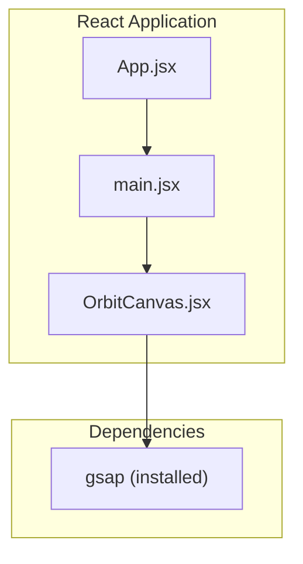
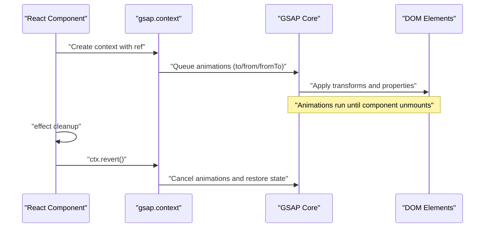
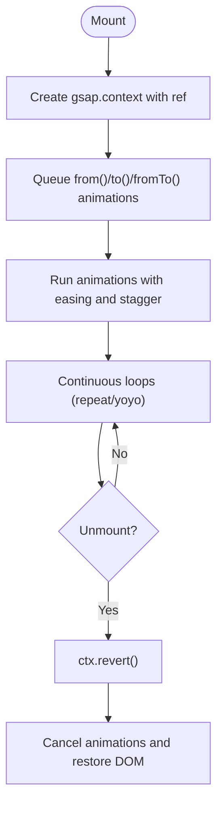
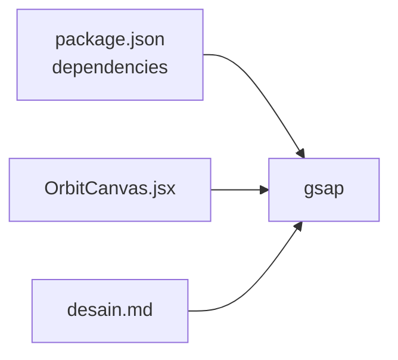

# GSAP Fundamentals

<cite>
**Referenced Files in This Document**
- [package.json](file://package.json)
- [desain.md](file://desain.md)
- [OrbitCanvas.jsx](file://src/components/OrbitCanvas.jsx)
</cite>

## Table of Contents
1. [Introduction](#introduction)
2. [Project Structure](#project-structure)
3. [Core Components](#core-components)
4. [Architecture Overview](#architecture-overview)
5. [Detailed Component Analysis](#detailed-component-analysis)
6. [Dependency Analysis](#dependency-analysis)
7. [Performance Considerations](#performance-considerations)
8. [Troubleshooting Guide](#troubleshooting-guide)
9. [Conclusion](#conclusion)

## Introduction
This document explains the fundamentals of GSAP as used in the portfolio project. It focuses on how animations are initialized and managed within React components, how to create timelines and sequences, and how to leverage staggered animations, easing, and lifecycle-aware cleanup to prevent memory leaks. Practical examples are drawn from the project’s OrbitCanvas component and design documentation.

## Project Structure
The project integrates GSAP via a standard npm installation and uses it inside React functional components with hooks. The primary GSAP usage appears in the OrbitCanvas component, while design documentation provides additional examples and explanations of transforms and easing.

**Diagram sources**
- [package.json](file://package.json)
- [OrbitCanvas.jsx](file://src/components/OrbitCanvas.jsx)

**Section sources**
- [package.json](file://package.json)
- [OrbitCanvas.jsx](file://src/components/OrbitCanvas.jsx)

## Core Components
- GSAP import and initialization: The OrbitCanvas component imports gsap and uses gsap.context to scope animations to a DOM container, ensuring automatic cleanup when the component unmounts.
- Animation primitives used:
  - to(): Animates properties from current values to target values.
  - from(): Animates from target values to current values.
  - fromTo(): Animates from a starting set of values to an ending set.
  - Stagger: Delays repeated animations across multiple elements.
- Easing and timing: Eases such as power2.out, power3.out, back.out(1.7), sine.inOut, and none are used to shape motion.
- Looping and repeats: repeat and yoyo are used to create continuous floating and orbit effects.
- Cleanup: The gsap.context returns a revert function invoked in the component’s effect cleanup to cancel animations and restore state.

Practical example references:
- [OrbitCanvas.jsx](file://src/components/OrbitCanvas.jsx)
- [desain.md](file://desain.md)

**Section sources**
- [OrbitCanvas.jsx](file://src/components/OrbitCanvas.jsx)
- [desain.md](file://desain.md)

## Architecture Overview
GSAP is integrated at the component level. The OrbitCanvas component creates a scoped animation context around a ref (canvasRef). Inside this context, multiple animations are queued. On unmount, the context’s revert function cancels all animations and restores DOM state.

**Diagram sources**
- [OrbitCanvas.jsx](file://src/components/OrbitCanvas.jsx)

**Section sources**
- [OrbitCanvas.jsx](file://src/components/OrbitCanvas.jsx)

## Detailed Component Analysis

### OrbitCanvas Component
The OrbitCanvas component demonstrates:
- Context-scoped animations: gsap.context wraps all animations targeting ".project-card", ".cert-card", ".profile-photo", ".orbit-ring", ".nav-item", and ".code-rain span".
- Entrance and ambient animations: from() for entrance, to() for continuous motion and rotation.
- Staggered animations: stagger controls delays across groups of elements.
- Easing and timing: power3.out, power2.out, back.out(1.7), sine.inOut, and none for constant rotation.
- Lifecycle cleanup: useEffect returns ctx.revert() to cancel animations and restore DOM on unmount.

**Diagram sources**
- [OrbitCanvas.jsx](file://src/components/OrbitCanvas.jsx)

**Section sources**
- [OrbitCanvas.jsx](file://src/components/OrbitCanvas.jsx)

### Animation Methods and Patterns
- to(): Used to animate properties toward a target (e.g., floating profile photo, ring rotations).
- from(): Used to animate elements into place from off-screen or hidden states.
- fromTo(): Used to animate between explicit start and end states (e.g., code rain vertical movement).
- Stagger: Applied to groups to create wave-like or cascading effects across multiple elements.

Example references:
- [OrbitCanvas.jsx](file://src/components/OrbitCanvas.jsx)
- [desain.md](file://desain.md)

**Section sources**
- [OrbitCanvas.jsx](file://src/components/OrbitCanvas.jsx)
- [desain.md](file://desain.md)

### Easing and Timing
Commonly used easers in the project:
- power2.out, power3.out: Smooth deceleration for entrance and subtle transitions.
- back.out(1.7): Slight overshoot for a playful entrance.
- sine.inOut: Smooth, fluid oscillation for floating effects.
- none: Constant speed for continuous rotation.

Example references:
- [OrbitCanvas.jsx](file://src/components/OrbitCanvas.jsx)
- [desain.md](file://desain.md)

**Section sources**
- [OrbitCanvas.jsx](file://src/components/OrbitCanvas.jsx)
- [desain.md](file://desain.md)

### Animation Sequencing and Chaining
While the OrbitCanvas component primarily queues parallel animations, chaining can be achieved by:
- Using gsap.timeline() to sequence multiple tweens.
- Leveraging staggered animations to create layered, timed effects across groups.

Example references:
- [OrbitCanvas.jsx](file://src/components/OrbitCanvas.jsx)

**Section sources**
- [OrbitCanvas.jsx](file://src/components/OrbitCanvas.jsx)

## Dependency Analysis
GSAP is installed as a project dependency and imported directly in the OrbitCanvas component. The design documentation also references GSAP usage for interactive card animations.

**Diagram sources**
- [package.json](file://package.json)
- [OrbitCanvas.jsx](file://src/components/OrbitCanvas.jsx)
- [desain.md](file://desain.md)

**Section sources**
- [package.json](file://package.json)
- [OrbitCanvas.jsx](file://src/components/OrbitCanvas.jsx)
- [desain.md](file://desain.md)

## Performance Considerations
- Prefer transform and opacity for GPU-accelerated animations to minimize layout thrashing.
- Use stagger judiciously to avoid overwhelming the browser with too many simultaneous tweens.
- Leverage repeat and yoyo for lightweight looping; ensure cleanup on unmount to prevent lingering timers.
- Keep easing choices consistent with the intended motion; overly complex easers can increase computation overhead.

[No sources needed since this section provides general guidance]

## Troubleshooting Guide
- Animations persist after unmount: Ensure gsap.context is used and ctx.revert() is returned in the effect cleanup.
- Unexpected element positions: Verify selectors and initial transforms; use gsap.set() to establish baseline styles before animations.
- Stagger not working: Confirm stagger is applied to the correct property and that the target elements exist in the DOM during the animation queue.
- Easing issues: Validate ease names and ensure they are supported; test with simpler easers if problems arise.

**Section sources**
- [OrbitCanvas.jsx](file://src/components/OrbitCanvas.jsx)

## Conclusion
The portfolio project uses GSAP effectively to create immersive, lifecycle-aware animations within React. By scoping animations to component lifecycles, leveraging to/from/fromTo, staggering, and easing, and cleaning up on unmount, the project achieves smooth, maintainable motion. These patterns provide a strong foundation for extending animations across the application.