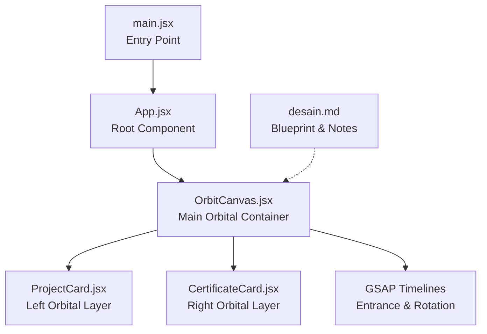
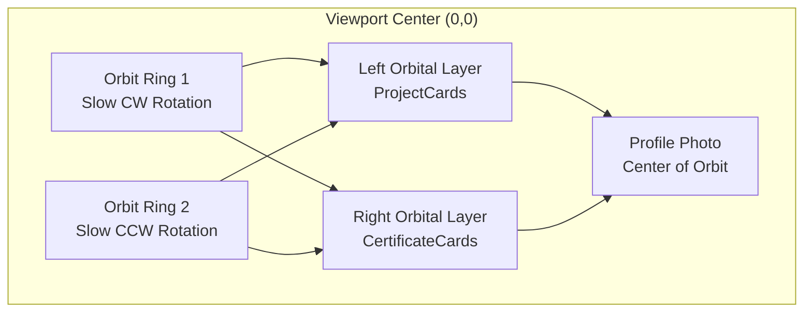
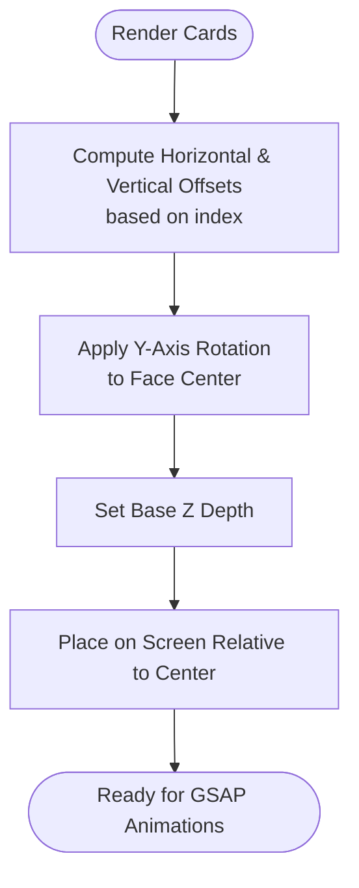
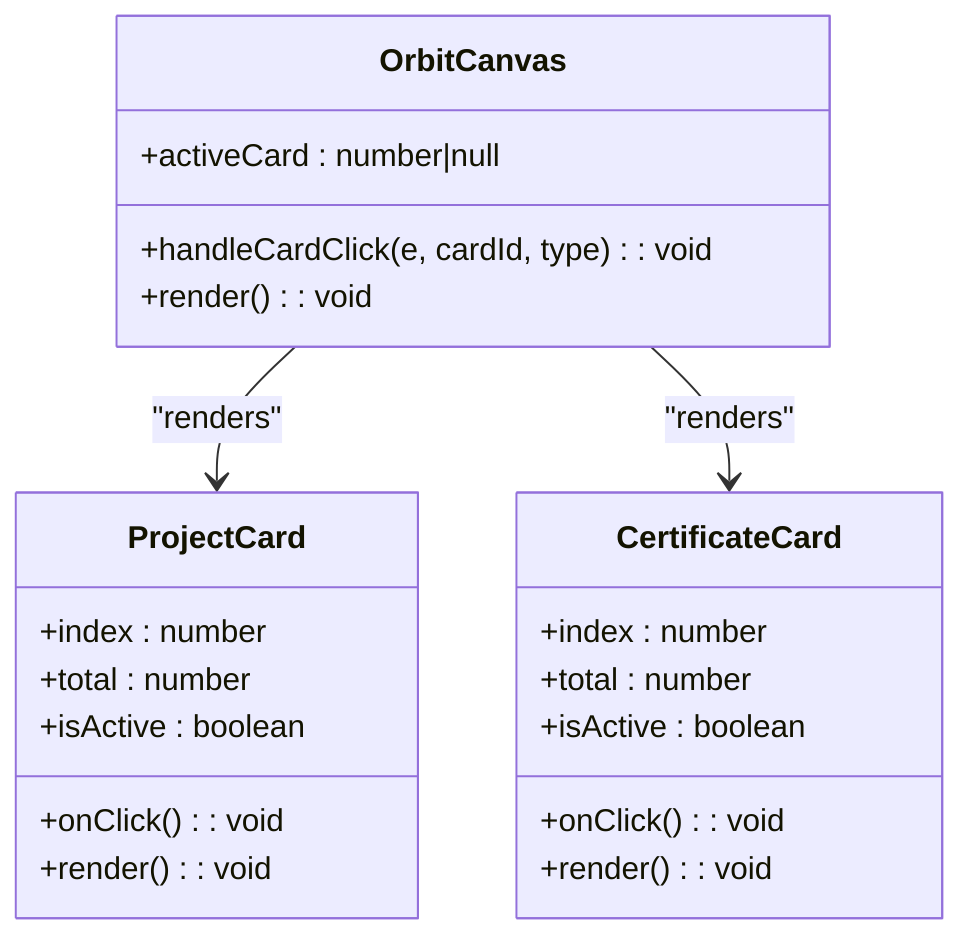
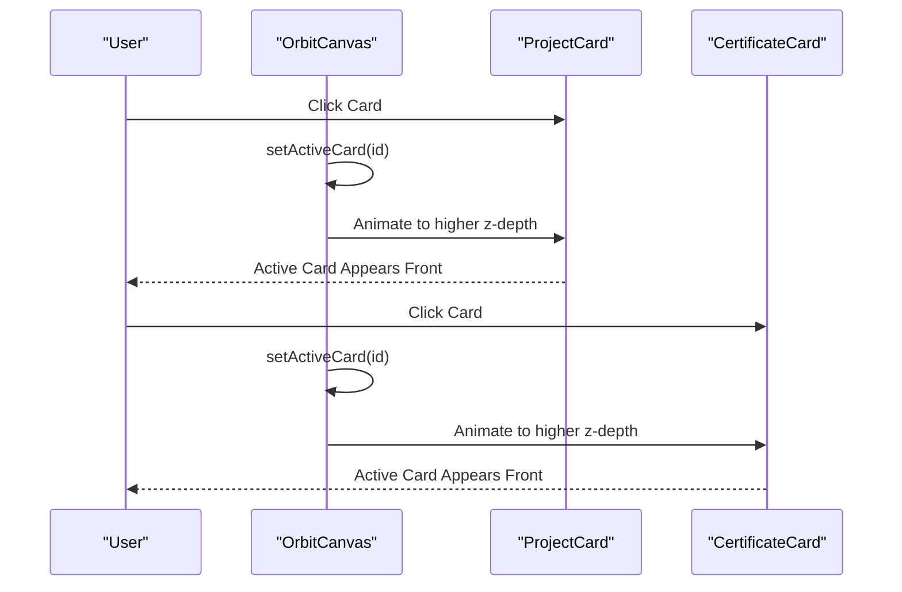
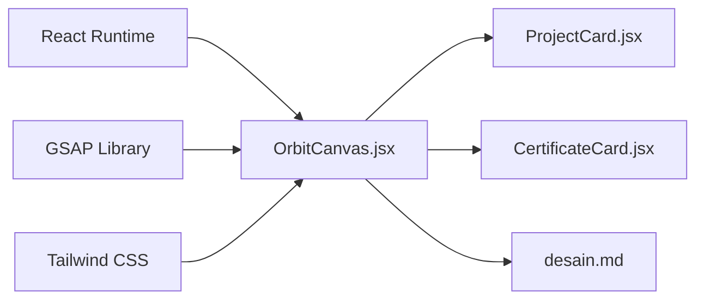

# Orbital Mechanics

<cite>
**Referenced Files in This Document**
- [OrbitCanvas.jsx](file://src/components/OrbitCanvas.jsx)
- [ProjectCard.jsx](file://src/components/ProjectCard.jsx)
- [CertificateCard.jsx](file://src/components/CertificateCard.jsx)
- [App.jsx](file://src/App.jsx)
- [main.jsx](file://src/main.jsx)
- [index.css](file://src/index.css)
- [desain.md](file://desain.md)
- [package.json](file://package.json)
</cite>

## Table of Contents
1. [Introduction](#introduction)
2. [Project Structure](#project-structure)
3. [Core Components](#core-components)
4. [Architecture Overview](#architecture-overview)
5. [Detailed Component Analysis](#detailed-component-analysis)
6. [Dependency Analysis](#dependency-analysis)
7. [Performance Considerations](#performance-considerations)
8. [Troubleshooting Guide](#troubleshooting-guide)
9. [Conclusion](#conclusion)
10. [Appendices](#appendices)

## Introduction
This document explains the orbital mechanics behind the 3D orbital animation system. It focuses on how cards are positioned around a central profile photo using 3D transforms and GSAP timelines. The system uses a combination of:
- Angular spacing around a central axis
- Vertical and horizontal offsets
- Perspective and 3D transform matrices
- Z-index stacking order via z-depth
- Coordinate systems aligned to the screen’s center

The goal is to provide a mathematically grounded understanding of how orbital radii, angular spacing, and z-index stacking are computed and how to customize parameters to create additional orbital layers.

## Project Structure
The orbital system is implemented in a small set of React components and a design blueprint. The main entry renders the OrbitCanvas, which orchestrates entrance animations, slow orbital rotations, and interactive card focus.

**Diagram sources**
- [main.jsx:1-11](file://src/main.jsx#L1-L11)
- [App.jsx:1-8](file://src/App.jsx#L1-L8)
- [OrbitCanvas.jsx:96-382](file://src/components/OrbitCanvas.jsx#L96-L382)
- [ProjectCard.jsx:1-32](file://src/components/ProjectCard.jsx#L1-L32)
- [CertificateCard.jsx:1-31](file://src/components/CertificateCard.jsx#L1-L31)
- [desain.md:1-381](file://desain.md#L1-L381)

**Section sources**
- [main.jsx:1-11](file://src/main.jsx#L1-L11)
- [App.jsx:1-8](file://src/App.jsx#L1-L8)
- [OrbitCanvas.jsx:96-382](file://src/components/OrbitCanvas.jsx#L96-L382)
- [ProjectCard.jsx:1-32](file://src/components/ProjectCard.jsx#L1-L32)
- [CertificateCard.jsx:1-31](file://src/components/CertificateCard.jsx#L1-L31)
- [desain.md:1-381](file://desain.md#L1-L381)

## Core Components
- OrbitCanvas: Central container that sets up entrance animations, slow orbital ring rotations, and handles card click interactions. It positions two orbital layers (left/right) around the central profile photo.
- ProjectCard: Left-side orbital layer cards with vertical offsets and slight horizontal spread, rotated to face the center.
- CertificateCard: Right-side orbital layer cards mirroring ProjectCard with mirrored offsets and rotation direction.

Key orbital parameters observed:
- Angular spacing: Cards are distributed horizontally with fixed offsets per index.
- Vertical distribution: Cards are offset vertically to form a curved arc around the center.
- Perspective: 3D transforms preserve depth and orientation during rotation.
- Z-index stacking: Active card is raised to a higher z-depth so it appears in front of the profile.

**Section sources**
- [OrbitCanvas.jsx:96-382](file://src/components/OrbitCanvas.jsx#L96-L382)
- [ProjectCard.jsx:1-32](file://src/components/ProjectCard.jsx#L1-L32)
- [CertificateCard.jsx:1-31](file://src/components/CertificateCard.jsx#L1-L31)

## Architecture Overview
The orbital system combines static HTML/CSS layout with dynamic GSAP-driven animations. The coordinate system is centered at the viewport’s center, with positive X to the right and positive Y downward. Cards are positioned relative to this center and animated using 3D transforms.

**Diagram sources**
- [OrbitCanvas.jsx:286-342](file://src/components/OrbitCanvas.jsx#L286-L342)
- [OrbitCanvas.jsx:290-294](file://src/components/OrbitCanvas.jsx#L290-L294)
- [OrbitCanvas.jsx:315-341](file://src/components/OrbitCanvas.jsx#L315-L341)

## Detailed Component Analysis

### Orbital Positioning Algorithm
The orbital positioning algorithm distributes cards around the central profile photo using:
- Index-based horizontal offsets
- Index-based vertical offsets
- Fixed 3D rotations to face the center
- Optional z-depth adjustments for stacking

Implementation highlights:
- Horizontal offsets: ProjectCards use increasing offsets; CertificateCards mirror with decreasing offsets.
- Vertical offsets: Both layers apply a small vertical spread to form an arc-like arrangement.
- 3D rotations: Cards are rotated around the Y-axis to face the center; left layer rotates positively, right layer negatively.
- Z-depth: Active card is raised to a higher z-depth to appear in front of the profile.

**Diagram sources**
- [ProjectCard.jsx:2-4](file://src/components/ProjectCard.jsx#L2-L4)
- [CertificateCard.jsx:2-3](file://src/components/CertificateCard.jsx#L2-L3)
- [ProjectCard.jsx:15-16](file://src/components/ProjectCard.jsx#L15-L16)
- [CertificateCard.jsx:13-15](file://src/components/CertificateCard.jsx#L13-L15)

**Section sources**
- [ProjectCard.jsx:1-32](file://src/components/ProjectCard.jsx#L1-L32)
- [CertificateCard.jsx:1-31](file://src/components/CertificateCard.jsx#L1-L31)

### Angular Spacing and Orbital Radii
While the current implementation uses explicit offsets rather than strict polar coordinates, the concept aligns with orbital mechanics:
- Angular spacing: Cards are spaced horizontally with fixed increments per index.
- Orbital radius: The distance from the center is implicitly controlled by the magnitude of horizontal offsets and vertical spread.
- Perspective: 3D transforms preserve depth perception during rotation.

To calculate orbital radii and angular spacing in a polar model:
- Angular spacing per card: Δθ = 2π / N, where N is the total number of cards.
- Orbital radius: r = sqrt(x^2 + y^2), where x and y are the horizontal and vertical offsets.
- Z-index stacking: Higher z-depth moves a card in front of others.

Note: The current implementation uses explicit offsets rather than polar coordinates. Polar modeling would require converting indices to angles and computing Cartesian coordinates accordingly.

**Section sources**
- [ProjectCard.jsx:2-4](file://src/components/ProjectCard.jsx#L2-L4)
- [CertificateCard.jsx:2-3](file://src/components/CertificateCard.jsx#L2-L3)

### Perspective Calculations and 3D Transform Matrices
The system relies on CSS 3D transforms and GSAP’s 3D capabilities:
- Transform perspective: Provides depth perception for 3D rotations.
- Preserve-3d: Ensures child transforms remain in 3D space.
- Rotation around Y-axis: Faces cards toward the center.
- Z-depth: Controls stacking order.

**Diagram sources**
- [ProjectCard.jsx:1](file://src/components/ProjectCard.jsx#L1-L32)
- [CertificateCard.jsx:1](file://src/components/CertificateCard.jsx#L1-L31)
- [OrbitCanvas.jsx:96-382](file://src/components/OrbitCanvas.jsx#L96-L382)

**Section sources**
- [ProjectCard.jsx:14-16](file://src/components/ProjectCard.jsx#L14-L16)
- [CertificateCard.jsx:13-15](file://src/components/CertificateCard.jsx#L13-L15)
- [OrbitCanvas.jsx:101-190](file://src/components/OrbitCanvas.jsx#L101-L190)

### Z-Index Stacking Order
The z-index stacking order is managed by raising the active card’s z-depth:
- Base z-depth for inactive cards
- Elevated z-depth for the active card
- Visual effect: Active card appears in front of the profile photo

**Diagram sources**
- [OrbitCanvas.jsx:192-226](file://src/components/OrbitCanvas.jsx#L192-L226)
- [ProjectCard.jsx:1-32](file://src/components/ProjectCard.jsx#L1-L32)
- [CertificateCard.jsx:1-31](file://src/components/CertificateCard.jsx#L1-L31)

**Section sources**
- [OrbitCanvas.jsx:192-226](file://src/components/OrbitCanvas.jsx#L192-L226)

### Creating Additional Orbital Layers
To add more orbital layers:
- Define new groups of cards (e.g., “Layer 3”, “Layer 4”).
- Assign distinct horizontal and vertical offsets per index.
- Apply mirrored or complementary rotations to maintain visual balance.
- Use separate GSAP timelines for each layer’s entrance and rotation.
- Adjust z-depth ranges to prevent overlap and ensure stacking order.

Example steps:
- Add a third orbital ring element in the container.
- Create a new card component for the third layer with its own offsets and rotation.
- Introduce a new GSAP timeline for the third layer’s entrance and rotation.
- Manage active states per layer to avoid conflicts.

**Section sources**
- [OrbitCanvas.jsx:286-342](file://src/components/OrbitCanvas.jsx#L286-L342)
- [OrbitCanvas.jsx:101-190](file://src/components/OrbitCanvas.jsx#L101-L190)

## Dependency Analysis
The orbital system depends on React for rendering and GSAP for smooth 3D animations. Tailwind CSS provides styling, while the design blueprint documents intended behavior.

**Diagram sources**
- [package.json:11-15](file://package.json#L11-L15)
- [OrbitCanvas.jsx:1-5](file://src/components/OrbitCanvas.jsx#L1-L5)
- [ProjectCard.jsx:1](file://src/components/ProjectCard.jsx#L1-L32)
- [CertificateCard.jsx:1](file://src/components/CertificateCard.jsx#L1-L31)
- [desain.md:229-284](file://desain.md#L229-L284)

**Section sources**
- [package.json:11-15](file://package.json#L11-L15)
- [OrbitCanvas.jsx:1-5](file://src/components/OrbitCanvas.jsx#L1-L5)

## Performance Considerations
- Prefer GPU-accelerated transforms: Use transform and opacity for smoother animations.
- Limit DOM reads/writes: Batch updates and leverage GSAP’s internal optimization.
- Control animation scope: Use gsap.context to scope timelines and revert them on unmount.
- Avoid excessive z-depth stacking: Keep z-values reasonable to prevent compositing overhead.
- Optimize images: Use appropriately sized images for cards to reduce paint cost.

[No sources needed since this section provides general guidance]

## Troubleshooting Guide
Common issues and resolutions:
- Cards not facing the center: Verify Y-axis rotation values and ensure transform-style preserves 3D.
- Stacking conflicts: Ensure active card receives the highest z-depth and inactive cards revert to base z.
- Animation timing: Use staggered entrance animations carefully to avoid overlapping with orbital rotations.
- Perspective issues: Confirm transform perspective is set appropriately for 3D effects.

**Section sources**
- [OrbitCanvas.jsx:101-190](file://src/components/OrbitCanvas.jsx#L101-L190)
- [ProjectCard.jsx:14-16](file://src/components/ProjectCard.jsx#L14-L16)
- [CertificateCard.jsx:13-15](file://src/components/CertificateCard.jsx#L13-L15)

## Conclusion
The orbital animation system achieves a visually compelling 3D orbit around a central profile photo using React and GSAP. While the current implementation uses explicit offsets, the underlying principles align with orbital mechanics: angular spacing, radial distances, and z-depth stacking. By extending the system with additional layers and refining the offset model, developers can create richer orbital experiences with predictable mathematical behavior.

[No sources needed since this section summarizes without analyzing specific files]

## Appendices

### Appendix A: Coordinate Systems and Notation
- Viewport origin: Center of the screen (0,0)
- Positive X: Right
- Positive Y: Down
- Z-depth: Higher values move cards in front of others
- Rotation: Around Y-axis to face the center

[No sources needed since this section provides general guidance]

### Appendix B: Customization Examples
- Change orbital radius: Adjust horizontal offsets per index.
- Modify angular spacing: Increase/decrease the increment per index.
- Adjust vertical spread: Modify vertical offsets to change arc curvature.
- Add layers: Duplicate card components with new offsets and rotations.
- Tune entrance animations: Adjust durations, easing, and staggering.

**Section sources**
- [ProjectCard.jsx:2-4](file://src/components/ProjectCard.jsx#L2-L4)
- [CertificateCard.jsx:2-3](file://src/components/CertificateCard.jsx#L2-L3)
- [OrbitCanvas.jsx:101-190](file://src/components/OrbitCanvas.jsx#L101-L190)