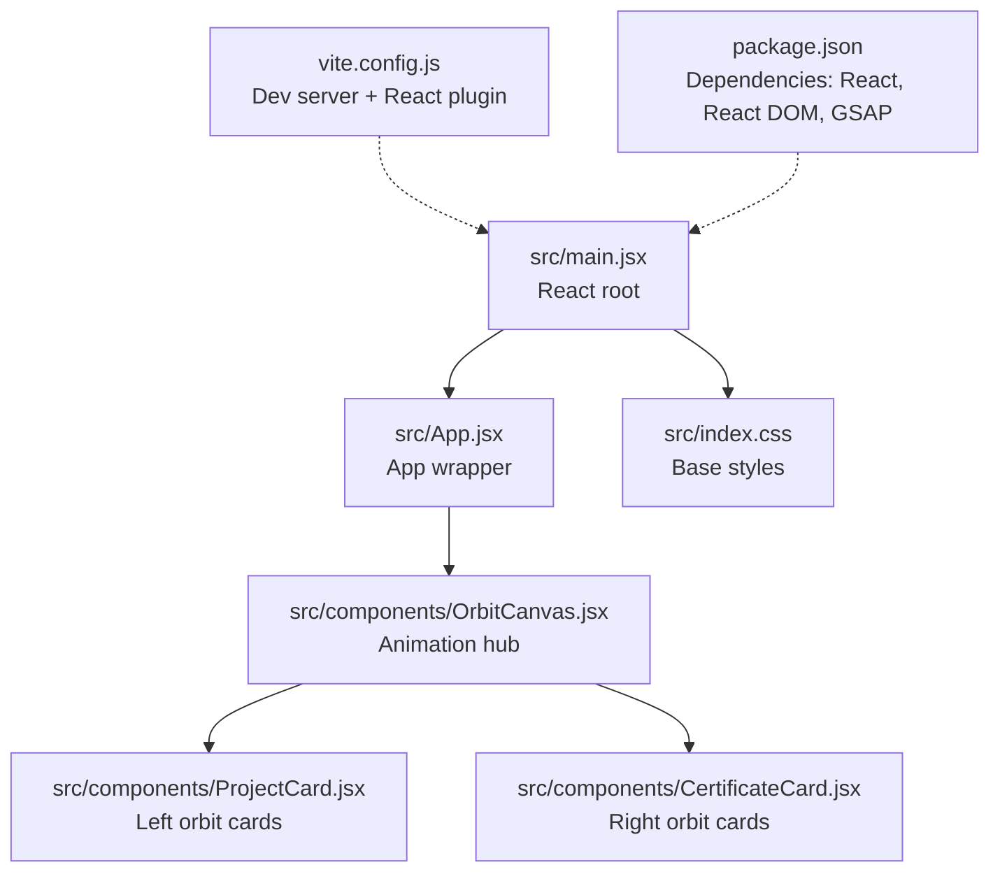
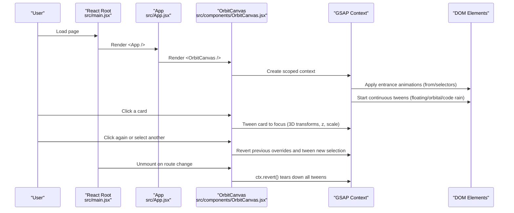
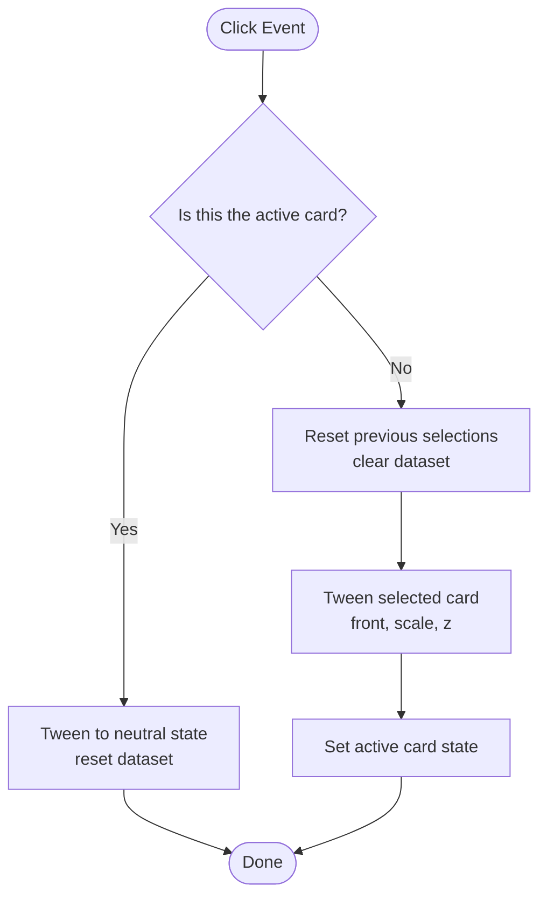
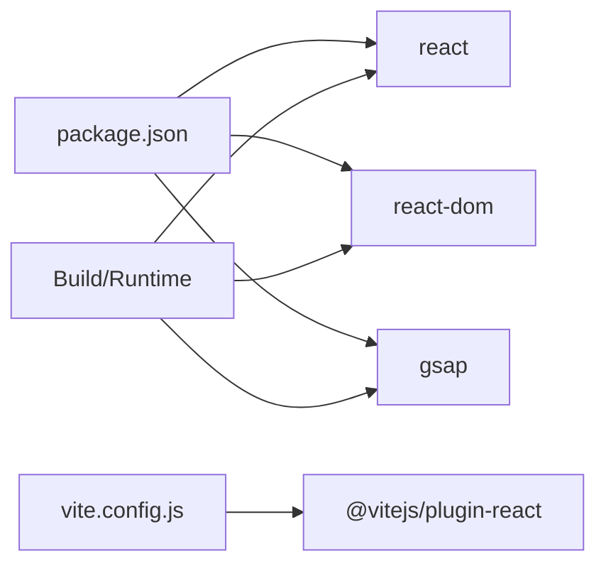

# Performance Optimization

<cite>
**Referenced Files in This Document**
- [package.json](file://package.json)
- [vite.config.js](file://vite.config.js)
- [src/main.jsx](file://src/main.jsx)
- [src/App.jsx](file://src/App.jsx)
- [src/index.css](file://src/index.css)
- [src/components/OrbitCanvas.jsx](file://src/components/OrbitCanvas.jsx)
- [src/components/ProjectCard.jsx](file://src/components/ProjectCard.jsx)
- [src/components/CertificateCard.jsx](file://src/components/CertificateCard.jsx)
- [desain.md](file://desain.md)
</cite>

## Table of Contents
1. [Introduction](#introduction)
2. [Project Structure](#project-structure)
3. [Core Components](#core-components)
4. [Architecture Overview](#architecture-overview)
5. [Detailed Component Analysis](#detailed-component-analysis)
6. [Dependency Analysis](#dependency-analysis)
7. [Performance Considerations](#performance-considerations)
8. [Troubleshooting Guide](#troubleshooting-guide)
9. [Conclusion](#conclusion)

## Introduction
This document focuses on performance optimization for animation efficiency and resource management in the portfolio project. It covers memory cleanup and GSAP context lifecycle, animation teardown, GPU acceleration benefits, browser rendering optimization, throttling strategies, layout thrashing prevention, 3D transform optimization, and monitoring techniques to maintain smooth animations across devices and browsers.

## Project Structure
The project is a React application using Vite for development and Tailwind CSS for styling. Animation logic is centralized in a single canvas component that orchestrates entrance animations, continuous floating and orbital motions, and interactive card focus transitions. GSAP is used for declarative timelines and context-scoped selectors.



**Diagram sources**
- [src/main.jsx:1-11](file://src/main.jsx#L1-L11)
- [src/App.jsx:1-8](file://src/App.jsx#L1-L8)
- [src/components/OrbitCanvas.jsx:1-383](file://src/components/OrbitCanvas.jsx#L1-L383)
- [src/components/ProjectCard.jsx:1-32](file://src/components/ProjectCard.jsx#L1-L32)
- [src/components/CertificateCard.jsx:1-31](file://src/components/CertificateCard.jsx#L1-L31)
- [vite.config.js:1-7](file://vite.config.js#L1-L7)
- [package.json:1-24](file://package.json#L1-L24)

**Section sources**
- [src/main.jsx:1-11](file://src/main.jsx#L1-L11)
- [src/App.jsx:1-8](file://src/App.jsx#L1-L8)
- [vite.config.js:1-7](file://vite.config.js#L1-L7)
- [package.json:1-24](file://package.json#L1-L24)

## Core Components
- OrbitCanvas: Orchestrates entrance animations, continuous floating and orbital rotations, and code rain. Uses GSAP context to scope selectors and auto-revert on unmount. Implements click-to-focus transitions with 3D transforms and z-index stacking.
- ProjectCard and CertificateCard: Presentational components with 3D transforms and hover/focus states. They rely on shared CSS classes and inline transforms to achieve orbit positioning and perspective effects.
- Index CSS: Establishes base styles, scrollbars, and global box sizing. Tailwind utilities are used extensively for responsive layouts and effects.

Key performance-relevant aspects:
- GSAP context scoping and automatic revert on unmount prevent lingering tweens and memory leaks.
- Continuous tweens (floating, orbital, code rain) are designed to loop indefinitely; ensure device capability checks and throttling for lower-end devices.
- 3D transforms leverage preserve-3d and z-axis depth to minimize layout reflows and improve GPU offloading.

**Section sources**
- [src/components/OrbitCanvas.jsx:96-190](file://src/components/OrbitCanvas.jsx#L96-L190)
- [src/components/ProjectCard.jsx:1-32](file://src/components/ProjectCard.jsx#L1-L32)
- [src/components/CertificateCard.jsx:1-31](file://src/components/CertificateCard.jsx#L1-L31)
- [src/index.css:1-28](file://src/index.css#L1-L28)

## Architecture Overview
The animation pipeline centers on a single orchestration component that initializes animations on mount and tears them down on unmount. Interactive focus toggles update transforms and z-index while preserving GPU-friendly properties.



**Diagram sources**
- [src/main.jsx:6-10](file://src/main.jsx#L6-L10)
- [src/App.jsx:3-5](file://src/App.jsx#L3-L5)
- [src/components/OrbitCanvas.jsx:101-190](file://src/components/OrbitCanvas.jsx#L101-L190)

## Detailed Component Analysis

### OrbitCanvas: Animation Orchestration and Teardown
- Entrance animations: Uses selector-based tweens for project and certificate cards, profile photo, orbit rings, and navigation items with staggered delays and easing.
- Continuous animations: Floating motion for the profile photo, slow rotations for orbit rings, and a randomized code rain effect.
- Interactive focus: On click, the selected card scales up, rotates to front, moves forward (z), and updates active state. Previous selections are reset safely.
- Teardown: A GSAP context is created on mount and reverted on unmount to cancel all tweens and restore DOM state.

Performance implications:
- Selector-based tweens avoid per-element refs and reduce overhead for moderate counts.
- Overwrite mode ensures conflicting tweens resolve smoothly without manual cancellation.
- Reverting the context guarantees memory cleanup and prevents dangling listeners.

**Section sources**
- [src/components/OrbitCanvas.jsx:101-190](file://src/components/OrbitCanvas.jsx#L101-L190)
- [src/components/OrbitCanvas.jsx:192-226](file://src/components/OrbitCanvas.jsx#L192-L226)

#### Class Diagram: Animation Lifecycle
```mermaid
classDiagram
class OrbitCanvas {
+canvasRef
+activeCard
+activeNav
+useEffect(init)
+handleCardClick(e, cardId, type)
}
class GSAPContext {
+revert()
}
OrbitCanvas --> GSAPContext : "creates on mount"
GSAPContext --> "DOM Selectors" : "applies tweens"
```

**Diagram sources**
- [src/components/OrbitCanvas.jsx:96-190](file://src/components/OrbitCanvas.jsx#L96-L190)

### ProjectCard and CertificateCard: 3D Transform and Interaction
- Positioning: Cards are positioned using translateY and translateX with index-based offsets. Inline transforms apply rotateY and preserve-3d for depth.
- Interaction: Click triggers a parent handler that applies 3D transforms (rotationY, z, scale) and updates active state. The component itself does not manage animations.

Performance considerations:
- Using preserve-3d and z-axis transforms leverages GPU compositing.
- Minimizing DOM reads during interactions reduces layout thrashing.
- Keep transforms on compositor-friendly properties (2D/3D translate, rotate, scale, opacity).

**Section sources**
- [src/components/ProjectCard.jsx:1-32](file://src/components/ProjectCard.jsx#L1-L32)
- [src/components/CertificateCard.jsx:1-31](file://src/components/CertificateCard.jsx#L1-L31)

#### Flowchart: Click-to-Focus Transition


**Diagram sources**
- [src/components/OrbitCanvas.jsx:192-226](file://src/components/OrbitCanvas.jsx#L192-L226)

### Animation Blueprint (Design Reference)
The design document outlines intended 3D transforms, perspective, and z-index stacking for orbiting cards. These principles guide performance by keeping transforms on the compositor thread and avoiding layout-affecting properties.

- Perspective and rotationY for realistic 3D appearance.
- z-index and z-depth to layer cards in front of the profile photo.
- Scale and position adjustments for focus states.

**Section sources**
- [desain.md:229-359](file://desain.md#L229-L359)

## Dependency Analysis
External dependencies and build configuration:
- React and React DOM: Core rendering engine.
- GSAP: Animation library with context scoping and performance-focused tweens.
- Vite + React plugin: Fast dev server and JSX transform.
- Tailwind CSS: Utility-first styling with minimal runtime cost.



**Diagram sources**
- [package.json:11-22](file://package.json#L11-L22)
- [vite.config.js:4-6](file://vite.config.js#L4-L6)

**Section sources**
- [package.json:1-24](file://package.json#L1-L24)
- [vite.config.js:1-7](file://vite.config.js#L1-L7)

## Performance Considerations

### Memory Cleanup and GSAP Context Management
- Use GSAP context to scope animations to the component lifecycle. Revert on unmount to cancel all tweens and remove event listeners.
- Avoid global timers or manual intervals; rely on GSAP’s internal scheduling.
- Clear any manually attached event handlers in cleanup.

**Section sources**
- [src/components/OrbitCanvas.jsx:101-190](file://src/components/OrbitCanvas.jsx#L101-L190)

### Proper Animation Teardown
- Always pair animation initialization with teardown. In this project, the effect returns a revert function that cancels all tweens.
- When switching routes or unmounting, ensure the revert runs to free resources.

**Section sources**
- [src/components/OrbitCanvas.jsx:189-190](file://src/components/OrbitCanvas.jsx#L189-L190)

### Large Numbers of Animated Elements
- Prefer selector-based tweens for moderate counts; avoid per-element refs when unnecessary.
- Batch updates and stagger carefully to prevent frame drops.
- Consider virtualization or lazy initialization for very large lists.

[No sources needed since this section provides general guidance]

### GPU Acceleration Benefits
- Use transform and opacity for animations; these properties trigger compositing.
- Maintain 3D contexts with preserve-3d and z-depth to keep transforms on the GPU.
- Avoid animating layout-affecting properties (width, height, top/left) to reduce forced synchronous layouts.

**Section sources**
- [src/components/ProjectCard.jsx:14-17](file://src/components/ProjectCard.jsx#L14-L17)
- [src/components/CertificateCard.jsx:13-16](file://src/components/CertificateCard.jsx#L13-L16)

### Browser Rendering Optimization
- Minimize layout thrashing by batching DOM reads/writes and avoiding forced synchronous layouts.
- Prefer transform and opacity over changing position or dimensions.
- Use requestAnimationFrame for micro-optimizations and throttle heavy work.

[No sources needed since this section provides general guidance]

### Animation Throttling
- Detect low-end devices and reduce animation intensity (e.g., fewer concurrent tweens, shorter durations).
- Use reduced motion preferences to simplify animations for accessibility.
- Consider pausing non-critical animations when the tab is inactive.

[No sources needed since this section provides general guidance]

### Reducing Layout Thrashing
- Cache computed styles and measurements; avoid interleaving reads and writes.
- Use transform-origin and preserve-3d to keep layout calculations out of the critical path.

[No sources needed since this section provides general guidance]

### Optimizing 3D Transforms
- Keep z-depth reasonable to avoid excessive z-buffer pressure.
- Use perspective judiciously; too much can increase GPU work.
- Prefer 3D transforms over complex 2D projections for layered effects.

**Section sources**
- [desain.md:290-327](file://desain.md#L290-L327)

### Monitoring Techniques for Bottlenecks
- Use browser DevTools Performance panel to record frames and identify long tasks.
- Measure FPS during animations; target 60 FPS (16.67 ms/frame budget).
- Inspect the Layers panel to confirm GPU compositing for animated elements.
- Monitor memory usage to detect leaks from lingering tweens or event handlers.

[No sources needed since this section provides general guidance]

### Maintaining Smooth Animations Across Devices and Browsers
- Test on a spectrum of devices; adjust animation complexity dynamically.
- Validate vendor prefixes and fallbacks for transforms and filters.
- Ensure CSS utilities (Tailwind) are purged appropriately to reduce bundle size.

**Section sources**
- [src/index.css:1-28](file://src/index.css#L1-L28)

## Troubleshooting Guide
Common issues and remedies:
- Animations not stopping on route change: Verify the effect cleanup returns the revert function and that it executes on unmount.
- Stuttering on mobile: Reduce the number of simultaneous tweens, shorten durations, or disable continuous loops for lower-end devices.
- Excessive memory usage: Confirm that all event listeners and tweens are removed via context.revert().
- Jittery transforms: Ensure preserve-3d is applied and avoid animating layout-affecting properties.

**Section sources**
- [src/components/OrbitCanvas.jsx:189-190](file://src/components/OrbitCanvas.jsx#L189-L190)

## Conclusion
By scoping animations to component lifecycles, leveraging GPU-friendly transforms, and implementing robust teardown, the portfolio achieves smooth, efficient animations. Applying throttling, monitoring performance, and optimizing for diverse devices ensures consistent experiences across browsers and hardware.