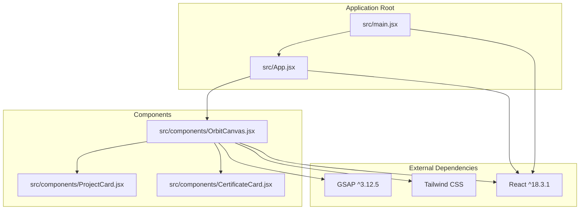
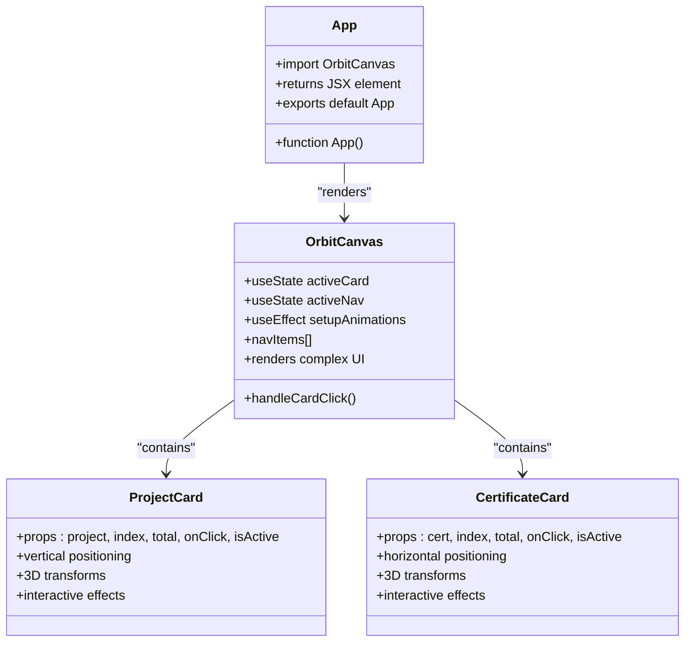
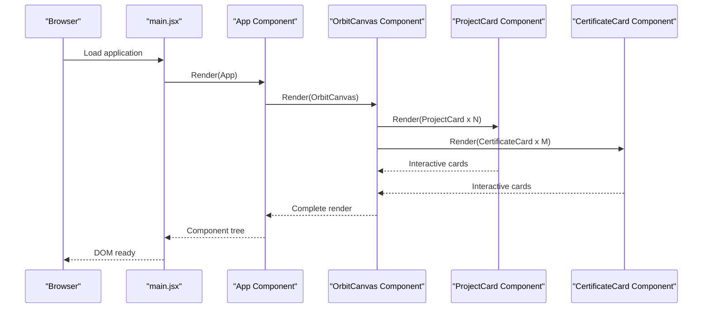
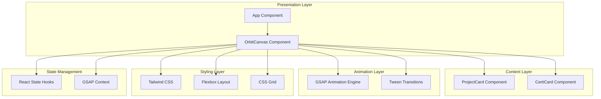
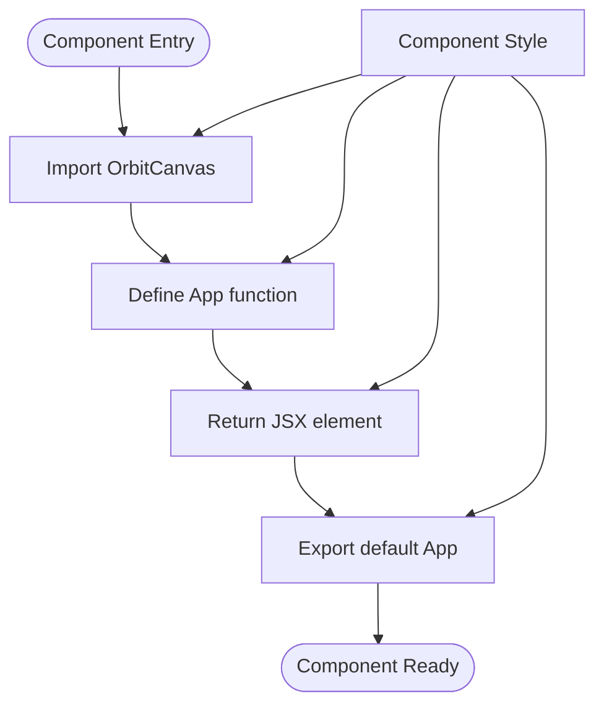
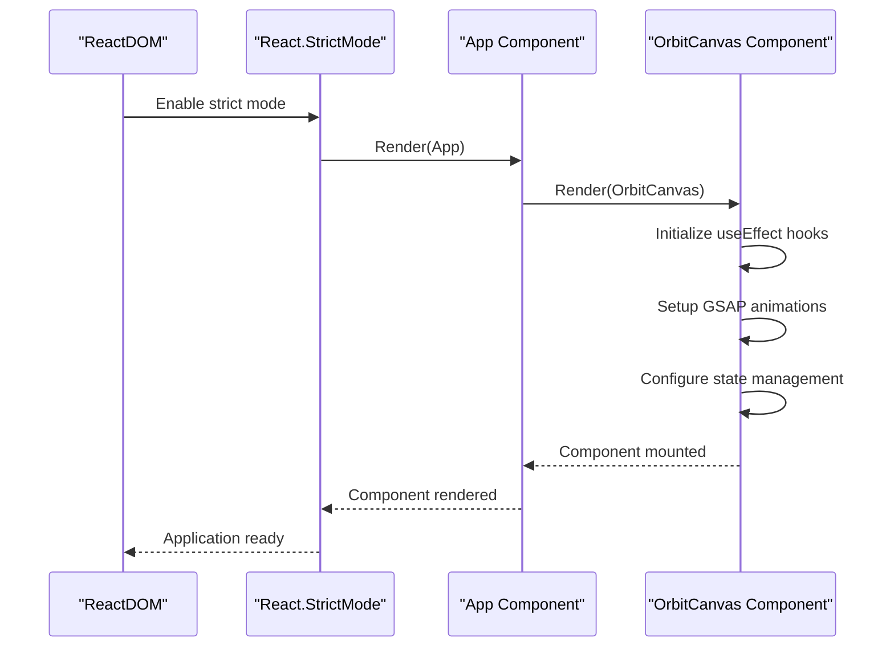
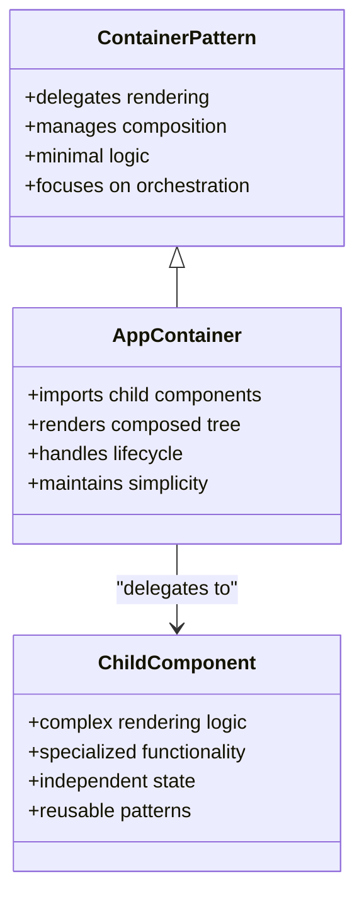
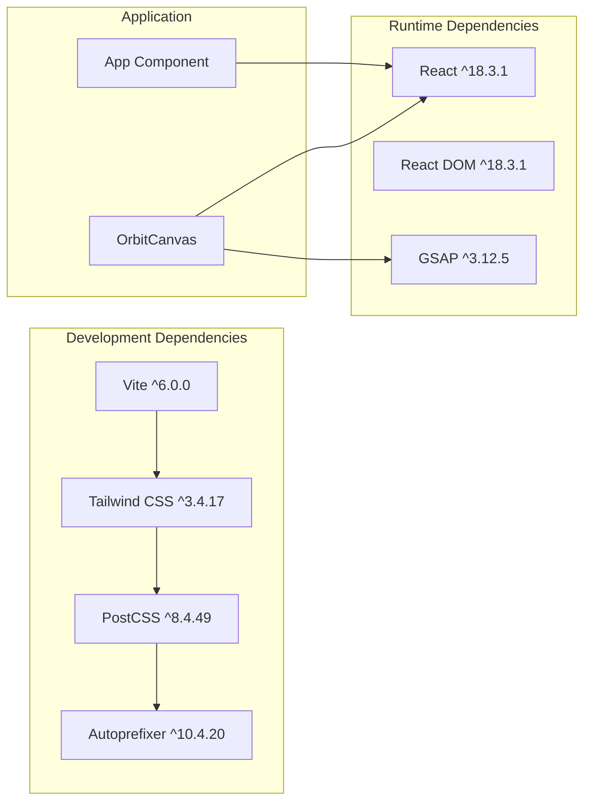
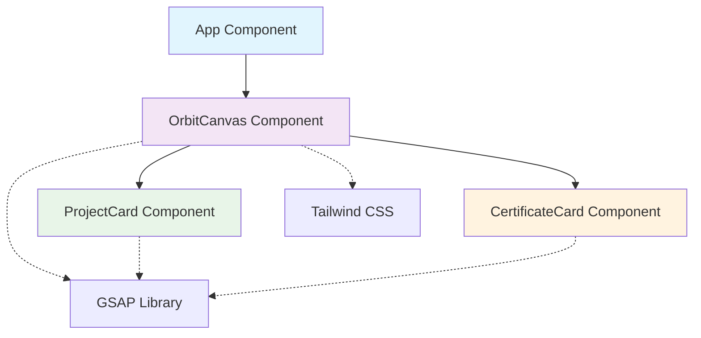

# App Component

<cite>
**Referenced Files in This Document**
- [App.jsx](file://src/App.jsx)
- [main.jsx](file://src/main.jsx)
- [OrbitCanvas.jsx](file://src/components/OrbitCanvas.jsx)
- [ProjectCard.jsx](file://src/components/ProjectCard.jsx)
- [CertificateCard.jsx](file://src/components/CertificateCard.jsx)
- [package.json](file://package.json)
</cite>

## Table of Contents
1. [Introduction](#introduction)
2. [Project Structure](#project-structure)
3. [Core Components](#core-components)
4. [Architecture Overview](#architecture-overview)
5. [Detailed Component Analysis](#detailed-component-analysis)
6. [Dependency Analysis](#dependency-analysis)
7. [Performance Considerations](#performance-considerations)
8. [Troubleshooting Guide](#troubleshooting-guide)
9. [Conclusion](#conclusion)

## Introduction

The App component serves as the primary entry point for this React application, functioning as a minimalist wrapper that delegates rendering responsibilities to specialized child components. This component exemplifies clean architectural practices by maintaining a simple interface while orchestrating complex visual experiences through dedicated subcomponents.

The application follows a container pattern where the App component acts as a thin shell, focusing solely on component composition and lifecycle management. This approach ensures clear separation of concerns, making the codebase maintainable and scalable.

## Project Structure

The project follows a modular structure that promotes component reusability and maintainability:

**Diagram sources**
- [main.jsx:1-11](file://src/main.jsx#L1-L11)
- [App.jsx:1-8](file://src/App.jsx#L1-L8)
- [OrbitCanvas.jsx:1-382](file://src/components/OrbitCanvas.jsx#L1-L382)

**Section sources**
- [package.json:1-24](file://package.json#L1-L24)

## Core Components

### App Component Structure

The App component maintains exceptional simplicity with a minimal footprint:

**Diagram sources**
- [App.jsx:1-8](file://src/App.jsx#L1-L8)
- [OrbitCanvas.jsx:96-382](file://src/components/OrbitCanvas.jsx#L96-L382)
- [ProjectCard.jsx:1-32](file://src/components/ProjectCard.jsx#L1-L32)
- [CertificateCard.jsx:1-31](file://src/components/CertificateCard.jsx#L1-L31)

The component structure demonstrates several key architectural principles:

- **Single Responsibility**: The App component focuses exclusively on component composition
- **Delegation Pattern**: Complex rendering logic is delegated to specialized components
- **Export Pattern**: Uses ES6 default export for clean module consumption
- **Minimal Dependencies**: Imports only the necessary component without external logic

### Component Composition Strategy

The App component employs a hierarchical composition pattern:

**Diagram sources**
- [main.jsx:6-10](file://src/main.jsx#L6-L10)
- [App.jsx:3-5](file://src/App.jsx#L3-L5)
- [OrbitCanvas.jsx:317-341](file://src/components/OrbitCanvas.jsx#L317-L341)

**Section sources**
- [App.jsx:1-8](file://src/App.jsx#L1-L8)
- [main.jsx:1-11](file://src/main.jsx#L1-L11)

## Architecture Overview

The application architecture follows a layered approach that separates concerns effectively:

**Diagram sources**
- [OrbitCanvas.jsx:101-190](file://src/components/OrbitCanvas.jsx#L101-L190)
- [OrbitCanvas.jsx:228-229](file://src/components/OrbitCanvas.jsx#L228-L229)

The architecture demonstrates excellent separation of concerns:

- **Presentation Layer**: Handles component composition and rendering
- **Content Layer**: Manages individual content presentation
- **Animation Layer**: Provides sophisticated motion graphics
- **Styling Layer**: Implements responsive design systems
- **State Management**: Coordinates interactive elements

## Detailed Component Analysis

### App Component Implementation

The App component exemplifies minimalist design principles:

**Diagram sources**
- [App.jsx:1-8](file://src/App.jsx#L1-L8)

Key implementation characteristics:

- **Import Statement**: Single-line import for clean dependency management
- **Function Declaration**: Arrow function syntax for concise definition
- **Return Statement**: Minimal JSX rendering of the OrbitCanvas component
- **Export Pattern**: ES6 default export for standard React module consumption

### Integration with React Application Lifecycle

The App component integrates seamlessly with React's lifecycle through the root rendering process:

**Diagram sources**
- [main.jsx:6-10](file://src/main.jsx#L6-L10)
- [OrbitCanvas.jsx:101-190](file://src/components/OrbitCanvas.jsx#L101-L190)

### Container Pattern Implementation

The App component serves as an exemplary container pattern implementation:

**Diagram sources**
- [App.jsx:3-5](file://src/App.jsx#L3-L5)

The container pattern benefits demonstrated:

- **Separation of Concerns**: App handles composition, children handle rendering
- **Reusability**: Child components can be used independently
- **Testability**: Each component can be tested in isolation
- **Maintainability**: Changes are localized to specific components

**Section sources**
- [App.jsx:1-8](file://src/App.jsx#L1-L8)
- [main.jsx:1-11](file://src/main.jsx#L1-L11)

## Dependency Analysis

### External Dependencies

The application maintains a focused dependency set that supports its animation-heavy architecture:

**Diagram sources**
- [package.json:11-22](file://package.json#L11-L22)

### Internal Component Dependencies

The internal dependency structure demonstrates clear architectural boundaries:

**Diagram sources**
- [App.jsx:1](file://src/App.jsx#L1)
- [OrbitCanvas.jsx:1-5](file://src/components/OrbitCanvas.jsx#L1-L5)

**Section sources**
- [package.json:1-24](file://package.json#L1-L24)

## Performance Considerations

### Rendering Optimization

The App component's simplicity contributes significantly to performance:

- **Minimal Re-renders**: Single JSX element reduces render overhead
- **Efficient Composition**: Delegated rendering to specialized components
- **Lazy Loading**: Child components can implement their own optimization strategies
- **Memory Efficiency**: No unnecessary state or complex logic

### Animation Performance

The OrbitCanvas component implements several performance optimization techniques:

- **GSAP Context Management**: Automatic cleanup prevents memory leaks
- **Transform-Based Animations**: Hardware-accelerated CSS transforms
- **Selective Updates**: State changes trigger targeted re-renders
- **Efficient DOM Manipulation**: Minimal DOM queries and updates

## Troubleshooting Guide

### Common Issues and Solutions

**Issue**: Component not rendering
- Verify App component export pattern
- Check main.jsx import path correctness
- Ensure OrbitCanvas component exports properly

**Issue**: Animation not working
- Confirm GSAP library installation
- Verify useEffect hook execution
- Check browser console for errors

**Issue**: Styling problems
- Validate Tailwind CSS configuration
- Ensure CSS classes match component expectations
- Check for conflicting styles

### Debugging Strategies

For component-related debugging:

1. **Console Logging**: Add temporary logs in App component
2. **Props Validation**: Verify component prop passing
3. **State Inspection**: Monitor state changes in OrbitCanvas
4. **Performance Profiling**: Use React DevTools for performance analysis

**Section sources**
- [App.jsx:1-8](file://src/App.jsx#L1-L8)
- [OrbitCanvas.jsx:101-190](file://src/components/OrbitCanvas.jsx#L101-L190)

## Conclusion

The App component successfully demonstrates excellent architectural practices through its minimalist design and strategic delegation of responsibilities. By serving as a simple wrapper around the complex OrbitCanvas component, it maintains clean separation of concerns while enabling sophisticated visual experiences.

Key architectural strengths include:

- **Clean Separation of Concerns**: App focuses on composition, children handle rendering
- **Container Pattern Implementation**: Demonstrates effective component orchestration
- **Minimal Complexity**: Single-purpose component reduces maintenance overhead
- **Scalable Design**: Foundation supports future component additions
- **Performance Optimization**: Simple structure minimizes rendering overhead

This implementation serves as an excellent example of how React applications can achieve both functional excellence and architectural clarity through thoughtful component design and clear responsibility distribution.