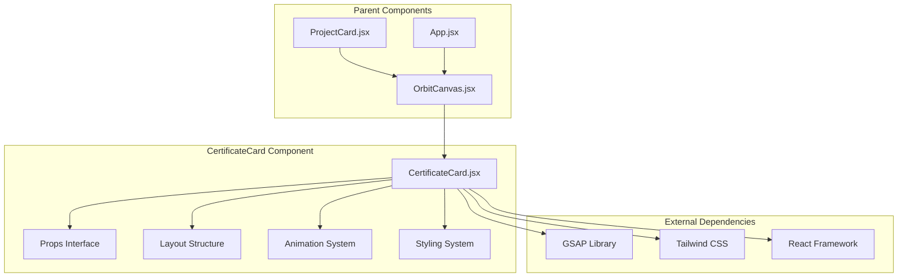

# CertificateCard Component

<cite>
**Referenced Files in This Document**
- [CertificateCard.jsx](file://src/components/CertificateCard.jsx)
- [ProjectCard.jsx](file://src/components/ProjectCard.jsx)
- [OrbitCanvas.jsx](file://src/components/OrbitCanvas.jsx)
- [App.jsx](file://src/App.jsx)
- [index.css](file://src/index.css)
- [main.jsx](file://src/main.jsx)
</cite>

## Table of Contents
1. [Introduction](#introduction)
2. [Component Architecture](#component-architecture)
3. [Props Interface](#props-interface)
4. [Visual Design System](#visual-design-system)
5. [Animation Implementation](#animation-implementation)
6. [Integration Patterns](#integration-patterns)
7. [Responsive Behavior](#responsive-behavior)
8. [Comparison with ProjectCard](#comparison-with-projectcard)
9. [Data Handling](#data-handling)
10. [Performance Considerations](#performance-considerations)
11. [Troubleshooting Guide](#troubleshooting-guide)
12. [Conclusion](#conclusion)

## Introduction

The CertificateCard component is a specialized React component designed to display educational certifications within the orbital portfolio system. Unlike its counterpart ProjectCard, CertificateCard implements a reverse orbital animation that creates visual diversity and establishes a distinct presentation pattern for certification data. This component serves as a crucial element in the portfolio's three-dimensional orbital interface, contributing to the overall aesthetic and functional design of the interactive experience.

The component operates within a sophisticated GSAP-based animation system that manages entrance animations, hover effects, and interactive transformations. Its unique positioning and styling characteristics distinguish it from ProjectCard while maintaining consistency with the overall orbital theme and design language.

## Component Architecture

The CertificateCard component follows a functional React architecture with the following key structural elements:



**Diagram sources**
- [CertificateCard.jsx:1-31](file://src/components/CertificateCard.jsx#L1-L31)
- [OrbitCanvas.jsx:330-342](file://src/components/OrbitCanvas.jsx#L330-L342)

The component is structured as a pure functional component that receives props and renders JSX with integrated styling and animation logic. It maintains a clean separation of concerns by focusing solely on presentation and interaction patterns specific to certificate data.

**Section sources**
- [CertificateCard.jsx:1-31](file://src/components/CertificateCard.jsx#L1-L31)
- [OrbitCanvas.jsx:330-342](file://src/components/OrbitCanvas.jsx#L330-L342)

## Props Interface

The CertificateCard component accepts a well-defined set of props that control its behavior, appearance, and interaction patterns:

| Prop | Type | Required | Description |
|------|------|----------|-------------|
| `cert` | Object | Yes | Certificate data object containing image, title, subtitle, and description |
| `index` | Number | Yes | Position index determining vertical offset and horizontal positioning |
| `total` | Number | Yes | Total count of certificates for distribution calculations |
| `onClick` | Function | No | Event handler for card click interactions |
| `isActive` | Boolean | No | Flag indicating whether the card is currently active |

The certificate data structure follows a standardized format:

```javascript
const certificate = {
  id: Number,
  title: String,
  subtitle: String,
  description: String,
  image: String
}
```

**Section sources**
- [CertificateCard.jsx:1-31](file://src/components/CertificateCard.jsx#L1-L31)
- [OrbitCanvas.jsx:44-73](file://src/components/OrbitCanvas.jsx#L44-L73)

## Visual Design System

The CertificateCard implements a sophisticated visual design system that emphasizes depth, transparency, and modern aesthetics:

### Color Palette and Theming
- **Primary Background**: `#111827` with 70% opacity backdrop blur
- **Accent Colors**: 
  - Active state: `#ff2d78` (pink) for borders and glow effects
  - Hover state: `#66FCF1` (cyan) for subtle hover effects
  - Neutral backgrounds: Gray-700/50 for inactive states
- **Text Colors**: White for titles, `#66FCF1` for subtitles, gray-400 for descriptions

### Typography System
- **Titles**: Text-white, text-sm, font-bold for primary headings
- **Subtitles**: `#66FCF1` color, text-[10px], marginTop of 0.5
- **Descriptions**: Gray-400, text-[11px], line-clamp-2 for two-line truncation

### Border and Shadow Effects
- **Active State**: Solid `#ff2d78` border with `#ff2d78` shadow glow (`0_0_20px_rgba(255,45,120,0.4)`)
- **Hover State**: Subtle `#66FCF1`/50 border enhancement
- **Inactive State**: `gray-700/50` border with reduced opacity

**Section sources**
- [CertificateCard.jsx:7-11](file://src/components/CertificateCard.jsx#L7-L11)
- [CertificateCard.jsx:24-26](file://src/components/CertificateCard.jsx#L24-L26)

## Animation Implementation

The CertificateCard component participates in a complex GSAP-based animation system that creates dynamic orbital effects:

### Entrance Animation Pattern
The component utilizes GSAP's `from` method for entrance animations with specific parameters:

```javascript
gsap.from(".cert-card", {
  duration: 1.2,
  x: 400,
  opacity: 0,
  rotationY: -60,
  stagger: 0.15,
  ease: "power3.out",
});
```

Key animation characteristics:
- **Entrance Direction**: Moves from right (x: 400) to center position
- **Rotation**: Counter-clockwise rotation with `rotationY: -60`
- **Timing**: 1.2-second duration with 0.15-second stagger between cards
- **Easing**: Power3 out for smooth acceleration-deceleration

### Interactive Transformations
When activated, the component responds to user interactions with sophisticated GSAP animations:

```javascript
gsap.to(card, {
  duration: 0.6,
  x: 0,
  y: 0,
  rotationY: 0,
  z: 100,
  scale: 1.1,
  opacity: 1,
  ease: "power2.out",
  overwrite: "auto",
});
```

Interactive features include:
- **Center Positioning**: Cards move to center (x: 0, y: 0)
- **3D Rotation**: Smooth transition to `rotationY: 0`
- **Depth Enhancement**: `z: 100` creates perceived depth
- **Scale Effect**: `scale: 1.1` provides visual prominence
- **Opacity Control**: `opacity: 1` ensures full visibility

**Section sources**
- [OrbitCanvas.jsx:113-120](file://src/components/OrbitCanvas.jsx#L113-L120)
- [OrbitCanvas.jsx:192-226](file://src/components/OrbitCanvas.jsx#L192-L226)

## Integration Patterns

The CertificateCard integrates seamlessly with the broader orbital system through several established patterns:

### Parent-Child Relationship
The component is rendered within OrbitCanvas as part of a dual-card system:

```javascript
<div className="absolute right-4 md:right-16 top-1/2 -translate-y-1/2 w-[45%] h-full z-20 flex items-center">
  {certificates.map((cert, i) => (
    <CertificateCard
      key={cert.id}
      cert={cert}
      index={i}
      total={certificates.length}
      onClick={(e) => handleCardClick(e, cert.id, "cert")}
      isActive={activeCard === cert.id}
    />
  ))}
</div>
```

### State Management Integration
The component respects global state management through:
- **Active Card Tracking**: Uses `activeCard` state to determine visual prominence
- **Event Propagation**: Receives click handlers from parent component
- **Conditional Styling**: Applies active/inactive styles based on state

### Animation Coordination
The component coordinates with ProjectCard through synchronized animation patterns:
- **Opposite Directions**: Certificate cards animate from right, Project cards from left
- **Shared Timing**: Both use 1.2-second duration with 0.15-second stagger
- **Different Easing**: Complementary easing functions create visual harmony

**Section sources**
- [OrbitCanvas.jsx:330-342](file://src/components/OrbitCanvas.jsx#L330-L342)
- [OrbitCanvas.jsx:316-328](file://src/components/OrbitCanvas.jsx#L316-L328)

## Responsive Behavior

The CertificateCard component implements comprehensive responsive design patterns:

### Breakpoint-Specific Dimensions
- **Mobile**: Width of `200px` with `h-[130px]` image height
- **Desktop**: Width increases to `230px` with proportional scaling
- **Flexible Sizing**: Uses `w-[200px] md:w-[230px]` for adaptive sizing

### Adaptive Positioning
The component calculates positions based on viewport constraints:
- **Horizontal Offset**: `xOffset = index * -15 + 20` creates right-to-left positioning
- **Vertical Distribution**: `yOffset` varies by index for optimal spacing
- **Center Alignment**: Uses `top-1/2 -translate-y-1/2` for vertical centering

### Container Flexibility
The component adapts to different container sizes:
- **Percentage-Based Containers**: `w-[45%]` ensures proportional fit
- **Flexbox Integration**: Works within flex containers for automatic alignment
- **Z-Index Management**: Maintains proper stacking order with `z-20`

**Section sources**
- [CertificateCard.jsx:3](file://src/components/CertificateCard.jsx#L3)
- [CertificateCard.jsx:7](file://src/components/CertificateCard.jsx#L7)
- [OrbitCanvas.jsx:330-342](file://src/components/OrbitCanvas.jsx#L330-L342)

## Comparison with ProjectCard

The CertificateCard and ProjectCard share similar structural foundations but implement distinct visual and behavioral patterns:

### Structural Similarities
- **Same Props Interface**: Both accept identical prop structures
- **Similar Layout**: Both use card-based layouts with images and text
- **Shared Styling Approach**: Both utilize backdrop blur and glass-morphism effects
- **Common Animation Foundation**: Both participate in GSAP-based animation systems

### Key Differences

| Aspect | CertificateCard | ProjectCard |
|--------|----------------|-------------|
| **Rotation Direction** | Counter-clockwise (`-15deg`) | Clockwise (`15deg`) |
| **Entrance Direction** | Right-to-left (x: 400) | Left-to-right (x: -400) |
| **Positioning Logic** | Negative offsets for reverse direction | Positive offsets for forward direction |
| **Visual Emphasis** | Educational focus with certificate styling | Project showcase with development emphasis |
| **Color Scheme** | Consistent with certification theme | Consistent with project theme |

### Animation Distinctions
The components use complementary animation patterns:
- **Opposite Rotation**: Creates visual balance between left and right card groups
- **Different Entrance Paths**: Prevents visual clutter during initial loading
- **Coordinated Stagger**: Maintains rhythm while preserving individual character

**Section sources**
- [CertificateCard.jsx:15](file://src/components/CertificateCard.jsx#L15)
- [ProjectCard.jsx:16](file://src/components/ProjectCard.jsx#L16)
- [OrbitCanvas.jsx:104-120](file://src/components/OrbitCanvas.jsx#L104-L120)

## Data Handling

The CertificateCard component processes certificate data through a structured approach:

### Data Structure Requirements
The component expects certificate objects with the following properties:
- **Required Fields**: `id`, `title`, `subtitle`, `description`, `image`
- **Consistency**: All certificates must follow the same data schema
- **Validation**: Component assumes valid data structure without explicit validation

### Image Loading and Presentation
- **Dynamic Image Sources**: Supports external image URLs for flexibility
- **Responsive Sizing**: Automatically scales with component width changes
- **Object Cover**: Uses `object-cover` for consistent image presentation

### Text Content Management
- **Line Clamping**: Descriptions use `line-clamp-2` for two-line truncation
- **Typography Scaling**: Font sizes adapt to responsive breakpoints
- **Accessibility**: Proper alt text support for screen readers

**Section sources**
- [CertificateCard.jsx:18-27](file://src/components/CertificateCard.jsx#L18-L27)
- [OrbitCanvas.jsx:44-73](file://src/components/OrbitCanvas.jsx#L44-L73)

## Performance Considerations

The CertificateCard component implements several performance optimization strategies:

### Rendering Efficiency
- **Pure Component Pattern**: Stateless functional component reduces re-render overhead
- **Minimal DOM Manipulation**: Relies on CSS transforms for animations
- **Efficient Styling**: Uses Tailwind utility classes for optimized CSS generation

### Animation Performance
- **Hardware Acceleration**: CSS transforms leverage GPU acceleration
- **Optimized Transitions**: 300ms transition duration balances responsiveness with performance
- **Selective Updates**: Only active cards receive intensive animations

### Memory Management
- **No Internal State**: Component is stateless, reducing memory footprint
- **Clean Dependencies**: Minimal external dependencies for lightweight bundle size
- **Efficient Event Handling**: Single event handler per card instance

**Section sources**
- [CertificateCard.jsx:12](file://src/components/CertificateCard.jsx#L12)
- [CertificateCard.jsx:14-16](file://src/components/CertificateCard.jsx#L14-L16)

## Troubleshooting Guide

Common issues and solutions when working with CertificateCard:

### Styling Issues
**Problem**: Cards not appearing with expected styling
**Solution**: Verify Tailwind classes are properly loaded and CSS is included in build process

**Problem**: Colors not displaying correctly
**Solution**: Check color palette consistency and ensure proper hex values are used

### Animation Problems
**Problem**: Entrance animations not triggering
**Solution**: Verify GSAP library is properly imported and initialized

**Problem**: Click interactions not working
**Solution**: Ensure onClick prop is properly passed and event handlers are attached

### Responsive Display Issues
**Problem**: Cards not aligning properly on mobile devices
**Solution**: Check breakpoint-specific classes and ensure proper viewport meta tags

**Problem**: Images not loading correctly
**Solution**: Verify image URLs are accessible and CORS policies permit loading

### Performance Concerns
**Problem**: Slow rendering on low-end devices
**Solution**: Consider lazy loading for images and optimize animation complexity

**Section sources**
- [index.css:1-28](file://src/index.css#L1-L28)
- [main.jsx:1-11](file://src/main.jsx#L1-L11)

## Conclusion

The CertificateCard component represents a sophisticated implementation of React's component architecture within a complex orbital animation system. Its unique characteristics, particularly the reverse orbital animation and specialized styling, contribute significantly to the portfolio's visual diversity and user experience.

The component demonstrates excellent separation of concerns through its pure functional design, efficient prop-based data handling, and seamless integration with the broader GSAP-based animation ecosystem. The careful balance between visual appeal and performance makes it an exemplary model for interactive React components.

Through its implementation of responsive design patterns, comprehensive animation systems, and thoughtful integration with parent components, CertificateCard serves as both a functional UI element and a showcase of modern React development practices. Its role in creating visual diversity within the portfolio layout cannot be overstated, as it provides essential contrast to the ProjectCard system while maintaining thematic consistency.

The component's success lies in its ability to remain focused on its specific purpose—certificate presentation—while contributing to the larger narrative of the orbital portfolio experience. This focused approach, combined with robust performance characteristics and comprehensive responsive behavior, establishes CertificateCard as a cornerstone component in the portfolio's architectural design.