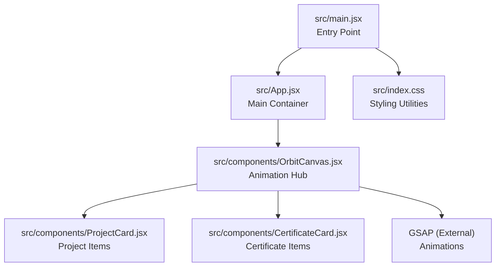
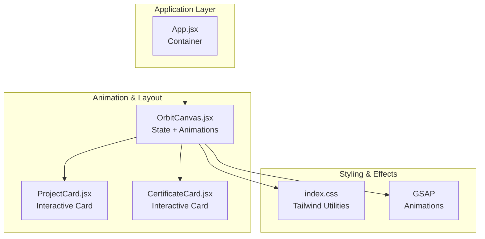
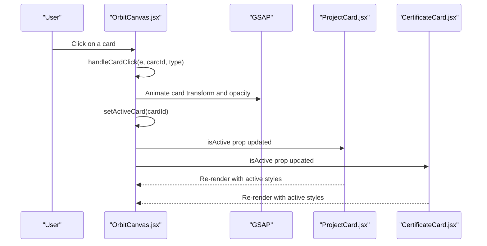
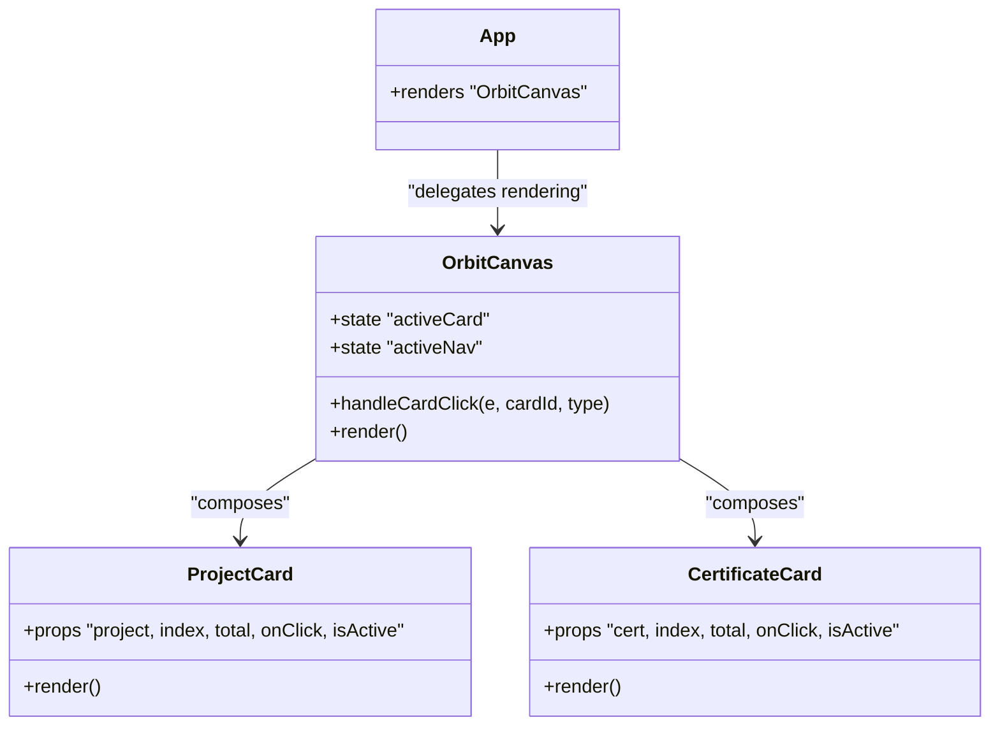
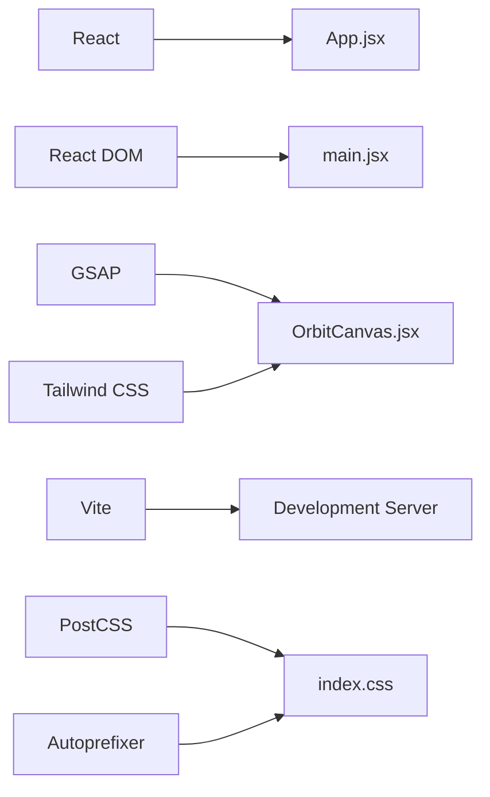

# Component Architecture

<cite>
**Referenced Files in This Document**
- [App.jsx](file://src/App.jsx)
- [main.jsx](file://src/main.jsx)
- [OrbitCanvas.jsx](file://src/components/OrbitCanvas.jsx)
- [ProjectCard.jsx](file://src/components/ProjectCard.jsx)
- [CertificateCard.jsx](file://src/components/CertificateCard.jsx)
- [index.css](file://src/index.css)
- [package.json](file://package.json)
</cite>

## Table of Contents
1. [Introduction](#introduction)
2. [Project Structure](#project-structure)
3. [Core Components](#core-components)
4. [Architecture Overview](#architecture-overview)
5. [Detailed Component Analysis](#detailed-component-analysis)
6. [Dependency Analysis](#dependency-analysis)
7. [Performance Considerations](#performance-considerations)
8. [Troubleshooting Guide](#troubleshooting-guide)
9. [Conclusion](#conclusion)

## Introduction
This document describes the React component architecture for a portfolio website featuring animated orbit layouts. The system centers around a single-page application with App.jsx as the main container, OrbitCanvas.jsx as the central animation hub, and specialized card components for projects and certificates. The design emphasizes separation of concerns, reusable component patterns, and smooth user interactions powered by GSAP animations.

## Project Structure
The project follows a straightforward, feature-based layout:
- Root entry point renders the App component inside React.StrictMode
- App.jsx serves as the primary container, delegating rendering to OrbitCanvas.jsx
- OrbitCanvas.jsx orchestrates the entire UI, including navigation, orbital animations, and card displays
- ProjectCard.jsx and CertificateCard.jsx encapsulate presentation and interaction logic for individual items
- Tailwind CSS provides styling utilities, while GSAP handles animations

**Diagram sources**
- [main.jsx:1-11](file://src/main.jsx#L1-L11)
- [App.jsx:1-8](file://src/App.jsx#L1-L8)
- [OrbitCanvas.jsx:1-382](file://src/components/OrbitCanvas.jsx#L1-L382)
- [ProjectCard.jsx:1-32](file://src/components/ProjectCard.jsx#L1-L32)
- [CertificateCard.jsx:1-31](file://src/components/CertificateCard.jsx#L1-L31)
- [index.css:1-28](file://src/index.css#L1-L28)
- [package.json:11-14](file://package.json#L11-L14)

**Section sources**
- [main.jsx:1-11](file://src/main.jsx#L1-L11)
- [App.jsx:1-8](file://src/App.jsx#L1-L8)
- [index.css:1-28](file://src/index.css#L1-L28)
- [package.json:11-14](file://package.json#L11-L14)

## Core Components
- App.jsx: Minimal wrapper component that renders the OrbitCanvas. It maintains a clean separation between the application bootstrap and the animation-centric UI.
- OrbitCanvas.jsx: Central component managing state, animations, and layout. It defines data arrays for projects and certificates, controls navigation state, and coordinates interactive card behaviors.
- ProjectCard.jsx: Presentational component for project entries with hover and click interactions, including 3D transforms and active state styling.
- CertificateCard.jsx: Similar to ProjectCard.jsx but tailored for certificate entries, mirroring the same interaction model.

Key responsibilities:
- State management: activeCard and activeNav states are managed within OrbitCanvas.jsx.
- Animation orchestration: GSAP is used for entrance, floating, rotation, and code rain effects.
- Prop drilling: OrbitCanvas.jsx passes props to child components to control rendering and interactions.

**Section sources**
- [App.jsx:1-8](file://src/App.jsx#L1-L8)
- [OrbitCanvas.jsx:96-382](file://src/components/OrbitCanvas.jsx#L96-L382)
- [ProjectCard.jsx:1-32](file://src/components/ProjectCard.jsx#L1-L32)
- [CertificateCard.jsx:1-31](file://src/components/CertificateCard.jsx#L1-L31)

## Architecture Overview
The system employs a unidirectional data flow with centralized state in OrbitCanvas.jsx. App.jsx acts as the root container, while OrbitCanvas.jsx manages:
- Data arrays for projects and certificates
- Active selection state (activeCard)
- Navigation state (activeNav)
- Animation lifecycle via GSAP context
- Event handlers for card interactions

**Diagram sources**
- [App.jsx:1-8](file://src/App.jsx#L1-L8)
- [OrbitCanvas.jsx:96-382](file://src/components/OrbitCanvas.jsx#L96-L382)
- [ProjectCard.jsx:1-32](file://src/components/ProjectCard.jsx#L1-L32)
- [CertificateCard.jsx:1-31](file://src/components/CertificateCard.jsx#L1-L31)
- [index.css:1-28](file://src/index.css#L1-L28)
- [package.json:14](file://package.json#L14)

## Detailed Component Analysis

### App.jsx
- Role: Single-purpose container that renders the OrbitCanvas component.
- Props: None required; relies on OrbitCanvas.jsx for all UI logic.
- Coupling: Minimal coupling to maintain simplicity and focus on composition.

**Section sources**
- [App.jsx:1-8](file://src/App.jsx#L1-L8)

### OrbitCanvas.jsx
- Responsibilities:
  - Manages activeCard and activeNav state
  - Defines static data arrays for projects, certificates, and code snippets
  - Initializes GSAP animations on mount and cleans up on unmount
  - Handles card click interactions to toggle active states and apply transforms
  - Renders navigation bar, title, orbit rings, profile photo, and tech stack badges
- State management:
  - activeCard: Tracks the currently selected card ID
  - activeNav: Tracks the active navigation item
- Inter-component communication:
  - Passes props to ProjectCard.jsx and CertificateCard.jsx
  - Uses event handlers to update state and trigger animations
- Animation patterns:
  - Entrance animations for cards, profile, orbit rings, and navigation items
  - Floating and pulsating effects for profile photo
  - Continuous rotation for orbit rings
  - Randomized code rain effect

**Diagram sources**
- [OrbitCanvas.jsx:192-226](file://src/components/OrbitCanvas.jsx#L192-L226)
- [ProjectCard.jsx:1-32](file://src/components/ProjectCard.jsx#L1-L32)
- [CertificateCard.jsx:1-31](file://src/components/CertificateCard.jsx#L1-L31)

**Section sources**
- [OrbitCanvas.jsx:96-382](file://src/components/OrbitCanvas.jsx#L96-L382)

### ProjectCard.jsx
- Purpose: Render a single project entry with interactive behavior.
- Props:
  - project: Project data object
  - index: Position in the list for layout calculations
  - total: Total number of items (used for layout distribution)
  - onClick: Callback to notify parent of clicks
  - isActive: Boolean indicating whether the card is active
- Styling and transforms:
  - Uses dynamic offsets for vertical and horizontal positioning
  - Applies 3D rotations and preserve-3d for depth perception
  - Conditional borders and shadows based on active state

**Section sources**
- [ProjectCard.jsx:1-32](file://src/components/ProjectCard.jsx#L1-L32)

### CertificateCard.jsx
- Purpose: Render a single certificate entry with identical interaction model as ProjectCard.jsx.
- Props:
  - cert: Certificate data object
  - index: Position in the list for layout calculations
  - total: Total number of items (used for layout distribution)
  - onClick: Callback to notify parent of clicks
  - isActive: Boolean indicating whether the card is active
- Styling and transforms:
  - Mirrors ProjectCard.jsx with mirrored rotation direction for visual balance
  - Conditional borders and shadows based on active state

**Section sources**
- [CertificateCard.jsx:1-31](file://src/components/CertificateCard.jsx#L1-L31)

### Component Composition Patterns
- Parent-child composition: OrbitCanvas.jsx composes ProjectCard.jsx and CertificateCard.jsx instances.
- Prop drilling: Data and callbacks are passed down from OrbitCanvas.jsx to children.
- Reusable design principles:
  - Shared styling classes and transform logic across card components
  - Consistent active state handling and visual feedback
  - Separation of concerns: animation logic in OrbitCanvas.jsx, presentation in child components

**Diagram sources**
- [App.jsx:1-8](file://src/App.jsx#L1-L8)
- [OrbitCanvas.jsx:96-382](file://src/components/OrbitCanvas.jsx#L96-L382)
- [ProjectCard.jsx:1-32](file://src/components/ProjectCard.jsx#L1-L32)
- [CertificateCard.jsx:1-31](file://src/components/CertificateCard.jsx#L1-L31)

## Dependency Analysis
- Runtime dependencies:
  - React and React DOM: Core framework for component rendering
  - GSAP: Animation library for complex motion and timeline control
- Build-time dependencies:
  - Vite: Development server and bundler
  - Tailwind CSS: Utility-first styling framework
  - PostCSS and Autoprefixer: CSS processing pipeline

**Diagram sources**
- [package.json:11-22](file://package.json#L11-L22)
- [main.jsx:1-11](file://src/main.jsx#L1-L11)
- [index.css:1-28](file://src/index.css#L1-L28)
- [OrbitCanvas.jsx:1-3](file://src/components/OrbitCanvas.jsx#L1-L3)

**Section sources**
- [package.json:11-22](file://package.json#L11-L22)
- [main.jsx:1-11](file://src/main.jsx#L1-L11)
- [index.css:1-28](file://src/index.css#L1-L28)

## Performance Considerations
- Animation performance:
  - GSAP animations are scoped to a ref context to ensure cleanup on unmount
  - Staggered animations use efficient easing functions and minimal DOM reads
- Rendering efficiency:
  - Card components receive only necessary props; avoid unnecessary re-renders by keeping props stable
  - Use memoization for expensive computations if data grows larger
- Bundle size:
  - Keep external dependencies minimal; consider lazy-loading animations if needed
- CSS performance:
  - Tailwind utilities are applied efficiently; avoid excessive nesting or complex selectors

## Troubleshooting Guide
- Animation not playing:
  - Verify GSAP is imported and initialized correctly in OrbitCanvas.jsx
  - Ensure the canvas ref is attached and animations run within the GSAP context
- Cards not responding to clicks:
  - Confirm that onClick handlers are passed correctly to child components
  - Check that activeCard state updates and triggers re-renders
- Styling issues:
  - Ensure Tailwind CSS is configured and utility classes are applied consistently
  - Verify that CSS resets and global styles do not interfere with component rendering

**Section sources**
- [OrbitCanvas.jsx:101-190](file://src/components/OrbitCanvas.jsx#L101-L190)
- [ProjectCard.jsx:12-16](file://src/components/ProjectCard.jsx#L12-L16)
- [CertificateCard.jsx:12-16](file://src/components/CertificateCard.jsx#L12-L16)
- [index.css:1-28](file://src/index.css#L1-L28)

## Conclusion
The component architecture demonstrates a clean separation of concerns with a single-page application structure. App.jsx remains minimal, delegating UI responsibilities to OrbitCanvas.jsx, which orchestrates state, animations, and child components. ProjectCard.jsx and CertificateCard.jsx encapsulate presentation and interaction logic, enabling reuse and maintainability. The system leverages GSAP for rich animations and Tailwind CSS for responsive styling, resulting in a visually engaging and performant portfolio experience.