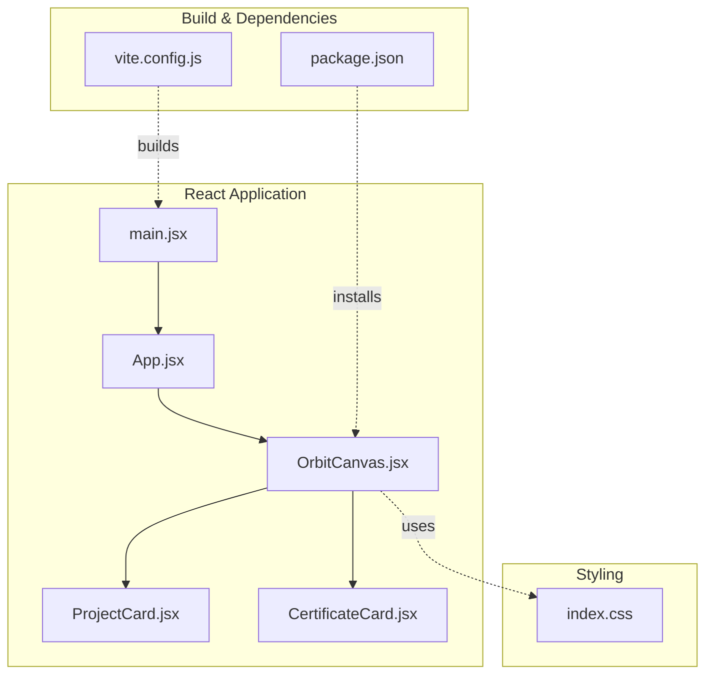
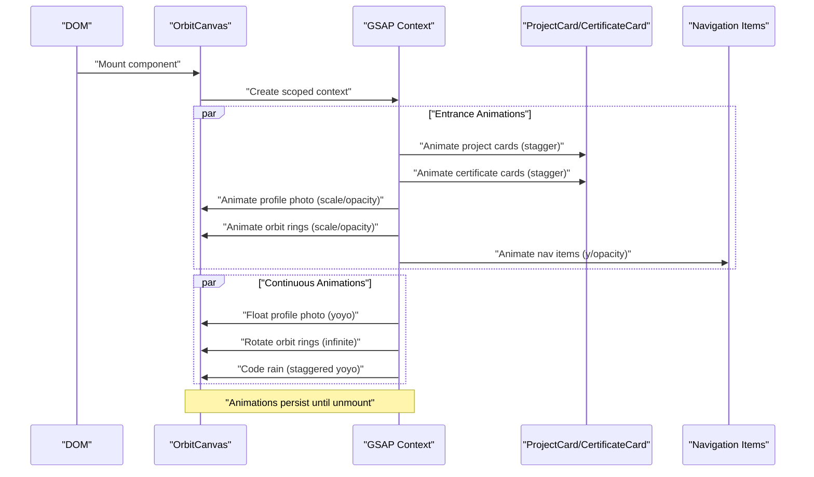
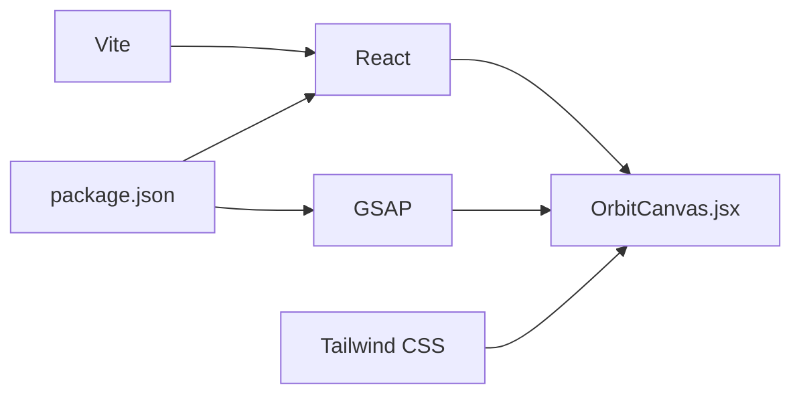

# Animation Management

<cite>
**Referenced Files in This Document**
- [OrbitCanvas.jsx](file://src/components/OrbitCanvas.jsx)
- [ProjectCard.jsx](file://src/components/ProjectCard.jsx)
- [CertificateCard.jsx](file://src/components/CertificateCard.jsx)
- [App.jsx](file://src/App.jsx)
- [main.jsx](file://src/main.jsx)
- [index.css](file://src/index.css)
- [package.json](file://package.json)
- [vite.config.js](file://vite.config.js)
</cite>

## Table of Contents
1. [Introduction](#introduction)
2. [Project Structure](#project-structure)
3. [Core Components](#core-components)
4. [Architecture Overview](#architecture-overview)
5. [Detailed Component Analysis](#detailed-component-analysis)
6. [Dependency Analysis](#dependency-analysis)
7. [Performance Considerations](#performance-considerations)
8. [Troubleshooting Guide](#troubleshooting-guide)
9. [Conclusion](#conclusion)

## Introduction
This document explains the OrbitCanvas animation management system built with React and GSAP. It covers the complete animation lifecycle, timing configurations, easing functions, and performance optimizations for:
- Entrance animations for project cards and certificate cards
- Entrance animations for the profile photo, orbit rings, and navigation items
- Floating animation for the profile photo
- Slow rotation animations for orbit rings
- Code rain background animation

It also documents how animations are triggered on component mount, how to customize or extend them, and how the system integrates with Tailwind CSS and Vite.

## Project Structure
The animation system centers around a single canvas component that orchestrates multiple animated elements. Supporting components render individual cards and are positioned and transformed to create an orbital layout.

**Diagram sources**
- [main.jsx:1-11](file://src/main.jsx#L1-L11)
- [App.jsx:1-8](file://src/App.jsx#L1-L8)
- [OrbitCanvas.jsx:1-383](file://src/components/OrbitCanvas.jsx#L1-L383)
- [ProjectCard.jsx:1-32](file://src/components/ProjectCard.jsx#L1-L32)
- [CertificateCard.jsx:1-31](file://src/components/CertificateCard.jsx#L1-L31)
- [index.css:1-28](file://src/index.css#L1-L28)
- [package.json:1-24](file://package.json#L1-L24)
- [vite.config.js:1-7](file://vite.config.js#L1-L7)

**Section sources**
- [main.jsx:1-11](file://src/main.jsx#L1-L11)
- [App.jsx:1-8](file://src/App.jsx#L1-L8)
- [OrbitCanvas.jsx:1-383](file://src/components/OrbitCanvas.jsx#L1-L383)
- [ProjectCard.jsx:1-32](file://src/components/ProjectCard.jsx#L1-L32)
- [CertificateCard.jsx:1-31](file://src/components/CertificateCard.jsx#L1-L31)
- [index.css:1-28](file://src/index.css#L1-L28)
- [package.json:1-24](file://package.json#L1-L24)
- [vite.config.js:1-7](file://vite.config.js#L1-L7)

## Core Components
- OrbitCanvas: Orchestrates all entrance and continuous animations, manages active card state, and renders the grid, code rain, orbit rings, profile photo, project cards, and certificate cards.
- ProjectCard: Renders a single project card with vertical and horizontal offsets and 3D transforms for entrance.
- CertificateCard: Renders a single certificate card with mirrored offsets and 3D transforms for entrance.
- App and main: Entry points that mount OrbitCanvas into the DOM.

Key animation responsibilities:
- Entrance animations: project cards, certificate cards, profile photo, orbit rings, navigation items
- Continuous animations: floating profile photo, slow ring rotations, code rain
- Interaction: card click toggles a 3D pop effect and active state

**Section sources**
- [OrbitCanvas.jsx:96-190](file://src/components/OrbitCanvas.jsx#L96-L190)
- [ProjectCard.jsx:1-32](file://src/components/ProjectCard.jsx#L1-L32)
- [CertificateCard.jsx:1-31](file://src/components/CertificateCard.jsx#L1-L31)
- [App.jsx:1-8](file://src/App.jsx#L1-L8)
- [main.jsx:1-11](file://src/main.jsx#L1-L11)

## Architecture Overview
The animation lifecycle is managed inside a React effect hook that creates a scoped GSAP context. On mount, entrance animations are sequenced and staggered. Continuous tweens loop indefinitely. Click handlers update active states and trigger interactive tweens.

**Diagram sources**
- [OrbitCanvas.jsx:101-190](file://src/components/OrbitCanvas.jsx#L101-L190)

## Detailed Component Analysis

### OrbitCanvas Animation Lifecycle
- Mount lifecycle: A scoped GSAP context initializes entrance animations for cards, profile photo, orbit rings, and navigation items with staggered delays and easing curves.
- Continuous animations: Floating profile photo, slow ring rotations, and code rain use infinite repeats with yoyo or none easing.
- Unmount cleanup: The effect returns a revert function to remove all tweens and styles.

Timing and easing highlights:
- Project cards: duration 1.2s, x translation from -400px, opacity fade, rotationY 60°, stagger 0.15s, ease power3.out
- Certificate cards: duration 1.2s, x translation from 400px, opacity fade, rotationY -60°, stagger 0.15s, ease power3.out
- Profile photo: duration 1.2s, scale 0.5→1, opacity 0→1, delay 0.3s, ease back.out(1.7)
- Orbit rings: duration 1.5s, scale 0→1, opacity 0→1, stagger 0.2s, delay 0.5s, ease power2.out
- Navigation items: duration 0.8s, y translation from -30px, opacity fade, stagger 0.1s, ease power2.out
- Floating profile photo: yoyo up/down, duration 3s, ease sine.inOut
- Orbit ring 1: 360° rotation, duration 20s, ease none
- Orbit ring 2: -360° rotation, duration 25s, ease none
- Code rain: opacity 0.1→0.3, y -20→20, duration 4s, repeat -1, yoyo true, stagger each 0.3s from random, ease sine.inOut

Triggering on mount:
- The effect runs once on mount and reverts on unmount, ensuring animations are scoped to the component.

Customization and extension:
- Adjust durations, delays, and easing to fit new motion designs.
- Add new staggered entrance groups by extending the context initialization.
- Introduce new continuous loops for additional elements.

**Section sources**
- [OrbitCanvas.jsx:101-190](file://src/components/OrbitCanvas.jsx#L101-L190)

### Card Interaction and Active State
- Clicking a card triggers a 3D pop tween with rotationY and z depth, scaling to highlight focus.
- Active state is tracked and persisted via dataset attributes to visually distinguish the selected card.
- Clicking the same card again resets it to default.

Timing and easing highlights:
- Duration 0.6s, rotationY 15°/-15° depending on card type, z 0→100, scale 1→1.1, opacity 0.9, ease power2.out
- Overwrite mode auto ensures concurrent tweens resolve cleanly.

Extending interactions:
- Add hover states or keyboard navigation to toggle active cards.
- Chain additional tweens for secondary effects (e.g., glow or border pulse).

**Section sources**
- [OrbitCanvas.jsx:192-226](file://src/components/OrbitCanvas.jsx#L192-L226)
- [ProjectCard.jsx:14-17](file://src/components/ProjectCard.jsx#L14-L17)
- [CertificateCard.jsx:13-16](file://src/components/CertificateCard.jsx#L13-L16)

### Code Rain Background Animation
- Static HTML spans are generated from a code snippet array and positioned absolutely.
- GSAP animates opacity and vertical movement with a yoyo pattern and randomized stagger.
- The effect creates a subtle, immersive background without impacting foreground elements.

Timing and easing highlights:
- Opacity 0.1→0.3, y -20→20, duration 4s, repeat -1, yoyo true, stagger each 0.3s from random, ease sine.inOut

Customization:
- Increase/decrease density by adjusting the snippet count and stagger.
- Change colors or font sizes via CSS utilities applied to the container.

**Section sources**
- [OrbitCanvas.jsx:240-255](file://src/components/OrbitCanvas.jsx#L240-L255)
- [OrbitCanvas.jsx:171-186](file://src/components/OrbitCanvas.jsx#L171-L186)

### Floating Profile Photo Animation
- A continuous yoyo tween moves the profile photo up and down along the y-axis.
- Smooth sine-based easing gives a gentle floating feel.

Timing and easing highlights:
- yoyo true, duration 3s, ease sine.inOut

Customization:
- Adjust amplitude by changing the y offset delta.
- Modify duration to speed up or slow down the float.

**Section sources**
- [OrbitCanvas.jsx:147-154](file://src/components/OrbitCanvas.jsx#L147-L154)

### Slow Rotation Animations for Orbit Rings
- Two orbit rings rotate continuously at different speeds and directions.
- Ring 1 rotates clockwise; Ring 2 rotates counter-clockwise.
- Ease none ensures constant angular velocity.

Timing and easing highlights:
- Ring 1: 360°, duration 20s, repeat -1, ease none
- Ring 2: -360°, duration 25s, repeat -1, ease none

Customization:
- Change rotation direction by flipping sign.
- Adjust duration to alter perceived speed.

**Section sources**
- [OrbitCanvas.jsx:156-169](file://src/components/OrbitCanvas.jsx#L156-L169)

### Entrance Animations for Cards and Navigation Items
- Project cards animate from the left with rotationY and opacity.
- Certificate cards animate from the right with mirrored transforms.
- Navigation items animate upward with opacity.

Timing and easing highlights:
- Cards: duration 1.2s, x ±400, rotationY ±60, stagger 0.15s, ease power3.out
- Navigation: duration 0.8s, y -30, stagger 0.1s, ease power2.out

Customization:
- Modify stagger intervals to create different pacing.
- Swap easing functions for different feel (bounce, elastic, etc.).

**Section sources**
- [OrbitCanvas.jsx:103-145](file://src/components/OrbitCanvas.jsx#L103-L145)

### Card Components and 3D Transforms
- ProjectCard and CertificateCard apply vertical and horizontal offsets and 3D rotations to position cards in an orbital layout.
- Active borders and shadows enhance focus states.

Positioning details:
- Vertical offsets vary per index to distribute cards evenly.
- Horizontal offsets mirror between left/right sides.
- 3D preserve is enabled to support entrance and interaction rotations.

**Section sources**
- [ProjectCard.jsx:2-17](file://src/components/ProjectCard.jsx#L2-L17)
- [CertificateCard.jsx:2-16](file://src/components/CertificateCard.jsx#L2-L16)

## Dependency Analysis
- React: Component rendering and lifecycle hooks
- GSAP: Animation orchestration and tweens
- Tailwind CSS: Utility classes for styling and responsive layouts
- Vite: Build toolchain for development and production

**Diagram sources**
- [package.json:11-14](file://package.json#L11-L14)
- [vite.config.js:1-7](file://vite.config.js#L1-L7)
- [OrbitCanvas.jsx:1-2](file://src/components/OrbitCanvas.jsx#L1-L2)

**Section sources**
- [package.json:11-14](file://package.json#L11-L14)
- [vite.config.js:1-7](file://vite.config.js#L1-L7)
- [OrbitCanvas.jsx:1-2](file://src/components/OrbitCanvas.jsx#L1-L2)

## Performance Considerations
- Scoped GSAP context: Ensures animations are cleaned up on unmount, preventing memory leaks and conflicts.
- Transform and opacity tweens: Prefer transform and opacity for GPU-accelerated animations.
- Staggered animations: Use stagger to reduce jank by spreading out work over time.
- Infinite repeats with yoyo: Keep durations reasonable to avoid excessive repaints.
- Code rain density: Limit the number of animated spans to balance visual impact and performance.
- 3D transforms: Enable preserve-3d on parent containers to optimize 3D rotations.

[No sources needed since this section provides general guidance]

## Troubleshooting Guide
- Animations not playing: Verify the component mounts and the effect runs once. Check that the scoped context is created and reverted on unmount.
- Elements not found: Ensure class names match selectors (e.g., project-card, cert-card, profile-photo, orbit-ring, nav-item).
- Stuttering or lag: Reduce stagger counts, shorten durations, or limit the number of simultaneous tweens.
- Active state not updating: Confirm dataset attributes are set/unset on click and that active styles reflect the state.
- Code rain not moving: Confirm the code rain container exists and spans are rendered with correct classes.

**Section sources**
- [OrbitCanvas.jsx:101-190](file://src/components/OrbitCanvas.jsx#L101-L190)
- [OrbitCanvas.jsx:192-226](file://src/components/OrbitCanvas.jsx#L192-L226)

## Conclusion
The OrbitCanvas animation system combines orchestrated entrance animations, continuous floating and rotating effects, and interactive card states to deliver a cohesive, performant, and extensible animation experience. By leveraging GSAP’s scoped context, transform-based tweens, and staggered sequences, the system balances visual richness with runtime efficiency. Extensibility is straightforward: add new entrance groups, adjust timing/easing, or introduce new continuous loops while maintaining clean lifecycle management.