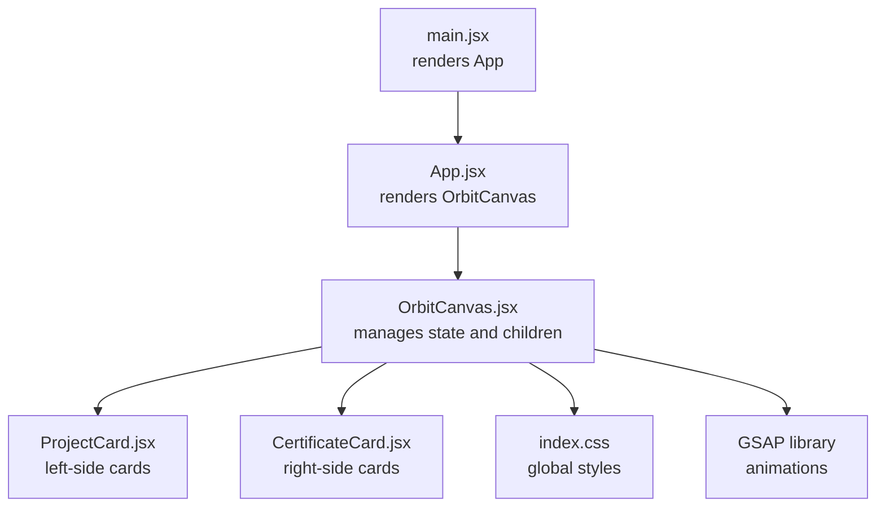
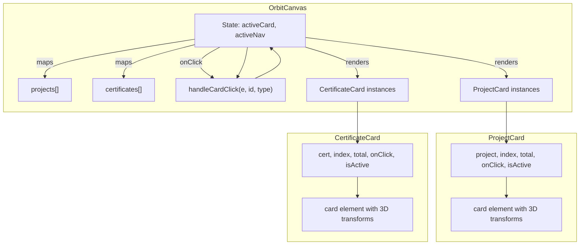
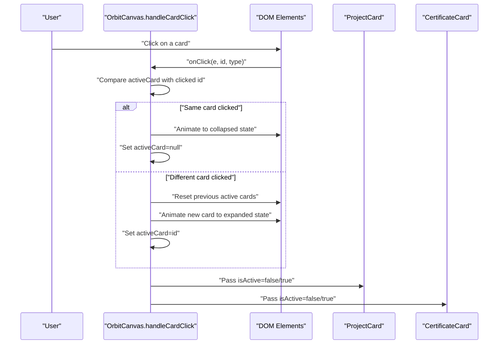
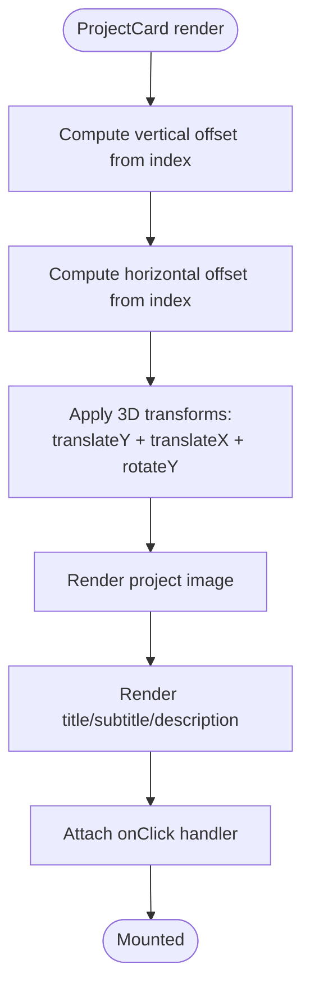
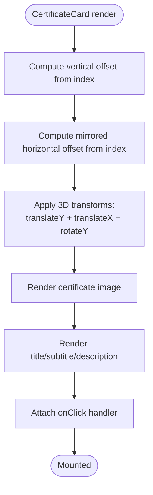
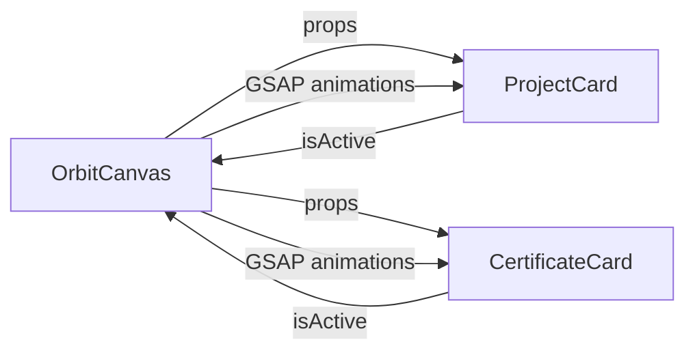
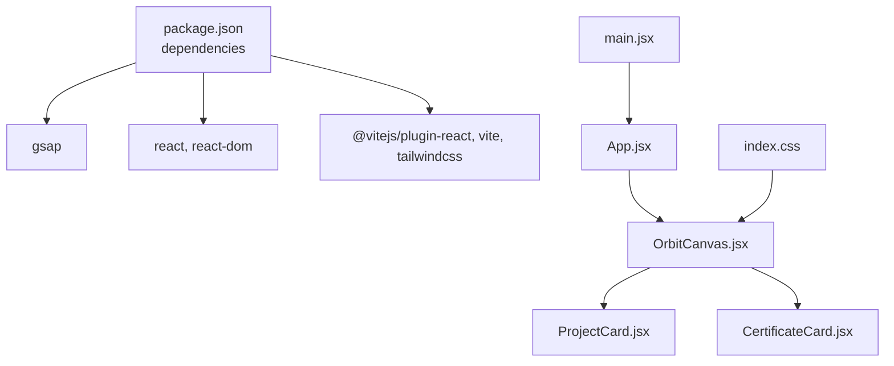

# Component Integration

<cite>
**Referenced Files in This Document**
- [OrbitCanvas.jsx](file://src/components/OrbitCanvas.jsx)
- [ProjectCard.jsx](file://src/components/ProjectCard.jsx)
- [CertificateCard.jsx](file://src/components/CertificateCard.jsx)
- [App.jsx](file://src/App.jsx)
- [main.jsx](file://src/main.jsx)
- [index.css](file://src/index.css)
- [package.json](file://package.json)
</cite>

## Table of Contents
1. [Introduction](#introduction)
2. [Project Structure](#project-structure)
3. [Core Components](#core-components)
4. [Architecture Overview](#architecture-overview)
5. [Detailed Component Analysis](#detailed-component-analysis)
6. [Dependency Analysis](#dependency-analysis)
7. [Performance Considerations](#performance-considerations)
8. [Troubleshooting Guide](#troubleshooting-guide)
9. [Conclusion](#conclusion)

## Introduction
This document explains how OrbitCanvas orchestrates its child components—ProjectCard and CertificateCard—to create an interactive orbital layout. It details the prop passing patterns, data flow, event coordination, and how the parent manages active states across multiple card instances. The goal is to help developers understand the composition architecture and coordinate interactions between the orbital system and individual cards.

## Project Structure
The application follows a straightforward React component hierarchy:
- The root renders the OrbitCanvas component.
- OrbitCanvas composes ProjectCard and CertificateCard instances and passes them data and handlers.
- Tailwind CSS provides styling, and GSAP powers animations.

**Diagram sources**
- [main.jsx:1-11](file://src/main.jsx#L1-L11)
- [App.jsx:1-8](file://src/App.jsx#L1-L8)
- [OrbitCanvas.jsx:1-383](file://src/components/OrbitCanvas.jsx#L1-L383)
- [ProjectCard.jsx:1-32](file://src/components/ProjectCard.jsx#L1-L32)
- [CertificateCard.jsx:1-31](file://src/components/CertificateCard.jsx#L1-L31)
- [index.css:1-28](file://src/index.css#L1-L28)
- [package.json:11-14](file://package.json#L11-L14)

**Section sources**
- [main.jsx:1-11](file://src/main.jsx#L1-L11)
- [App.jsx:1-8](file://src/App.jsx#L1-L8)
- [index.css:1-28](file://src/index.css#L1-L28)
- [package.json:11-14](file://package.json#L11-L14)

## Core Components
- OrbitCanvas: Central container that holds orbital rings, navigation arrows, profile photo, and two lists of cards. It maintains active card state and handles click events to animate and focus cards.
- ProjectCard: Receives project data, positional index, total count, click handler, and active state. Renders a project card with 3D transforms and applies active styling.
- CertificateCard: Receives certificate data, positional index, total count, click handler, and active state. Mirrors ProjectCard’s interface and styling for consistent orbital behavior.

Key integration points:
- Props passed from OrbitCanvas to children include data objects (project/cert), index, total count, onClick handler, and isActive flag.
- Both children use index-driven transforms to position themselves along the vertical axis and apply slight horizontal offsets to create an orbital effect.
- Active state is coordinated centrally in OrbitCanvas and propagated down to children via isActive.

**Section sources**
- [OrbitCanvas.jsx:96-383](file://src/components/OrbitCanvas.jsx#L96-L383)
- [ProjectCard.jsx:1-32](file://src/components/ProjectCard.jsx#L1-L32)
- [CertificateCard.jsx:1-31](file://src/components/CertificateCard.jsx#L1-L31)

## Architecture Overview
The orbital composition centers around OrbitCanvas rendering two groups of cards:
- Left side: ProjectCard instances receive project data and are positioned with left-side transforms.
- Right side: CertificateCard instances receive certificate data and are positioned with right-side transforms.
- Both groups share the same click handler and active state logic, enabling coordinated selection and focus.

**Diagram sources**
- [OrbitCanvas.jsx:316-342](file://src/components/OrbitCanvas.jsx#L316-L342)
- [ProjectCard.jsx:1-32](file://src/components/ProjectCard.jsx#L1-L32)
- [CertificateCard.jsx:1-31](file://src/components/CertificateCard.jsx#L1-L31)

## Detailed Component Analysis

### OrbitCanvas: Parent orchestration and state management
Responsibilities:
- Holds orbital data arrays for projects and certificates.
- Manages active card state and active navigation state.
- Provides a centralized click handler to coordinate card selection and animations.
- Applies entrance and continuous animations using GSAP for cards, profile photo, orbit rings, and code rain.

Prop passing to children:
- ProjectCard receives project object, index, total length, onClick handler, and isActive flag.
- CertificateCard receives cert object, index, total length, onClick handler, and isActive flag.

Active state propagation:
- When a card is clicked, OrbitCanvas updates activeCard and re-renders children with isActive toggled accordingly.
- The handler animates the clicked card to a focused state and resets previously active cards.

Event handling coordination:
- The shared handleCardClick ensures only one card is active at a time.
- Clicks toggle between expanded focus and collapsed idle states.

**Diagram sources**
- [OrbitCanvas.jsx:192-226](file://src/components/OrbitCanvas.jsx#L192-L226)
- [ProjectCard.jsx:1-32](file://src/components/ProjectCard.jsx#L1-L32)
- [CertificateCard.jsx:1-31](file://src/components/CertificateCard.jsx#L1-L31)

**Section sources**
- [OrbitCanvas.jsx:96-383](file://src/components/OrbitCanvas.jsx#L96-L383)

### ProjectCard: Left-side orbital card
Props consumed:
- project: object containing title, subtitle, description, and image.
- index: zero-based position in the projects array.
- total: length of the projects array.
- onClick: delegated click handler from parent.
- isActive: boolean indicating whether this card is currently focused.

Positioning and transforms:
- Vertical offset is index-dependent to distribute cards vertically.
- Horizontal offset creates a subtle lateral shift for orbital feel.
- 3D rotation is applied to give depth and perspective.

Styling and interaction:
- Border and shadow change based on isActive.
- Click handler is attached to the card container.

**Diagram sources**
- [ProjectCard.jsx:1-32](file://src/components/ProjectCard.jsx#L1-L32)

**Section sources**
- [ProjectCard.jsx:1-32](file://src/components/ProjectCard.jsx#L1-L32)

### CertificateCard: Right-side orbital card
Props consumed:
- cert: object containing title, subtitle, description, and image.
- index: zero-based position in the certificates array.
- total: length of the certificates array.
- onClick: delegated click handler from parent.
- isActive: boolean indicating whether this card is currently focused.

Positioning and transforms:
- Mirrors ProjectCard’s index-based distribution with mirrored horizontal offsets for symmetry.
- 3D rotation is opposite to ProjectCard to create balanced orbital motion.

Styling and interaction:
- Border and shadow change based on isActive.
- Click handler is attached to the card container.

**Diagram sources**
- [CertificateCard.jsx:1-31](file://src/components/CertificateCard.jsx#L1-L31)

**Section sources**
- [CertificateCard.jsx:1-31](file://src/components/CertificateCard.jsx#L1-L31)

### Component Composition and Data Flow
- Data flow is unidirectional from OrbitCanvas down to children:
  - Arrays of project and certificate objects are mapped into lists.
  - Each child receives its data slice, index, total count, and event handler.
- Active state is centralized in OrbitCanvas and passed down as a boolean prop to indicate focus.
- Children remain presentation-focused and do not manage global state.

**Diagram sources**
- [OrbitCanvas.jsx:316-342](file://src/components/OrbitCanvas.jsx#L316-L342)
- [ProjectCard.jsx:1-32](file://src/components/ProjectCard.jsx#L1-L32)
- [CertificateCard.jsx:1-31](file://src/components/CertificateCard.jsx#L1-L31)

**Section sources**
- [OrbitCanvas.jsx:316-342](file://src/components/OrbitCanvas.jsx#L316-L342)

## Dependency Analysis
External libraries:
- GSAP: Used for entrance and continuous animations across cards, profile photo, orbit rings, and code rain.
- React: Component model and hooks for state and effects.
- Tailwind CSS: Utility-first styling for responsive design and theme consistency.

Internal dependencies:
- OrbitCanvas imports ProjectCard and CertificateCard and passes them data and handlers.
- App renders OrbitCanvas.
- main.jsx mounts App inside StrictMode.

**Diagram sources**
- [package.json:11-22](file://package.json#L11-L22)
- [OrbitCanvas.jsx:1-4](file://src/components/OrbitCanvas.jsx#L1-L4)
- [App.jsx:1-5](file://src/App.jsx#L1-L5)
- [main.jsx:1-11](file://src/main.jsx#L1-L11)
- [index.css:1-28](file://src/index.css#L1-L28)

**Section sources**
- [package.json:11-22](file://package.json#L11-L22)
- [OrbitCanvas.jsx:1-4](file://src/components/OrbitCanvas.jsx#L1-L4)
- [App.jsx:1-5](file://src/App.jsx#L1-L5)
- [main.jsx:1-11](file://src/main.jsx#L1-L11)
- [index.css:1-28](file://src/index.css#L1-L28)

## Performance Considerations
- Animation scope: GSAP targets specific selectors (e.g., ".project-card", ".cert-card"), minimizing unnecessary reflows.
- Active state updates: OrbitCanvas uses dataset manipulation and targeted GSAP tweens to update only the affected card, reducing layout thrash.
- Transform-based layout: Using translate and rotate avoids expensive layout recalculations compared to changing position properties.
- Index-based transforms: Precomputed offsets reduce runtime calculations during renders.

[No sources needed since this section provides general guidance]

## Troubleshooting Guide
Common issues and resolutions:
- Click handler not firing:
  - Verify that onClick is attached to the card container and that the handler receives the correct id and type.
  - Ensure that the handler updates activeCard and re-renders children with the correct isActive flag.
- Active card visuals not updating:
  - Confirm that isActive prop is passed correctly and that conditional styling reflects the active state.
  - Check that the handler sets dataset attributes appropriately for previously active cards.
- Animations not playing:
  - Ensure GSAP is imported and that selectors match rendered elements (e.g., ".project-card", ".cert-card").
  - Verify that entrance animations run after initial mount and that continuous animations are not reverted prematurely.

**Section sources**
- [OrbitCanvas.jsx:192-226](file://src/components/OrbitCanvas.jsx#L192-L226)
- [ProjectCard.jsx:1-32](file://src/components/ProjectCard.jsx#L1-L32)
- [CertificateCard.jsx:1-31](file://src/components/CertificateCard.jsx#L1-L31)

## Conclusion
OrbitCanvas serves as the central coordinator for an orbital card system. By passing minimal, well-defined props to ProjectCard and CertificateCard, it enables predictable composition and consistent behavior across multiple card instances. The centralized active state and shared click handler ensure smooth interactions, while GSAP animations enhance the immersive experience. This architecture cleanly separates concerns: the parent manages state and animations, while children focus on rendering and receiving props.