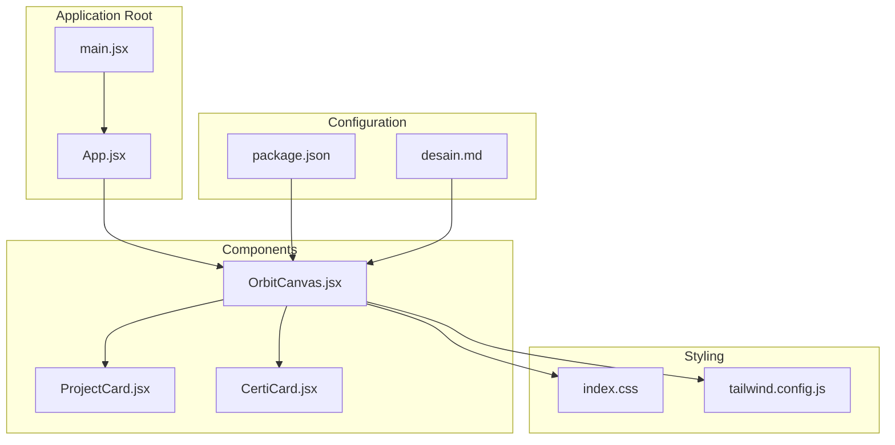
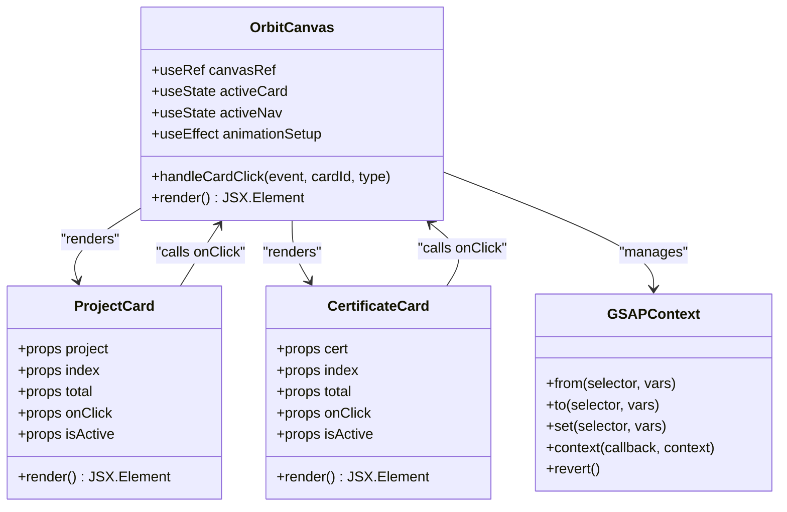
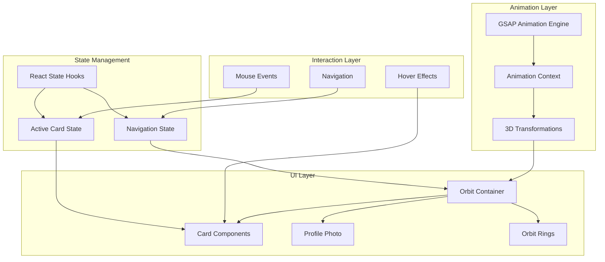
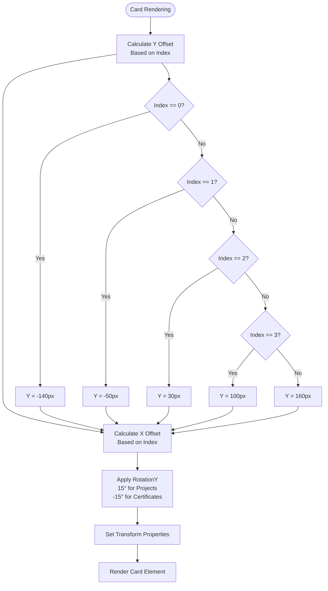
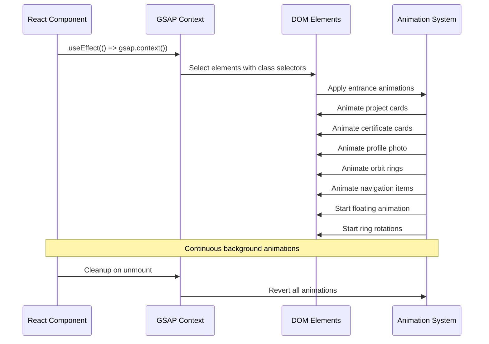
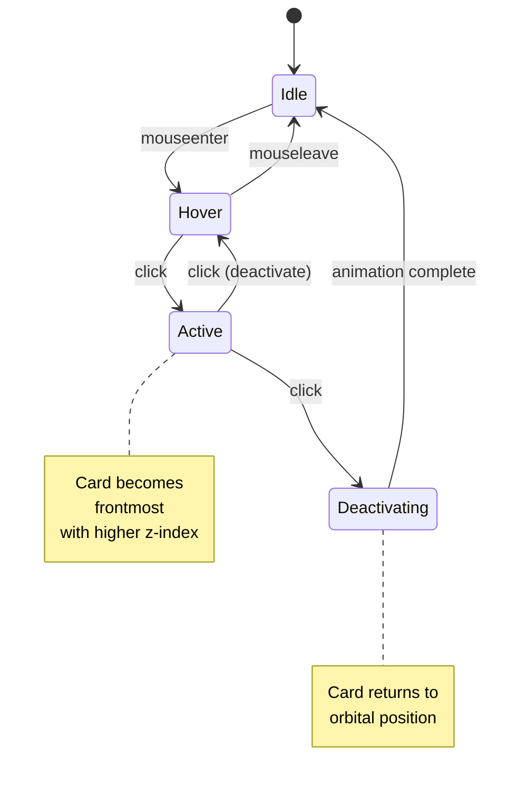
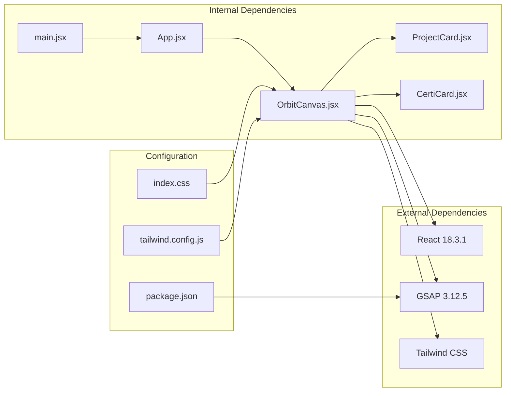
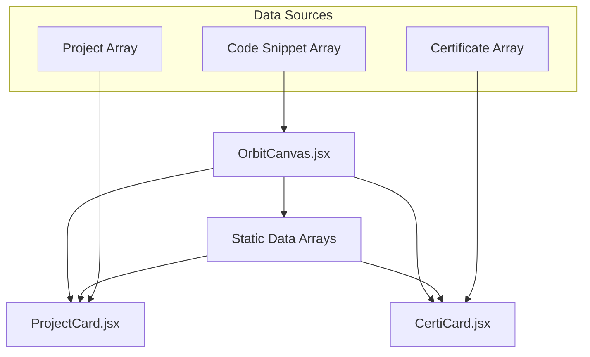
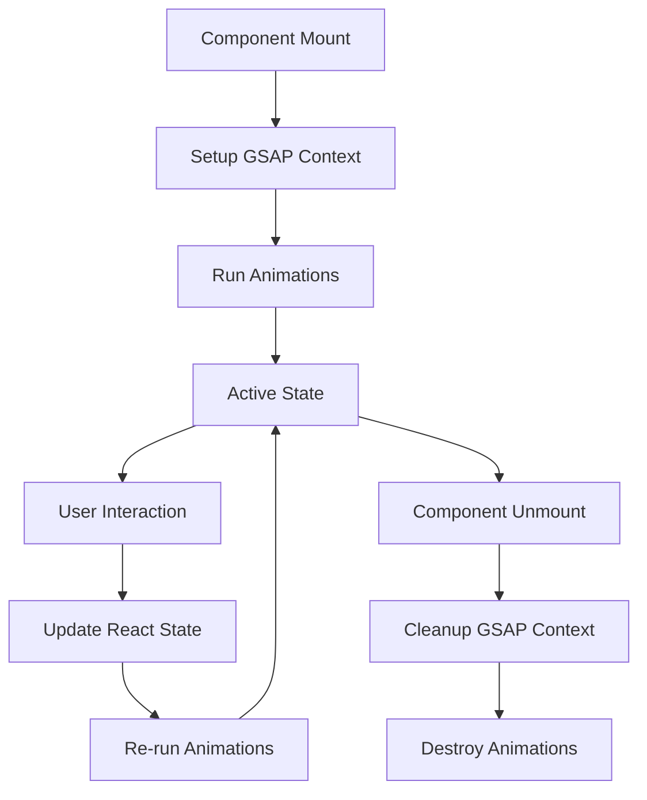

# OrbitCanvas Component

<cite>
**Referenced Files in This Document**
- [OrbitCanvas.jsx](file://src/components/OrbitCanvas.jsx)
- [ProjectCard.jsx](file://src/components/ProjectCard.jsx)
- [CertificateCard.jsx](file://src/components/CertificateCard.jsx)
- [App.jsx](file://src/App.jsx)
- [main.jsx](file://src/main.jsx)
- [index.css](file://src/index.css)
- [tailwind.config.js](file://tailwind.config.js)
- [desain.md](file://desain.md)
- [package.json](file://package.json)
</cite>

## Table of Contents
1. [Introduction](#introduction)
2. [Project Structure](#project-structure)
3. [Core Components](#core-components)
4. [Architecture Overview](#architecture-overview)
5. [Detailed Component Analysis](#detailed-component-analysis)
6. [Dependency Analysis](#dependency-analysis)
7. [Performance Considerations](#performance-considerations)
8. [Troubleshooting Guide](#troubleshooting-guide)
9. [Conclusion](#conclusion)

## Introduction

The OrbitCanvas component serves as the central animation hub for a modern 3D portfolio website. It orchestrates orbital positioning of project and certification cards around a central profile photo using GSAP animations, creating an immersive visual experience. The component manages state for active card selection, handles user interactions through click events, and coordinates the overall 3D visualization system with responsive design considerations.

This component implements a sophisticated orbital mechanics system where cards orbit around a central profile photo, with smooth entrance animations, continuous background animations, and interactive focus management. The implementation leverages React hooks for state management, GSAP for high-performance animations, and Tailwind CSS for responsive styling.

## Project Structure

The OrbitCanvas component is part of a React-based portfolio application with the following structure:

**Diagram sources**
- [main.jsx:1-11](file://src/main.jsx#L1-L11)
- [App.jsx:1-8](file://src/App.jsx#L1-L8)
- [OrbitCanvas.jsx:1-382](file://src/components/OrbitCanvas.jsx#L1-L382)

**Section sources**
- [main.jsx:1-11](file://src/main.jsx#L1-L11)
- [App.jsx:1-8](file://src/App.jsx#L1-L8)
- [package.json:1-23](file://package.json#L1-L23)

## Core Components

The OrbitCanvas system consists of several interconnected components that work together to create the orbital animation experience:

### Main Component Architecture

**Diagram sources**
- [OrbitCanvas.jsx:96-382](file://src/components/OrbitCanvas.jsx#L96-L382)
- [ProjectCard.jsx:1-32](file://src/components/ProjectCard.jsx#L1-L32)
- [CertificateCard.jsx:1-31](file://src/components/CertificateCard.jsx#L1-L31)

### State Management System

The component maintains two primary state variables:

| State Variable | Type | Purpose | Default Value |
|----------------|------|---------|---------------|
| `activeCard` | Number | Tracks currently focused card ID | null |
| `activeNav` | String | Current navigation tab selection | "Home" |

**Section sources**
- [OrbitCanvas.jsx:96-100](file://src/components/OrbitCanvas.jsx#L96-L100)

## Architecture Overview

The OrbitCanvas implements a layered architecture with distinct concerns for animation orchestration, state management, and UI rendering:

**Diagram sources**
- [OrbitCanvas.jsx:101-190](file://src/components/OrbitCanvas.jsx#L101-L190)
- [OrbitCanvas.jsx:192-226](file://src/components/OrbitCanvas.jsx#L192-L226)

The architecture follows React's declarative paradigm while leveraging GSAP's imperative animation capabilities. The component uses React's effect hooks for lifecycle management and GSAP's context system for automatic cleanup.

**Section sources**
- [OrbitCanvas.jsx:1-382](file://src/components/OrbitCanvas.jsx#L1-L382)

## Detailed Component Analysis

### Orbital Mechanics Implementation

The orbital mechanics system creates a realistic 3D animation where project and certificate cards orbit around a central profile photo:

#### Card Distribution Algorithm

**Diagram sources**
- [ProjectCard.jsx:2-4](file://src/components/ProjectCard.jsx#L2-L4)
- [CertificateCard.jsx:1-3](file://src/components/CertificateCard.jsx#L1-L3)

#### Animation Lifecycle

The component implements a comprehensive animation lifecycle managed through GSAP's context system:

**Diagram sources**
- [OrbitCanvas.jsx:101-190](file://src/components/OrbitCanvas.jsx#L101-L190)

**Section sources**
- [ProjectCard.jsx:1-32](file://src/components/ProjectCard.jsx#L1-L32)
- [CertificateCard.jsx:1-31](file://src/components/CertificateCard.jsx#L1-L31)
- [OrbitCanvas.jsx:101-190](file://src/components/OrbitCanvas.jsx#L101-L190)

### Focus Management System

The focus management system provides interactive card selection with smooth transitions:

**Diagram sources**
- [OrbitCanvas.jsx:192-226](file://src/components/OrbitCanvas.jsx#L192-L226)

The system uses GSAP animations for smooth transitions between states, with different animation parameters for activation and deactivation scenarios.

**Section sources**
- [OrbitCanvas.jsx:192-226](file://src/components/OrbitCanvas.jsx#L192-L226)

### Responsive Design Implementation

The component implements a comprehensive responsive design system using Tailwind CSS breakpoints:

| Breakpoint | Description | Usage |
|------------|-------------|-------|
| Base | Mobile-first | Default styles apply to all screens |
| `md:` | Medium screens (768px+) | Tablet and larger devices |
| `lg:` | Large screens (1024px+) | Desktop devices |
| `xl:` | Extra-large screens (1280px+) | Large desktop displays |

**Responsive Element Breakdown:**

| Element | Base Size | MD Size | XL Size |
|---------|-----------|---------|---------|
| Profile Photo | 200px × 350px | 260px × 420px | - |
| Project Cards | 200px × 230px | - | - |
| Certificate Cards | 200px × 230px | - | - |
| Orbit Rings | 500px × 500px | 650px × 650px | - |
| Orbit Rings (2) | 400px × 400px | 520px × 520px | - |

**Section sources**
- [OrbitCanvas.jsx:290-294](file://src/components/OrbitCanvas.jsx#L290-L294)
- [ProjectCard.jsx:8](file://src/components/ProjectCard.jsx#L8)
- [CertificateCard.jsx:7](file://src/components/CertificateCard.jsx#L7)

### Animation Configuration

The component uses GSAP for high-performance animations with carefully tuned parameters:

| Animation Type | Duration | Easing | Repeat | Purpose |
|----------------|----------|--------|--------|---------|
| Card Entrance | 1.2s | power3.out | - | Initial card appearance |
| Profile Photo | 1.2s | back.out(1.7) | - | Central photo reveal |
| Orbit Rings | 1.5s | power2.out | - | Ring formation |
| Navigation Items | 0.8s | power2.out | - | Menu reveal |
| Profile Float | - | sine.inOut | -1 | Continuous floating |
| Ring Rotation 1 | 20s | none | -1 | Slow clockwise rotation |
| Ring Rotation 2 | 25s | none | -1 | Slow counter-clockwise rotation |
| Code Rain | 4s | sine.inOut | -1 | Background animation |

**Section sources**
- [OrbitCanvas.jsx:102-187](file://src/components/OrbitCanvas.jsx#L102-L187)

## Dependency Analysis

The OrbitCanvas component has several key dependencies that enable its functionality:

**Diagram sources**
- [package.json:11-14](file://package.json#L11-L14)
- [OrbitCanvas.jsx:1-4](file://src/components/OrbitCanvas.jsx#L1-L4)

### External Dependencies

| Dependency | Version | Purpose | Usage |
|------------|---------|---------|-------|
| react | ^18.3.1 | Core framework | Component structure |
| react-dom | ^18.3.1 | DOM rendering | Application bootstrapping |
| gsap | ^3.12.5 | Animation engine | Complex animations |
| tailwindcss | ^3.4.17 | Utility CSS | Responsive styling |

**Section sources**
- [package.json:11-22](file://package.json#L11-L22)

### Internal Component Dependencies

The component structure demonstrates clear separation of concerns:

**Diagram sources**
- [OrbitCanvas.jsx:6-94](file://src/components/OrbitCanvas.jsx#L6-L94)
- [ProjectCard.jsx:1](file://src/components/ProjectCard.jsx#L1)
- [CertificateCard.jsx:1](file://src/components/CertificateCard.jsx#L1)

**Section sources**
- [OrbitCanvas.jsx:1-94](file://src/components/OrbitCanvas.jsx#L1-L94)

## Performance Considerations

The OrbitCanvas component implements several performance optimization strategies:

### Animation Performance

1. **GSAP Context Management**: Uses GSAP's context system for automatic cleanup and memory management
2. **Transform Optimization**: Leverages hardware-accelerated CSS transforms for smooth animations
3. **Selective Updates**: Only animates elements that are visible or relevant to the current state
4. **Efficient Selectors**: Uses class-based selectors for optimal DOM querying

### Memory Management

**Diagram sources**
- [OrbitCanvas.jsx:101-190](file://src/components/OrbitCanvas.jsx#L101-L190)

### Responsive Performance

1. **CSS Grid Background**: Uses efficient CSS gradients instead of heavy images
2. **Tailwind Utilities**: Leverages compiled utility classes for optimal performance
3. **Minimal DOM Nodes**: Reduces DOM complexity through strategic element placement
4. **Hardware Acceleration**: Utilizes transform properties for GPU acceleration

**Section sources**
- [OrbitCanvas.jsx:101-190](file://src/components/OrbitCanvas.jsx#L101-L190)
- [index.css:1-28](file://src/index.css#L1-L28)

## Troubleshooting Guide

### Common Issues and Solutions

#### Animation Not Working

**Symptoms**: Cards don't orbit or animations don't play
**Causes**:
- GSAP not properly imported
- DOM elements not rendered yet
- Animation context not properly cleaned up

**Solutions**:
1. Verify GSAP import in component
2. Ensure component renders before animation runs
3. Check useEffect cleanup returns properly

#### Cards Not Positioning Correctly

**Symptoms**: Cards overlap or appear in wrong positions
**Causes**:
- Incorrect transform calculations
- CSS conflicts with Tailwind utilities
- Missing preserve-3d property

**Solutions**:
1. Verify transform calculations in card components
2. Check CSS specificity conflicts
3. Ensure transform-style: preserve-3d is applied

#### Performance Issues

**Symptoms**: Stuttering animations or slow interactions
**Causes**:
- Too many simultaneous animations
- Excessive re-renders
- Memory leaks from animation contexts

**Solutions**:
1. Limit concurrent animations
2. Optimize component re-renders
3. Ensure proper cleanup in useEffect

**Section sources**
- [OrbitCanvas.jsx:101-190](file://src/components/OrbitCanvas.jsx#L101-L190)
- [ProjectCard.jsx:14-17](file://src/components/ProjectCard.jsx#L14-L17)
- [CertificateCard.jsx:13-16](file://src/components/CertificateCard.jsx#L13-L16)

### Debugging Tips

1. **Console Logging**: Add console.log statements in animation callbacks
2. **Browser DevTools**: Use Performance tab to monitor animation frames
3. **React DevTools**: Monitor component re-renders and state changes
4. **GSAP Debugger**: Use GSAP's built-in debugging tools

## Conclusion

The OrbitCanvas component represents a sophisticated implementation of 3D animation in React using GSAP. It successfully combines orbital mechanics, state management, and responsive design to create an immersive portfolio experience. The component's architecture demonstrates best practices for animation-heavy applications, including proper cleanup, performance optimization, and maintainable code structure.

Key achievements include:
- Seamless orbital animations with GSAP
- Interactive focus management with smooth transitions
- Comprehensive responsive design system
- Efficient memory management and cleanup
- Modular component architecture

The implementation serves as an excellent example of how to blend declarative React patterns with imperative animation libraries for creating engaging user experiences. The component's modular design and clear separation of concerns make it highly maintainable and extensible for future enhancements.