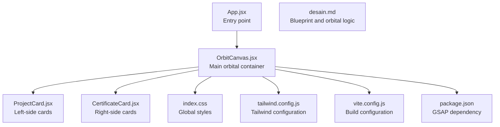
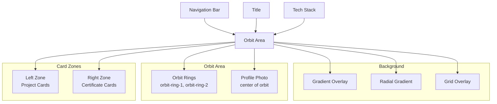
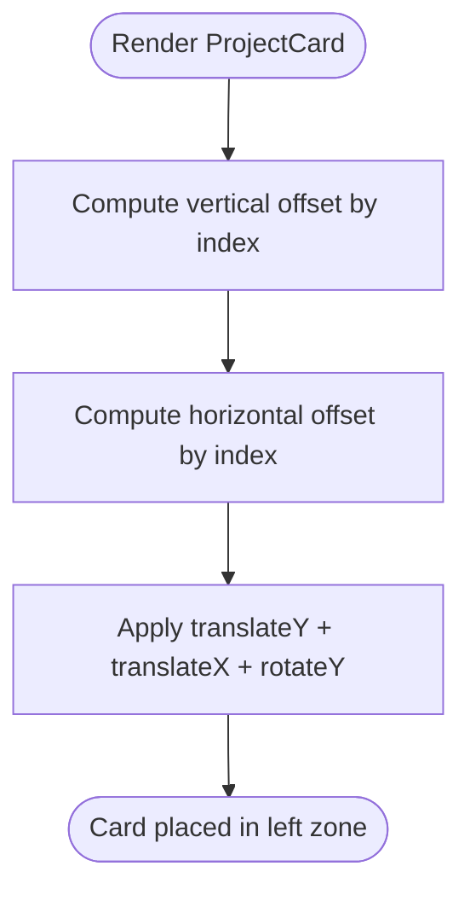
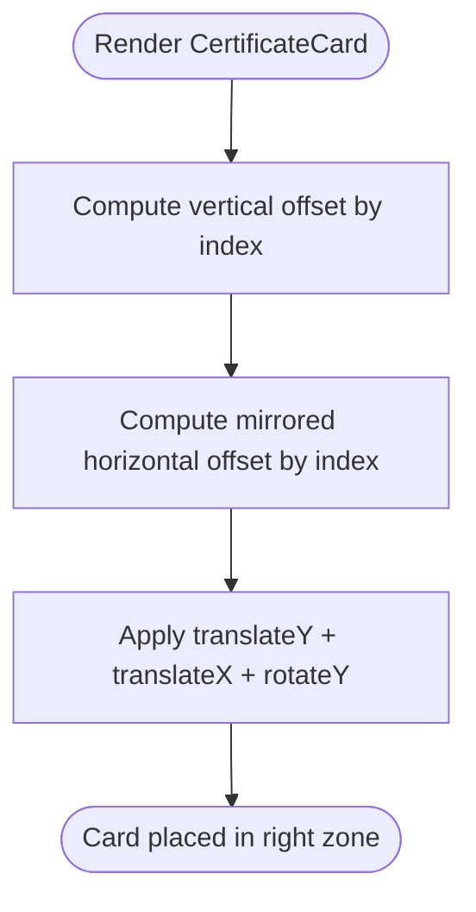
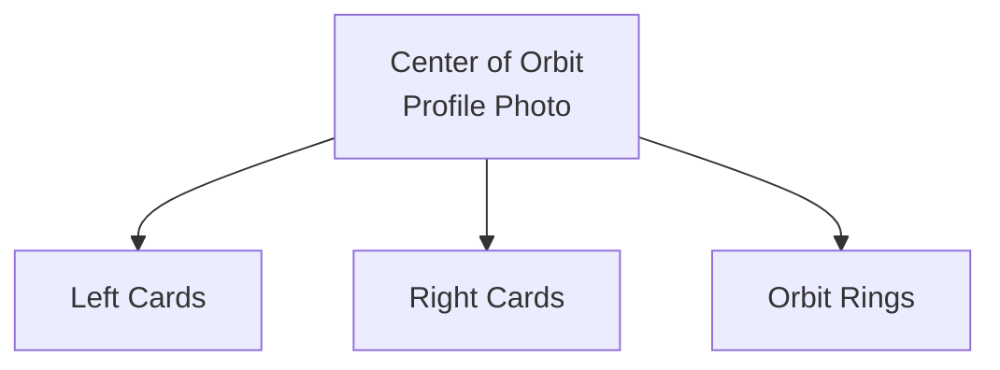
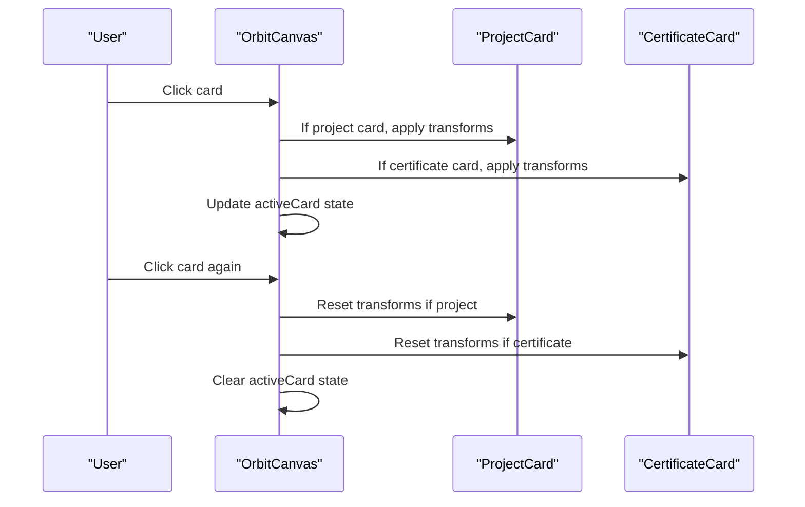
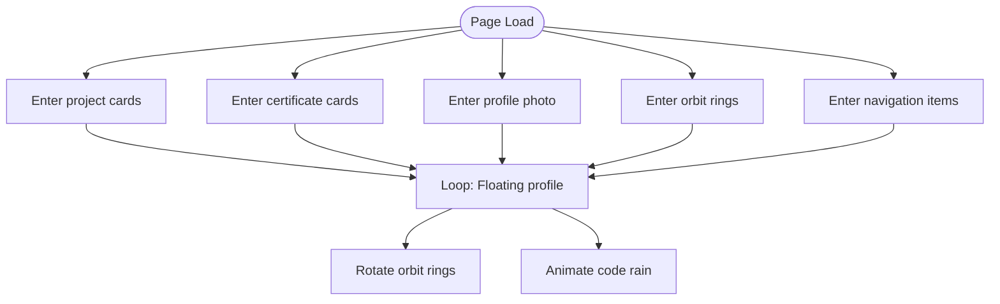
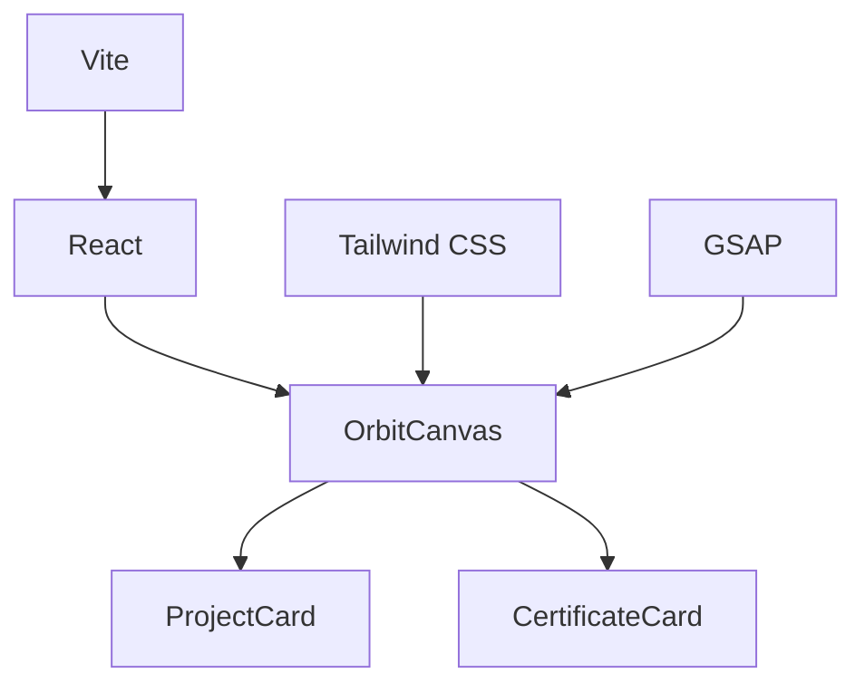

# Orbital Positioning System

<cite>
**Referenced Files in This Document**
- [OrbitCanvas.jsx](file://src/components/OrbitCanvas.jsx)
- [ProjectCard.jsx](file://src/components/ProjectCard.jsx)
- [CertificateCard.jsx](file://src/components/CertificateCard.jsx)
- [App.jsx](file://src/App.jsx)
- [index.css](file://src/index.css)
- [tailwind.config.js](file://tailwind.config.js)
- [vite.config.js](file://vite.config.js)
- [package.json](file://package.json)
- [desain.md](file://desain.md)
</cite>

## Table of Contents
1. [Introduction](#introduction)
2. [Project Structure](#project-structure)
3. [Core Components](#core-components)
4. [Architecture Overview](#architecture-overview)
5. [Detailed Component Analysis](#detailed-component-analysis)
6. [Dependency Analysis](#dependency-analysis)
7. [Performance Considerations](#performance-considerations)
8. [Troubleshooting Guide](#troubleshooting-guide)
9. [Conclusion](#conclusion)
10. [Appendices](#appendices)

## Introduction
This document explains the orbital positioning system that creates a 3D layout for project and certificate cards around a central profile photo. It covers:
- Mathematical positioning logic for cards on the left and right sides of the orbit
- Orbital angle and distance calculations
- Perspective and coordinate system
- Responsive behavior across screen sizes
- How the central profile photo acts as the orbital center
- Examples of card position computation and adaptation to varying numbers of cards

## Project Structure
The orbital system is implemented as a React component that orchestrates animations and layout. Supporting components manage individual cards. The design blueprint outlines the intended orbital mechanics and GSAP-driven transforms.

**Diagram sources**
- [App.jsx:1-8](file://src/App.jsx#L1-L8)
- [OrbitCanvas.jsx:1-383](file://src/components/OrbitCanvas.jsx#L1-L383)
- [ProjectCard.jsx:1-32](file://src/components/ProjectCard.jsx#L1-L32)
- [CertificateCard.jsx:1-31](file://src/components/CertificateCard.jsx#L1-L31)
- [index.css:1-28](file://src/index.css#L1-L28)
- [tailwind.config.js:1-16](file://tailwind.config.js#L1-L16)
- [vite.config.js:1-7](file://vite.config.js#L1-L7)
- [package.json:1-24](file://package.json#L1-L24)
- [desain.md:1-381](file://desain.md#L1-L381)

**Section sources**
- [App.jsx:1-8](file://src/App.jsx#L1-L8)
- [OrbitCanvas.jsx:1-383](file://src/components/OrbitCanvas.jsx#L1-L383)
- [ProjectCard.jsx:1-32](file://src/components/ProjectCard.jsx#L1-L32)
- [CertificateCard.jsx:1-31](file://src/components/CertificateCard.jsx#L1-L31)
- [index.css:1-28](file://src/index.css#L1-L28)
- [tailwind.config.js:1-16](file://tailwind.config.js#L1-L16)
- [vite.config.js:1-7](file://vite.config.js#L1-L7)
- [package.json:1-24](file://package.json#L1-L24)
- [desain.md:1-381](file://desain.md#L1-L381)

## Core Components
- OrbitCanvas: Central container that defines the orbital area, renders orbit rings, profile photo, and card containers. It sets up entrance animations, floating and rotating effects, and handles card click interactions.
- ProjectCard: Left-side card renderer with vertical offset and slight horizontal offset to create a curved orbit appearance.
- CertificateCard: Right-side card renderer mirroring ProjectCard with opposite horizontal offsets to achieve symmetrical orbiting.

Key responsibilities:
- Coordinate system origin at the center of the profile photo
- Perspective transforms via GSAP for 3D effect
- Responsive sizing and spacing using Tailwind utilities
- Click-to-focus behavior with z-index elevation and scaling

**Section sources**
- [OrbitCanvas.jsx:96-383](file://src/components/OrbitCanvas.jsx#L96-L383)
- [ProjectCard.jsx:1-32](file://src/components/ProjectCard.jsx#L1-L32)
- [CertificateCard.jsx:1-31](file://src/components/CertificateCard.jsx#L1-L31)

## Architecture Overview
The orbital system composes a layered, responsive layout:
- Background: gradient and grid overlays
- Orbit area: centered profile photo with orbit rings
- Left and right card zones: containers for ProjectCard and CertificateCard lists
- Navigation and tech stack: UI elements around the orbit

**Diagram sources**
- [OrbitCanvas.jsx:235-343](file://src/components/OrbitCanvas.jsx#L235-L343)

## Detailed Component Analysis

### Coordinate System and Perspective
- Origin: The profile photo is positioned at the center of the orbit area and serves as the orbital center.
- Perspective: GSAP transforms apply perspective to give a realistic 3D effect during rotations and translations.
- Axes:
  - X-axis: Horizontal translation determines lateral placement relative to the center
  - Y-axis: Vertical translation positions cards along the vertical axis
  - Z-axis: Depth translation controls perceived depth and focus

Responsive adjustments:
- On larger screens, card dimensions and orbit ring sizes increase while maintaining proportional spacing.

**Section sources**
- [OrbitCanvas.jsx:287-314](file://src/components/OrbitCanvas.jsx#L287-L314)
- [ProjectCard.jsx:14-17](file://src/components/ProjectCard.jsx#L14-L17)
- [CertificateCard.jsx:13-16](file://src/components/CertificateCard.jsx#L13-L16)

### Left-Side Orbital Positioning (Project Cards)
Positioning logic:
- Vertical offsets: Each card receives a specific vertical offset based on its index to distribute them vertically.
- Horizontal offsets: A small horizontal offset is applied per index to create a subtle curve toward the center.
- Rotation: Cards are rotated slightly around the Y-axis to face the center.

Adaptation to card count:
- The current implementation uses fixed offsets for a small set of cards. For dynamic counts, the offsets could be computed proportionally across the available vertical space.

**Diagram sources**
- [ProjectCard.jsx:2-4](file://src/components/ProjectCard.jsx#L2-L4)
- [ProjectCard.jsx:14-17](file://src/components/ProjectCard.jsx#L14-L17)

**Section sources**
- [ProjectCard.jsx:1-32](file://src/components/ProjectCard.jsx#L1-L32)

### Right-Side Orbital Positioning (Certificate Cards)
Positioning logic:
- Vertical offsets mirror the left side for symmetry.
- Horizontal offsets are mirrored (negative) to place cards on the right side of the center.
- Rotation: Cards are rotated in the opposite direction around the Y-axis to face the center.

Adaptation to card count:
- Similar to the left side, fixed offsets are used. Dynamic distribution can be achieved by computing offsets based on total card count.

**Diagram sources**
- [CertificateCard.jsx:2-3](file://src/components/CertificateCard.jsx#L2-L3)
- [CertificateCard.jsx:13-16](file://src/components/CertificateCard.jsx#L13-L16)

**Section sources**
- [CertificateCard.jsx:1-31](file://src/components/CertificateCard.jsx#L1-L31)

### Central Profile Photo as Orbital Center
- Positioned absolutely at the center of the orbit area.
- Acts as the focal point around which cards orbit.
- Provides a visual anchor for the 3D perspective and animations.

**Diagram sources**
- [OrbitCanvas.jsx:304-314](file://src/components/OrbitCanvas.jsx#L304-L314)

**Section sources**
- [OrbitCanvas.jsx:304-314](file://src/components/OrbitCanvas.jsx#L304-L314)

### Click-to-Focus Interaction
Behavior:
- When a card is clicked:
  - It moves to the center (x: 0)
  - Reduces rotation around Y-axis to face the camera
  - Increases z-depth and scale to appear in front of the profile photo
- When clicked again, it returns to its orbital position.

**Diagram sources**
- [OrbitCanvas.jsx:192-226](file://src/components/OrbitCanvas.jsx#L192-L226)

**Section sources**
- [OrbitCanvas.jsx:192-226](file://src/components/OrbitCanvas.jsx#L192-L226)

### Entrance and Continuous Animations
Entrance animations:
- Project cards enter from the left with rotation and fade-in
- Certificate cards enter from the right with mirrored rotation and fade-in
- Profile photo and orbit rings scale in with staggered delays
- Navigation items slide up into place

Continuous animations:
- Profile photo floats gently up and down
- Orbit rings rotate at different speeds and directions
- Background code rain spans animate independently

**Diagram sources**
- [OrbitCanvas.jsx:101-190](file://src/components/OrbitCanvas.jsx#L101-L190)

**Section sources**
- [OrbitCanvas.jsx:101-190](file://src/components/OrbitCanvas.jsx#L101-L190)

### Responsive Positioning Across Screen Sizes
- Tailwind utilities adjust card dimensions and orbit ring sizes for medium and larger screens.
- The orbit area uses relative units and flexbox to center content.
- The left and right card zones occupy half the viewport width minus margins, ensuring balanced coverage.

Examples:
- On larger screens, card width increases, and orbit ring diameters grow proportionally.
- The vertical distribution remains consistent, but spacing scales with screen size.

**Section sources**
- [OrbitCanvas.jsx:316-342](file://src/components/OrbitCanvas.jsx#L316-L342)
- [ProjectCard.jsx:8](file://src/components/ProjectCard.jsx#L8)
- [CertificateCard.jsx:7](file://src/components/CertificateCard.jsx#L7)

## Dependency Analysis
External libraries and frameworks:
- GSAP: Provides 3D transforms, timing, and easing for animations
- Tailwind CSS: Utility-first styling for responsive layouts and visual effects
- Vite: Build toolchain for development and production
- React: UI framework powering the component tree

**Diagram sources**
- [package.json:11-14](file://package.json#L11-L14)
- [vite.config.js:1-7](file://vite.config.js#L1-L7)
- [tailwind.config.js:1-16](file://tailwind.config.js#L1-L16)

**Section sources**
- [package.json:1-24](file://package.json#L1-L24)
- [vite.config.js:1-7](file://vite.config.js#L1-L7)
- [tailwind.config.js:1-16](file://tailwind.config.js#L1-L16)

## Performance Considerations
- Use preserve-3d transforms to maintain 3D context for child elements
- Prefer hardware-accelerated properties (transform, opacity) for smooth animations
- Limit the number of animated elements on screen simultaneously
- Use staggered animations judiciously to avoid jank on lower-end devices
- Keep z-index stacking minimal to reduce repaint costs

## Troubleshooting Guide
Common issues and resolutions:
- Cards overlap or compress on small screens:
  - Adjust vertical offsets and card widths for smaller breakpoints
  - Consider dynamic offset computation based on total card count
- Perspective looks flat:
  - Ensure transform-style is preserved and perspective is applied consistently
- Animations stutter:
  - Reduce the number of simultaneous animations
  - Use simpler easing curves for complex sequences
- Click interactions not registering:
  - Verify event handlers are attached to the correct DOM nodes
  - Confirm active state updates do not conflict with animation tweens

**Section sources**
- [ProjectCard.jsx:14-17](file://src/components/ProjectCard.jsx#L14-L17)
- [CertificateCard.jsx:13-16](file://src/components/CertificateCard.jsx#L13-L16)
- [OrbitCanvas.jsx:192-226](file://src/components/OrbitCanvas.jsx#L192-L226)

## Conclusion
The orbital positioning system achieves a visually engaging 3D layout by combining a central profile photo with left and right card zones. Fixed vertical and horizontal offsets create a curved orbit appearance, while GSAP animations provide smooth entrance, continuous motion, and interactive focus transitions. The system is responsive and extensible, with room to refine positional calculations for dynamic card counts and optimize performance for varied device capabilities.

## Appendices

### Blueprint Reference
The design blueprint outlines intended orbital mechanics and GSAP transforms, including perspective, rotation, depth, and spacing calculations.

**Section sources**
- [desain.md:229-381](file://desain.md#L229-L381)