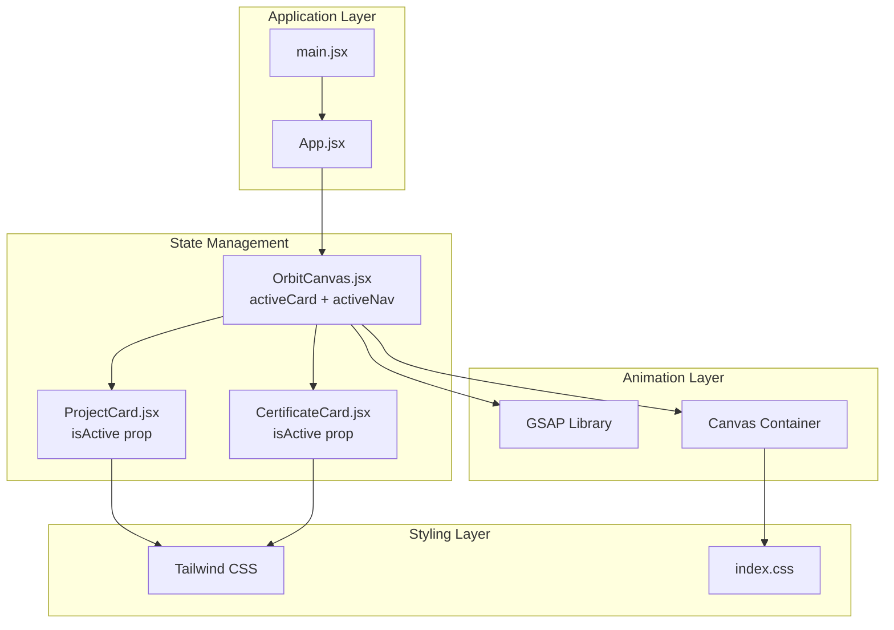
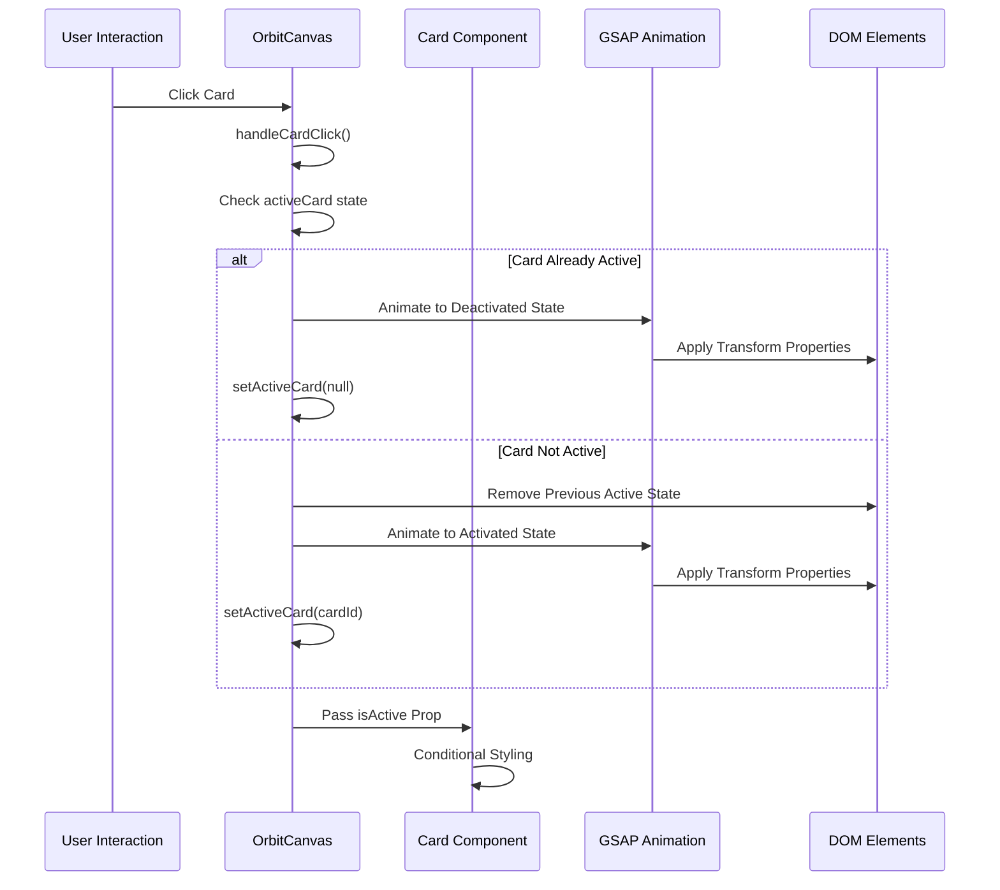
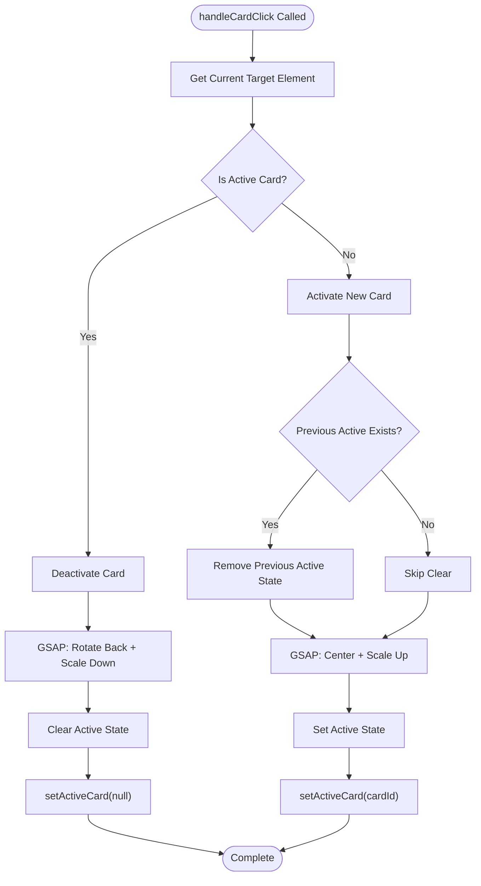
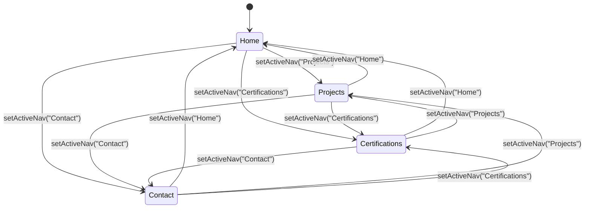
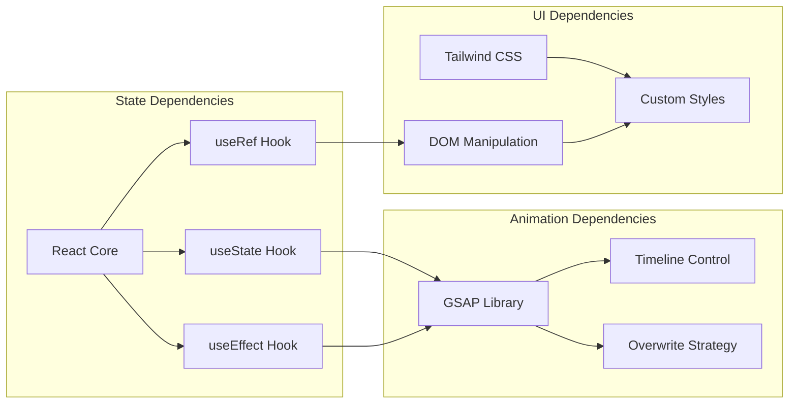

# State Management

<cite>
**Referenced Files in This Document**
- [OrbitCanvas.jsx](file://src/components/OrbitCanvas.jsx)
- [ProjectCard.jsx](file://src/components/ProjectCard.jsx)
- [CertificateCard.jsx](file://src/components/CertificateCard.jsx)
- [App.jsx](file://src/App.jsx)
- [main.jsx](file://src/main.jsx)
- [index.css](file://src/index.css)
- [package.json](file://package.json)
- [desain.md](file://desain.md)
</cite>

## Table of Contents
1. [Introduction](#introduction)
2. [Project Structure](#project-structure)
3. [Core Components](#core-components)
4. [Architecture Overview](#architecture-overview)
5. [Detailed Component Analysis](#detailed-component-analysis)
6. [Dependency Analysis](#dependency-analysis)
7. [Performance Considerations](#performance-considerations)
8. [Troubleshooting Guide](#troubleshooting-guide)
9. [Conclusion](#conclusion)

## Introduction
This document provides comprehensive documentation for the OrbitCanvas state management system, focusing on the activeCard state for tracking currently focused cards, activeNav state for navigation highlighting, and their coordination with user interactions. The system integrates React state management with GSAP animations to create smooth, interactive 3D card experiences.

## Project Structure
The state management system is organized around a central OrbitCanvas component that manages two primary state variables: activeCard and activeNav. These states coordinate with child components and GSAP animations to create an immersive orbital interface.

**Diagram sources**
- [App.jsx:1-8](file://src/App.jsx#L1-L8)
- [main.jsx:1-11](file://src/main.jsx#L1-L11)
- [OrbitCanvas.jsx:96-100](file://src/components/OrbitCanvas.jsx#L96-L100)

**Section sources**
- [App.jsx:1-8](file://src/App.jsx#L1-L8)
- [main.jsx:1-11](file://src/main.jsx#L1-L11)
- [package.json:1-24](file://package.json#L1-L24)

## Core Components
The state management system centers around two key state variables managed within the OrbitCanvas component:

### Active Card State (`activeCard`)
The `activeCard` state variable tracks which card is currently selected and focused. It serves as the primary mechanism for managing card activation/deactivation cycles.

### Active Navigation State (`activeNav`)
The `activeNav` state variable controls which navigation item is highlighted, providing visual feedback for user navigation actions.

**Section sources**
- [OrbitCanvas.jsx:98-99](file://src/components/OrbitCanvas.jsx#L98-L99)

## Architecture Overview
The state management architecture follows a unidirectional data flow pattern where the OrbitCanvas component acts as the central state manager coordinating interactions between cards, navigation, and animations.

**Diagram sources**
- [OrbitCanvas.jsx:192-226](file://src/components/OrbitCanvas.jsx#L192-L226)
- [ProjectCard.jsx:11](file://src/components/ProjectCard.jsx#L11)
- [CertificateCard.jsx:10](file://src/components/CertificateCard.jsx#L10)

## Detailed Component Analysis

### OrbitCanvas State Management
The OrbitCanvas component serves as the central state manager, implementing sophisticated state coordination between user interactions and visual feedback.

#### State Variables and Initialization
The component initializes two critical state variables:
- `activeCard`: Tracks currently selected card ID or null
- `activeNav`: Controls active navigation item with default "Home"

#### Handle Card Click Implementation
The `handleCardClick` function implements the core card activation/deactivation logic:

**Diagram sources**
- [OrbitCanvas.jsx:192-226](file://src/components/OrbitCanvas.jsx#L192-L226)

#### State Transition Patterns
The system implements bidirectional state transitions:
- **Activation Pattern**: `null` → `cardId` (with DOM cleanup)
- **Deactivation Pattern**: `cardId` → `null` (with GSAP revert)
- **Reactivation Pattern**: `previousCardId` → `newCardId` (with cleanup)

#### Conditional Rendering Logic
Card components receive `isActive` props that trigger conditional styling:
- Active cards: Enhanced borders, glow effects, and hover states
- Inactive cards: Subtle borders and hover transitions

**Section sources**
- [OrbitCanvas.jsx:192-226](file://src/components/OrbitCanvas.jsx#L192-L226)
- [ProjectCard.jsx:11](file://src/components/ProjectCard.jsx#L11)
- [CertificateCard.jsx:10](file://src/components/CertificateCard.jsx#L10)

### Card Component State Integration
Both ProjectCard and CertificateCard components consume the active state through props and apply conditional styling.

#### ProjectCard State Handling
ProjectCard components receive:
- `isActive` prop for conditional border styling
- `onClick` handler for state coordination
- Positioning transforms based on index

#### CertificateCard State Handling
CertificateCard components mirror ProjectCard functionality with mirrored positioning:
- Opposite rotation direction (negative Y-axis)
- Mirrored horizontal positioning
- Consistent active state styling

**Section sources**
- [ProjectCard.jsx:1-31](file://src/components/ProjectCard.jsx#L1-L31)
- [CertificateCard.jsx:1-31](file://src/components/CertificateCard.jsx#L1-L31)

### Navigation State Management
The navigation system maintains separate state from card interactions:

**Diagram sources**
- [OrbitCanvas.jsx:228-229](file://src/components/OrbitCanvas.jsx#L228-L229)

**Section sources**
- [OrbitCanvas.jsx:266-278](file://src/components/OrbitCanvas.jsx#L266-L278)

## Dependency Analysis
The state management system relies on several key dependencies and their interactions:

**Diagram sources**
- [package.json:11-14](file://package.json#L11-L14)
- [OrbitCanvas.jsx:1-5](file://src/components/OrbitCanvas.jsx#L1-L5)

### External Dependencies
- **React**: Core state management and component lifecycle
- **GSAP**: Advanced animation orchestration and timing control
- **Tailwind CSS**: Utility-first styling with responsive design

### Internal Dependencies
- **Component Composition**: OrbitCanvas → Card Components
- **Prop Drilling**: State passed down to child components
- **Event Propagation**: Click handlers coordinated through parent

**Section sources**
- [package.json:11-22](file://package.json#L11-L22)
- [OrbitCanvas.jsx:1-5](file://src/components/OrbitCanvas.jsx#L1-L5)

## Performance Considerations
The state management system implements several performance optimizations:

### Animation Performance
- **GSAP Overwrite Strategy**: Prevents animation conflicts and memory leaks
- **Context Management**: Automatic cleanup of GSAP timelines
- **Selective Updates**: Only affected elements receive state changes

### State Update Efficiency
- **Minimal Re-renders**: State updates only when card selection changes
- **DOM Query Optimization**: Efficient selector usage for state cleanup
- **Conditional Styling**: CSS classes prevent unnecessary reflows

### Memory Management
- **Automatic Cleanup**: GSAP context reverts on component unmount
- **Event Handler Cleanup**: No lingering event listeners
- **State Reset**: Proper cleanup when deactivating cards

## Troubleshooting Guide

### Common State Issues
**Problem**: Cards remain highlighted after clicking elsewhere
**Solution**: Verify that previous card cleanup occurs before new activation

**Problem**: Navigation state doesn't update visually
**Solution**: Check that activeNav state updates trigger component re-render

**Problem**: Animation conflicts during rapid clicks
**Solution**: Utilize GSAP's overwrite strategy for smooth transitions

### Debugging State Transitions
Enable React DevTools to monitor state changes:
- Track `activeCard` transitions between null and card IDs
- Monitor `activeNav` state changes during navigation
- Observe prop updates in card components

### Performance Monitoring
- Use browser dev tools to monitor animation performance
- Check for excessive re-renders in state-heavy components
- Monitor GSAP timeline memory usage

**Section sources**
- [OrbitCanvas.jsx:207-210](file://src/components/OrbitCanvas.jsx#L207-L210)
- [OrbitCanvas.jsx:189](file://src/components/OrbitCanvas.jsx#L189)

## Conclusion
The OrbitCanvas state management system demonstrates sophisticated coordination between React state management, GSAP animations, and component-based UI updates. The dual-state architecture (activeCard + activeNav) provides intuitive user interaction patterns while maintaining performance and visual coherence. The system's modular design allows for easy extension and maintenance, making it a robust foundation for interactive 3D interfaces.

The implementation showcases best practices in state management including proper cleanup, efficient updates, and seamless integration with animation libraries. The separation of concerns between state management, animation orchestration, and UI presentation creates a maintainable and scalable architecture suitable for complex interactive applications.