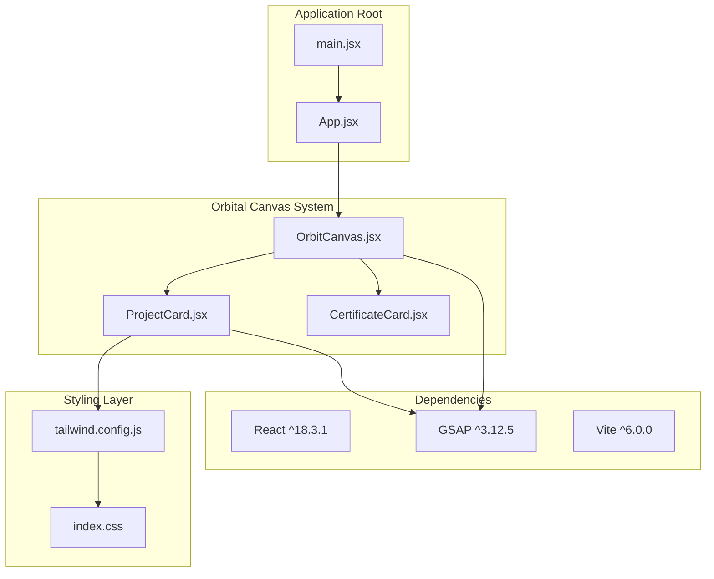
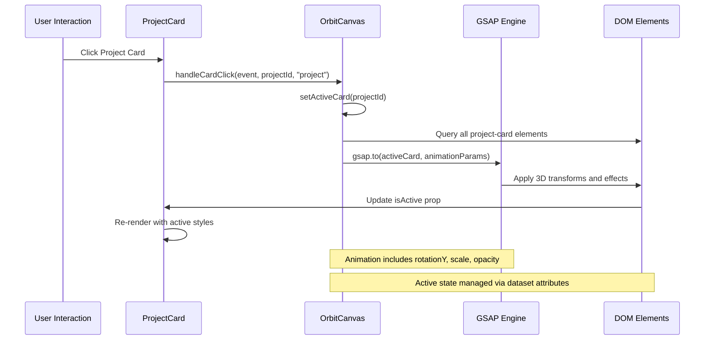
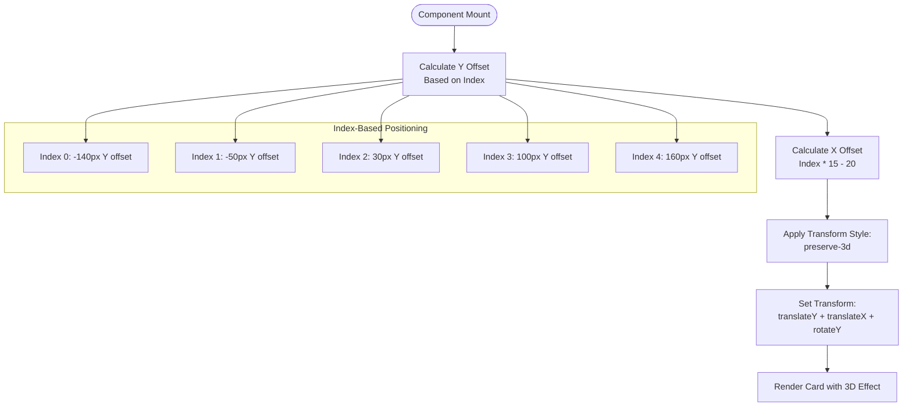
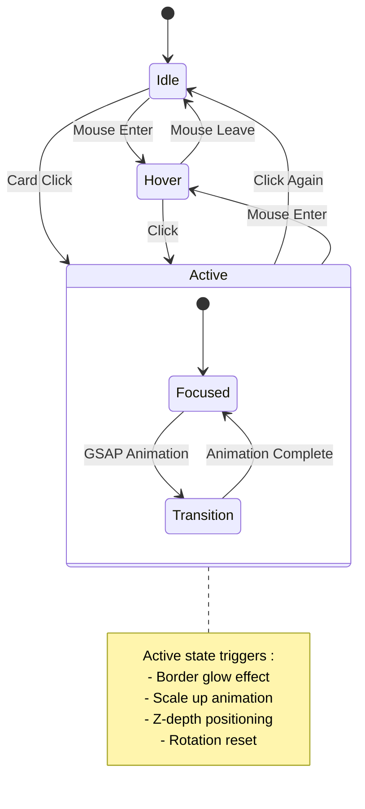
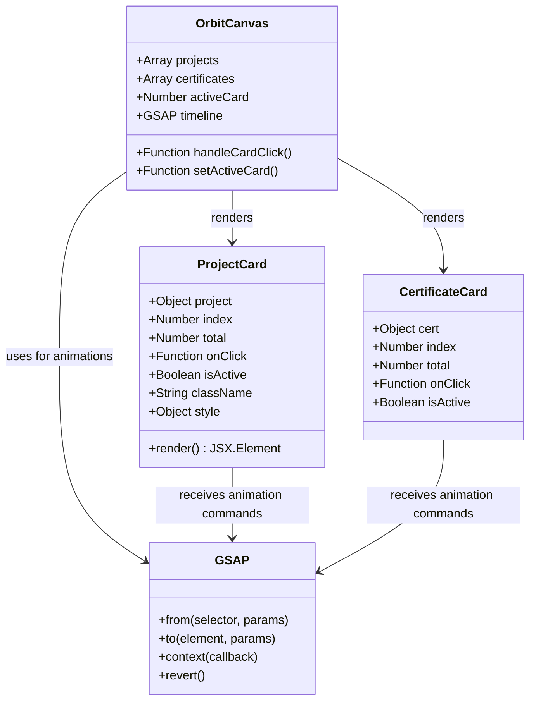
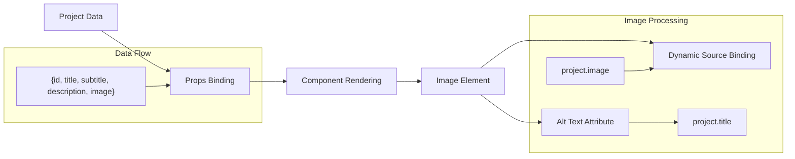
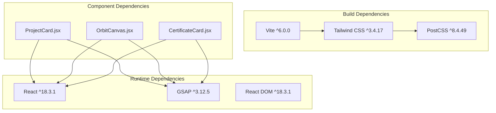

# ProjectCard Component

<cite>
**Referenced Files in This Document**
- [ProjectCard.jsx](file://src/components/ProjectCard.jsx)
- [OrbitCanvas.jsx](file://src/components/OrbitCanvas.jsx)
- [CertificateCard.jsx](file://src/components/CertificateCard.jsx)
- [App.jsx](file://src/App.jsx)
- [main.jsx](file://src/main.jsx)
- [index.css](file://src/index.css)
- [tailwind.config.js](file://src/tailwind.config.js)
- [package.json](file://package.json)
</cite>

## Table of Contents
1. [Introduction](#introduction)
2. [Project Structure](#project-structure)
3. [Core Components](#core-components)
4. [Architecture Overview](#architecture-overview)
5. [Detailed Component Analysis](#detailed-component-analysis)
6. [Dependency Analysis](#dependency-analysis)
7. [Performance Considerations](#performance-considerations)
8. [Troubleshooting Guide](#troubleshooting-guide)
9. [Conclusion](#conclusion)

## Introduction
The ProjectCard component is a key element in the orbital portfolio system, responsible for rendering individual project entries with 3D transformations and interactive behaviors. It serves as part of a larger immersive experience where projects orbit around a central profile photo, utilizing GSAP for smooth animations and transitions. The component demonstrates modern React patterns with Tailwind CSS styling and integrates seamlessly with the broader orbital canvas system.

## Project Structure
The ProjectCard component is organized within a cohesive ecosystem that emphasizes 3D visual effects and smooth animations:

**Diagram sources**
- [App.jsx:1-8](file://src/App.jsx#L1-L8)
- [main.jsx:1-11](file://src/main.jsx#L1-L11)
- [OrbitCanvas.jsx:1-383](file://src/components/OrbitCanvas.jsx#L1-L383)
- [ProjectCard.jsx:1-32](file://src/components/ProjectCard.jsx#L1-L32)
- [tailwind.config.js:1-16](file://src/tailwind.config.js#L1-L16)
- [package.json:1-24](file://package.json#L1-L24)

**Section sources**
- [App.jsx:1-8](file://src/App.jsx#L1-L8)
- [main.jsx:1-11](file://src/main.jsx#L1-L11)
- [package.json:11-14](file://package.json#L11-L14)

## Core Components
The ProjectCard component serves as a specialized card renderer within the orbital portfolio system, featuring:

### Props Interface
The component accepts a structured set of props that define its behavior and appearance:

| Prop | Type | Required | Description |
|------|------|----------|-------------|
| `project` | Object | Yes | Contains project metadata (id, title, subtitle, description, image) |
| `index` | Number | Yes | Position index determining vertical and horizontal positioning |
| `total` | Number | Yes | Total count of items in the collection |
| `onClick` | Function | Yes | Event handler for card click interactions |
| `isActive` | Boolean | Yes | Controls active state styling and focus effects |

### Data Structure
Each project object follows a consistent schema:
- `id`: Unique identifier for the project
- `title`: Primary project name displayed prominently
- `subtitle`: Secondary information (technologies, tools)
- `description`: Brief project overview (limited to two lines)
- `image`: URL or path to project showcase image

### Styling Architecture
The component employs a layered styling approach combining:
- **Base Styles**: Fixed dimensions and positioning (`w-[200px] md:w-[230px]`)
- **Background Effects**: Dark theme with backdrop blur (`bg-[#111827]/70 backdrop-blur-md`)
- **Border States**: Dynamic borders based on active state (`border-gray-700/50` vs `border-[#ff2d78]`)
- **Shadow Effects**: Glowing effects for active state (`shadow-[0_0_20px_rgba(255,45,120,0.4)]`)

**Section sources**
- [ProjectCard.jsx:1-32](file://src/components/ProjectCard.jsx#L1-L32)

## Architecture Overview
The ProjectCard component operates within a sophisticated orbital animation system that combines React state management with GSAP animations:

**Diagram sources**
- [OrbitCanvas.jsx:192-226](file://src/components/OrbitCanvas.jsx#L192-L226)
- [ProjectCard.jsx:1-32](file://src/components/ProjectCard.jsx#L1-L32)

The component participates in several key orbital mechanics:
- **Vertical Distribution**: Cards are positioned with calculated offsets based on index
- **Horizontal Spacing**: X-axis positioning creates orbital arrangement
- **3D Transformations**: Preserve 3D context for realistic depth perception
- **Interactive Focus**: Smooth transitions between idle and active states

**Section sources**
- [OrbitCanvas.jsx:316-328](file://src/components/OrbitCanvas.jsx#L316-L328)
- [ProjectCard.jsx:3-4](file://src/components/ProjectCard.jsx#L3-L4)

## Detailed Component Analysis

### 3D Transformation Implementation
The ProjectCard component implements sophisticated 3D transformations through CSS transforms:

**Diagram sources**
- [ProjectCard.jsx:3-4](file://src/components/ProjectCard.jsx#L3-L4)

The transformation pipeline includes:
- **Y-Axis Translation**: Creates vertical orbital distribution
- **X-Axis Translation**: Establishes horizontal positioning
- **Y-Axis Rotation**: Adds perspective depth (`rotateY(15deg)`)
- **Preserve-3D Context**: Ensures child elements maintain 3D positioning

### Interactive Behaviors
The component responds to user interactions through a comprehensive event handling system:

**Diagram sources**
- [OrbitCanvas.jsx:192-226](file://src/components/OrbitCanvas.jsx#L192-L226)
- [ProjectCard.jsx:10-11](file://src/components/ProjectCard.jsx#L10-L11)

Key interaction patterns:
- **Hover Effects**: Subtle border enhancement (`hover:border-[#66FCF1]/50`)
- **Active State**: Prominent focus with glowing border and increased scale
- **Click Handling**: Toggle between focused and idle states
- **Smooth Transitions**: 300ms duration for all state changes

### Styling Patterns and Responsive Design
The component implements a mobile-first responsive design strategy:

| Breakpoint | Width | Styling Pattern | Purpose |
|------------|-------|----------------|---------|
| Base | 200px | `w-[200px]` | Mobile optimization |
| Medium | 230px | `md:w-[230px]` | Tablet/desktop enhancement |
| Large | 260px | `lg:w-[260px]` | Extra-large displays |

Responsive typography scales appropriately:
- **Title**: `text-sm` → `font-bold`
- **Subtitle**: `text-[10px]` → `mt-0.5`
- **Description**: `text-[11px]` → `line-clamp-2`

**Section sources**
- [ProjectCard.jsx:8-12](file://src/components/ProjectCard.jsx#L8-L12)
- [ProjectCard.jsx:24-28](file://src/components/ProjectCard.jsx#L24-L28)

### Integration with GSAP Animation System
The ProjectCard component seamlessly integrates with GSAP for advanced animation capabilities:

**Diagram sources**
- [OrbitCanvas.jsx:96-383](file://src/components/OrbitCanvas.jsx#L96-L383)
- [ProjectCard.jsx:1-32](file://src/components/ProjectCard.jsx#L1-L32)
- [CertificateCard.jsx:1-31](file://src/components/CertificateCard.jsx#L1-L31)

Animation coordination includes:
- **Entrance Animations**: Staggered reveals with rotation and opacity
- **Focus Transitions**: Smooth scaling and positioning changes
- **Context Management**: GSAP context ensures proper cleanup
- **Cross-Component Synchronization**: Both project and certificate cards share animation logic

**Section sources**
- [OrbitCanvas.jsx:101-190](file://src/components/OrbitCanvas.jsx#L101-L190)
- [OrbitCanvas.jsx:192-226](file://src/components/OrbitCanvas.jsx#L192-L226)

### Data Binding and Image Handling
The component demonstrates robust data binding patterns:

**Diagram sources**
- [ProjectCard.jsx:19-23](file://src/components/ProjectCard.jsx#L19-L23)

Implementation patterns:
- **Dynamic Image Loading**: Images loaded from project.image property
- **Accessibility**: Proper alt text using project.title
- **Responsive Sizing**: Consistent height (130px) with flexible width
- **Object Cover**: Maintains aspect ratio while filling container

**Section sources**
- [ProjectCard.jsx:19-23](file://src/components/ProjectCard.jsx#L19-L23)

## Dependency Analysis
The ProjectCard component relies on several key dependencies that enable its functionality:

**Diagram sources**
- [package.json:11-22](file://package.json#L11-L22)
- [ProjectCard.jsx:1-32](file://src/components/ProjectCard.jsx#L1-L32)
- [OrbitCanvas.jsx:1-383](file://src/components/OrbitCanvas.jsx#L1-L383)
- [CertificateCard.jsx:1-31](file://src/components/CertificateCard.jsx#L1-L31)

Key dependency relationships:
- **React**: Core framework for component rendering and state management
- **GSAP**: Advanced animation library for smooth transitions and 3D effects
- **Tailwind CSS**: Utility-first styling framework enabling rapid UI development
- **Vite**: Modern build tool providing fast development experience

**Section sources**
- [package.json:11-22](file://package.json#L11-L22)

## Performance Considerations
The ProjectCard component implements several performance optimization strategies:

### Transform Performance
- **Hardware Acceleration**: Uses transform properties that leverage GPU acceleration
- **3D Context Preservation**: `transformStyle: "preserve-3d"` maintains depth perception efficiently
- **Minimal Reflows**: Static positioning reduces layout calculations during animations

### Memory Management
- **Event Handler Cleanup**: GSAP context automatically manages animation lifecycle
- **Conditional Rendering**: Only active cards receive intensive animations
- **Efficient State Updates**: Minimal re-renders through targeted prop updates

### Animation Optimization
- **Staggered Animations**: GSAP handles animation queuing efficiently
- **Transform Properties**: Prefer transform over position changes for smoother animations
- **Backface Visibility**: Prevents flickering during 3D rotations

## Troubleshooting Guide

### Common Issues and Solutions

**Issue**: Cards not appearing in orbital positions
- **Cause**: Incorrect index calculation or missing transform properties
- **Solution**: Verify index-based offset calculations and transform style settings

**Issue**: Animation conflicts with other elements
- **Cause**: GSAP context not properly scoped
- **Solution**: Ensure GSAP context is properly cleaned up and scoped to component

**Issue**: Hover effects not working
- **Cause**: Tailwind CSS utility classes not applying correctly
- **Solution**: Check for proper class concatenation and Tailwind configuration

**Issue**: Image loading failures
- **Cause**: Invalid image URLs or network issues
- **Solution**: Implement fallback images and proper error handling

**Section sources**
- [OrbitCanvas.jsx:189-190](file://src/components/OrbitCanvas.jsx#L189-L190)
- [ProjectCard.jsx:14-17](file://src/components/ProjectCard.jsx#L14-L17)

## Conclusion
The ProjectCard component exemplifies modern React development practices combined with advanced animation techniques. Its integration with the orbital canvas system demonstrates sophisticated 3D positioning, responsive design patterns, and seamless user interaction handling. The component's modular architecture allows for easy customization while maintaining performance and accessibility standards.

Through careful consideration of data binding, styling patterns, and animation coordination, the ProjectCard component contributes significantly to the overall portfolio presentation, providing users with an engaging and immersive experience that showcases projects effectively within the orbital design paradigm.