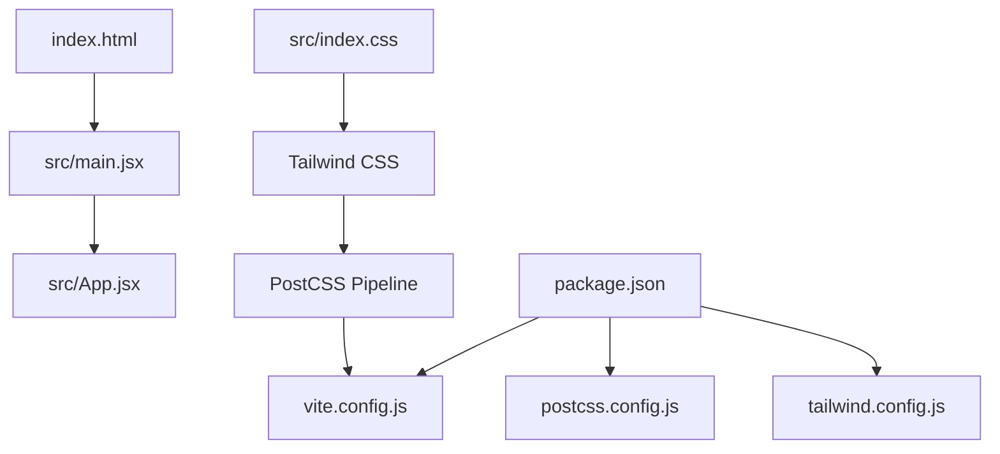
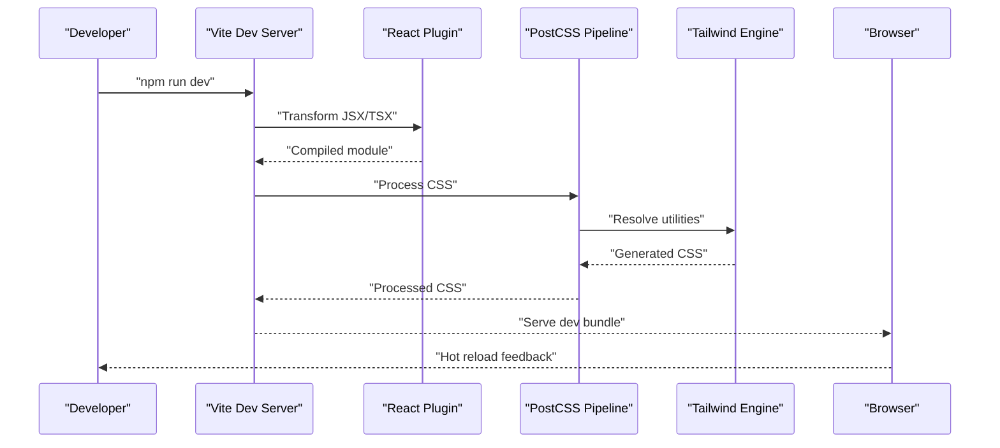
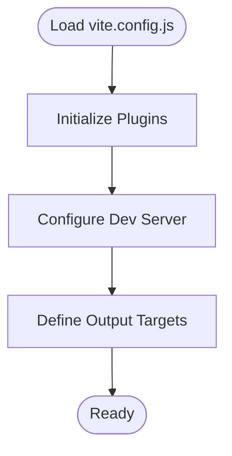
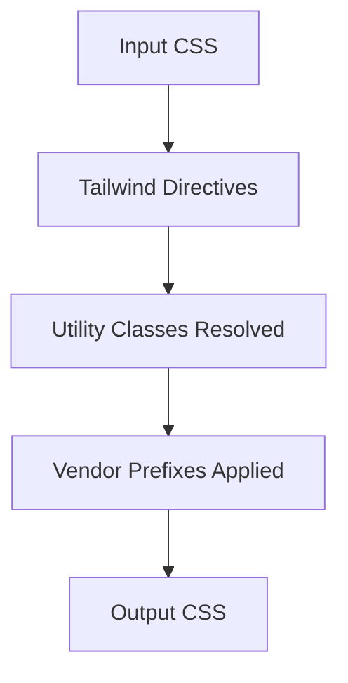
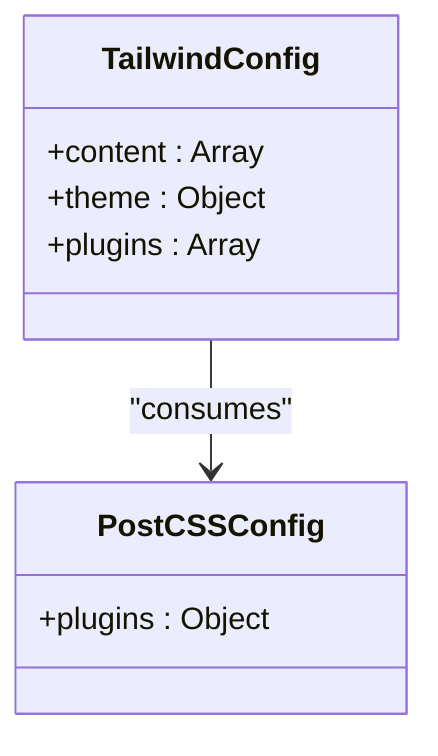
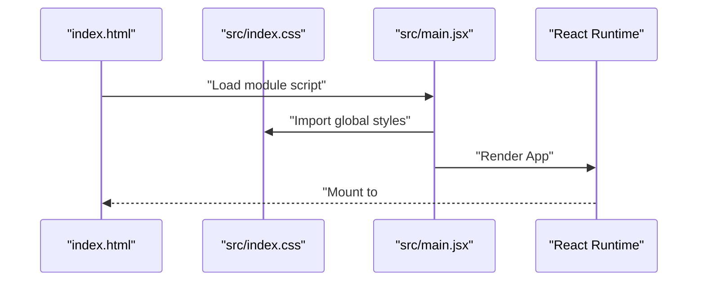
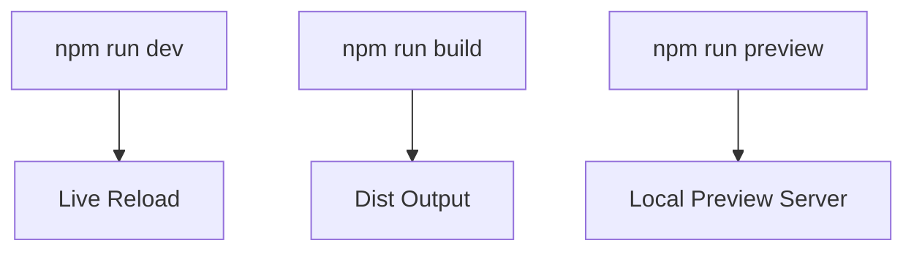
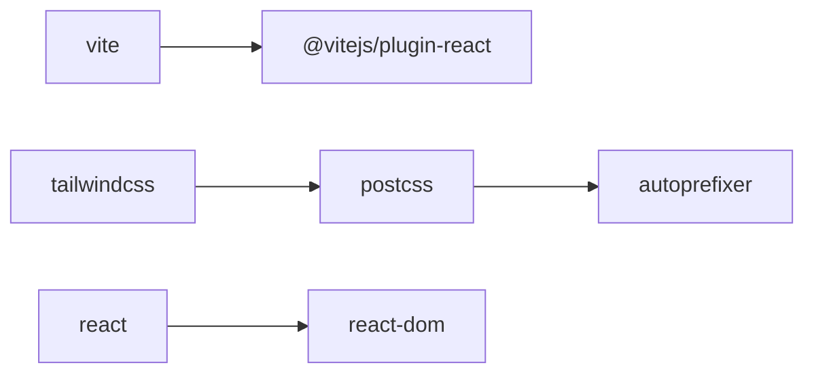

# Configuration and Build

<cite>
**Referenced Files in This Document**
- [vite.config.js](file://vite.config.js)
- [postcss.config.js](file://postcss.config.js)
- [tailwind.config.js](file://tailwind.config.js)
- [package.json](file://package.json)
- [src/main.jsx](file://src/main.jsx)
- [src/index.css](file://src/index.css)
- [index.html](file://index.html)
- [tempinit/vite.config.js](file://tempinit/vite.config.js)
- [tempinit/package.json](file://tempinit/package.json)
</cite>

## Table of Contents
1. [Introduction](#introduction)
2. [Project Structure](#project-structure)
3. [Core Components](#core-components)
4. [Architecture Overview](#architecture-overview)
5. [Detailed Component Analysis](#detailed-component-analysis)
6. [Dependency Analysis](#dependency-analysis)
7. [Performance Considerations](#performance-considerations)
8. [Troubleshooting Guide](#troubleshooting-guide)
9. [Conclusion](#conclusion)
10. [Appendices](#appendices)

## Introduction
This document explains the build configuration and development workflow for a modern React + Vite project integrated with Tailwind CSS and PostCSS. It covers the Vite setup, the PostCSS processing pipeline, environment scripts, asset handling, and how to prepare for production builds. It also outlines optimization strategies, customization options, and CI/CD integration patterns, along with common build issues and resolutions.

## Project Structure
The project follows a conventional Vite + React layout with Tailwind CSS configured via PostCSS. Key files:
- Vite configuration defines the React plugin and serves as the central build orchestrator.
- PostCSS configuration enables Tailwind and Autoprefixer.
- Tailwind configuration controls scanning, theme extensions, and plugins.
- Package scripts expose dev, build, and preview commands.
- Entry points connect HTML, CSS, and JS.

**Diagram sources**
- [index.html:1-14](file://index.html#L1-L14)
- [src/main.jsx:1-11](file://src/main.jsx#L1-L11)
- [src/index.css:1-28](file://src/index.css#L1-L28)
- [vite.config.js:1-7](file://vite.config.js#L1-L7)
- [postcss.config.js:1-7](file://postcss.config.js#L1-L7)
- [tailwind.config.js:1-16](file://tailwind.config.js#L1-L16)
- [package.json:1-24](file://package.json#L1-L24)

**Section sources**
- [index.html:1-14](file://index.html#L1-L14)
- [src/main.jsx:1-11](file://src/main.jsx#L1-L11)
- [src/index.css:1-28](file://src/index.css#L1-L28)
- [vite.config.js:1-7](file://vite.config.js#L1-L7)
- [postcss.config.js:1-7](file://postcss.config.js#L1-L7)
- [tailwind.config.js:1-16](file://tailwind.config.js#L1-L16)
- [package.json:1-24](file://package.json#L1-L24)

## Core Components
- Vite configuration
  - Enables the React plugin for JSX/TSX transforms and fast refresh.
  - Acts as the single source of truth for build-time behavior.
- PostCSS configuration
  - Applies Tailwind directives and Autoprefixer for vendor prefixes.
- Tailwind configuration
  - Scans HTML and components for utility classes.
  - Extends animations and adds custom theme values.
- Package scripts
  - Provides dev server, production build, and preview commands.

Key implementation references:
- Vite plugin setup: [vite.config.js:4-6](file://vite.config.js#L4-L6)
- PostCSS plugins: [postcss.config.js:1-7](file://postcss.config.js#L1-L7)
- Tailwind scanning and theme: [tailwind.config.js:3-14](file://tailwind.config.js#L3-L14)
- Scripts: [package.json:6-10](file://package.json#L6-L10)

**Section sources**
- [vite.config.js:1-7](file://vite.config.js#L1-L7)
- [postcss.config.js:1-7](file://postcss.config.js#L1-L7)
- [tailwind.config.js:1-16](file://tailwind.config.js#L1-L16)
- [package.json:1-24](file://package.json#L1-L24)

## Architecture Overview
The build pipeline integrates Vite’s dev server and bundler with Tailwind CSS and PostCSS. During development, Vite hot-reloads React components and applies PostCSS transformations. For production, Vite bundles assets, minifies code, and optimizes CSS.

**Diagram sources**
- [vite.config.js:4-6](file://vite.config.js#L4-L6)
- [postcss.config.js:1-7](file://postcss.config.js#L1-L7)
- [tailwind.config.js:3-14](file://tailwind.config.js#L3-L14)
- [package.json:6-10](file://package.json#L6-L10)

## Detailed Component Analysis

### Vite Configuration
- Purpose: Define plugins and build behavior.
- Current setup: React plugin enabled; minimal configuration suitable for small projects.
- Customization hooks:
  - Add build.rollupOptions for advanced bundling (external libraries, output targets).
  - Configure optimizeDeps for pre-bundling heavy dependencies.
  - Enable esbuild minification and sourcemaps for production.
  - Integrate environment variables via define or envPrefix.

Implementation references:
- Plugin declaration: [vite.config.js:4-6](file://vite.config.js#L4-L6)
- Scripts for dev/build/preview: [package.json:6-10](file://package.json#L6-L10)

**Diagram sources**
- [vite.config.js:4-6](file://vite.config.js#L4-L6)

**Section sources**
- [vite.config.js:1-7](file://vite.config.js#L1-L7)
- [package.json:6-10](file://package.json#L6-L10)

### PostCSS Processing Pipeline
- Purpose: Transform CSS with Tailwind and Autoprefixer.
- Current setup: Tailwind and Autoprefixer enabled; Tailwind scans HTML and components.
- Customization hooks:
  - Add additional PostCSS plugins (e.g., cssnano for production).
  - Configure Tailwind content globs for new directories or frameworks.
  - Adjust Autoprefixer browserslist for target environments.

Implementation references:
- Plugins: [postcss.config.js:1-7](file://postcss.config.js#L1-L7)
- Tailwind scanning: [tailwind.config.js:3-6](file://tailwind.config.js#L3-L6)

**Diagram sources**
- [postcss.config.js:1-7](file://postcss.config.js#L1-L7)
- [tailwind.config.js:3-14](file://tailwind.config.js#L3-L14)

**Section sources**
- [postcss.config.js:1-7](file://postcss.config.js#L1-L7)
- [tailwind.config.js:1-16](file://tailwind.config.js#L1-L16)

### Tailwind Configuration
- Purpose: Control scanning scope, theme, and plugins.
- Current setup: Scans index.html and src/**/*.{js,ts,jsx,tsx}; extends animation; no plugins.
- Customization hooks:
  - Expand content globs for monorepos or nested directories.
  - Add custom colors, spacing, or typography scales.
  - Introduce Tailwind plugins (e.g., forms, aspect-ratio).

Implementation references:
- Content scanning: [tailwind.config.js:3-6](file://tailwind.config.js#L3-L6)
- Theme extension: [tailwind.config.js:7-13](file://tailwind.config.js#L7-L13)

**Diagram sources**
- [tailwind.config.js:1-16](file://tailwind.config.js#L1-L16)
- [postcss.config.js:1-7](file://postcss.config.js#L1-L7)

**Section sources**
- [tailwind.config.js:1-16](file://tailwind.config.js#L1-L16)
- [postcss.config.js:1-7](file://postcss.config.js#L1-L7)

### Asset Handling and Entry Points
- HTML entry: Defines the root container and script module path.
- CSS entry: Imports Tailwind directives and global styles.
- JS entry: Initializes React and mounts the root component.

Implementation references:
- HTML root element: [index.html:9-11](file://index.html#L9-L11)
- CSS imports: [src/index.css:1-3](file://src/index.css#L1-L3)
- Root mount: [src/main.jsx:6-10](file://src/main.jsx#L6-L10)

**Diagram sources**
- [index.html:9-11](file://index.html#L9-L11)
- [src/index.css:1-3](file://src/index.css#L1-L3)
- [src/main.jsx:1-11](file://src/main.jsx#L1-L11)

**Section sources**
- [index.html:1-14](file://index.html#L1-L14)
- [src/index.css:1-28](file://src/index.css#L1-L28)
- [src/main.jsx:1-11](file://src/main.jsx#L1-L11)

### Development Workflow
- Start dev server: npm run dev
- Preview production build locally: npm run preview
- Build for production: npm run build

Implementation references:
- Scripts: [package.json:6-10](file://package.json#L6-L10)

**Diagram sources**
- [package.json:6-10](file://package.json#L6-L10)

**Section sources**
- [package.json:6-10](file://package.json#L6-L10)

### Production Build Preparation
- Bundle optimization: Vite’s default bundling minimizes and splits code.
- CSS optimization: Tailwind purges unused utilities; Autoprefixer ensures compatibility.
- Sourcemaps: Enable for debugging; disable for smaller bundles.
- Environment variables: Inject via define or envPrefix for runtime configuration.

Implementation references:
- Scripts: [package.json:6-10](file://package.json#L6-L10)
- Tailwind scanning: [tailwind.config.js:3-6](file://tailwind.config.js#L3-L6)
- PostCSS plugins: [postcss.config.js:1-7](file://postcss.config.js#L1-L7)

**Section sources**
- [package.json:6-10](file://package.json#L6-L10)
- [tailwind.config.js:3-14](file://tailwind.config.js#L3-L14)
- [postcss.config.js:1-7](file://postcss.config.js#L1-L7)

### CI/CD Integration Patterns
- Install dependencies and build:
  - npm ci
  - npm run build
- Static hosting deployment:
  - Publish dist folder to CDN or static host.
- Environment-specific builds:
  - Use environment variables injected via define or envPrefix.
- Caching:
  - Cache node_modules and Vite cache directories for faster builds.

Implementation references:
- Scripts: [package.json:6-10](file://package.json#L6-L10)

**Section sources**
- [package.json:6-10](file://package.json#L6-L10)

## Dependency Analysis
External dependencies and their roles:
- Vite: Build tool and dev server.
- @vitejs/plugin-react: JSX/TSX transform and fast refresh.
- Tailwind CSS: Utility-first CSS framework.
- PostCSS and Autoprefixer: CSS processing and vendor prefixing.
- React and React DOM: UI runtime.

Implementation references:
- Dependencies: [package.json:11-22](file://package.json#L11-L22)

**Diagram sources**
- [package.json:11-22](file://package.json#L11-L22)

**Section sources**
- [package.json:11-22](file://package.json#L11-L22)

## Performance Considerations
- Minification and tree-shaking: Rely on Vite defaults; enable esbuild minify for production.
- CSS optimization: Tailwind purges unused classes; consider adding cssnano in PostCSS for production.
- Dependency optimization: Use optimizeDeps for large libraries; externalize rarely changing dependencies.
- Asset optimization: Compress images and fonts; leverage browser caching via hashed filenames.
- Monitoring: Use Vite’s built-in metrics and external tools to track bundle sizes and load times.

[No sources needed since this section provides general guidance]

## Troubleshooting Guide
Common issues and resolutions:
- Tailwind utilities not applied
  - Ensure content globs include all relevant files: [tailwind.config.js:3-6](file://tailwind.config.js#L3-L6)
  - Verify CSS import order: [src/index.css:1-3](file://src/index.css#L1-L3)
- Hot reload not triggering
  - Confirm React plugin is active: [vite.config.js:4-6](file://vite.config.js#L4-L6)
  - Check dev server logs for errors.
- CSS not processed
  - Validate PostCSS plugins: [postcss.config.js:1-7](file://postcss.config.js#L1-L7)
  - Ensure Tailwind directives are present: [src/index.css:1-3](file://src/index.css#L1-L3)
- Build fails or missing assets
  - Review build scripts: [package.json:6-10](file://package.json#L6-L10)
  - Confirm entry points and HTML root: [index.html:9-11](file://index.html#L9-L11), [src/main.jsx:6-10](file://src/main.jsx#L6-L10)

**Section sources**
- [tailwind.config.js:3-6](file://tailwind.config.js#L3-L6)
- [src/index.css:1-3](file://src/index.css#L1-L3)
- [vite.config.js:4-6](file://vite.config.js#L4-L6)
- [postcss.config.js:1-7](file://postcss.config.js#L1-L7)
- [package.json:6-10](file://package.json#L6-L10)
- [index.html:9-11](file://index.html#L9-L11)
- [src/main.jsx:6-10](file://src/main.jsx#L6-L10)

## Conclusion
This project’s build system centers on Vite with React and Tailwind CSS via PostCSS. The configuration is intentionally minimal, enabling rapid iteration while remaining extensible. By leveraging the existing scripts, Tailwind scanning, and PostCSS plugins, teams can efficiently develop, preview, and ship optimized production builds. For larger projects, consider adding advanced Vite options, PostCSS plugins, and CI/CD caching strategies.

[No sources needed since this section summarizes without analyzing specific files]

## Appendices

### Appendix A: Historical Context (Comparison with tempinit)
- The tempinit structure shows a similar Vite + React setup with minor differences in versions and extra scripts.
- Differences observed:
  - Different React and Vite versions.
  - Additional lint script in tempinit.
  - Slightly different plugin versions.

Implementation references:
- Original Vite config: [tempinit/vite.config.js:1-8](file://tempinit/vite.config.js#L1-L8)
- Original package.json: [tempinit/package.json:1-24](file://tempinit/package.json#L1-L24)

**Section sources**
- [tempinit/vite.config.js:1-8](file://tempinit/vite.config.js#L1-L8)
- [tempinit/package.json:1-24](file://tempinit/package.json#L1-L24)