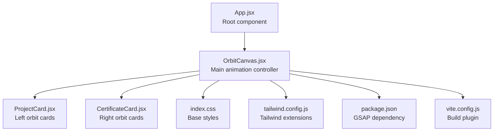
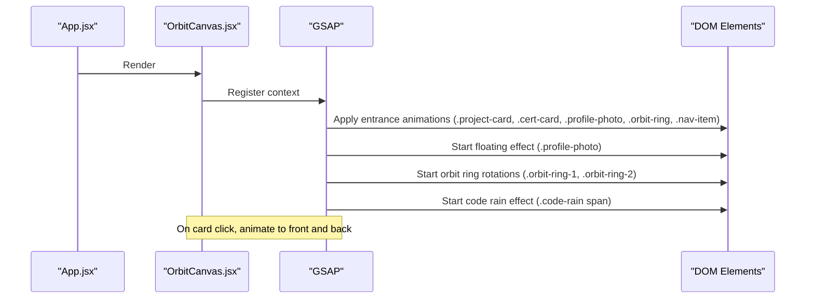
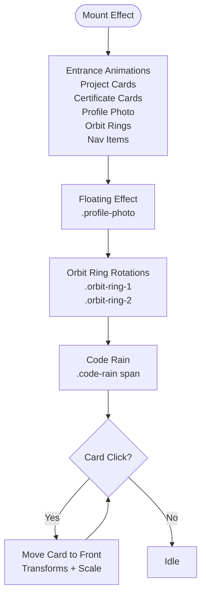
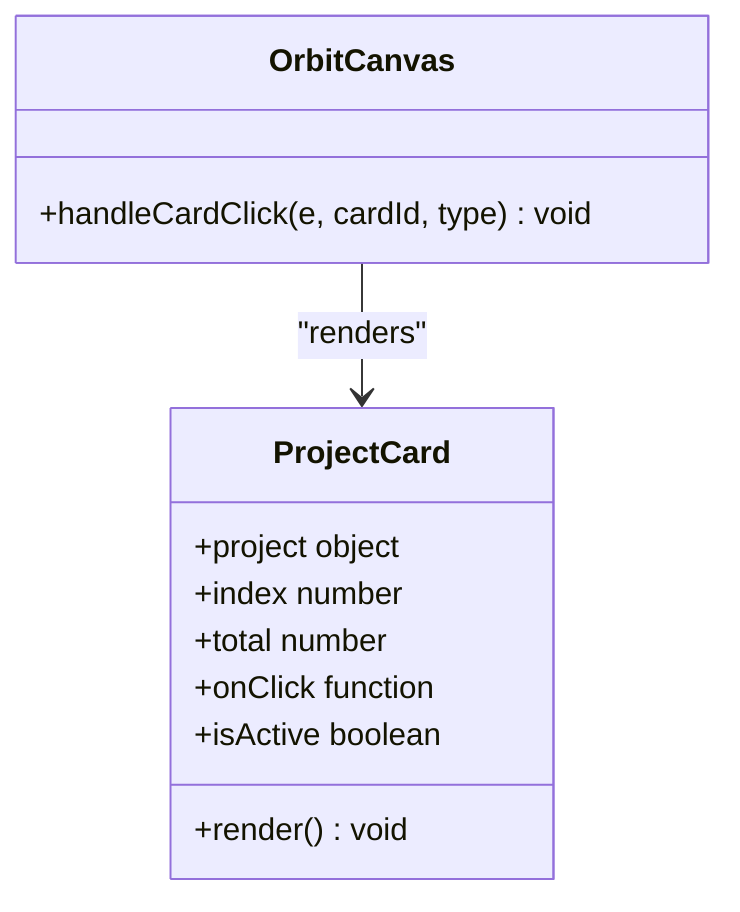
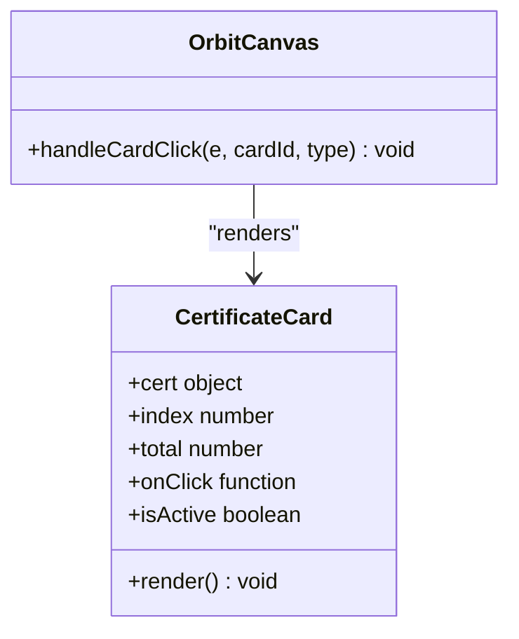
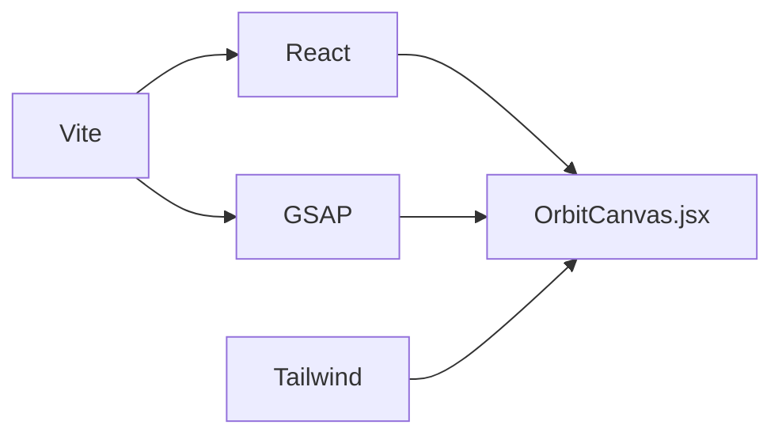

# Animation Customization

<cite>
**Referenced Files in This Document**
- [OrbitCanvas.jsx](file://src/components/OrbitCanvas.jsx)
- [ProjectCard.jsx](file://src/components/ProjectCard.jsx)
- [CertificateCard.jsx](file://src/components/CertificateCard.jsx)
- [App.jsx](file://src/App.jsx)
- [index.css](file://src/index.css)
- [tailwind.config.js](file://tailwind.config.js)
- [package.json](file://package.json)
- [vite.config.js](file://vite.config.js)
- [desain.md](file://desain.md)
</cite>

## Table of Contents
1. [Introduction](#introduction)
2. [Project Structure](#project-structure)
3. [Core Components](#core-components)
4. [Architecture Overview](#architecture-overview)
5. [Detailed Component Analysis](#detailed-component-analysis)
6. [Dependency Analysis](#dependency-analysis)
7. [Performance Considerations](#performance-considerations)
8. [Troubleshooting Guide](#troubleshooting-guide)
9. [Conclusion](#conclusion)
10. [Appendices](#appendices)

## Introduction
This document explains how to customize the orbital animation system built with React and GSAP. It focuses on:
- Adjusting animation timing parameters (duration, stagger, delay)
- Modifying easing functions
- Customizing rotation speeds for orbit rings
- Configuring entrance animations, floating effects, and interactive card animations
- Adapting animations for different screen sizes
- Optimizing performance across devices
- Creating custom animation sequences

The system centers around a central profile photo, two orbiting rings, and sets of project and certificate cards that enter with staggered animations and float gently. Clicking a card brings it forward with a smooth transition.

## Project Structure
The animation system is primarily implemented in a single component that orchestrates multiple GSAP timelines and effects. Supporting components render the cards and apply styles.

**Diagram sources**
- [App.jsx](file://src/App.jsx)
- [OrbitCanvas.jsx](file://src/components/OrbitCanvas.jsx)
- [ProjectCard.jsx](file://src/components/ProjectCard.jsx)
- [CertificateCard.jsx](file://src/components/CertificateCard.jsx)
- [index.css](file://src/index.css)
- [tailwind.config.js](file://tailwind.config.js)
- [package.json](file://package.json)
- [vite.config.js](file://vite.config.js)

**Section sources**
- [App.jsx](file://src/App.jsx)
- [OrbitCanvas.jsx](file://src/components/OrbitCanvas.jsx)
- [ProjectCard.jsx](file://src/components/ProjectCard.jsx)
- [CertificateCard.jsx](file://src/components/CertificateCard.jsx)
- [index.css](file://src/index.css)
- [tailwind.config.js](file://tailwind.config.js)
- [package.json](file://package.json)
- [vite.config.js](file://vite.config.js)

## Core Components
- OrbitCanvas: Orchestrates entrance animations, floating profile, orbit ring rotations, and interactive card transitions.
- ProjectCard: Renders left-side orbiting cards with 3D transforms and hover/active states.
- CertificateCard: Renders right-side orbiting cards mirrored to the opposite side.
- App: Mounts the orbital canvas.
- index.css: Base styles and global resets.
- tailwind.config.js: Tailwind extension for custom animation utilities.
- package.json: Declares GSAP as a runtime dependency.
- vite.config.js: Build-time plugin configuration.

Key animation areas in OrbitCanvas:
- Entrance animations for project cards, certificate cards, profile photo, orbit rings, and navigation items
- Floating effect for the profile photo
- Slow, continuous rotation for orbit rings
- Interactive card click transitions

**Section sources**
- [OrbitCanvas.jsx](file://src/components/OrbitCanvas.jsx)
- [ProjectCard.jsx](file://src/components/ProjectCard.jsx)
- [CertificateCard.jsx](file://src/components/CertificateCard.jsx)
- [App.jsx](file://src/App.jsx)
- [index.css](file://src/index.css)
- [tailwind.config.js](file://tailwind.config.js)
- [package.json](file://package.json)
- [vite.config.js](file://vite.config.js)

## Architecture Overview
The animation pipeline is a composition of multiple GSAP timelines triggered on mount. Each timeline targets specific DOM selectors and applies transforms, opacity, and rotations with configurable timing and easing.

**Diagram sources**
- [OrbitCanvas.jsx](file://src/components/OrbitCanvas.jsx)

## Detailed Component Analysis

### OrbitCanvas: Animation Orchestration
Responsibilities:
- Define entrance animations for cards, profile, rings, and nav items
- Configure floating and rotating effects
- Manage interactive transitions on card click
- Clean up animations on unmount

Timing parameters:
- duration: Total time for each tween
- stagger: Delay between tweens for grouped elements
- delay: Offset before starting a tween
- repeat/yoyo: Looping and reverse playback for continuous effects

Easing functions:
- power3.out, power2.out, back.out(1.7), sine.inOut, none

Rotation customization:
- Orbit rings rotate continuously with different durations to create a layered motion
- Rotation direction alternates between positive and negative for visual depth

Interactive transitions:
- On click, a card moves to the front with transforms and scale adjustments
- Active state toggles to revert when clicked again

**Diagram sources**
- [OrbitCanvas.jsx](file://src/components/OrbitCanvas.jsx)

**Section sources**
- [OrbitCanvas.jsx](file://src/components/OrbitCanvas.jsx)

### ProjectCard: Left Orbit Cards
Responsibilities:
- Render individual project cards with 3D transforms
- Apply active and hover states via Tailwind classes
- Contribute to the orbital layout with vertical offsets and horizontal shifts

Customization hooks:
- Vertical offset per index influences orbital height
- Horizontal offset per index positions cards along the orbit
- Transform-style preserve-3d ensures 3D rotations appear smooth

**Diagram sources**
- [ProjectCard.jsx](file://src/components/ProjectCard.jsx)
- [OrbitCanvas.jsx](file://src/components/OrbitCanvas.jsx)

**Section sources**
- [ProjectCard.jsx](file://src/components/ProjectCard.jsx)

### CertificateCard: Right Orbit Cards
Responsibilities:
- Mirror layout and transforms for right-side cards
- Maintain parity with ProjectCard for balanced orbital motion

Customization hooks:
- Mirrored horizontal offsets and rotation directions
- Consistent active/hover styling

**Diagram sources**
- [CertificateCard.jsx](file://src/components/CertificateCard.jsx)
- [OrbitCanvas.jsx](file://src/components/OrbitCanvas.jsx)

**Section sources**
- [CertificateCard.jsx](file://src/components/CertificateCard.jsx)

### App: Root Component
Responsibilities:
- Mount the orbital canvas as the primary UI surface

**Section sources**
- [App.jsx](file://src/App.jsx)

### Tailwind and Styles
- index.css: Global resets and base styles
- tailwind.config.js: Adds a custom pulse animation utility

These support the visual polish and ensure consistent spacing and typography across animations.

**Section sources**
- [index.css](file://src/index.css)
- [tailwind.config.js](file://tailwind.config.js)

## Dependency Analysis
External libraries and integrations:
- GSAP: Core animation engine for all tweens and timelines
- React: Component lifecycle and hooks for mounting/unmounting animations
- Tailwind: Utility classes for responsive sizing and states
- Vite: Build toolchain for development and production

**Diagram sources**
- [OrbitCanvas.jsx](file://src/components/OrbitCanvas.jsx)
- [package.json](file://package.json)
- [vite.config.js](file://vite.config.js)

**Section sources**
- [package.json](file://package.json)
- [vite.config.js](file://vite.config.js)

## Performance Considerations
- Prefer transform and opacity for GPU-accelerated animations
- Use stagger judiciously to avoid overwhelming the CPU/GPU
- Limit repeat counts for continuous loops; monitor device performance
- Keep easing functions lightweight (e.g., none for constant rotation)
- Use responsive breakpoints to reduce animation intensity on smaller screens
- Revert animations on unmount to prevent memory leaks

[No sources needed since this section provides general guidance]

## Troubleshooting Guide
Common issues and remedies:
- Animations not playing: Ensure the component mounts and the effect runs once
- Staggered elements not aligning: Verify selector specificity and order of appearance
- Rotation feels too fast/slow: Adjust duration values for orbit rings
- Click transitions feel abrupt: Tune duration and easing for interactive tweens
- Floating effect not smooth: Reduce amplitude or increase duration

**Section sources**
- [OrbitCanvas.jsx](file://src/components/OrbitCanvas.jsx)

## Conclusion
The orbital animation system combines entrance, floating, and interactive animations to create a dynamic, immersive experience. By adjusting timing parameters, easing functions, and rotation speeds, you can tailor the motion to different contexts and devices while maintaining performance and responsiveness.

[No sources needed since this section summarizes without analyzing specific files]

## Appendices

### A. Timing Parameters Reference
- duration: Controls the length of each tween
- stagger: Delays between successive tweens for grouped elements
- delay: Initial pause before a tween begins
- repeat/yoyo: Looping and reversing for continuous effects

Examples in code:
- Entrance tweens for cards, profile, rings, and nav items
- Floating tween for the profile photo
- Continuous rotation tweens for orbit rings
- Code rain tween with random stagger

**Section sources**
- [OrbitCanvas.jsx](file://src/components/OrbitCanvas.jsx)

### B. Easing Functions Reference
- power3.out, power2.out, back.out(1.7), sine.inOut, none
- Choose easing to match the desired feel: snappy, smooth, elastic, or steady

**Section sources**
- [OrbitCanvas.jsx](file://src/components/OrbitCanvas.jsx)

### C. Rotation Speeds for Orbit Rings
- orbit-ring-1: Positive rotation with a shorter duration for faster motion
- orbit-ring-2: Negative rotation with a longer duration for slower motion
- Adjust duration to balance perceived speed and visual harmony

**Section sources**
- [OrbitCanvas.jsx](file://src/components/OrbitCanvas.jsx)

### D. Interactive Card Animations
- On click, a card moves to the front with transforms and scale adjustments
- Active state toggles to revert when clicked again
- Use overwrite to prevent conflicts during rapid interactions

**Section sources**
- [OrbitCanvas.jsx](file://src/components/OrbitCanvas.jsx)

### E. Screen Size Adaptations
- Use Tailwind responsive variants (md:, lg:) to scale card sizes and ring dimensions
- Adjust durations and amplitudes for mobile devices
- Consider disabling or reducing floating and rotation on low-power devices

**Section sources**
- [OrbitCanvas.jsx](file://src/components/OrbitCanvas.jsx)
- [ProjectCard.jsx](file://src/components/ProjectCard.jsx)
- [CertificateCard.jsx](file://src/components/CertificateCard.jsx)
- [tailwind.config.js](file://tailwind.config.js)

### F. Creating Custom Animation Sequences
- Chain multiple tweens using delays
- Combine entrance and interactive animations
- Use callbacks or events to trigger follow-up actions

**Section sources**
- [OrbitCanvas.jsx](file://src/components/OrbitCanvas.jsx)

### G. Blueprint Animations (Reference)
Additional design notes and examples for perspective, rotation, z-index, and scale are documented separately.

**Section sources**
- [desain.md](file://desain.md)