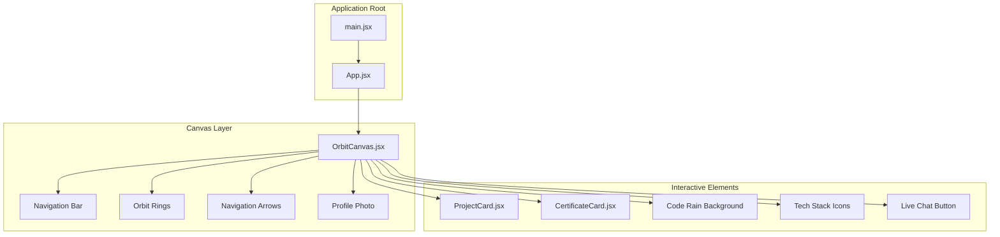
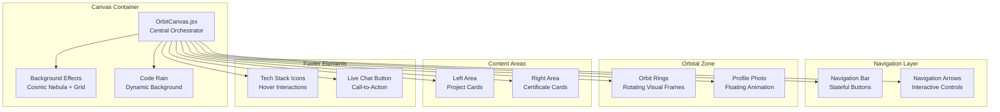
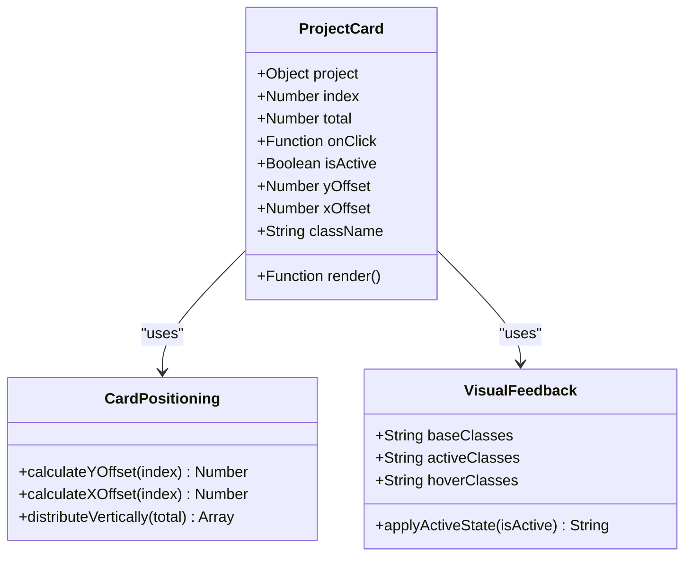
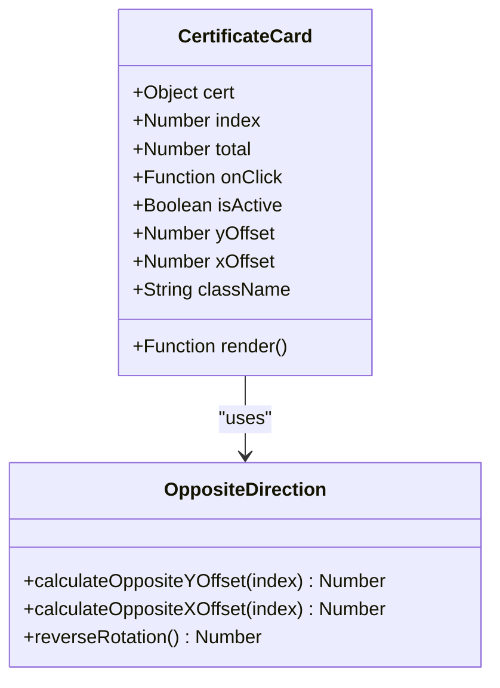
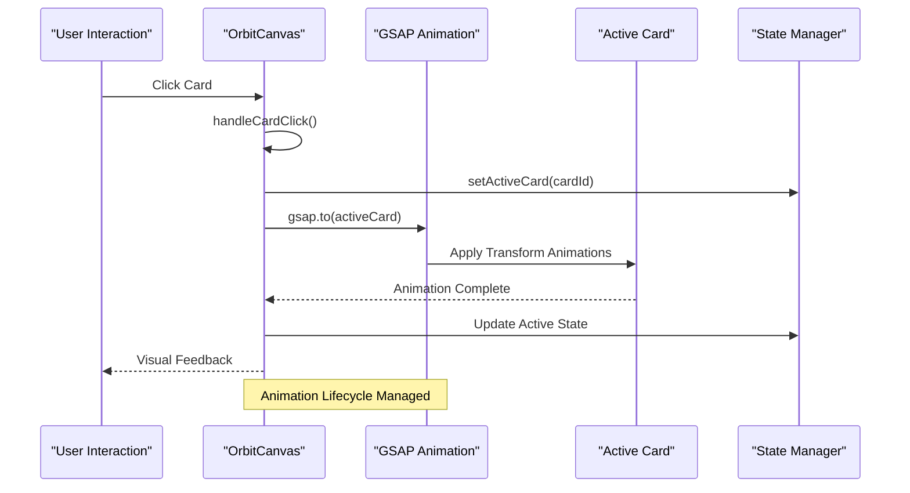
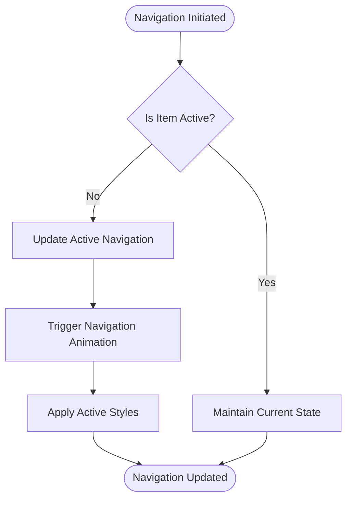
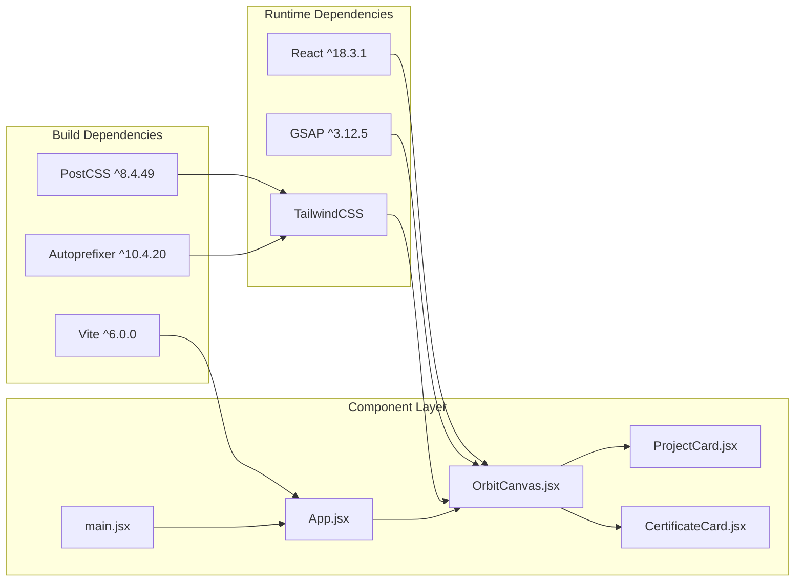

# Component Extension

<cite>
**Referenced Files in This Document**
- [OrbitCanvas.jsx](file://src/components/OrbitCanvas.jsx)
- [ProjectCard.jsx](file://src/components/ProjectCard.jsx)
- [CertificateCard.jsx](file://src/components/CertificateCard.jsx)
- [App.jsx](file://src/App.jsx)
- [main.jsx](file://src/main.jsx)
- [index.css](file://src/index.css)
- [package.json](file://package.json)
- [tailwind.config.js](file://tailwind.config.js)
</cite>

## Table of Contents
1. [Introduction](#introduction)
2. [Project Structure](#project-structure)
3. [Core Components](#core-components)
4. [Architecture Overview](#architecture-overview)
5. [Detailed Component Analysis](#detailed-component-analysis)
6. [Dependency Analysis](#dependency-analysis)
7. [Performance Considerations](#performance-considerations)
8. [Troubleshooting Guide](#troubleshooting-guide)
9. [Conclusion](#conclusion)
10. [Appendices](#appendices)

## Introduction
This document provides comprehensive guidance for extending the existing component architecture to add new interactive elements and functionality. It focuses on:
- Creating new card types that integrate seamlessly with the orbital animation system
- Adding additional navigation elements while maintaining responsive behavior
- Implementing new interactive features using the established prop system, state management patterns, and GSAP animation hooks
- Ensuring component reusability and adherence to existing code patterns
- Integrating new components with the GSAP animation system for smooth transitions and orbital effects

The goal is to enable developers to extend the portfolio orbit canvas with minimal disruption to the existing design and animation flow.

## Project Structure
The project follows a component-based architecture with a central canvas orchestrating multiple specialized components. The structure emphasizes separation of concerns and modularity.

**Diagram sources**
- [main.jsx:1-11](file://src/main.jsx#L1-L11)
- [App.jsx:1-8](file://src/App.jsx#L1-L8)
- [OrbitCanvas.jsx:96-383](file://src/components/OrbitCanvas.jsx#L96-L383)

**Section sources**
- [main.jsx:1-11](file://src/main.jsx#L1-L11)
- [App.jsx:1-8](file://src/App.jsx#L1-L8)
- [OrbitCanvas.jsx:96-383](file://src/components/OrbitCanvas.jsx#L96-L383)

## Core Components
The core components form the foundation of the interactive orbit canvas system. Each component serves a specific role in the overall composition while adhering to shared patterns for props, state, and interactivity.

### Component Prop System
All interactive components follow a consistent prop interface designed for the orbital animation system:
- `index`: Positional index determining vertical and horizontal placement
- `total`: Total count of sibling components for proportional distribution
- `onClick`: Event handler for click interactions
- `isActive`: Boolean flag indicating active state for visual emphasis

### State Management Patterns
The central canvas manages global state for:
- Active card selection (`activeCard`)
- Navigation state (`activeNav`)
- Animation lifecycle through GSAP context

### Event Handling Mechanisms
Components implement click handlers that trigger GSAP animations and update the active state, creating a cohesive interaction loop.

**Section sources**
- [ProjectCard.jsx:1-32](file://src/components/ProjectCard.jsx#L1-L32)
- [CertificateCard.jsx:1-31](file://src/components/CertificateCard.jsx#L1-L31)
- [OrbitCanvas.jsx:96-383](file://src/components/OrbitCanvas.jsx#L96-L383)

## Architecture Overview
The orbital canvas architecture creates a layered composition with distinct functional areas. The system balances visual appeal with interactive responsiveness through coordinated animations and state management.

**Diagram sources**
- [OrbitCanvas.jsx:230-383](file://src/components/OrbitCanvas.jsx#L230-L383)

## Detailed Component Analysis

### ProjectCard Component
The ProjectCard component demonstrates the foundational pattern for interactive cards in the orbital system. It implements precise positioning calculations and visual feedback for active states.

**Diagram sources**
- [ProjectCard.jsx:1-32](file://src/components/ProjectCard.jsx#L1-L32)

Key implementation patterns:
- Vertical distribution using conditional offset calculations
- Horizontal positioning with controlled spacing
- Transform-based 3D effects with preserve-3d
- Dynamic class application based on active state

**Section sources**
- [ProjectCard.jsx:1-32](file://src/components/ProjectCard.jsx#L1-L32)

### CertificateCard Component
The CertificateCard mirrors the ProjectCard pattern while adapting positioning for the opposite orbital direction, showcasing consistent design principles across different content types.

**Diagram sources**
- [CertificateCard.jsx:1-31](file://src/components/CertificateCard.jsx#L1-L31)

Notable differences from ProjectCard:
- Reverse horizontal offset calculation
- Opposite vertical positioning logic
- Consistent 3D transform orientation

**Section sources**
- [CertificateCard.jsx:1-31](file://src/components/CertificateCard.jsx#L1-L31)

### OrbitCanvas Central System
The OrbitCanvas component orchestrates the entire orbital animation system, managing state, coordinating animations, and serving as the integration hub for all interactive elements.

**Diagram sources**
- [OrbitCanvas.jsx:192-226](file://src/components/OrbitCanvas.jsx#L192-L226)

Core orchestration responsibilities:
- Global state management for active selections
- GSAP animation coordination across multiple elements
- Event delegation and propagation
- Responsive layout adaptation

**Section sources**
- [OrbitCanvas.jsx:96-383](file://src/components/OrbitCanvas.jsx#L96-L383)

### Navigation System Integration
The navigation system provides stateful controls that complement the orbital card interactions, offering complementary ways to explore content.

**Diagram sources**
- [OrbitCanvas.jsx:265-279](file://src/components/OrbitCanvas.jsx#L265-L279)

**Section sources**
- [OrbitCanvas.jsx:228-279](file://src/components/OrbitCanvas.jsx#L228-L279)

## Dependency Analysis
The component ecosystem relies on a carefully orchestrated set of dependencies that enable smooth animations and responsive interactions.

**Diagram sources**
- [package.json:11-22](file://package.json#L11-L22)
- [main.jsx:1-11](file://src/main.jsx#L1-L11)
- [App.jsx:1-8](file://src/App.jsx#L1-L8)

**Section sources**
- [package.json:11-22](file://package.json#L11-L22)
- [tailwind.config.js:1-16](file://tailwind.config.js#L1-L16)

## Performance Considerations
The orbital animation system employs several optimization strategies to maintain smooth performance across different devices and screen sizes.

### Animation Optimization Strategies
- GSAP context scoping prevents memory leaks and ensures proper cleanup
- Transform-based animations leverage GPU acceleration
- Staggered animations distribute computational load
- Conditional rendering reduces unnecessary DOM updates

### Responsive Design Patterns
- Flexible sizing with percentage-based layouts
- Adaptive spacing using viewport-relative units
- Mobile-first approach with progressive enhancement
- Hardware-accelerated transforms for smooth motion

### State Management Efficiency
- Minimal state updates through targeted setState calls
- Event delegation reduces listener overhead
- Dataset attributes provide efficient state communication
- Cleanup functions prevent memory accumulation

## Troubleshooting Guide

### Common Extension Issues and Solutions

#### Issue: New Card Type Not Animating
**Symptoms**: Newly created card component appears but doesn't respond to orbital animations
**Solution**: Ensure the component follows the established prop interface and includes the required CSS class names for GSAP targeting

#### Issue: Animation Conflicts with Existing Elements
**Symptoms**: New animations interfere with existing card animations
**Solution**: Use unique CSS class identifiers and ensure proper GSAP context scoping

#### Issue: State Synchronization Problems
**Symptoms**: Active state doesn't update correctly across components
**Solution**: Verify that the parent component properly manages and passes the active state down to child components

#### Issue: Performance Degradation with Multiple Animations
**Symptoms**: Animation performance becomes sluggish with many concurrent elements
**Solution**: Implement animation throttling and consider reducing the number of simultaneous animations

**Section sources**
- [OrbitCanvas.jsx:101-190](file://src/components/OrbitCanvas.jsx#L101-L190)
- [ProjectCard.jsx:1-32](file://src/components/ProjectCard.jsx#L1-32)
- [CertificateCard.jsx:1-31](file://src/components/CertificateCard.jsx#L1-31)

## Conclusion
The component extension framework provides a robust foundation for adding new interactive elements while maintaining visual consistency and performance standards. By following the established patterns for props, state management, and GSAP integration, developers can extend the orbital animation system with confidence.

The key success factors for extensions include:
- Adhering to the standardized prop interface
- Leveraging the centralized state management patterns
- Utilizing GSAP context for animation lifecycle management
- Maintaining responsive design principles
- Ensuring proper cleanup and memory management

## Appendices

### Extension Guidelines Checklist
- [ ] Implement required props: index, total, onClick, isActive
- [ ] Use consistent CSS class naming conventions
- [ ] Integrate with GSAP animation system
- [ ] Handle responsive design considerations
- [ ] Implement proper state management
- [ ] Ensure cleanup and memory management
- [ ] Test across different screen sizes
- [ ] Verify animation performance

### Component Creation Template
When creating new card types, follow this template structure:
1. Define component with standardized props
2. Implement positioning calculations
3. Add visual feedback for active states
4. Integrate with click handling system
5. Test animation coordination
6. Verify responsive behavior

### Animation Integration Best Practices
- Use GSAP context for automatic cleanup
- Leverage staggered animations for multiple elements
- Implement proper easing functions for natural motion
- Consider hardware acceleration for smooth performance
- Test animation performance across devices