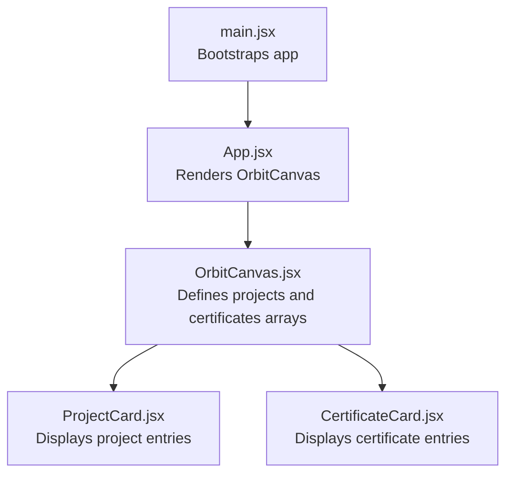
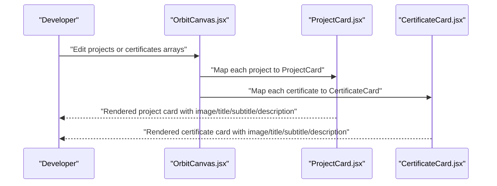
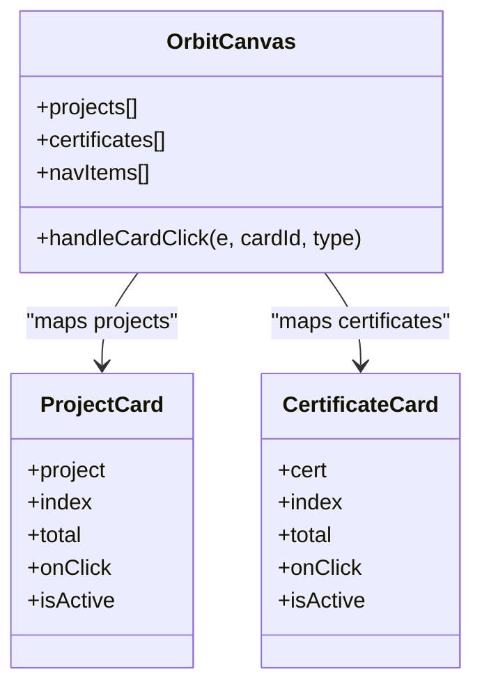
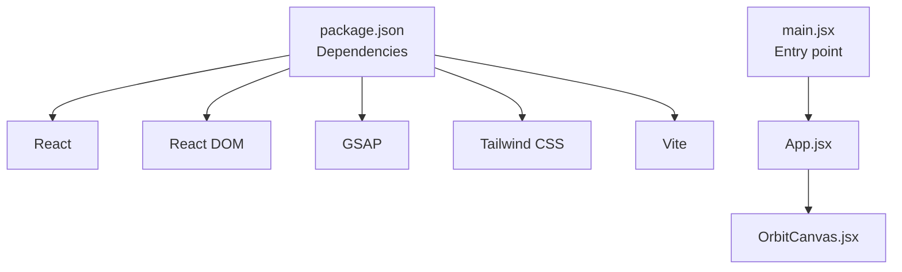

# Content Customization

<cite>
**Referenced Files in This Document**
- [OrbitCanvas.jsx](file://src/components/OrbitCanvas.jsx)
- [ProjectCard.jsx](file://src/components/ProjectCard.jsx)
- [CertificateCard.jsx](file://src/components/CertificateCard.jsx)
- [App.jsx](file://src/App.jsx)
- [main.jsx](file://src/main.jsx)
- [index.css](file://src/index.css)
- [tailwind.config.js](file://tailwind.config.js)
- [package.json](file://package.json)
- [index.html](file://index.html)
</cite>

## Table of Contents
1. [Introduction](#introduction)
2. [Project Structure](#project-structure)
3. [Core Components](#core-components)
4. [Architecture Overview](#architecture-overview)
5. [Detailed Component Analysis](#detailed-component-analysis)
6. [Dependency Analysis](#dependency-analysis)
7. [Performance Considerations](#performance-considerations)
8. [Troubleshooting Guide](#troubleshooting-guide)
9. [Conclusion](#conclusion)
10. [Appendices](#appendices)

## Introduction
This document explains how to customize content for projects and certifications in the portfolio. It focuses on the data structures required for project and certificate objects, how to add or replace content, and how to optimize visuals for consistent presentation across devices. The primary customization target is the OrbitCanvas component, which hosts two arrays: projects and certificates. These arrays feed ProjectCard and CertificateCard components respectively.

## Project Structure
The portfolio is a React application built with Vite and styled with Tailwind CSS. The main rendering entry point is App.jsx, which renders OrbitCanvas. OrbitCanvas defines the content arrays and renders cards for projects and certificates.

**Diagram sources**
- [main.jsx:1-11](file://src/main.jsx#L1-L11)
- [App.jsx:1-8](file://src/App.jsx#L1-L8)
- [OrbitCanvas.jsx:1-382](file://src/components/OrbitCanvas.jsx#L1-L382)
- [ProjectCard.jsx:1-32](file://src/components/ProjectCard.jsx#L1-L32)
- [CertificateCard.jsx:1-31](file://src/components/CertificateCard.jsx#L1-L31)

**Section sources**
- [main.jsx:1-11](file://src/main.jsx#L1-L11)
- [App.jsx:1-8](file://src/App.jsx#L1-L8)
- [index.html:1-14](file://index.html#L1-L14)

## Core Components
- OrbitCanvas: Holds the projects and certificates arrays and passes each item to ProjectCard or CertificateCard. It also manages navigation and animations.
- ProjectCard: Renders a single project entry with image, title, subtitle, and description.
- CertificateCard: Renders a single certificate entry with image, title, subtitle, and description.

Key customization points:
- Add or modify entries in the projects array inside OrbitCanvas.
- Add or modify entries in the certificates array inside OrbitCanvas.
- Replace placeholder images with your own images.
- Adjust descriptions and metadata to reflect your content.

**Section sources**
- [OrbitCanvas.jsx:6-73](file://src/components/OrbitCanvas.jsx#L6-L73)
- [ProjectCard.jsx:1-32](file://src/components/ProjectCard.jsx#L1-L32)
- [CertificateCard.jsx:1-31](file://src/components/CertificateCard.jsx#L1-L31)

## Architecture Overview
The content customization pipeline flows from the data arrays to the card components and then to the rendered UI.

**Diagram sources**
- [OrbitCanvas.jsx:317-341](file://src/components/OrbitCanvas.jsx#L317-L341)
- [ProjectCard.jsx:1-32](file://src/components/ProjectCard.jsx#L1-L32)
- [CertificateCard.jsx:1-31](file://src/components/CertificateCard.jsx#L1-L31)

## Detailed Component Analysis

### Data Model: Project and Certificate Objects
Both project and certificate objects share a common shape used by their respective card components. The required fields are:
- id: Unique identifier for the item.
- title: Primary headline text.
- subtitle: Secondary label or tagline.
- description: Short summary text.
- image: Image URL or local asset path.

Notes:
- The card components rely on these fields to render the UI.
- The OrbitCanvas component iterates over arrays of these objects to render cards.

**Section sources**
- [OrbitCanvas.jsx:6-42](file://src/components/OrbitCanvas.jsx#L6-L42)
- [OrbitCanvas.jsx:44-73](file://src/components/OrbitCanvas.jsx#L44-L73)
- [ProjectCard.jsx:18-27](file://src/components/ProjectCard.jsx#L18-L27)
- [CertificateCard.jsx:18-26](file://src/components/CertificateCard.jsx#L18-L26)

### Adding New Content
Steps to add a new project or certificate:
1. Open OrbitCanvas.jsx.
2. Locate the projects array (lines 6–42) or certificates array (lines 44–73).
3. Append a new object with the required fields: id, title, subtitle, description, image.
4. Save the file and refresh the browser to see the new card appear.

Guidelines:
- Assign a unique id.
- Keep descriptions concise; the cards use a clamp to limit visible lines.
- Ensure image URLs are accessible or place local assets under the public directory.

**Section sources**
- [OrbitCanvas.jsx:6-73](file://src/components/OrbitCanvas.jsx#L6-L73)

### Replacing Placeholder Images
Current placeholders are external URLs. To replace them:
- Option A: Use your own hosted image URL.
- Option B: Place a local image under the public directory and reference it from the image field.

Example steps:
1. Put your image in the public directory (for example, public/images/my-project.png).
2. Update the image field in the project or certificate object to the new path (for example, "/images/my-project.png").
3. Confirm the image loads in the browser.

Notes:
- The profile photo is loaded from a fixed path in OrbitCanvas; update that separately if needed.
- The card components use object-cover scaling; ensure images are appropriately sized for the card height.

**Section sources**
- [OrbitCanvas.jsx:12,50,64](file://src/components/OrbitCanvas.jsx#L12)
- [OrbitCanvas.jsx:306-313](file://src/components/OrbitCanvas.jsx#L306-L313)
- [ProjectCard.jsx:18-22](file://src/components/ProjectCard.jsx#L18-L22)
- [CertificateCard.jsx:18-22](file://src/components/CertificateCard.jsx#L18-L22)

### Modifying Descriptions and Metadata
- Edit the description and subtitle fields in the project or certificate objects.
- Titles are used as alt text for images; keep them descriptive and SEO-friendly.
- Keep metadata short; the cards truncate long text to fit the layout.

**Section sources**
- [OrbitCanvas.jsx:6-42](file://src/components/OrbitCanvas.jsx#L6-L42)
- [OrbitCanvas.jsx:44-73](file://src/components/OrbitCanvas.jsx#L44-L73)
- [ProjectCard.jsx:24-27](file://src/components/ProjectCard.jsx#L24-L27)
- [CertificateCard.jsx:24-26](file://src/components/CertificateCard.jsx#L24-L26)

### Visual Organization and Presentation
- Cards are positioned using transforms and offsets controlled by index. Vertical and horizontal offsets vary per index to create a layered effect.
- Active cards receive special styling and elevation for focus.
- Animations (entrance, floating, rotation) are handled by GSAP in OrbitCanvas.

Best practices:
- Maintain consistent aspect ratios for images to preserve layout integrity.
- Limit description length to prevent truncation artifacts.
- Use meaningful ids to ensure stable rendering and interactions.

**Section sources**
- [ProjectCard.jsx:2-4](file://src/components/ProjectCard.jsx#L2-L4)
- [CertificateCard.jsx:2-3](file://src/components/CertificateCard.jsx#L2-L3)
- [OrbitCanvas.jsx:192-226](file://src/components/OrbitCanvas.jsx#L192-L226)
- [OrbitCanvas.jsx:101-187](file://src/components/OrbitCanvas.jsx#L101-L187)

### Class and Component Relationships

**Diagram sources**
- [OrbitCanvas.jsx:96-382](file://src/components/OrbitCanvas.jsx#L96-L382)
- [ProjectCard.jsx:1-32](file://src/components/ProjectCard.jsx#L1-L32)
- [CertificateCard.jsx:1-31](file://src/components/CertificateCard.jsx#L1-L31)

## Dependency Analysis
External libraries and frameworks:
- React and React DOM: Application runtime.
- GSAP: Animation engine for entrance, floating, and orbital effects.
- Tailwind CSS: Utility-first styling framework.

Build and tooling:
- Vite: Development server and bundler.
- Tailwind CLI: CSS generation and purging.

**Diagram sources**
- [package.json:11-22](file://package.json#L11-L22)
- [main.jsx:1-11](file://src/main.jsx#L1-L11)
- [App.jsx:1-8](file://src/App.jsx#L1-L8)
- [OrbitCanvas.jsx:1-5](file://src/components/OrbitCanvas.jsx#L1-L5)

**Section sources**
- [package.json:11-22](file://package.json#L11-L22)
- [tailwind.config.js:1-16](file://tailwind.config.js#L1-L16)

## Performance Considerations
- Image optimization: Prefer compressed, appropriately sized images to reduce load times. Use modern formats (WebP) when possible.
- Lazy loading: Consider lazy-loading images if the number of cards grows significantly.
- Minimize re-renders: Keep arrays stable and avoid unnecessary updates to the data structures.
- Animations: GSAP animations are efficient, but avoid excessive concurrent animations on low-power devices.

[No sources needed since this section provides general guidance]

## Troubleshooting Guide
Common issues and resolutions:
- Images not loading:
  - Verify the image URL or local path is correct.
  - Ensure the image is placed under the public directory and referenced with a leading slash.
- Cards not appearing:
  - Confirm the new object includes all required fields (id, title, subtitle, description, image).
  - Ensure the id is unique within the array.
- Styling inconsistencies:
  - Check Tailwind utilities and ensure the build process runs without errors.
  - Verify viewport meta tag is present in the HTML head.
- Animations not playing:
  - Ensure GSAP is installed and imported correctly.
  - Confirm OrbitCanvas is mounted and the component lifecycle executes.

**Section sources**
- [OrbitCanvas.jsx:306-313](file://src/components/OrbitCanvas.jsx#L306-L313)
- [ProjectCard.jsx:18-22](file://src/components/ProjectCard.jsx#L18-L22)
- [CertificateCard.jsx:18-22](file://src/components/CertificateCard.jsx#L18-L22)
- [index.html:3-7](file://index.html#L3-L7)
- [package.json:11-14](file://package.json#L11-L14)

## Conclusion
Customizing projects and certificates in the portfolio involves editing the arrays in OrbitCanvas and ensuring each object includes the required fields. By following the steps outlined here—adding entries, replacing images, and optimizing content—you can maintain a visually consistent and performant presentation across devices.

[No sources needed since this section summarizes without analyzing specific files]

## Appendices

### Step-by-Step: Adding a New Project
1. Open OrbitCanvas.jsx.
2. Navigate to the projects array.
3. Add a new object with fields: id, title, subtitle, description, image.
4. Save and reload the page to confirm.

**Section sources**
- [OrbitCanvas.jsx:6-42](file://src/components/OrbitCanvas.jsx#L6-L42)

### Step-by-Step: Adding a New Certificate
1. Open OrbitCanvas.jsx.
2. Navigate to the certificates array.
3. Add a new object with fields: id, title, subtitle, description, image.
4. Save and reload the page to confirm.

**Section sources**
- [OrbitCanvas.jsx:44-73](file://src/components/OrbitCanvas.jsx#L44-L73)

### Best Practices Checklist
- Use unique ids for each entry.
- Keep descriptions concise and scannable.
- Optimize images for fast loading.
- Test across device sizes to ensure readability.
- Keep metadata consistent (titles, subtitles) for brand coherence.

[No sources needed since this section provides general guidance]