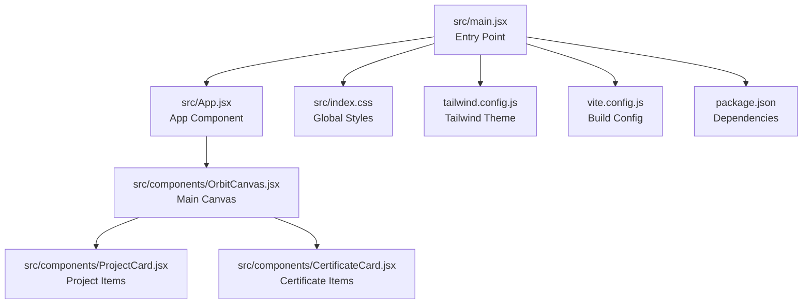
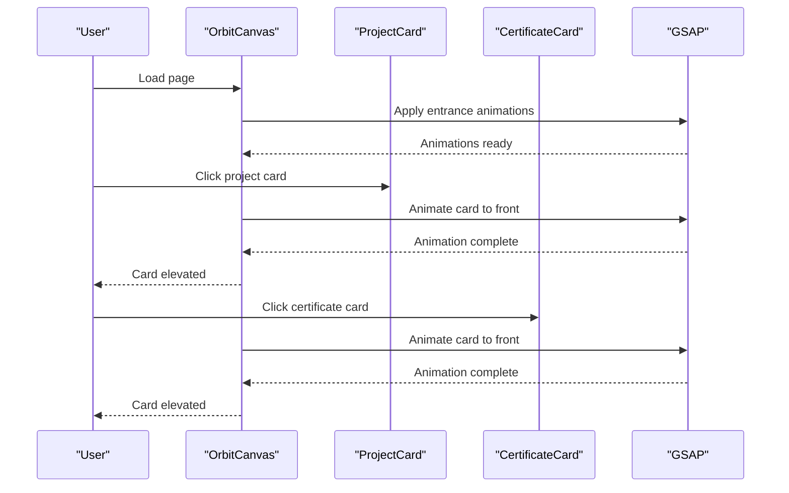
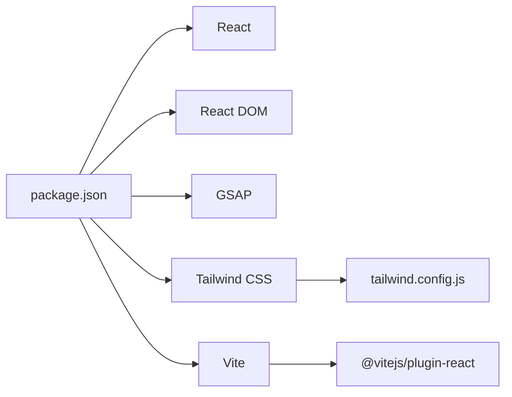

# Customization and Extension Guide

<cite>
**Referenced Files in This Document**
- [src/App.jsx](file://src/App.jsx)
- [src/components/OrbitCanvas.jsx](file://src/components/OrbitCanvas.jsx)
- [src/components/ProjectCard.jsx](file://src/components/ProjectCard.jsx)
- [src/components/CertificateCard.jsx](file://src/components/CertificateCard.jsx)
- [src/index.css](file://src/index.css)
- [tailwind.config.js](file://tailwind.config.js)
- [vite.config.js](file://vite.config.js)
- [package.json](file://package.json)
- [desain.md](file://desain.md)
</cite>

## Table of Contents
1. [Introduction](#introduction)
2. [Project Structure](#project-structure)
3. [Core Components](#core-components)
4. [Architecture Overview](#architecture-overview)
5. [Detailed Component Analysis](#detailed-component-analysis)
6. [Dependency Analysis](#dependency-analysis)
7. [Performance Considerations](#performance-considerations)
8. [Troubleshooting Guide](#troubleshooting-guide)
9. [Conclusion](#conclusion)
10. [Appendices](#appendices)

## Introduction
This guide explains how to customize and extend the portfolio website built with React, Tailwind CSS, and GSAP. It focuses on:
- Adding new projects and certificates
- Customizing animation parameters
- Modifying visual themes
- Extending functionality
- Maintaining performance while scaling content

The system centers around a single-page orbit canvas that displays projects and certificates in animated orbits around a central profile photo, with interactive selection and hover effects.

## Project Structure
The project follows a component-driven architecture with minimal configuration:
- Application entry renders a single OrbitCanvas component
- OrbitCanvas orchestrates animations, layout, and content
- ProjectCard and CertificateCard render individual items
- Styling is handled via Tailwind CSS with global styles and theme extensions
- Build tooling uses Vite with React plugin

**Diagram sources**
- [src/main.jsx:1-11](file://src/main.jsx#L1-L11)
- [src/App.jsx:1-8](file://src/App.jsx#L1-L8)
- [src/components/OrbitCanvas.jsx:1-382](file://src/components/OrbitCanvas.jsx#L1-L382)
- [src/components/ProjectCard.jsx:1-32](file://src/components/ProjectCard.jsx#L1-L32)
- [src/components/CertificateCard.jsx:1-31](file://src/components/CertificateCard.jsx#L1-L31)
- [src/index.css:1-28](file://src/index.css#L1-L28)
- [tailwind.config.js:1-16](file://tailwind.config.js#L1-L16)
- [vite.config.js:1-7](file://vite.config.js#L1-L7)
- [package.json:1-24](file://package.json#L1-L24)

**Section sources**
- [src/main.jsx:1-11](file://src/main.jsx#L1-L11)
- [src/App.jsx:1-8](file://src/App.jsx#L1-L8)
- [src/components/OrbitCanvas.jsx:1-382](file://src/components/OrbitCanvas.jsx#L1-L382)
- [src/components/ProjectCard.jsx:1-32](file://src/components/ProjectCard.jsx#L1-L32)
- [src/components/CertificateCard.jsx:1-31](file://src/components/CertificateCard.jsx#L1-L31)
- [src/index.css:1-28](file://src/index.css#L1-L28)
- [tailwind.config.js:1-16](file://tailwind.config.js#L1-L16)
- [vite.config.js:1-7](file://vite.config.js#L1-L7)
- [package.json:1-24](file://package.json#L1-L24)

## Core Components
- OrbitCanvas: Central component managing data arrays, animations, layout, and interactions
- ProjectCard: Renders project entries with 3D transforms and hover/active states
- CertificateCard: Renders certificate entries with mirrored 3D transforms and states
- App: Minimal wrapper rendering the OrbitCanvas
- Global styles and Tailwind theme: Define base styles, colors, and animations

Key customization touchpoints:
- Data arrays for projects and certificates
- Animation parameters in OrbitCanvas
- Tailwind classes and theme extensions
- Component props for cards

**Section sources**
- [src/components/OrbitCanvas.jsx:6-73](file://src/components/OrbitCanvas.jsx#L6-L73)
- [src/components/ProjectCard.jsx:1-32](file://src/components/ProjectCard.jsx#L1-L32)
- [src/components/CertificateCard.jsx:1-31](file://src/components/CertificateCard.jsx#L1-L31)
- [src/App.jsx:1-8](file://src/App.jsx#L1-L8)
- [src/index.css:1-28](file://src/index.css#L1-L28)
- [tailwind.config.js:1-16](file://tailwind.config.js#L1-L16)

## Architecture Overview
The system uses React for UI composition, GSAP for animations, and Tailwind for styling. The OrbitCanvas component:
- Declares static data arrays for projects and certificates
- Applies entrance and floating animations on mount
- Manages click interactions to elevate selected cards
- Renders cards with 3D transforms and hover effects
- Provides navigation and tech stack visuals

**Diagram sources**
- [src/components/OrbitCanvas.jsx:101-226](file://src/components/OrbitCanvas.jsx#L101-L226)
- [src/components/ProjectCard.jsx:1-32](file://src/components/ProjectCard.jsx#L1-L32)
- [src/components/CertificateCard.jsx:1-31](file://src/components/CertificateCard.jsx#L1-L31)

## Detailed Component Analysis

### OrbitCanvas: Data, Animations, and Layout
- Data arrays:
  - projects: Array of project objects with id, title, subtitle, description, image
  - certificates: Array of certificate objects with id, title, subtitle, description, image
  - codeSnippets: Static array for background code rain effect
- Animations:
  - Entrance: staggered from left/right with rotation and opacity
  - Profile: floating up/down
  - Orbit rings: slow continuous rotation in opposite directions
  - Code rain: vertical movement with random staggering
- Interactions:
  - handleCardClick toggles elevation and z-index for selected card
  - Uses dataset attributes to track active state
- Layout:
  - Grid overlay, radial gradients, and code rain background
  - Navigation bar, title, orbit rings, profile photo, and tech stack footer

Best practices:
- Keep data arrays flat and consistent
- Use dataset attributes for state to avoid heavy React state updates
- Tune animation durations and easing for smoothness vs. performance

**Section sources**
- [src/components/OrbitCanvas.jsx:6-94](file://src/components/OrbitCanvas.jsx#L6-L94)
- [src/components/OrbitCanvas.jsx:101-190](file://src/components/OrbitCanvas.jsx#L101-L190)
- [src/components/OrbitCanvas.jsx:192-226](file://src/components/OrbitCanvas.jsx#L192-L226)
- [src/components/OrbitCanvas.jsx:230-381](file://src/components/OrbitCanvas.jsx#L230-L381)

### ProjectCard: Rendering and Styling
- Props:
  - project: object with image, title, subtitle, description
  - index: position in array
  - total: length of array
  - onClick: handler for clicks
  - isActive: whether currently selected
- Transform logic:
  - Vertical offset based on index
  - Horizontal offset based on index
  - Initial 3D rotation for orbital effect
- Styling:
  - Backdrop blur, borders, and transitions
  - Active state highlights

Extensibility:
- Add new fields to project objects and render them in the card body
- Adjust transform offsets for different orbital layouts

**Section sources**
- [src/components/ProjectCard.jsx:1-32](file://src/components/ProjectCard.jsx#L1-L32)

### CertificateCard: Rendering and Styling
- Props mirror ProjectCard
- Mirrored transform offsets for symmetric orbit
- Same styling and active state behavior

Extensibility:
- Extend certificate objects similarly to projects
- Mirror any layout changes to maintain symmetry

**Section sources**
- [src/components/CertificateCard.jsx:1-31](file://src/components/CertificateCard.jsx#L1-L31)

### App and Entry Point
- App renders OrbitCanvas
- main.jsx mounts App with strict mode and global styles

Extensibility:
- Wrap OrbitCanvas with providers (theme, analytics) if needed
- Add routing or additional pages by extending App

**Section sources**
- [src/App.jsx:1-8](file://src/App.jsx#L1-L8)
- [src/main.jsx:1-11](file://src/main.jsx#L1-L11)

## Dependency Analysis
External libraries and build configuration:
- React and React DOM: UI framework
- GSAP: Animation engine
- Tailwind CSS: Utility-first styling
- Vite: Build tool with React plugin

**Diagram sources**
- [package.json:11-22](file://package.json#L11-L22)
- [vite.config.js:1-7](file://vite.config.js#L1-L7)
- [tailwind.config.js:1-16](file://tailwind.config.js#L1-L16)

**Section sources**
- [package.json:1-24](file://package.json#L1-L24)
- [vite.config.js:1-7](file://vite.config.js#L1-L7)
- [tailwind.config.js:1-16](file://tailwind.config.js#L1-L16)

## Performance Considerations
- Animation complexity:
  - Limit simultaneous tweens to avoid jank
  - Prefer staggered animations for large lists
  - Use overwrite policies to prevent conflicts
- Rendering:
  - Keep card images optimized and sized appropriately
  - Avoid excessive re-renders by using dataset for active state
- Content scaling:
  - Each additional card adds to DOM and animation workload
  - Consider lazy loading or pagination for very large datasets
- Browser resources:
  - Monitor GPU usage during complex animations
  - Reduce animation intensity on lower-end devices

[No sources needed since this section provides general guidance]

## Troubleshooting Guide
Common issues and resolutions:
- Animations not playing:
  - Verify GSAP is installed and imported
  - Ensure refs are attached before applying animations
- Cards not elevating:
  - Confirm dataset attribute manipulation and active state logic
  - Check that click handlers receive correct card IDs
- Styling inconsistencies:
  - Ensure Tailwind classes match theme configuration
  - Verify global styles are loaded before component styles
- Build errors:
  - Confirm Vite and React plugin are configured
  - Check package versions for compatibility

**Section sources**
- [src/components/OrbitCanvas.jsx:101-190](file://src/components/OrbitCanvas.jsx#L101-L190)
- [src/components/OrbitCanvas.jsx:192-226](file://src/components/OrbitCanvas.jsx#L192-L226)
- [src/index.css:1-28](file://src/index.css#L1-L28)
- [package.json:11-22](file://package.json#L11-L22)

## Conclusion
The portfolio website offers a flexible foundation for customization and extension. By focusing on data arrays, animation parameters, and Tailwind-based theming, you can add new projects and certificates, refine visual styles, and enhance interactivity while maintaining performance.

[No sources needed since this section summarizes without analyzing specific files]

## Appendices

### Step-by-Step Guides

#### Add a New Project
1. Open the OrbitCanvas component and locate the projects array.
2. Add a new project object with keys: id, title, subtitle, description, image.
3. Save and refresh the browser to see the new project appear in orbit.
4. Optionally adjust vertical/horizontal offsets in ProjectCard for custom positioning.

**Section sources**
- [src/components/OrbitCanvas.jsx:6-42](file://src/components/OrbitCanvas.jsx#L6-L42)
- [src/components/ProjectCard.jsx:1-32](file://src/components/ProjectCard.jsx#L1-L32)

#### Add a New Certificate
1. Open the OrbitCanvas component and locate the certificates array.
2. Add a new certificate object with keys: id, title, subtitle, description, image.
3. Save and refresh the browser to see the new certificate appear in orbit.
4. Keep offsets mirrored to maintain symmetry with ProjectCard.

**Section sources**
- [src/components/OrbitCanvas.jsx:44-73](file://src/components/OrbitCanvas.jsx#L44-L73)
- [src/components/CertificateCard.jsx:1-31](file://src/components/CertificateCard.jsx#L1-L31)

#### Customize Animation Parameters
1. Locate animation blocks in OrbitCanvas:
   - Entrance animations for project and certificate cards
   - Floating animation for profile photo
   - Rotation animations for orbit rings
   - Code rain animation
2. Adjust duration, easing, and stagger values to fit your preferences.
3. Test responsiveness and performance after changes.

**Section sources**
- [src/components/OrbitCanvas.jsx:101-190](file://src/components/OrbitCanvas.jsx#L101-L190)

#### Modify Visual Themes
1. Global colors and fonts:
   - Edit base colors and typography in global CSS.
2. Tailwind theme:
   - Extend color palette and animation utilities in Tailwind config.
3. Component styling:
   - Update card borders, shadows, and backgrounds using Tailwind classes.
4. Preview changes and ensure accessibility contrast.

**Section sources**
- [src/index.css:11-28](file://src/index.css#L11-L28)
- [tailwind.config.js:7-12](file://tailwind.config.js#L7-L12)
- [src/components/ProjectCard.jsx:8-12](file://src/components/ProjectCard.jsx#L8-L12)
- [src/components/CertificateCard.jsx:7-11](file://src/components/CertificateCard.jsx#L7-L11)

#### Extend Functionality
1. Add new sections:
   - Duplicate card container patterns and adjust transforms.
2. Introduce new data types:
   - Define new arrays and render loops mirroring existing patterns.
3. Enhance interactions:
   - Add hover states, tooltips, or modals using Tailwind and GSAP.
4. Maintain compatibility:
   - Keep prop contracts consistent across components.
   - Preserve animation performance by limiting concurrent tweens.

**Section sources**
- [src/components/OrbitCanvas.jsx:315-341](file://src/components/OrbitCanvas.jsx#L315-L341)
- [src/components/ProjectCard.jsx:1-32](file://src/components/ProjectCard.jsx#L1-L32)
- [src/components/CertificateCard.jsx:1-31](file://src/components/CertificateCard.jsx#L1-L31)

### Best Practices for Compatibility
- Keep data structures consistent across projects and certificates
- Use dataset attributes for active state to minimize React state churn
- Avoid excessive animation complexity on mobile devices
- Validate Tailwind classes against theme configuration
- Test animations across browsers and devices

[No sources needed since this section provides general guidance]

### Guidelines for Extending the Orbital Animation System
- Maintain symmetry between left/right orbital sides
- Use transformPerspective and preserve-3d for realistic 3D rotations
- Keep staggered animations predictable and performant
- Reuse GSAP contexts to manage lifecycle and revert animations cleanly
- Document custom animation parameters for future maintenance

**Section sources**
- [src/components/OrbitCanvas.jsx:101-190](file://src/components/OrbitCanvas.jsx#L101-L190)
- [src/components/ProjectCard.jsx:14-17](file://src/components/ProjectCard.jsx#L14-L17)
- [src/components/CertificateCard.jsx:13-16](file://src/components/CertificateCard.jsx#L13-L16)