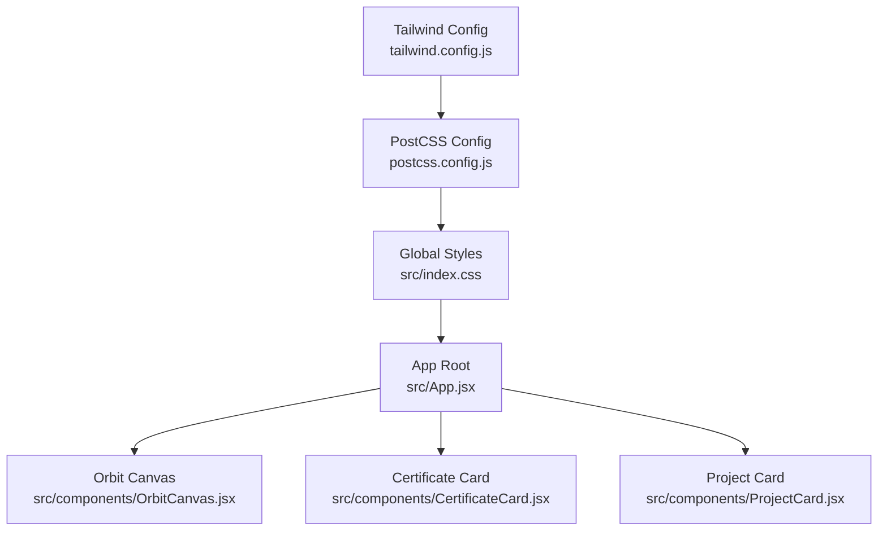
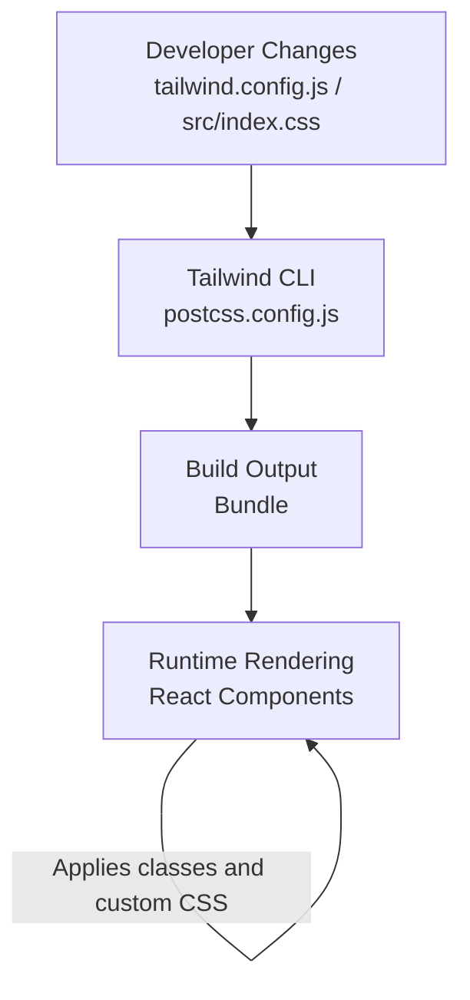
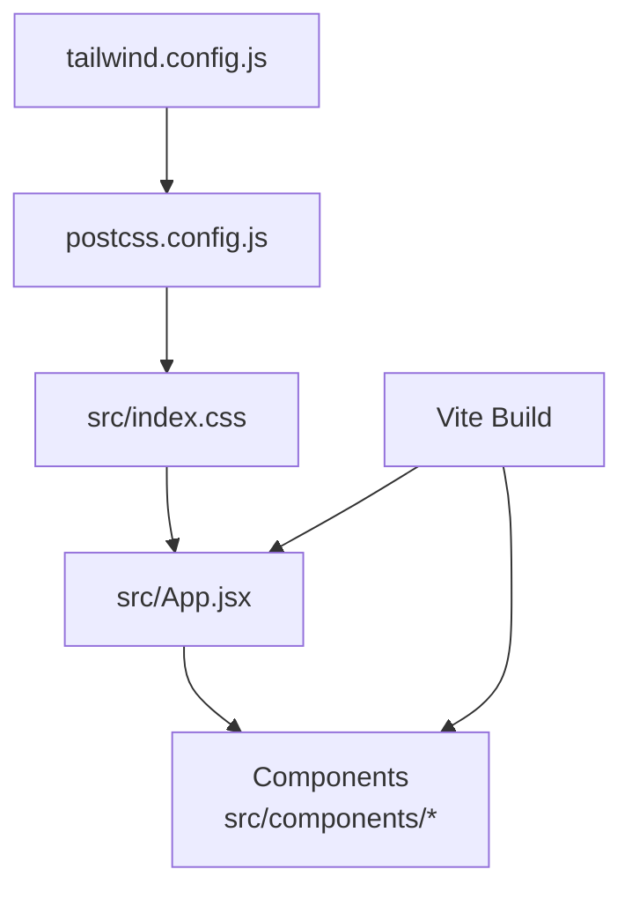

# Visual Theme Modification

<cite>
**Referenced Files in This Document**
- [tailwind.config.js](file://tailwind.config.js)
- [postcss.config.js](file://postcss.config.js)
- [src/index.css](file://src/index.css)
- [src/App.jsx](file://src/App.jsx)
- [src/components/OrbitCanvas.jsx](file://src/components/OrbitCanvas.jsx)
- [src/components/CertificateCard.jsx](file://src/components/CertificateCard.jsx)
- [src/components/ProjectCard.jsx](file://src/components/ProjectCard.jsx)
- [desain.md](file://desain.md)
</cite>

## Table of Contents
1. [Introduction](#introduction)
2. [Project Structure](#project-structure)
3. [Core Components](#core-components)
4. [Architecture Overview](#architecture-overview)
5. [Detailed Component Analysis](#detailed-component-analysis)
6. [Dependency Analysis](#dependency-analysis)
7. [Performance Considerations](#performance-considerations)
8. [Troubleshooting Guide](#troubleshooting-guide)
9. [Conclusion](#conclusion)
10. [Appendices](#appendices)

## Introduction
This document explains how to customize the visual theme for a dark-themed portfolio site built with React, Tailwind CSS, and PostCSS. It focuses on modifying color schemes, gradients, neon effects, grid backgrounds, glow effects, and typography while maintaining accessibility and brand alignment. The guide references actual files in the repository to ensure accurate, actionable steps.

## Project Structure
The theme is driven by Tailwind CSS configuration and PostCSS processing, with global styles and component-specific styling applied across the app. Key files include:
- Tailwind configuration defines color palettes and custom utilities
- PostCSS config enables Tailwind directives and plugins
- Global CSS applies base styles and theme-wide effects
- Components implement visual patterns such as glowing borders, gradients, and grid backgrounds

**Diagram sources**
- [tailwind.config.js](file://tailwind.config.js)
- [postcss.config.js](file://postcss.config.js)
- [src/index.css](file://src/index.css)
- [src/App.jsx](file://src/App.jsx)
- [src/components/OrbitCanvas.jsx](file://src/components/OrbitCanvas.jsx)
- [src/components/CertificateCard.jsx](file://src/components/CertificateCard.jsx)
- [src/components/ProjectCard.jsx](file://src/components/ProjectCard.jsx)

**Section sources**
- [tailwind.config.js](file://tailwind.config.js)
- [postcss.config.js](file://postcss.config.js)
- [src/index.css](file://src/index.css)
- [src/App.jsx](file://src/App.jsx)

## Core Components
This section outlines the primary areas where visual themes are defined and applied.

- Tailwind configuration: Defines color tokens, custom utilities, and plugin behavior. Use this to introduce new colors, adjust spacing, and extend design tokens.
- PostCSS pipeline: Processes Tailwind directives and ensures utilities are generated and bundled.
- Global CSS: Applies base styles, resets, dark mode defaults, and theme-wide effects like glow and grid backgrounds.
- Components: Implement visual patterns such as glowing borders, gradient overlays, and canvas-based animations.

Key customization touchpoints:
- Color palette replacement via Tailwind’s color configuration
- Gradient backgrounds via utility classes or custom CSS
- Neon effects via box-shadows, text-shadows, and pseudo-element glows
- Grid backgrounds via background-image utilities or custom CSS
- Typography via font families, weights, and responsive sizing utilities

**Section sources**
- [tailwind.config.js](file://tailwind.config.js)
- [postcss.config.js](file://postcss.config.js)
- [src/index.css](file://src/index.css)
- [src/App.jsx](file://src/App.jsx)

## Architecture Overview
The theme architecture integrates Tailwind-generated utilities with global CSS and component-specific styles. The flow below illustrates how configuration influences runtime styles.

**Diagram sources**
- [tailwind.config.js](file://tailwind.config.js)
- [postcss.config.js](file://postcss.config.js)
- [src/index.css](file://src/index.css)
- [src/App.jsx](file://src/App.jsx)

## Detailed Component Analysis

### Tailwind Configuration and Color Palette
- Purpose: Centralize color tokens and design tokens for consistent theming.
- How to customize:
  - Replace existing colors (e.g., neon blue and pink) by updating the color definition map.
  - Add new semantic colors for brand alignment.
  - Extend spacing, border radius, and shadow scales for cohesive design.
- Impact: All components using Tailwind utilities inherit the updated palette automatically.

Practical steps:
- Open the Tailwind configuration file and update the color map entries.
- Rebuild the project to regenerate utilities.
- Verify color usage across components and adjust where necessary.

**Section sources**
- [tailwind.config.js](file://tailwind.config.js)

### Global Styles and Dark Theme Foundation
- Purpose: Establish dark mode defaults, base typography, and global effects.
- How to customize:
  - Adjust background colors for dark mode.
  - Modify base font stacks and sizes.
  - Define theme-wide glow and grid effects.
- Impact: These styles apply globally and influence component rendering.

Practical steps:
- Review the global CSS file for dark mode selectors and base styles.
- Update background and text colors to match your palette.
- Introduce or refine grid backgrounds and glow utilities.

**Section sources**
- [src/index.css](file://src/index.css)

### Component-Level Visual Patterns
Components implement specific visual patterns that can be customized independently or in coordination with global styles.

#### OrbitCanvas
- Purpose: Renders animated orbital effects with glow and gradient overlays.
- How to customize:
  - Adjust gradient stops and directions for background gradients.
  - Modify glow intensity and color via shadow utilities or custom CSS.
  - Tune animation timing and easing for performance and feel.
- Impact: Enhances hero/background visuals with dynamic motion.

Practical steps:
- Inspect the component’s styling and animation logic.
- Replace gradient tokens with new color tokens from the updated palette.
- Adjust shadow and blur values to maintain readability and contrast.

**Section sources**
- [src/components/OrbitCanvas.jsx](file://src/components/OrbitCanvas.jsx)

#### CertificateCard
- Purpose: Displays certificate items with subtle borders and hover effects.
- How to customize:
  - Swap accent colors for borders and highlights.
  - Adjust hover states and transitions for accessibility.
- Impact: Improves card aesthetics and interaction feedback.

Practical steps:
- Locate the card’s styling and hover states.
- Replace color tokens with your chosen palette.
- Ensure sufficient contrast for text and interactive elements.

**Section sources**
- [src/components/CertificateCard.jsx](file://src/components/CertificateCard.jsx)

#### ProjectCard
- Purpose: Highlights projects with visual emphasis and subtle animations.
- How to customize:
  - Update background and border colors.
  - Adjust glow or shadow effects for depth.
- Impact: Elevates project presentation and brand consistency.

Practical steps:
- Review the card’s styling and any pseudo-element effects.
- Align colors with the global palette and brand guidelines.
- Test hover and focus states for accessibility.

**Section sources**
- [src/components/ProjectCard.jsx](file://src/components/ProjectCard.jsx)

### Design Notes and Brand Alignment
The design document provides context for visual direction and brand alignment. Use it to:
- Define target contrast ratios and readable color combinations.
- Establish brand-aligned palettes and tone.
- Document decisions for gradients, glows, and typography choices.

**Section sources**
- [desain.md](file://desain.md)

## Dependency Analysis
Theme dependencies connect configuration, build pipeline, and runtime rendering.

**Diagram sources**
- [tailwind.config.js](file://tailwind.config.js)
- [postcss.config.js](file://postcss.config.js)
- [src/index.css](file://src/index.css)
- [src/App.jsx](file://src/App.jsx)
- [src/components/OrbitCanvas.jsx](file://src/components/OrbitCanvas.jsx)
- [src/components/CertificateCard.jsx](file://src/components/CertificateCard.jsx)
- [src/components/ProjectCard.jsx](file://src/components/ProjectCard.jsx)

**Section sources**
- [tailwind.config.js](file://tailwind.config.js)
- [postcss.config.js](file://postcss.config.js)
- [src/index.css](file://src/index.css)
- [src/App.jsx](file://src/App.jsx)

## Performance Considerations
- Prefer Tailwind utilities over ad-hoc custom CSS for reusability and consistency.
- Minimize heavy shadows and gradients on many elements to keep rendering fast.
- Use CSS custom properties sparingly; leverage Tailwind’s color tokens for scalability.
- Keep animation durations reasonable to avoid jank on lower-powered devices.

## Troubleshooting Guide
Common issues and resolutions:
- Colors not updating:
  - Ensure Tailwind configuration is rebuilt after changes.
  - Verify PostCSS is processing Tailwind directives.
- Glow or shadow artifacts:
  - Reduce blur radius or opacity for better performance.
  - Confirm contrast ratios meet accessibility guidelines.
- Typography inconsistencies:
  - Standardize font stacks and sizes in global CSS.
  - Use Tailwind’s text utilities consistently across components.

**Section sources**
- [tailwind.config.js](file://tailwind.config.js)
- [postcss.config.js](file://postcss.config.js)
- [src/index.css](file://src/index.css)

## Conclusion
Customizing the visual theme involves coordinated updates across Tailwind configuration, global CSS, and component styles. By replacing color tokens, adjusting gradients and glow effects, and refining typography, you can achieve a cohesive, accessible, and brand-aligned dark theme. Use the design document to guide decisions and validate contrast and readability.

## Appendices

### Accessibility Checklist for Theme Updates
- Contrast ratios: Ensure text and interactive elements meet minimum contrast thresholds against backgrounds.
- Focus indicators: Maintain visible focus styles for keyboard navigation.
- Motion preferences: Respect reduced motion settings and avoid excessive animations.
- Color independence: Do not rely solely on color to convey meaning; pair with icons or text labels.

### Quick Reference: Where to Edit
- Color palette: Tailwind configuration
- Global effects: Global CSS
- Component visuals: Component files
- Brand alignment: Design document