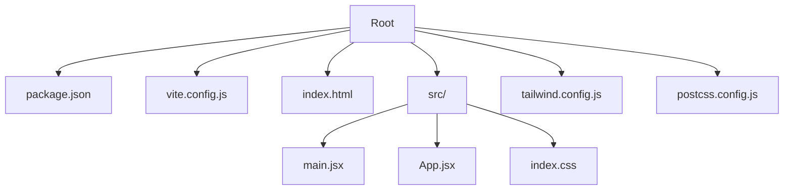

# Getting Started

<cite>
**Referenced Files in This Document**
- [package.json](file://package.json)
- [vite.config.js](file://vite.config.js)
- [index.html](file://index.html)
- [src/main.jsx](file://src/main.jsx)
- [src/App.jsx](file://src/App.jsx)
- [src/index.css](file://src/index.css)
- [tailwind.config.js](file://tailwind.config.js)
- [postcss.config.js](file://postcss.config.js)
</cite>

## Table of Contents
1. [Introduction](#introduction)
2. [Prerequisites](#prerequisites)
3. [Installation](#installation)
4. [Development Workflow](#development-workflow)
5. [Production Build](#production-build)
6. [Environment Variables](#environment-variables)
7. [Project Structure](#project-structure)
8. [Verification Steps](#verification-steps)
9. [Troubleshooting](#troubleshooting)
10. [Conclusion](#conclusion)

## Introduction
This guide helps you set up and run the portfolio website project locally. It covers prerequisites, installation, development server startup with Vite, building for production, environment variables, and troubleshooting common issues.

## Prerequisites
- Node.js: Install a current LTS (Long Term Support) version compatible with your operating system. Verify by running node --version and npm --version in your terminal. The project uses Vite and modern JavaScript tooling, so a recent Node.js version is recommended.
- Git: Optional but useful for cloning repositories and managing updates.
- A modern web browser: To preview the application during development.

## Installation
Follow these steps to install and prepare the project:

1. **Clone or acquire the project files**  
   Place the project folder in your desired directory. Ensure the root contains the key files: package.json, vite.config.js, index.html, and the src directory.

2. **Install dependencies**  
   Open a terminal in the project root and run:
   ```
   npm install
   ```
   This reads the dependencies from package.json and installs them into node_modules.

3. **Verify installation**  
   After installation completes, check that node_modules exists and contains the expected packages.

**Section sources**
- [package.json](file://package.json)

## Development Workflow
Use the following commands to develop locally:

- **Start the development server**  
  Run:
  ```
  npm run dev
  ```
  This launches the Vite development server. By default, Vite serves the app on http://localhost:5173. Open your browser to this address to view the site.

- **Build for development preview**  
  Optionally, run:
  ```
  npm run build
  ```
  This creates a production-like build for inspection.

- **Preview the production build locally**  
  Run:
  ```
  npm run preview
  ```
  This serves the built assets locally for testing.

Notes:
- The development server hot-reloads the page when you edit files in the src directory.
- Vite resolves the entry point from index.html and mounts the React app via src/main.jsx.

**Section sources**
- [vite.config.js](file://vite.config.js)
- [index.html](file://index.html)
- [src/main.jsx](file://src/main.jsx)

## Production Build
To build the project for production:

1. **Run the production build script**  
   Execute:
   ```
   npm run build
   ```
   Vite compiles and bundles your application into the dist directory by default.

2. **Serve the production build locally (optional)**  
   To test the production build locally, run:
   ```
   npm run preview
   ```

3. **Deploy the dist folder**  
   Upload the contents of the dist directory to your hosting provider or static site host.

**Section sources**
- [vite.config.js](file://vite.config.js)

## Environment Variables
- The project does not define custom environment variables in the repository files visible here. If you need environment variables, define them per your deployment platform or use a .env file convention supported by your environment. Vite loads .env files automatically in development; for production builds, ensure variables are injected at build time if needed.

[No sources needed since this section provides general guidance]

## Project Structure
High-level layout of the most important files and folders:

- Root
  - package.json: Defines scripts, dependencies, and metadata.
  - vite.config.js: Vite configuration (including plugins and server settings).
  - index.html: Application entry HTML file.
  - src/
    - main.jsx: React root entry point.
    - App.jsx: Top-level React component.
    - index.css: Global styles.
  - tailwind.config.js: Tailwind CSS configuration.
  - postcss.config.js: PostCSS configuration for CSS processing.



**Diagram sources**
- [package.json](file://package.json)
- [vite.config.js](file://vite.config.js)
- [index.html](file://index.html)
- [src/main.jsx](file://src/main.jsx)
- [src/App.jsx](file://src/App.jsx)
- [src/index.css](file://src/index.css)
- [tailwind.config.js](file://tailwind.config.js)
- [postcss.config.js](file://postcss.config.js)

**Section sources**
- [package.json](file://package.json)
- [vite.config.js](file://vite.config.js)
- [index.html](file://index.html)
- [src/main.jsx](file://src/main.jsx)
- [src/App.jsx](file://src/App.jsx)
- [src/index.css](file://src/index.css)
- [tailwind.config.js](file://tailwind.config.js)
- [postcss.config.js](file://postcss.config.js)

## Verification Steps
After installation and server startup, confirm everything works:

- Confirm the development server starts without errors.
- Visit http://localhost:5173 in your browser.
- Verify the portfolio renders and interactive elements work.
- Make a small change in src/App.jsx and ensure the page reloads automatically.
- Run npm run build and check that the dist directory is created.
- Run npm run preview and confirm the production-like build loads.

**Section sources**
- [vite.config.js](file://vite.config.js)
- [src/App.jsx](file://src/App.jsx)
- [index.html](file://index.html)

## Troubleshooting
Common setup issues and fixes:

- **Node.js or npm not found**  
  Ensure Node.js and npm are installed and added to your PATH. Reopen your terminal or restart your IDE after installation.

- **Port 5173 in use**  
  The development server defaults to port 5173. If it is in use, stop the conflicting process or configure a different port in vite.config.js.

- **Missing dependencies**  
  If components fail to load, reinstall dependencies:  
  ```
  rm -rf node_modules package-lock.json
  npm install
  ```

- **CSS not applying**  
  Ensure Tailwind and PostCSS are configured correctly. Verify tailwind.config.js and postcss.config.js exist and are valid.

- **Build fails**  
  Clean the build cache and retry:  
  ```
  npm run build
  ```

- **Browser not refreshing on save**  
  Confirm you are editing files under src and that the dev server is running. Some editors require saving twice to trigger hot reload.

**Section sources**
- [vite.config.js](file://vite.config.js)
- [tailwind.config.js](file://tailwind.config.js)
- [postcss.config.js](file://postcss.config.js)

## Conclusion
You now have the essentials to install, run, and build the portfolio website locally. Use the development server for rapid iteration, and the production build for deployment. Refer to the troubleshooting section if you encounter issues during setup.