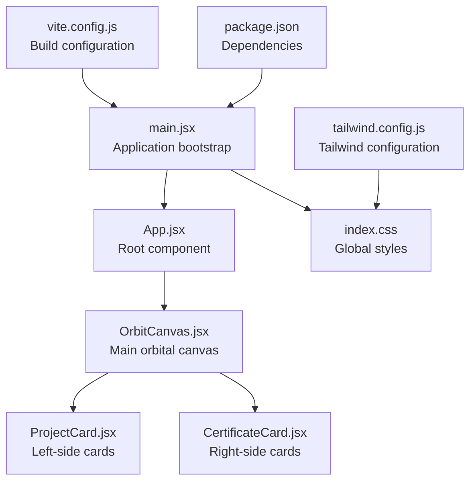
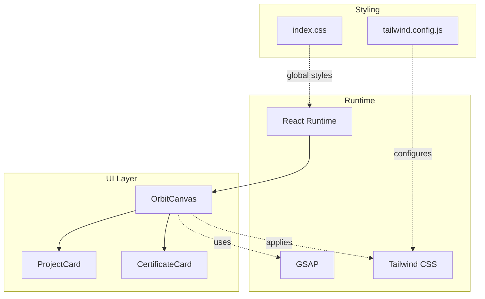
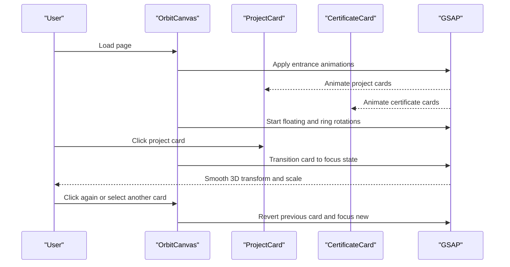
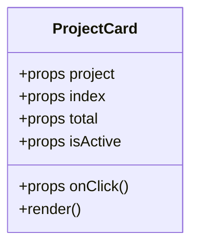
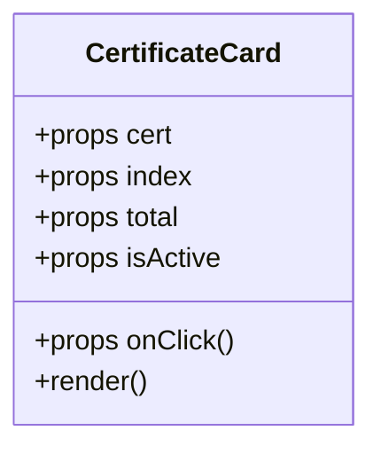
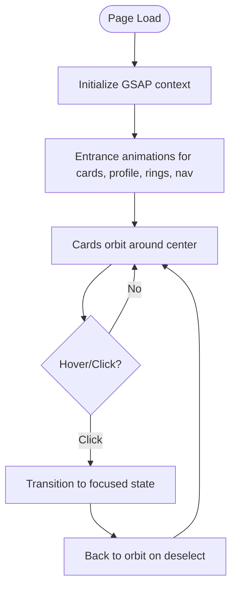
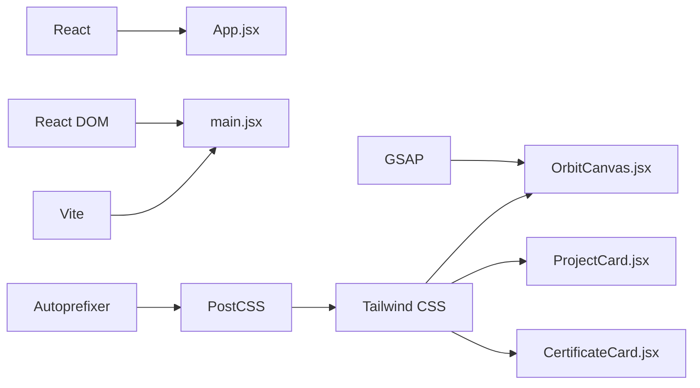

# Project Overview

<cite>
**Referenced Files in This Document**
- [src/App.jsx](file://src/App.jsx)
- [src/main.jsx](file://src/main.jsx)
- [src/components/OrbitCanvas.jsx](file://src/components/OrbitCanvas.jsx)
- [src/components/ProjectCard.jsx](file://src/components/ProjectCard.jsx)
- [src/components/CertificateCard.jsx](file://src/components/CertificateCard.jsx)
- [src/index.css](file://src/index.css)
- [desain.md](file://desain.md)
- [tailwind.config.js](file://tailwind.config.js)
- [vite.config.js](file://vite.config.js)
- [package.json](file://package.json)
</cite>

## Table of Contents
1. [Introduction](#introduction)
2. [Project Structure](#project-structure)
3. [Core Components](#core-components)
4. [Architecture Overview](#architecture-overview)
5. [Detailed Component Analysis](#detailed-component-analysis)
6. [Dependency Analysis](#dependency-analysis)
7. [Performance Considerations](#performance-considerations)
8. [Troubleshooting Guide](#troubleshooting-guide)
9. [Conclusion](#conclusion)
10. [Appendices](#appendices)

## Introduction
This React portfolio website showcases an interactive 3D orbital animation concept. It presents a modern, immersive experience where project and certification cards orbit around a central profile photo using GSAP-powered 3D transforms. The design philosophy emphasizes a dark, futuristic aesthetic with subtle grid overlays, glowing accents, and a responsive layout built with Tailwind CSS. The project aligns with contemporary web development trends by combining declarative UI with performant motion design, minimal third-party dependencies, and a clean component architecture.

## Project Structure
The project follows a straightforward React + Vite + Tailwind setup with a single-page application entry. The core rendering is driven by a single root component that hosts the orbital canvas, which orchestrates animations and card interactions.

**Diagram sources**
- [src/main.jsx:1-11](file://src/main.jsx#L1-L11)
- [src/App.jsx:1-8](file://src/App.jsx#L1-L8)
- [src/components/OrbitCanvas.jsx:1-382](file://src/components/OrbitCanvas.jsx#L1-L382)
- [src/components/ProjectCard.jsx:1-32](file://src/components/ProjectCard.jsx#L1-L32)
- [src/components/CertificateCard.jsx:1-31](file://src/components/CertificateCard.jsx#L1-L31)
- [src/index.css:1-28](file://src/index.css#L1-L28)
- [tailwind.config.js:1-16](file://tailwind.config.js#L1-L16)
- [vite.config.js:1-7](file://vite.config.js#L1-L7)
- [package.json:1-24](file://package.json#L1-L24)

**Section sources**
- [src/main.jsx:1-11](file://src/main.jsx#L1-L11)
- [src/App.jsx:1-8](file://src/App.jsx#L1-L8)
- [src/index.css:1-28](file://src/index.css#L1-L28)
- [tailwind.config.js:1-16](file://tailwind.config.js#L1-L16)
- [vite.config.js:1-7](file://vite.config.js#L1-L7)
- [package.json:1-24](file://package.json#L1-L24)

## Core Components
- OrbitCanvas: Central component that renders the orbital layout, manages GSAP animations, handles card selection, and composes the navigation, tech stack badges, and live chat elements.
- ProjectCard: Left-side card component representing projects with 3D transforms and hover/active states.
- CertificateCard: Right-side card component representing certifications with mirrored 3D transforms and hover/active states.

Key responsibilities:
- Orbital positioning and 3D transforms using Tailwind classes and inline styles.
- GSAP orchestration for entrance, floating, ring rotation, and code rain effects.
- Click-to-focus behavior with smooth transitions and z-index stacking.
- Responsive sizing and layout adjustments across breakpoints.

**Section sources**
- [src/components/OrbitCanvas.jsx:96-382](file://src/components/OrbitCanvas.jsx#L96-L382)
- [src/components/ProjectCard.jsx:1-32](file://src/components/ProjectCard.jsx#L1-L32)
- [src/components/CertificateCard.jsx:1-31](file://src/components/CertificateCard.jsx#L1-L31)

## Architecture Overview
The application uses a component-driven architecture with a single-page layout. The root component delegates rendering to the orbital canvas, which encapsulates all visuals, animations, and interactions. Tailwind CSS provides utility-first styling, while GSAP delivers performant, timeline-based animations.

**Diagram sources**
- [src/components/OrbitCanvas.jsx:1-382](file://src/components/OrbitCanvas.jsx#L1-L382)
- [src/components/ProjectCard.jsx:1-32](file://src/components/ProjectCard.jsx#L1-L32)
- [src/components/CertificateCard.jsx:1-31](file://src/components/CertificateCard.jsx#L1-L31)
- [src/index.css:1-28](file://src/index.css#L1-L28)
- [tailwind.config.js:1-16](file://tailwind.config.js#L1-L16)

## Detailed Component Analysis

### OrbitCanvas: Orbital Animation Engine
OrbitCanvas is the centerpiece of the 3D orbital visualization. It:
- Defines static datasets for projects, certificates, and code snippets.
- Uses GSAP context to manage lifecycle-aware animations scoped to the canvas element.
- Implements entrance animations for cards, profile photo, orbit rings, and navigation items.
- Applies continuous floating and slow rotation effects for profile and orbit rings.
- Renders a code rain background using randomized vertical movement.
- Manages click-to-focus behavior for cards with 3D transforms and z-index stacking.

**Diagram sources**
- [src/components/OrbitCanvas.jsx:101-226](file://src/components/OrbitCanvas.jsx#L101-L226)
- [src/components/ProjectCard.jsx:1-32](file://src/components/ProjectCard.jsx#L1-L32)
- [src/components/CertificateCard.jsx:1-31](file://src/components/CertificateCard.jsx#L1-L31)

Implementation highlights:
- 3D transforms: Cards use rotateY and z-axis offsets to achieve orbital depth.
- Staggered entrance: Staggered delays and easing create a cascading effect.
- Continuous motion: Floating and ring rotations use repeat cycles with yoyo for seamless loops.
- Interactive focus: Click toggles between stacked states with dataset flags for active tracking.

**Section sources**
- [src/components/OrbitCanvas.jsx:6-94](file://src/components/OrbitCanvas.jsx#L6-L94)
- [src/components/OrbitCanvas.jsx:101-190](file://src/components/OrbitCanvas.jsx#L101-L190)
- [src/components/OrbitCanvas.jsx:192-226](file://src/components/OrbitCanvas.jsx#L192-L226)
- [desain.md:229-381](file://desain.md#L229-L381)

### ProjectCard: Left-Side Orbital Card
ProjectCard positions itself along the left orbital path with a mirrored 3D orientation compared to CertificateCard. It:
- Receives project data and indices to compute vertical and horizontal offsets.
- Applies preserve-3d transform style for realistic 3D rendering.
- Uses Tailwind classes for backdrop blur, borders, and hover/active states.
- Integrates with OrbitCanvas click handler to participate in focus transitions.

**Diagram sources**
- [src/components/ProjectCard.jsx:1-32](file://src/components/ProjectCard.jsx#L1-L32)

**Section sources**
- [src/components/ProjectCard.jsx:1-32](file://src/components/ProjectCard.jsx#L1-L32)

### CertificateCard: Right-Side Orbital Card
CertificateCard mirrors ProjectCard’s behavior on the opposite side with reversed 3D orientation. It:
- Computes offsets to distribute cards vertically and horizontally.
- Maintains consistent styling and interaction semantics.
- Participates in the same focus and stacking logic as ProjectCard.

**Diagram sources**
- [src/components/CertificateCard.jsx:1-31](file://src/components/CertificateCard.jsx#L1-L31)

**Section sources**
- [src/components/CertificateCard.jsx:1-31](file://src/components/CertificateCard.jsx#L1-L31)

### Conceptual Overview
The orbital visualization concept revolves around:
- Central focus: The profile photo acts as the orbital center.
- Dual orbits: Project and certificate cards orbit left and right respectively.
- Depth cues: z-axis offsets and rotateY create layered depth.
- Interaction model: Clicking a card brings it to the front with increased scale and opacity.
- Motion language: Floating, slow rotations, and code rain reinforce a digital, futuristic feel.

[No sources needed since this diagram shows conceptual workflow, not actual code structure]

## Dependency Analysis
External libraries and tools:
- React and ReactDOM: Core framework and renderer.
- GSAP: Motion engine for 3D transforms and timelines.
- Tailwind CSS: Utility-first styling with custom configuration.
- Vite: Build toolchain with React plugin.
- PostCSS and Autoprefixer: CSS processing pipeline.

**Diagram sources**
- [package.json:11-22](file://package.json#L11-L22)
- [vite.config.js:1-7](file://vite.config.js#L1-L7)
- [tailwind.config.js:1-16](file://tailwind.config.js#L1-L16)
- [src/main.jsx:1-11](file://src/main.jsx#L1-L11)
- [src/App.jsx:1-8](file://src/App.jsx#L1-L8)
- [src/components/OrbitCanvas.jsx:1-5](file://src/components/OrbitCanvas.jsx#L1-L5)

**Section sources**
- [package.json:1-24](file://package.json#L1-L24)
- [vite.config.js:1-7](file://vite.config.js#L1-L7)
- [tailwind.config.js:1-16](file://tailwind.config.js#L1-L16)

## Performance Considerations
- GPU-accelerated transforms: Using rotateY, z, and translate3d-like properties leverages hardware acceleration for smoother animations.
- Staggered animations: Controlled staggering prevents frame drops during initial load.
- Context scoping: GSAP context ensures animations are cleaned up on unmount, preventing memory leaks.
- Minimal re-renders: State updates are limited to active card and navigation, avoiding unnecessary re-renders of static backgrounds.
- Tailwind utilities: Utility classes reduce custom CSS overhead and enable efficient composition.

[No sources needed since this section provides general guidance]

## Troubleshooting Guide
Common issues and resolutions:
- Cards not animating: Verify GSAP is imported and the canvas ref is attached to the container element.
- 3D transforms not visible: Ensure transform-style is preserved and perspective is set appropriately.
- Click handlers not firing: Confirm event handlers are passed down from OrbitCanvas and that dataset flags are toggled correctly.
- Tailwind utilities missing: Ensure Tailwind content globs match component paths and rebuild after configuration changes.
- Build errors: Confirm Vite and React plugin versions are compatible with the current Node and npm versions.

**Section sources**
- [src/components/OrbitCanvas.jsx:101-190](file://src/components/OrbitCanvas.jsx#L101-L190)
- [src/components/ProjectCard.jsx:14-16](file://src/components/ProjectCard.jsx#L14-L16)
- [src/components/CertificateCard.jsx:14-16](file://src/components/CertificateCard.jsx#L14-L16)
- [tailwind.config.js:3-6](file://tailwind.config.js#L3-L6)
- [vite.config.js:1-7](file://vite.config.js#L1-L7)

## Conclusion
This portfolio project demonstrates a cohesive blend of modern web technologies to deliver an engaging, 3D orbital experience. By structuring the UI around reusable card components, orchestrating motion with GSAP, and leveraging Tailwind for rapid styling, the application achieves both visual impact and maintainability. The design philosophy emphasizes clarity, depth, and interactivity—key traits of contemporary web experiences.

[No sources needed since this section summarizes without analyzing specific files]

## Appendices

### Visual Design Philosophy
- Color palette: Dark backgrounds with cyan and magenta accents for a cyber-inspired look.
- Typography: Clean, modern fonts with bold headings and readable body text.
- Effects: Glowing borders, radial gradients, and subtle grid overlays enhance depth without overwhelming content.
- Accessibility: Sufficient contrast and focus states for interactive elements.

**Section sources**
- [src/components/OrbitCanvas.jsx:236-262](file://src/components/OrbitCanvas.jsx#L236-L262)
- [src/index.css:11-15](file://src/index.css#L11-L15)

### Responsive Layout Approach
- Mobile-first design with breakpoint-specific adjustments for card sizes and spacing.
- Flexible containers and percentage-based layouts adapt to various screen widths.
- Navigation and tech stack badges remain centered and spaced proportionally.

**Section sources**
- [src/components/OrbitCanvas.jsx:265-342](file://src/components/OrbitCanvas.jsx#L265-L342)
- [tailwind.config.js:7-12](file://tailwind.config.js#L7-L12)

### Practical Examples: Orbital Visualization Concepts
- Orbital rings: Three concentric rings rotate at different speeds to simulate depth and motion.
- Card distribution: Vertical offsets and horizontal translations position cards along orbital paths.
- Focus transitions: Clicking a card scales it, reduces opacity of others, and elevates it above the profile photo.
- Code rain: Randomized spans move vertically to create a dynamic, data-inspired background.

**Section sources**
- [src/components/OrbitCanvas.jsx:290-342](file://src/components/OrbitCanvas.jsx#L290-L342)
- [src/components/OrbitCanvas.jsx:171-187](file://src/components/OrbitCanvas.jsx#L171-L187)
- [src/components/OrbitCanvas.jsx:192-226](file://src/components/OrbitCanvas.jsx#L192-L226)
- [desain.md:128-194](file://desain.md#L128-L194)