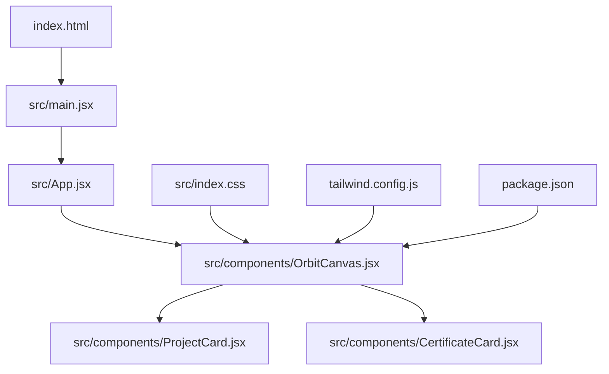
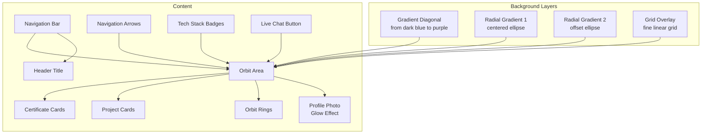
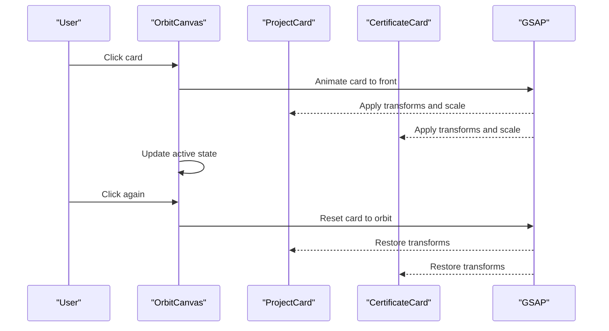
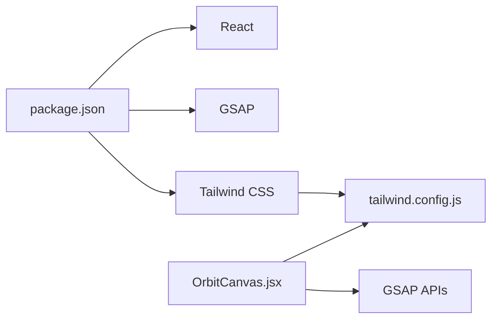

# Design Implementation

<cite>
**Referenced Files in This Document**
- [index.html](file://index.html)
- [src/main.jsx](file://src/main.jsx)
- [src/index.css](file://src/index.css)
- [tailwind.config.js](file://tailwind.config.js)
- [package.json](file://package.json)
- [src/App.jsx](file://src/App.jsx)
- [src/components/OrbitCanvas.jsx](file://src/components/OrbitCanvas.jsx)
- [src/components/ProjectCard.jsx](file://src/components/ProjectCard.jsx)
- [src/components/CertificateCard.jsx](file://src/components/CertificateCard.jsx)
- [desain.md](file://desain.md)
- [tempinit/src/index.css](file://tempinit/src/index.css)
- [tempinit/src/App.css](file://tempinit/src/App.css)
</cite>

## Table of Contents
1. [Introduction](#introduction)
2. [Project Structure](#project-structure)
3. [Core Components](#core-components)
4. [Architecture Overview](#architecture-overview)
5. [Detailed Component Analysis](#detailed-component-analysis)
6. [Dependency Analysis](#dependency-analysis)
7. [Performance Considerations](#performance-considerations)
8. [Troubleshooting Guide](#troubleshooting-guide)
9. [Conclusion](#conclusion)
10. [Appendices](#appendices)

## Introduction
This document explains the visual design implementation of the portfolio application, focusing on the dark theme system, gradient backgrounds, grid overlay effects, border glow, and animation techniques. It documents the color palette, typography system, spacing patterns, and responsive design patterns used across the application. It also provides guidelines for maintaining visual consistency and adding new design elements.

## Project Structure
The application is a React + Vite + Tailwind CSS project with GSAP for advanced animations. The design system is primarily implemented in:
- Global styles and base resets
- Tailwind configuration for custom animations
- A central OrbitCanvas component orchestrating layout, gradients, grid overlays, and animations
- Reusable ProjectCard and CertificateCard components with consistent styling and interactive states

**Diagram sources**
- [index.html:1-14](file://index.html#L1-L14)
- [src/main.jsx:1-11](file://src/main.jsx#L1-L11)
- [src/App.jsx:1-8](file://src/App.jsx#L1-L8)
- [src/components/OrbitCanvas.jsx:1-382](file://src/components/OrbitCanvas.jsx#L1-L382)
- [src/components/ProjectCard.jsx:1-32](file://src/components/ProjectCard.jsx#L1-L32)
- [src/components/CertificateCard.jsx:1-31](file://src/components/CertificateCard.jsx#L1-L31)
- [src/index.css:1-28](file://src/index.css#L1-L28)
- [tailwind.config.js:1-16](file://tailwind.config.js#L1-L16)
- [package.json:1-24](file://package.json#L1-L24)

**Section sources**
- [index.html:1-14](file://index.html#L1-L14)
- [src/main.jsx:1-11](file://src/main.jsx#L1-L11)
- [src/App.jsx:1-8](file://src/App.jsx#L1-L8)
- [src/components/OrbitCanvas.jsx:1-382](file://src/components/OrbitCanvas.jsx#L1-L382)
- [src/index.css:1-28](file://src/index.css#L1-L28)
- [tailwind.config.js:1-16](file://tailwind.config.js#L1-L16)
- [package.json:1-24](file://package.json#L1-L24)

## Core Components
- Dark theme foundation: body background and global resets establish a deep-space aesthetic with a dark blue base.
- Gradient backgrounds: layered radial and diagonal gradients create depth and a subtle cosmic feel.
- Grid overlay: a fine linear grid with radial masking produces a digital/cyber grid effect.
- Border glow and soft shadows: consistent use of border colors and glow effects around profile and cards.
- Typography: Inter-based font stack with bold headings and controlled tracking.
- Animation system: Tailwind pulse animation and GSAP-driven entrance, orbit, and selection animations.

**Section sources**
- [src/index.css:11-27](file://src/index.css#L11-L27)
- [src/components/OrbitCanvas.jsx:236-262](file://src/components/OrbitCanvas.jsx#L236-L262)
- [src/components/ProjectCard.jsx:10-11](file://src/components/ProjectCard.jsx#L10-L11)
- [src/components/CertificateCard.jsx:9-10](file://src/components/CertificateCard.jsx#L9-L10)
- [tailwind.config.js:9-11](file://tailwind.config.js#L9-L11)
- [src/components/OrbitCanvas.jsx:101-190](file://src/components/OrbitCanvas.jsx#L101-L190)

## Architecture Overview
The visual architecture centers on OrbitCanvas, which composes:
- Background layers: gradient overlays and code rain
- Grid overlay for digital texture
- Orbit rings and floating profile photo
- Project and certificate cards with 3D transforms and hover/active states
- Navigation and tech stack badges with consistent color tokens

**Diagram sources**
- [src/components/OrbitCanvas.jsx:236-381](file://src/components/OrbitCanvas.jsx#L236-L381)

## Detailed Component Analysis

### Dark Theme System
- Base background: deep dark blue (#0a0a1a) ensures contrast and reduces eye strain.
- Scrollbar customization: teal accent for thumb and track maintains theme continuity.
- Color tokens: consistent use of teal (#66FCF1) and accent pink (#ff2d78) for highlights and borders.

Implementation highlights:
- Body background and font family defined globally.
- Teal scrollbar colors for consistent theme across browsers.

**Section sources**
- [src/index.css:11-27](file://src/index.css#L11-L27)
- [src/components/OrbitCanvas.jsx:305-313](file://src/components/OrbitCanvas.jsx#L305-L313)

### Gradient Backgrounds
Layered gradients create depth:
- Diagonal gradient from dark blue to purple.
- Radial gradients with elliptical shapes positioned at center and offset to simulate light sources.
- Code rain background: animated spans with low opacity and subtle rotation for a digital rain effect.

Animation and composition:
- GSAP animates code rain opacity and vertical movement with staggered timing.
- Gradients are applied as pseudo-layers to avoid layout shifts.

**Section sources**
- [src/components/OrbitCanvas.jsx:236-255](file://src/components/OrbitCanvas.jsx#L236-L255)
- [src/components/OrbitCanvas.jsx:171-186](file://src/components/OrbitCanvas.jsx#L171-L186)

### Grid Overlay Effects
- Fine linear grid: vertical and horizontal lines spaced evenly.
- Radial mask: ellipse centered to soften edges and blend with background.
- Opacity tuned to a low value to remain subtle while enhancing digital texture.

Usage:
- Applied as an absolute overlay behind content to maintain readability.

**Section sources**
- [src/components/OrbitCanvas.jsx:257-262](file://src/components/OrbitCanvas.jsx#L257-L262)
- [desain.md:15-21](file://desain.md#L15-L21)

### Border Glow and Soft Shadows
- Profile photo: teal glow shadow behind the image to emphasize focus.
- Cards: active state uses a bright pink border and glow; hover uses a translucent teal border.
- Orbit rings: low-opacity borders with subtle transparency to imply depth.

Consistency:
- Teal and pink are used as primary accent colors for borders and glows.
- Shadow values are tuned for softness and depth perception.

**Section sources**
- [src/components/OrbitCanvas.jsx:312](file://src/components/OrbitCanvas.jsx#L312)
- [src/components/ProjectCard.jsx:10-11](file://src/components/ProjectCard.jsx#L10-L11)
- [src/components/CertificateCard.jsx:9-10](file://src/components/CertificateCard.jsx#L9-L10)
- [src/components/OrbitCanvas.jsx:290-294](file://src/components/OrbitCanvas.jsx#L290-L294)

### Typography System
- Font stack: Inter with fallbacks to system-ui and sans-serif for broad compatibility.
- Headings: bold weight, uppercase, and wider tracking for emphasis.
- Body text: controlled sizes and spacing for readability.

Responsive adjustments:
- Title scales from medium to larger on larger screens.
- Navigation items adjust spacing and sizing for mobile.

**Section sources**
- [src/index.css:13](file://src/index.css#L13)
- [src/components/OrbitCanvas.jsx:282](file://src/components/OrbitCanvas.jsx#L282)
- [src/components/OrbitCanvas.jsx:265-279](file://src/components/OrbitCanvas.jsx#L265-L279)

### Spacing Patterns
- Uniform padding and margins across navigation, cards, and tech badges.
- Relative units and percentages for responsive layouts.
- Z-index stacking ensures proper layering of background, rings, cards, and overlays.

Examples:
- Cards positioned absolutely with offsets for vertical distribution.
- Orbit rings sized relatively to screen dimensions.

**Section sources**
- [src/components/OrbitCanvas.jsx:316-341](file://src/components/OrbitCanvas.jsx#L316-L341)
- [src/components/ProjectCard.jsx:3-4](file://src/components/ProjectCard.jsx#L3-L4)
- [src/components/CertificateCard.jsx:2-3](file://src/components/CertificateCard.jsx#L2-L3)

### Visual Effect Techniques
- Pulse animation: slow, smooth pulse for profile photo using Tailwind’s custom animation.
- 3D transforms: preserve-3d and rotateY for orbital positioning; z-axis for depth.
- Staggered entrance: GSAP stagger controls for project and certificate cards.
- Yoyo and repeat: floating motion and continuous ring rotations.

**Section sources**
- [tailwind.config.js:9-11](file://tailwind.config.js#L9-L11)
- [src/components/ProjectCard.jsx:15-17](file://src/components/ProjectCard.jsx#L15-L17)
- [src/components/CertificateCard.jsx:14-16](file://src/components/CertificateCard.jsx#L14-L16)
- [src/components/OrbitCanvas.jsx:101-190](file://src/components/OrbitCanvas.jsx#L101-L190)

### CSS Custom Properties and Tokens
- The tempinit project demonstrates a robust CSS custom property system with:
  - Text, background, border, and accent tokens
  - Light and dark mode variants
  - Typography tokens for sans, heading, and mono fonts
  - Responsive font scaling and media queries

While the current OrbitCanvas project does not rely on CSS custom properties, adopting a similar tokenized approach would improve consistency and theme switching.

**Section sources**
- [tempinit/src/index.css:1-51](file://tempinit/src/index.css#L1-L51)
- [tempinit/src/App.css:1-185](file://tempinit/src/App.css#L1-L185)

### Animation Effects
- Entrance animations: GSAP from/to animations for cards, profile, orbit rings, and navigation.
- Continuous animations: floating profile and rotating orbit rings.
- Selection feedback: GSAP transitions for active card state with rotation, z-depth, and scale.

**Diagram sources**
- [src/components/OrbitCanvas.jsx:192-226](file://src/components/OrbitCanvas.jsx#L192-L226)

**Section sources**
- [src/components/OrbitCanvas.jsx:101-190](file://src/components/OrbitCanvas.jsx#L101-L190)
- [src/components/OrbitCanvas.jsx:192-226](file://src/components/OrbitCanvas.jsx#L192-L226)

### Responsive Design Patterns
- Mobile-first approach with increased spacing and adjusted font sizes on larger screens.
- Percentage-based widths and absolute positioning for cards with relative offsets.
- Z-index stacking ensures content remains readable across breakpoints.
- Navigation adapts spacing and hover states for touch-friendly interactions.

**Section sources**
- [src/components/OrbitCanvas.jsx:265-279](file://src/components/OrbitCanvas.jsx#L265-L279)
- [src/components/OrbitCanvas.jsx:316-341](file://src/components/OrbitCanvas.jsx#L316-L341)

## Dependency Analysis
External libraries and integrations:
- React: component framework
- GSAP: advanced animation orchestration
- Tailwind CSS: utility-first styling and custom animation extension

**Diagram sources**
- [package.json:11-22](file://package.json#L11-L22)
- [tailwind.config.js:1-16](file://tailwind.config.js#L1-L16)
- [src/components/OrbitCanvas.jsx:1-5](file://src/components/OrbitCanvas.jsx#L1-L5)

**Section sources**
- [package.json:11-22](file://package.json#L11-L22)
- [tailwind.config.js:1-16](file://tailwind.config.js#L1-L16)
- [src/components/OrbitCanvas.jsx:1-5](file://src/components/OrbitCanvas.jsx#L1-L5)

## Performance Considerations
- Prefer hardware-accelerated properties (transform, opacity) for animations.
- Use z-index sparingly; excessive stacking can cause repaints.
- Keep grid overlay opacity low to minimize rendering cost.
- Limit the number of animated elements on small screens.
- Use GSAP context to cleanly manage timelines and revert on unmount.

## Troubleshooting Guide
Common issues and resolutions:
- Animations not playing: ensure GSAP is imported and timelines are initialized inside a mounted component lifecycle.
- Z-index conflicts: verify stacking contexts and avoid unnecessary z-index increases.
- Scrollbar visibility: confirm custom scrollbar styles apply to the target element and browser supports the pseudo-elements.
- Grid overlay not visible: check opacity and gradient layer order; ensure it is placed behind content.

**Section sources**
- [src/components/OrbitCanvas.jsx:101-190](file://src/components/OrbitCanvas.jsx#L101-L190)
- [src/index.css:18-27](file://src/index.css#L18-L27)

## Conclusion
The design system combines a cohesive dark theme, layered gradients, a subtle grid overlay, and consistent border glow effects with robust animations powered by GSAP and Tailwind. The OrbitCanvas component serves as the visual anchor, orchestrating depth, motion, and focus. Adopting a tokenized CSS custom property system would further enhance consistency and scalability.

## Appendices

### Color Scheme Reference
- Background: dark blue base
- Accents: teal and pink for highlights and borders
- Text: white for headings, gray for secondary text
- Borders: translucent teal on hover, bright pink for active state

**Section sources**
- [src/index.css:12](file://src/index.css#L12)
- [src/components/ProjectCard.jsx:10-11](file://src/components/ProjectCard.jsx#L10-L11)
- [src/components/CertificateCard.jsx:9-10](file://src/components/CertificateCard.jsx#L9-L10)

### Typography Reference
- Font family: Inter with system-ui fallback
- Headings: bold, uppercase, wider tracking
- Body: controlled sizes and line heights

**Section sources**
- [src/index.css:13](file://src/index.css#L13)
- [src/components/OrbitCanvas.jsx:282](file://src/components/OrbitCanvas.jsx#L282)

### Spacing Reference
- Navigation gaps: small on mobile, increasing on larger screens
- Card offsets: vertical distribution with minor horizontal shifts
- Content padding: balanced for readability across breakpoints

**Section sources**
- [src/components/OrbitCanvas.jsx:265-279](file://src/components/OrbitCanvas.jsx#L265-L279)
- [src/components/ProjectCard.jsx:3-4](file://src/components/ProjectCard.jsx#L3-L4)
- [src/components/CertificateCard.jsx:2-3](file://src/components/CertificateCard.jsx#L2-L3)

### Animation Reference
- Entrance: staggered from/to animations for cards and profile
- Continuous: floating and rotating motions
- Selection: transforms to bring card to front with easing

**Section sources**
- [src/components/OrbitCanvas.jsx:101-190](file://src/components/OrbitCanvas.jsx#L101-L190)
- [src/components/OrbitCanvas.jsx:192-226](file://src/components/OrbitCanvas.jsx#L192-L226)

### Guidelines for Maintaining Visual Consistency
- Use consistent color tokens for borders and glows.
- Maintain z-index stacking order across components.
- Prefer utility classes for quick prototyping; extract reusable components for shared patterns.
- Keep grid overlay opacity low and gradients layered behind content.
- Test animations on lower-end devices and reduce complexity if needed.

### Guidelines for Implementing New Design Elements
- Define color and typography tokens early to ensure consistency.
- Use Tailwind utilities for rapid iteration; move to styled components or CSS modules for complex, reusable patterns.
- Integrate GSAP for advanced motion; manage timelines with React lifecycles.
- Add responsive variants with percentage-based widths and media queries.
- Document new patterns in a style guide or component README for future contributors.