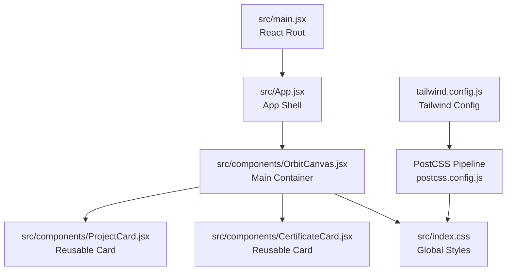
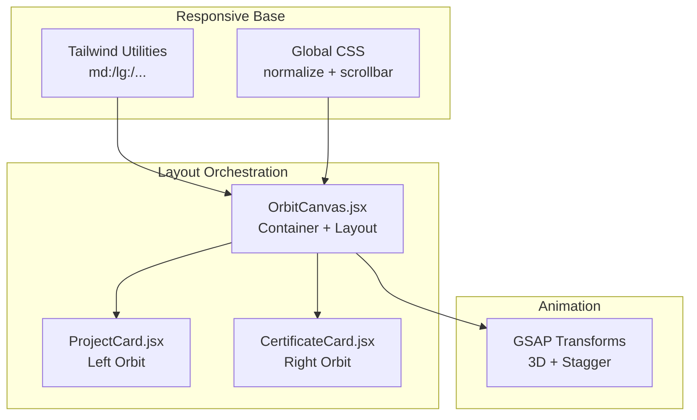
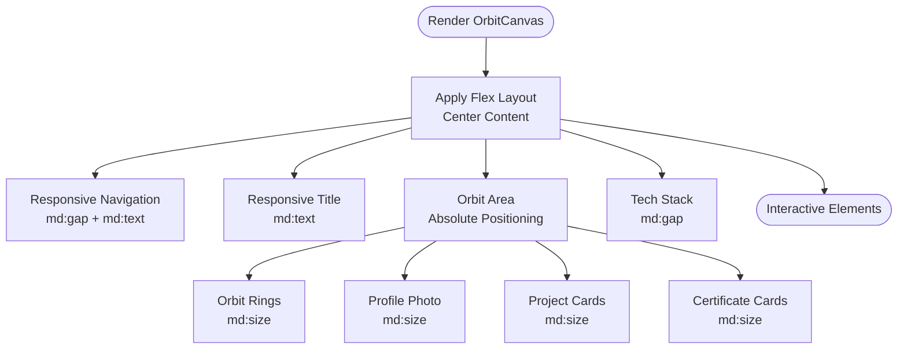
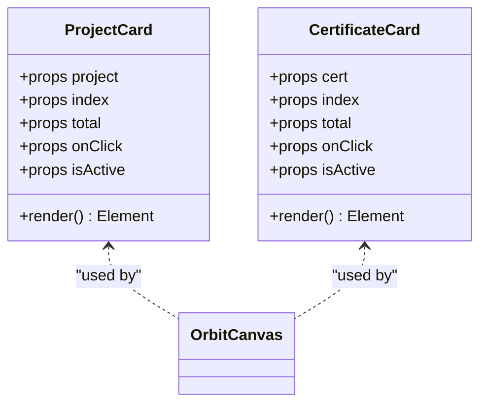
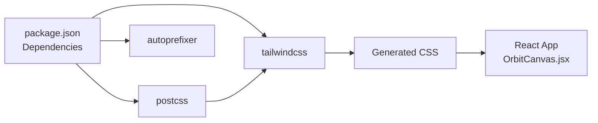

# Responsive Design Patterns

<cite>
**Referenced Files in This Document**
- [tailwind.config.js](file://tailwind.config.js)
- [postcss.config.js](file://postcss.config.js)
- [package.json](file://package.json)
- [src/index.css](file://src/index.css)
- [src/main.jsx](file://src/main.jsx)
- [src/App.jsx](file://src/App.jsx)
- [src/components/OrbitCanvas.jsx](file://src/components/OrbitCanvas.jsx)
- [src/components/ProjectCard.jsx](file://src/components/ProjectCard.jsx)
- [src/components/CertificateCard.jsx](file://src/components/CertificateCard.jsx)
- [desain.md](file://desain.md)
</cite>

## Table of Contents
1. [Introduction](#introduction)
2. [Project Structure](#project-structure)
3. [Core Components](#core-components)
4. [Architecture Overview](#architecture-overview)
5. [Detailed Component Analysis](#detailed-component-analysis)
6. [Dependency Analysis](#dependency-analysis)
7. [Performance Considerations](#performance-considerations)
8. [Troubleshooting Guide](#troubleshooting-guide)
9. [Conclusion](#conclusion)

## Introduction
This document explains how responsive design patterns and a mobile-first approach are implemented in the portfolio project. It focuses on the breakpoint system, adaptive component sizing, flexible layout patterns, and cross-device compatibility strategies. It also documents how Tailwind's responsive utilities are used, media query implementations, and viewport-specific optimizations, along with best practices for maintaining usability across different screen sizes and device orientations.

## Project Structure
The project follows a React + Vite + Tailwind CSS stack with a clear separation of concerns:
- Application entry point initializes React and mounts the root component.
- The main application component renders the OrbitCanvas container.
- OrbitCanvas orchestrates responsive layouts, animations, and interactive elements.
- ProjectCard and CertificateCard are reusable components with responsive sizing and transforms.

**Diagram sources**
- [src/main.jsx:1-11](file://src/main.jsx#L1-L11)
- [src/App.jsx:1-8](file://src/App.jsx#L1-L8)
- [src/components/OrbitCanvas.jsx:1-383](file://src/components/OrbitCanvas.jsx#L1-L383)
- [src/components/ProjectCard.jsx:1-32](file://src/components/ProjectCard.jsx#L1-L32)
- [src/components/CertificateCard.jsx:1-31](file://src/components/CertificateCard.jsx#L1-L31)
- [src/index.css:1-28](file://src/index.css#L1-L28)
- [tailwind.config.js:1-16](file://tailwind.config.js#L1-L16)
- [postcss.config.js:1-7](file://postcss.config.js#L1-L7)

**Section sources**
- [src/main.jsx:1-11](file://src/main.jsx#L1-L11)
- [src/App.jsx:1-8](file://src/App.jsx#L1-L8)
- [src/components/OrbitCanvas.jsx:1-383](file://src/components/OrbitCanvas.jsx#L1-L383)
- [src/components/ProjectCard.jsx:1-32](file://src/components/ProjectCard.jsx#L1-L32)
- [src/components/CertificateCard.jsx:1-31](file://src/components/CertificateCard.jsx#L1-L31)
- [src/index.css:1-28](file://src/index.css#L1-L28)
- [tailwind.config.js:1-16](file://tailwind.config.js#L1-L16)
- [postcss.config.js:1-7](file://postcss.config.js#L1-L7)

## Core Components
This section highlights the responsive patterns implemented across core components.

- Mobile-first responsive utilities:
  - Tailwind responsive prefixes (e.g., md:, lg:) are used extensively to adapt spacing, typography, and sizing on larger screens while keeping defaults minimal for small screens.
  - Example usage appears in navigation, title, profile photo, orbit rings, arrows, and tech stack components.

- Adaptive component sizing:
  - ProjectCard and CertificateCard adjust width and padding using md: variants to accommodate more space on tablets and desktops.
  - The OrbitCanvas container uses relative units (w-full, min-h-screen) and flexbox to remain fluid across devices.

- Flexible layout patterns:
  - Flexbox and absolute positioning are combined to center content and position orbiting cards around the profile photo.
  - Responsive gaps and paddings ensure readable content on smaller screens.

- Cross-device compatibility:
  - Global styles normalize margins/padding and enable smooth scrolling.
  - Scrollbar customization improves readability on desktop devices.
  - Backdrop blur and glass-like borders rely on modern browser support; fallbacks are implicit through opacity and border classes.

**Section sources**
- [src/components/OrbitCanvas.jsx:265-284](file://src/components/OrbitCanvas.jsx#L265-L284)
- [src/components/OrbitCanvas.jsx:305-314](file://src/components/OrbitCanvas.jsx#L305-L314)
- [src/components/OrbitCanvas.jsx:317-342](file://src/components/OrbitCanvas.jsx#L317-L342)
- [src/components/OrbitCanvas.jsx:346-367](file://src/components/OrbitCanvas.jsx#L346-L367)
- [src/components/ProjectCard.jsx:8-12](file://src/components/ProjectCard.jsx#L8-L12)
- [src/components/CertificateCard.jsx:7-11](file://src/components/CertificateCard.jsx#L7-L11)
- [src/index.css:1-28](file://src/index.css#L1-L28)

## Architecture Overview
The responsive architecture centers on Tailwind’s utility-first approach and OrbitCanvas’s layout orchestration. The design system emphasizes:
- A mobile-first baseline with md: and larger breakpoints for enhancements.
- Relative sizing and flexbox for dynamic layouts.
- Transform-based animations that remain performant across devices.

**Diagram sources**
- [src/components/OrbitCanvas.jsx:230-382](file://src/components/OrbitCanvas.jsx#L230-L382)
- [src/components/ProjectCard.jsx:1-32](file://src/components/ProjectCard.jsx#L1-L32)
- [src/components/CertificateCard.jsx:1-31](file://src/components/CertificateCard.jsx#L1-L31)
- [src/index.css:1-28](file://src/index.css#L1-L28)
- [tailwind.config.js:1-16](file://tailwind.config.js#L1-L16)

## Detailed Component Analysis

### OrbitCanvas: Responsive Layout and Interaction
OrbitCanvas serves as the primary responsive container. It applies:
- Full-width and minimum height to occupy the viewport on all devices.
- Flexbox to center content and distribute space between header, orbit area, and footer.
- Responsive spacing and typography using md: variants for improved readability on larger screens.
- Absolute positioning and transforms for the orbiting cards, with md: adjustments for larger screens.

**Diagram sources**
- [src/components/OrbitCanvas.jsx:230-382](file://src/components/OrbitCanvas.jsx#L230-L382)

**Section sources**
- [src/components/OrbitCanvas.jsx:230-382](file://src/components/OrbitCanvas.jsx#L230-L382)

### ProjectCard and CertificateCard: Adaptive Sizing and Transforms
These components demonstrate:
- Responsive width scaling using md: variants for larger screens.
- Consistent vertical distribution and horizontal offsets to create orbital motion.
- Transform-based 3D effects with preserve-3d to maintain depth perception across devices.

**Diagram sources**
- [src/components/ProjectCard.jsx:1-32](file://src/components/ProjectCard.jsx#L1-L32)
- [src/components/CertificateCard.jsx:1-31](file://src/components/CertificateCard.jsx#L1-L31)

**Section sources**
- [src/components/ProjectCard.jsx:1-32](file://src/components/ProjectCard.jsx#L1-L32)
- [src/components/CertificateCard.jsx:1-31](file://src/components/CertificateCard.jsx#L1-L31)

### Breakpoint System and Media Queries
The project relies on Tailwind’s built-in breakpoint system:
- md: applies styles starting at 768px wide.
- lg: applies styles starting at 1024px wide.
- These are used for spacing, typography, and sizing to progressively enhance the layout on larger screens.

Tailwind’s configuration extends animation utilities, which indirectly supports responsive transitions and micro-interactions.

**Section sources**
- [tailwind.config.js:1-16](file://tailwind.config.js#L1-L16)
- [src/components/OrbitCanvas.jsx:265-284](file://src/components/OrbitCanvas.jsx#L265-L284)
- [src/components/OrbitCanvas.jsx:317-342](file://src/components/OrbitCanvas.jsx#L317-L342)

### Flexible Layout Patterns
Flexible layout patterns include:
- Using w-full and min-h-screen to ensure the container fills the viewport on all devices.
- Flexbox for centering and distributing content.
- Absolute positioning for orbiting elements around the central profile photo.
- Responsive gaps and paddings to improve readability on smaller screens.

**Section sources**
- [src/components/OrbitCanvas.jsx:230-382](file://src/components/OrbitCanvas.jsx#L230-L382)

### Viewport-Specific Optimizations
Viewport-related optimizations observed:
- Global normalization and hidden horizontal overflow to prevent unwanted scrollbars.
- Scrollbar customization for enhanced desktop UX.
- Responsive typography and spacing to maintain legibility across devices.

**Section sources**
- [src/index.css:1-28](file://src/index.css#L1-L28)
- [src/components/OrbitCanvas.jsx:265-284](file://src/components/OrbitCanvas.jsx#L265-L284)

## Dependency Analysis
The responsive design pipeline integrates Tailwind CSS and PostCSS with Vite and React:

**Diagram sources**
- [package.json:1-24](file://package.json#L1-L24)
- [postcss.config.js:1-7](file://postcss.config.js#L1-L7)
- [tailwind.config.js:1-16](file://tailwind.config.js#L1-L16)
- [src/components/OrbitCanvas.jsx:1-383](file://src/components/OrbitCanvas.jsx#L1-L383)

**Section sources**
- [package.json:1-24](file://package.json#L1-L24)
- [postcss.config.js:1-7](file://postcss.config.js#L1-L7)
- [tailwind.config.js:1-16](file://tailwind.config.js#L1-L16)
- [src/components/OrbitCanvas.jsx:1-383](file://src/components/OrbitCanvas.jsx#L1-L383)

## Performance Considerations
- Prefer transform-based animations for smoother performance on mobile devices.
- Use relative units and flexbox to minimize reflows and repaints.
- Limit heavy DOM manipulation; leverage Tailwind utilities for layout and GSAP for animations.
- Keep images responsive and appropriately sized to reduce bandwidth on mobile networks.

## Troubleshooting Guide
Common responsive issues and resolutions:
- Text or elements clipped on small screens:
  - Verify responsive padding and gap classes are applied consistently.
  - Ensure global overflow-x is hidden and horizontal scrollbars are controlled.

- Cards overlapping on tablets:
  - Confirm md: sizing classes are present and orbit positions are adjusted accordingly.
  - Check absolute positioning and z-index stacking order.

- Animation stutter on low-end devices:
  - Reduce transform complexity or limit staggered animations.
  - Prefer hardware-accelerated properties (transform, opacity) and avoid layout-affecting properties.

**Section sources**
- [src/index.css:1-28](file://src/index.css#L1-L28)
- [src/components/OrbitCanvas.jsx:230-382](file://src/components/OrbitCanvas.jsx#L230-L382)

## Conclusion
The project implements a robust mobile-first responsive design using Tailwind’s utility classes and a clear layout hierarchy. OrbitCanvas coordinates flexible layouts, adaptive component sizing, and performant animations. By leveraging md: and lg: breakpoints, relative units, and transform-based effects, the interface remains usable and visually appealing across a wide range of devices and orientations.