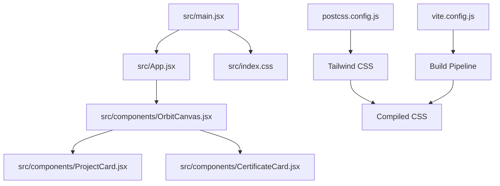
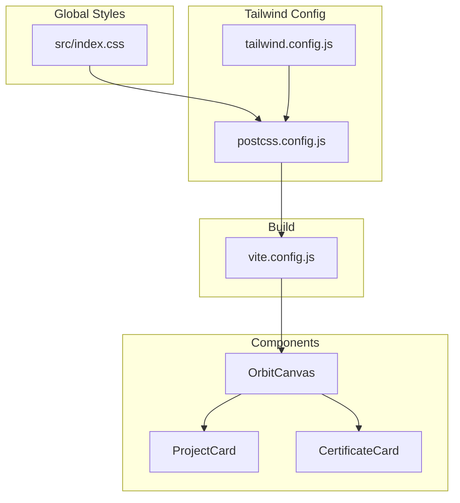
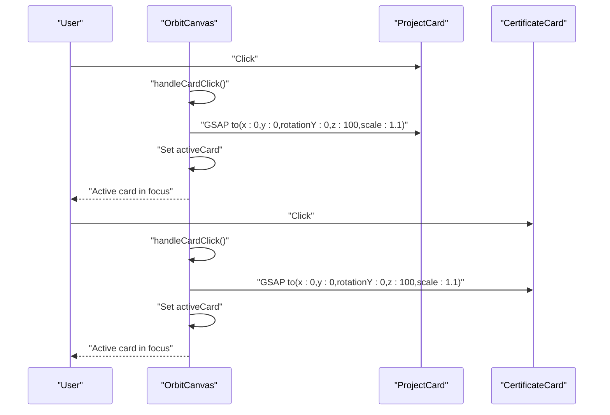
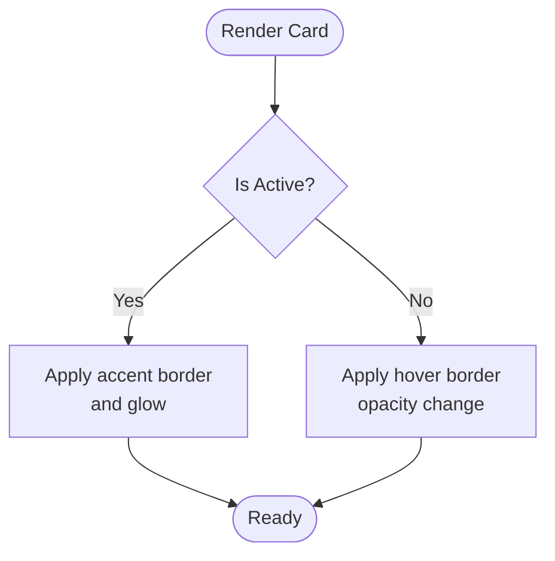
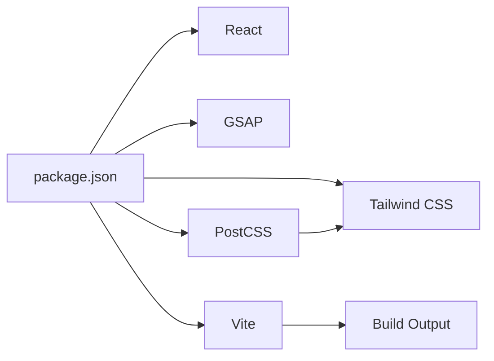

# Styling and Design System

<cite>
**Referenced Files in This Document**
- [tailwind.config.js](file://tailwind.config.js)
- [src/index.css](file://src/index.css)
- [desain.md](file://desain.md)
- [src/components/OrbitCanvas.jsx](file://src/components/OrbitCanvas.jsx)
- [src/components/ProjectCard.jsx](file://src/components/ProjectCard.jsx)
- [src/components/CertificateCard.jsx](file://src/components/CertificateCard.jsx)
- [src/App.jsx](file://src/App.jsx)
- [src/main.jsx](file://src/main.jsx)
- [postcss.config.js](file://postcss.config.js)
- [vite.config.js](file://vite.config.js)
- [package.json](file://package.json)
</cite>

## Table of Contents
1. [Introduction](#introduction)
2. [Project Structure](#project-structure)
3. [Core Components](#core-components)
4. [Architecture Overview](#architecture-overview)
5. [Detailed Component Analysis](#detailed-component-analysis)
6. [Dependency Analysis](#dependency-analysis)
7. [Performance Considerations](#performance-considerations)
8. [Troubleshooting Guide](#troubleshooting-guide)
9. [Conclusion](#conclusion)
10. [Appendices](#appendices)

## Introduction
This document describes the styling and design system for the portfolio project, focusing on the Tailwind CSS implementation, visual design approach, and interactive effects. It covers:
- Dark theme configuration and color palette
- Gradient backgrounds and layered visual effects
- Grid overlay and radial effects
- Border glow and shadow-based highlights
- Responsive design patterns and mobile-first approach
- Typography, spacing, and adaptive component sizing
- Guidelines for maintaining design consistency, extending the design system, and implementing custom visual effects

## Project Structure
The styling pipeline integrates Tailwind CSS with PostCSS and Vite. Styles are authored in CSS and JSX, with Tailwind utilities applied directly in components. The build process compiles Tailwind classes into production-ready styles.

**Diagram sources**
- [src/main.jsx:1-11](file://src/main.jsx#L1-L11)
- [src/App.jsx:1-8](file://src/App.jsx#L1-L8)
- [src/components/OrbitCanvas.jsx:1-382](file://src/components/OrbitCanvas.jsx#L1-L382)
- [src/components/ProjectCard.jsx:1-32](file://src/components/ProjectCard.jsx#L1-L32)
- [src/components/CertificateCard.jsx:1-31](file://src/components/CertificateCard.jsx#L1-L31)
- [src/index.css:1-28](file://src/index.css#L1-L28)
- [postcss.config.js:1-7](file://postcss.config.js#L1-L7)
- [vite.config.js:1-7](file://vite.config.js#L1-L7)

**Section sources**
- [src/main.jsx:1-11](file://src/main.jsx#L1-L11)
- [src/App.jsx:1-8](file://src/App.jsx#L1-L8)
- [postcss.config.js:1-7](file://postcss.config.js#L1-L7)
- [vite.config.js:1-7](file://vite.config.js#L1-L7)

## Core Components
This section documents the foundational design system elements and how they are applied across components.

- Dark theme and base styles
  - Base body background and typography are defined in the global stylesheet.
  - Scrollbar styling uses a teal accent against the dark background.
  - The dark theme establishes a consistent foundation for interactive and animated elements.

- Tailwind configuration and animations
  - Tailwind’s content scanning targets HTML and JSX under src.
  - A custom animation is defined to support slow pulse effects.

- Color palette and accents
  - Teal (#66FCF1) is used for highlights, borders, and glows.
  - Pink/purple (#ff2d78) is used for active states and accents.
  - Dark backgrounds (#0a0a1a, #111827) provide contrast and depth.

- Typography and spacing
  - Inter is the primary font family.
  - Spacing uses relative units and Tailwind utilities for responsive gaps and paddings.
  - Adaptive sizing adjusts for mobile and desktop breakpoints.

- Interactive effects
  - Glowing borders and soft shadows are used to indicate focus and hover states.
  - Backdrop blur and semi-transparent backgrounds create depth without heavy overlays.

**Section sources**
- [src/index.css:1-28](file://src/index.css#L1-L28)
- [tailwind.config.js:1-16](file://tailwind.config.js#L1-L16)
- [src/components/OrbitCanvas.jsx:230-382](file://src/components/OrbitCanvas.jsx#L230-L382)
- [src/components/ProjectCard.jsx:1-32](file://src/components/ProjectCard.jsx#L1-L32)
- [src/components/CertificateCard.jsx:1-31](file://src/components/CertificateCard.jsx#L1-L31)

## Architecture Overview
The design system is implemented through a combination of:
- Global base styles for typography and scrollbars
- Tailwind utilities for layout, colors, and responsive behavior
- Component-level styling for interactive states and layered visuals
- PostCSS/Tailwind build pipeline for production compilation

**Diagram sources**
- [src/index.css:1-28](file://src/index.css#L1-L28)
- [tailwind.config.js:1-16](file://tailwind.config.js#L1-L16)
- [postcss.config.js:1-7](file://postcss.config.js#L1-L7)
- [vite.config.js:1-7](file://vite.config.js#L1-L7)
- [src/components/OrbitCanvas.jsx:1-382](file://src/components/OrbitCanvas.jsx#L1-L382)
- [src/components/ProjectCard.jsx:1-32](file://src/components/ProjectCard.jsx#L1-L32)
- [src/components/CertificateCard.jsx:1-31](file://src/components/CertificateCard.jsx#L1-L31)

## Detailed Component Analysis

### OrbitCanvas: Dark Theme, Gradients, Grid Overlay, and Border Glow
- Dark theme and gradients
  - The canvas uses a dark base background with layered gradient overlays to simulate a cosmic nebula effect.
  - Radial gradients add depth and focus to the composition.
  - These layered backgrounds establish the visual tone for the entire scene.

- Grid overlay
  - A subtle grid overlay is applied using linear gradients and a mask to create a digital/cyber aesthetic.
  - Opacity and sizing are tuned to remain unobtrusive while reinforcing the theme.

- Border glow and focus effects
  - Active cards receive a bright border and a soft glow to indicate focus.
  - Hover states adjust border opacity and subtle transitions enhance interactivity.
  - The profile photo includes a glow behind it to draw attention and unify the composition.

- Responsive design and adaptive sizing
  - Widths and heights adapt for larger screens, with mobile-first defaults scaling up.
  - Breakpoints are handled through Tailwind utilities to ensure readability and usability across devices.

- Interactive states and animations
  - Clicking a card triggers a GSAP animation that brings it forward with scaling and rotation.
  - Navigation arrows and tech stack badges use hover states with color transitions.

**Diagram sources**
- [src/components/OrbitCanvas.jsx:192-226](file://src/components/OrbitCanvas.jsx#L192-L226)
- [src/components/ProjectCard.jsx:1-32](file://src/components/ProjectCard.jsx#L1-L32)
- [src/components/CertificateCard.jsx:1-31](file://src/components/CertificateCard.jsx#L1-L31)

**Section sources**
- [src/components/OrbitCanvas.jsx:230-382](file://src/components/OrbitCanvas.jsx#L230-L382)
- [src/components/OrbitCanvas.jsx:192-226](file://src/components/OrbitCanvas.jsx#L192-L226)

### ProjectCard and CertificateCard: Consistent Styling and Focus States
- Consistent card styling
  - Cards share a similar structure: image header, content area, and rounded corners with backdrop blur.
  - Borders and hover states are defined consistently across both card types.

- Focus and active states
  - Active cards switch to a bright accent border and glow, signaling focus.
  - Non-active cards use translucent borders and subtle hover adjustments.

- Positioning and transforms
  - Cards are positioned absolutely and offset vertically and horizontally to form an orbital arrangement.
  - Rotation and preserve-3d transforms create a sense of depth during animations.

**Diagram sources**
- [src/components/ProjectCard.jsx:1-32](file://src/components/ProjectCard.jsx#L1-L32)
- [src/components/CertificateCard.jsx:1-31](file://src/components/CertificateCard.jsx#L1-L31)

**Section sources**
- [src/components/ProjectCard.jsx:1-32](file://src/components/ProjectCard.jsx#L1-L32)
- [src/components/CertificateCard.jsx:1-31](file://src/components/CertificateCard.jsx#L1-L31)

### Responsive Design Patterns and Mobile-First Approach
- Mobile-first defaults
  - Base sizes and paddings are designed for smaller screens.
  - Upgrades for larger screens use Tailwind’s responsive modifiers.

- Adaptive component sizing
  - Cards increase in width and height on medium and larger screens.
  - Navigation and tech stack elements adjust spacing and icon sizes.

- Breakpoint usage
  - Utilities like md: are used to apply changes at specific screen widths.

**Section sources**
- [src/components/OrbitCanvas.jsx:230-382](file://src/components/OrbitCanvas.jsx#L230-L382)
- [src/components/ProjectCard.jsx:1-32](file://src/components/ProjectCard.jsx#L1-L32)
- [src/components/CertificateCard.jsx:1-31](file://src/components/CertificateCard.jsx#L1-L31)

### Typography, Color Schemes, and Spacing Systems
- Typography
  - Inter is the primary font family for body text.
  - Headings use bold weights and tracking adjustments for emphasis.

- Color scheme
  - Teal (#66FCF1) for highlights, borders, and glows.
  - Pink/purple (#ff2d78) for active states and accents.
  - Dark backgrounds (#0a0a1a, #111827) for contrast and depth.

- Spacing
  - Relative units and Tailwind utilities manage margins, paddings, and gaps.
  - Sections use consistent vertical rhythm with responsive adjustments.

**Section sources**
- [src/index.css:11-15](file://src/index.css#L11-L15)
- [src/components/OrbitCanvas.jsx:230-382](file://src/components/OrbitCanvas.jsx#L230-L382)

## Dependency Analysis
The styling system relies on Tailwind CSS and PostCSS, with Vite orchestrating the build. Dependencies are declared in package.json.

**Diagram sources**
- [package.json:1-24](file://package.json#L1-L24)
- [postcss.config.js:1-7](file://postcss.config.js#L1-L7)
- [vite.config.js:1-7](file://vite.config.js#L1-L7)

**Section sources**
- [package.json:1-24](file://package.json#L1-L24)
- [postcss.config.js:1-7](file://postcss.config.js#L1-L7)
- [vite.config.js:1-7](file://vite.config.js#L1-L7)

## Performance Considerations
- Efficient use of Tailwind utilities reduces CSS bloat while enabling rapid prototyping.
- GSAP animations are scoped to component lifecycles to minimize unnecessary computations.
- Backdrop blur and semi-transparent overlays are used sparingly to maintain rendering performance.
- Layered gradients and grid overlays are kept subtle to avoid heavy repaints.

## Troubleshooting Guide
- Tailwind classes not applying
  - Verify content paths in the Tailwind configuration scan the correct directories.
  - Ensure PostCSS is configured to include Tailwind and Autoprefixer.

- Scrollbar styling not visible
  - Confirm the global stylesheet defines the custom scrollbar styles.
  - Check browser compatibility for pseudo-element styling.

- Animation conflicts
  - Ensure GSAP context is cleaned up on component unmount.
  - Avoid conflicting transforms and z-index stacking.

**Section sources**
- [tailwind.config.js:1-16](file://tailwind.config.js#L1-L16)
- [postcss.config.js:1-7](file://postcss.config.js#L1-L7)
- [src/components/OrbitCanvas.jsx:189-190](file://src/components/OrbitCanvas.jsx#L189-L190)

## Conclusion
The design system combines a cohesive dark theme, layered gradients, subtle grid overlays, and targeted border glows to create a modern, immersive portfolio experience. Tailwind utilities enable rapid development and consistent styling, while responsive patterns and mobile-first defaults ensure accessibility across devices. GSAP animations elevate interactivity without compromising performance.

## Appendices

### Maintaining Design Consistency
- Centralize color tokens and typography scales in shared CSS variables or Tailwind theme extensions.
- Define reusable component variants for cards, buttons, and badges to enforce uniformity.
- Document animation timing and easing to keep motion consistent.

### Extending the Design System
- Add new utilities or theme extensions in Tailwind configuration for frequently used patterns.
- Introduce component-level variants for cards and interactive elements to reduce duplication.
- Use CSS custom properties for theme-aware colors and shadows.

### Implementing Custom Visual Effects
- For layered backgrounds, combine multiple gradients and masks to achieve depth.
- Use backdrop blur and semi-transparent borders to create depth without heavy overlays.
- Leverage GSAP for precise control over transforms, opacity, and timing in interactive states.

**Section sources**
- [tailwind.config.js:7-12](file://tailwind.config.js#L7-L12)
- [src/components/OrbitCanvas.jsx:230-382](file://src/components/OrbitCanvas.jsx#L230-L382)