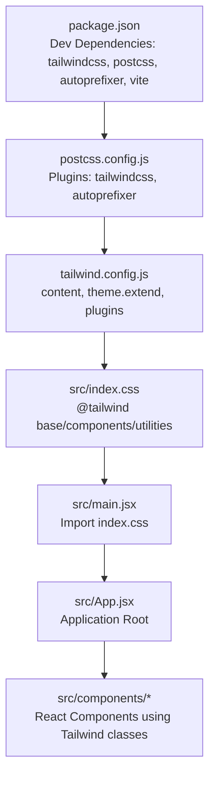
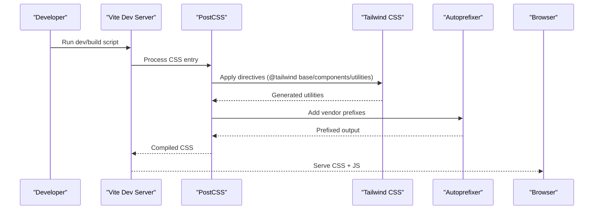
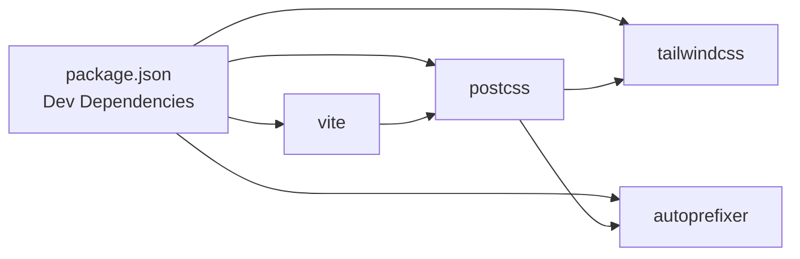

# Tailwind CSS Configuration

<cite>
**Referenced Files in This Document**
- [tailwind.config.js](file://tailwind.config.js)
- [postcss.config.js](file://postcss.config.js)
- [vite.config.js](file://vite.config.js)
- [package.json](file://package.json)
- [src/index.css](file://src/index.css)
- [src/main.jsx](file://src/main.jsx)
- [src/App.jsx](file://src/App.jsx)
- [src/components/OrbitCanvas.jsx](file://src/components/OrbitCanvas.jsx)
- [src/components/ProjectCard.jsx](file://src/components/ProjectCard.jsx)
- [src/components/CertificateCard.jsx](file://src/components/CertificateCard.jsx)
- [desain.md](file://desain.md)
</cite>

## Table of Contents
1. [Introduction](#introduction)
2. [Project Structure](#project-structure)
3. [Core Components](#core-components)
4. [Architecture Overview](#architecture-overview)
5. [Detailed Component Analysis](#detailed-component-analysis)
6. [Dependency Analysis](#dependency-analysis)
7. [Performance Considerations](#performance-considerations)
8. [Troubleshooting Guide](#troubleshooting-guide)
9. [Conclusion](#conclusion)

## Introduction
This document explains the Tailwind CSS configuration and setup for a Vite-powered React application. It covers configuration options, the PostCSS processing pipeline, dark mode considerations, custom color palettes, responsive breakpoints, and the build process integration. It also demonstrates how to extend the design system with custom utilities while maintaining consistency across components.

## Project Structure
The project integrates Tailwind CSS through a minimal configuration and a straightforward PostCSS pipeline managed by Vite. Styles are authored in a single CSS entry file and consumed by the React application.

**Diagram sources**
- [package.json:16-22](file://package.json#L16-L22)
- [postcss.config.js:1-6](file://postcss.config.js#L1-L6)
- [tailwind.config.js:1-15](file://tailwind.config.js#L1-L15)
- [src/index.css:1-28](file://src/index.css#L1-L28)
- [src/main.jsx:1-11](file://src/main.jsx#L1-L11)

**Section sources**
- [package.json:1-24](file://package.json#L1-L24)
- [postcss.config.js:1-7](file://postcss.config.js#L1-L7)
- [tailwind.config.js:1-16](file://tailwind.config.js#L1-L16)
- [src/index.css:1-28](file://src/index.css#L1-L28)
- [src/main.jsx:1-11](file://src/main.jsx#L1-L11)
- [src/App.jsx:1-8](file://src/App.jsx#L1-L8)

## Core Components
- Tailwind Configuration: Defines content scanning paths, theme extensions, and plugin hooks.
- PostCSS Pipeline: Applies Tailwind directives and autoprefixing during build.
- Build Tooling: Vite orchestrates development server, HMR, and production builds.
- Application Styles: Global CSS entry imports Tailwind layers and establishes base styles.

Key configuration highlights:
- Content discovery scans HTML and all TypeScript/JavaScript/JSX/TSX files under src.
- Theme extension adds a custom animation utility.
- Plugins array is empty, indicating no additional Tailwind plugins are enabled.
- PostCSS enables Tailwind and Autoprefixer.
- Vite manages React plugin and build scripts.

**Section sources**
- [tailwind.config.js:1-16](file://tailwind.config.js#L1-L16)
- [postcss.config.js:1-7](file://postcss.config.js#L1-L7)
- [vite.config.js:1-7](file://vite.config.js#L1-L7)
- [package.json:16-22](file://package.json#L16-L22)

## Architecture Overview
The Tailwind pipeline transforms utility classes into optimized CSS through a deterministic flow: Vite invokes PostCSS, which applies Tailwind directives and autoprefixing, then outputs compiled CSS consumed by the React application.

**Diagram sources**
- [postcss.config.js:1-6](file://postcss.config.js#L1-L6)
- [src/index.css:1-3](file://src/index.css#L1-L3)
- [vite.config.js:1-7](file://vite.config.js#L1-L7)

## Detailed Component Analysis

### Tailwind Configuration Options
- Content Discovery: Scans root HTML and all source files under src for class usage.
- Theme Extension: Adds a custom animation utility for slow pulse effects.
- Plugins: No additional plugins are configured.

Implementation references:
- Content paths: [tailwind.config.js:3-6](file://tailwind.config.js#L3-L6)
- Custom animation utility: [tailwind.config.js:8-12](file://tailwind.config.js#L8-L12)
- Plugins array: [tailwind.config.js:14](file://tailwind.config.js#L14)

**Section sources**
- [tailwind.config.js:1-16](file://tailwind.config.js#L1-L16)

### PostCSS Processing Pipeline
- Plugins: Tailwind CSS and Autoprefixer are enabled.
- Order: Tailwind runs first to generate utilities, followed by autoprefixer for vendor compatibility.

References:
- Plugin configuration: [postcss.config.js:1-6](file://postcss.config.js#L1-L6)

**Section sources**
- [postcss.config.js:1-7](file://postcss.config.js#L1-L7)

### CSS Compilation Workflow
- Global Styles Entry: Imports Tailwind layers and sets base styles.
- Base Reset and Typography: Establishes global resets and body styles.
- Scrollbar Customization: Adds a custom webkit scrollbar theme.

References:
- Tailwind layers: [src/index.css:1-3](file://src/index.css#L1-L3)
- Base reset and body: [src/index.css:5-15](file://src/index.css#L5-L15)
- Scrollbar customization: [src/index.css:17-27](file://src/index.css#L17-L27)

**Section sources**
- [src/index.css:1-28](file://src/index.css#L1-L28)

### Dark Mode Implementation
- Current Setup: The project does not enable Tailwind's dark mode strategy in configuration.
- Color Palette: Uses hardcoded hex values in components and global CSS for a cohesive dark theme.
- Practical Approach: Components consistently apply dark backgrounds and teal accents.

Evidence:
- Tailwind config lacks dark mode strategy: [tailwind.config.js:1-16](file://tailwind.config.js#L1-L16)
- Global dark background: [src/index.css:11-15](file://src/index.css#L11-L15)
- Teal accent usage across components: [src/components/OrbitCanvas.jsx:259-262](file://src/components/OrbitCanvas.jsx#L259-L262), [src/components/ProjectCard.jsx:10-11](file://src/components/ProjectCard.jsx#L10-L11), [src/components/CertificateCard.jsx:9-10](file://src/components/CertificateCard.jsx#L9-L10)

**Section sources**
- [tailwind.config.js:1-16](file://tailwind.config.js#L1-L16)
- [src/index.css:11-15](file://src/index.css#L11-L15)
- [src/components/OrbitCanvas.jsx:259-262](file://src/components/OrbitCanvas.jsx#L259-L262)
- [src/components/ProjectCard.jsx:10-11](file://src/components/ProjectCard.jsx#L10-L11)
- [src/components/CertificateCard.jsx:9-10](file://src/components/CertificateCard.jsx#L9-L10)

### Custom Color Palette Configuration
- Hardcoded Palette: The design relies on specific hex values for backgrounds, borders, and accents.
- Consistency Across Components: Teal (#66FCF1) and magenta (#ff2d78) are used as primary accents.

Examples:
- Teal grid overlay: [src/components/OrbitCanvas.jsx:259-262](file://src/components/OrbitCanvas.jsx#L259-L262)
- Accent borders and shadows: [src/components/ProjectCard.jsx:10-11](file://src/components/ProjectCard.jsx#L10-L11), [src/components/CertificateCard.jsx:9-10](file://src/components/CertificateCard.jsx#L9-L10)
- Body background: [src/index.css:11-15](file://src/index.css#L11-L15)

**Section sources**
- [src/components/OrbitCanvas.jsx:259-262](file://src/components/OrbitCanvas.jsx#L259-L262)
- [src/components/ProjectCard.jsx:10-11](file://src/components/ProjectCard.jsx#L10-L11)
- [src/components/CertificateCard.jsx:9-10](file://src/components/CertificateCard.jsx#L9-L10)
- [src/index.css:11-15](file://src/index.css#L11-L15)

### Responsive Breakpoint Definitions
- Tailwind Defaults: Breakpoints are inherited from Tailwind’s default configuration.
- Usage Patterns: Components leverage responsive variants (e.g., md: for larger screens) to adapt layout and typography.

Evidence:
- Responsive navigation spacing: [src/components/OrbitCanvas.jsx:265](file://src/components/OrbitCanvas.jsx#L265)
- Responsive card sizes: [src/components/OrbitCanvas.jsx:316-341](file://src/components/OrbitCanvas.jsx#L316-L341)
- Responsive tech stack sizing: [src/components/OrbitCanvas.jsx:345-366](file://src/components/OrbitCanvas.jsx#L345-L366)

**Section sources**
- [src/components/OrbitCanvas.jsx:265](file://src/components/OrbitCanvas.jsx#L265)
- [src/components/OrbitCanvas.jsx:316-341](file://src/components/OrbitCanvas.jsx#L316-L341)
- [src/components/OrbitCanvas.jsx:345-366](file://src/components/OrbitCanvas.jsx#L345-L366)

### Extending the Design System with Custom Utilities
- Animation Utility: A custom slow pulse animation is added via theme extension.
- Usage Example: Applied to a profile element in the Orbit Canvas component.

References:
- Custom animation definition: [tailwind.config.js:8-12](file://tailwind.config.js#L8-L12)
- Animation usage: [desain.md:51](file://desain.md#L51)

**Section sources**
- [tailwind.config.js:8-12](file://tailwind.config.js#L8-L12)
- [desain.md:51](file://desain.md#L51)

### Build Process Integration
- Scripts: Development, build, and preview commands are defined in package.json.
- Vite Configuration: React plugin is enabled; no additional Tailwind/Vite-specific configuration is present.
- CSS Entry Import: The global CSS file is imported in the main application entry.

References:
- Scripts: [package.json:6-10](file://package.json#L6-L10)
- Vite config: [vite.config.js:1-7](file://vite.config.js#L1-L7)
- CSS import: [src/main.jsx:4](file://src/main.jsx#L4)

**Section sources**
- [package.json:6-10](file://package.json#L6-L10)
- [vite.config.js:1-7](file://vite.config.js#L1-L7)
- [src/main.jsx:4](file://src/main.jsx#L4)

## Dependency Analysis
Tailwind CSS depends on PostCSS and Autoprefixer to generate prefixed utilities. Vite coordinates the build process and serves the compiled output.

**Diagram sources**
- [package.json:16-22](file://package.json#L16-L22)
- [postcss.config.js:1-6](file://postcss.config.js#L1-L6)

**Section sources**
- [package.json:16-22](file://package.json#L16-L22)
- [postcss.config.js:1-7](file://postcss.config.js#L1-L7)

## Performance Considerations
- Purge Unused Styles: Ensure content paths in Tailwind configuration cover all template locations to allow efficient purging in production.
- Minification: Leverage Vite’s production build for minification and asset optimization.
- Critical Rendering: Keep base and component styles scoped to avoid unnecessary repaints.

## Troubleshooting Guide
- Utilities Not Applying:
  - Verify content paths include all relevant files: [tailwind.config.js:3-6](file://tailwind.config.js#L3-L6)
  - Confirm Tailwind layers are imported in the CSS entry: [src/index.css:1-3](file://src/index.css#L1-L3)
- Dark Mode Not Activating:
  - Tailwind’s dark mode strategy is not configured; consider enabling it if desired: [tailwind.config.js:1-16](file://tailwind.config.js#L1-L16)
- Autoprefixing Issues:
  - Ensure Autoprefixer is enabled in PostCSS: [postcss.config.js:1-6](file://postcss.config.js#L1-L6)
- Build Failures:
  - Confirm Vite and required plugins are installed: [package.json:16-22](file://package.json#L16-L22), [vite.config.js:1-7](file://vite.config.js#L1-L7)

**Section sources**
- [tailwind.config.js:3-6](file://tailwind.config.js#L3-L6)
- [src/index.css:1-3](file://src/index.css#L1-L3)
- [tailwind.config.js:1-16](file://tailwind.config.js#L1-L16)
- [postcss.config.js:1-6](file://postcss.config.js#L1-L6)
- [package.json:16-22](file://package.json#L16-L22)
- [vite.config.js:1-7](file://vite.config.js#L1-L7)

## Conclusion
The project employs a clean, minimal Tailwind setup integrated with Vite and PostCSS. While dark mode and advanced theme customization are not explicitly configured, the design system maintains consistency through a shared color palette and responsive patterns. Extensibility is achieved via theme extensions (e.g., custom animations) and component-level utility usage. For production deployments, ensure content paths are accurate and rely on Vite’s build pipeline for optimization.