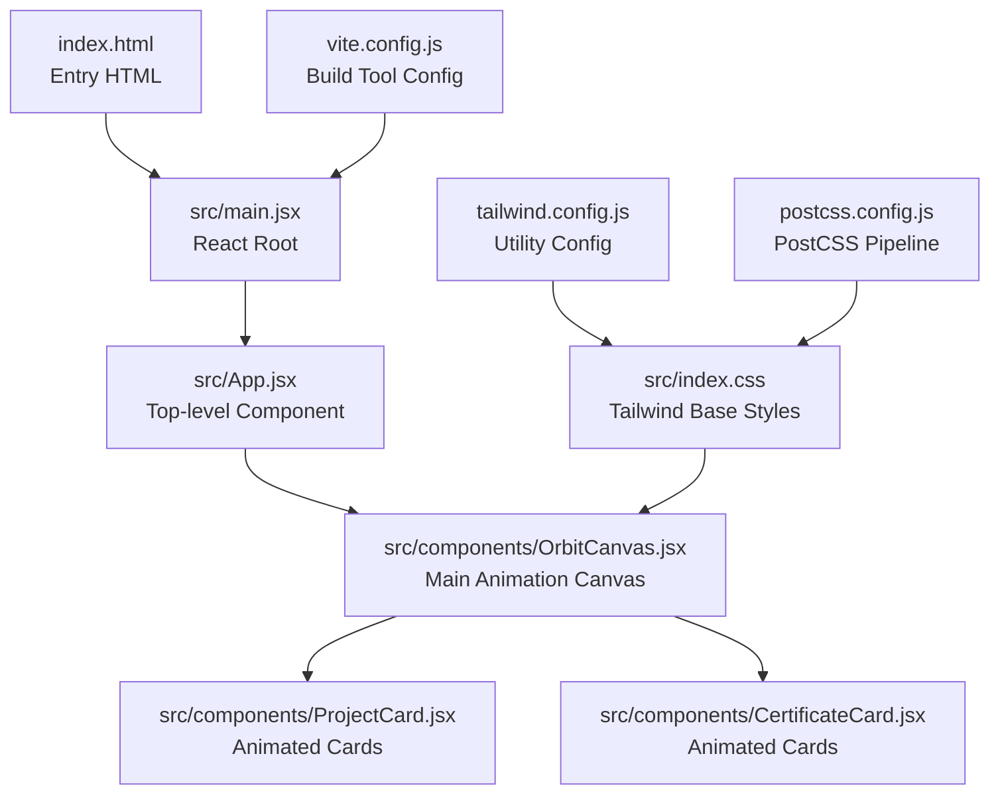
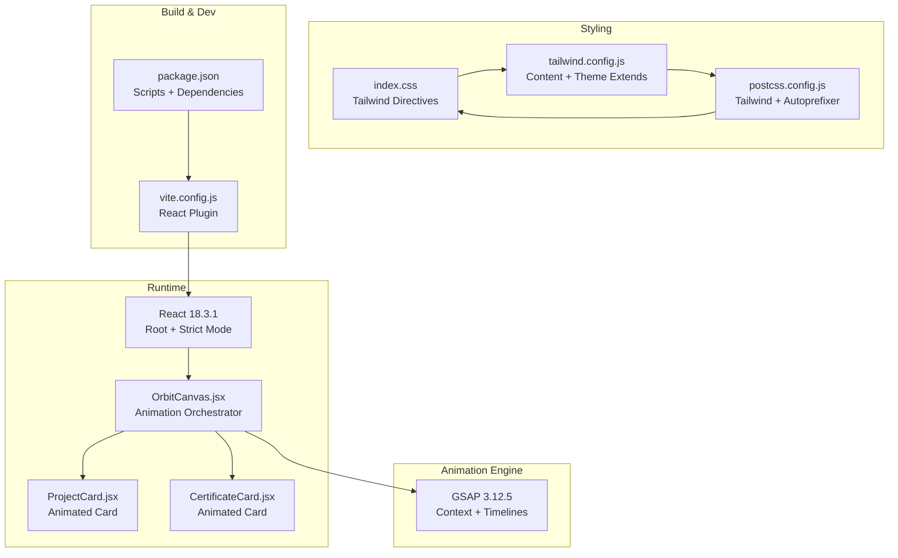
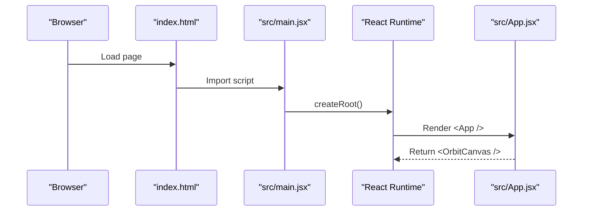
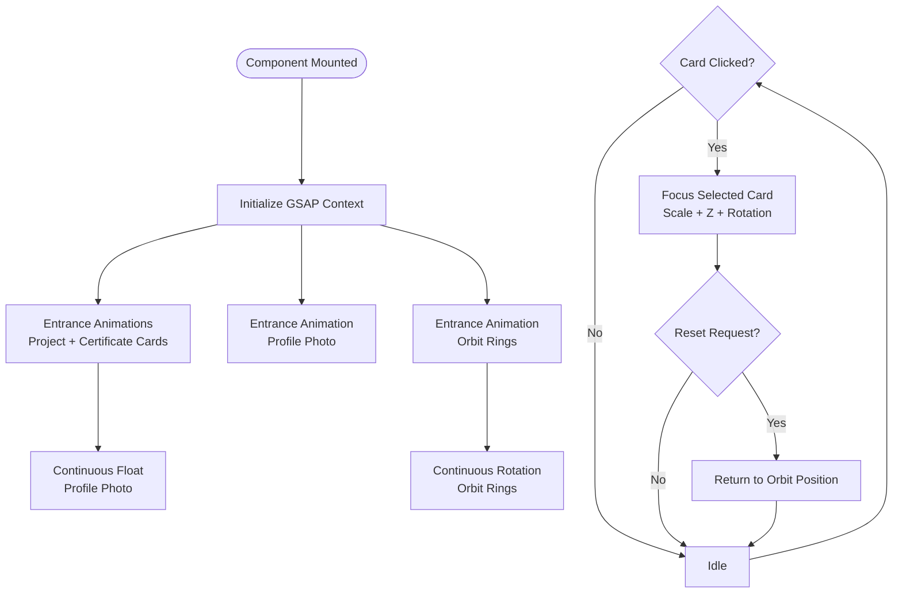
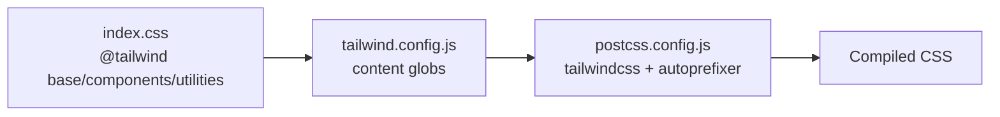
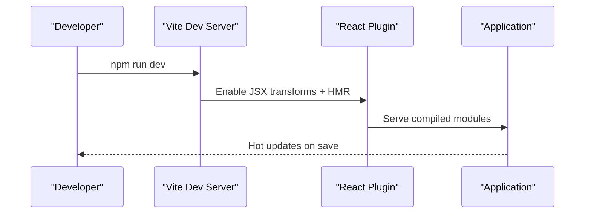
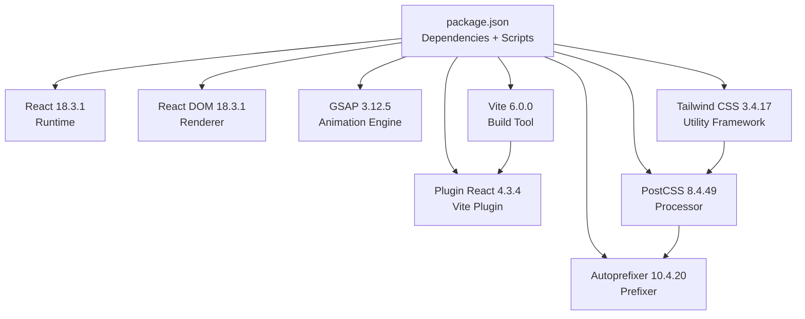

# Technology Stack

<cite>
**Referenced Files in This Document**
- [package.json](file://package.json)
- [vite.config.js](file://vite.config.js)
- [tailwind.config.js](file://tailwind.config.js)
- [postcss.config.js](file://postcss.config.js)
- [index.html](file://index.html)
- [src/main.jsx](file://src/main.jsx)
- [src/App.jsx](file://src/App.jsx)
- [src/index.css](file://src/index.css)
- [src/components/OrbitCanvas.jsx](file://src/components/OrbitCanvas.jsx)
- [src/components/ProjectCard.jsx](file://src/components/ProjectCard.jsx)
- [src/components/CertificateCard.jsx](file://src/components/CertificateCard.jsx)
- [desain.md](file://desain.md)
</cite>

## Table of Contents
1. [Introduction](#introduction)
2. [Project Structure](#project-structure)
3. [Core Technologies](#core-technologies)
4. [Architecture Overview](#architecture-overview)
5. [Detailed Component Analysis](#detailed-component-analysis)
6. [Dependency Analysis](#dependency-analysis)
7. [Performance Considerations](#performance-considerations)
8. [Troubleshooting Guide](#troubleshooting-guide)
9. [Conclusion](#conclusion)

## Introduction
This document explains the technology stack powering the React portfolio project. It focuses on the integration and rationale behind React 18.3.1, GSAP 3.12.5, Vite 6.0.0, and Tailwind CSS 3.4.17. The stack emphasizes modern frontend performance, developer productivity, and visually engaging animations. The project demonstrates practical usage of these technologies in a single-page application with animated orbital layouts and interactive card experiences.

## Project Structure
The project follows a conventional React application layout with a focus on component-driven UI and utility-first styling. Key elements:
- Entry point initializes React and mounts the root component.
- A single-page layout renders an orbital canvas with animated cards.
- Utility-first CSS via Tailwind integrates seamlessly with component styling.
- Build tooling powered by Vite for fast development and optimized production builds.

**Diagram sources**
- [index.html:1-14](file://index.html#L1-L14)
- [src/main.jsx:1-11](file://src/main.jsx#L1-L11)
- [src/App.jsx:1-8](file://src/App.jsx#L1-L8)
- [src/components/OrbitCanvas.jsx:1-382](file://src/components/OrbitCanvas.jsx#L1-L382)
- [src/components/ProjectCard.jsx:1-32](file://src/components/ProjectCard.jsx#L1-L32)
- [src/components/CertificateCard.jsx:1-31](file://src/components/CertificateCard.jsx#L1-L31)
- [src/index.css:1-28](file://src/index.css#L1-L28)
- [vite.config.js:1-7](file://vite.config.js#L1-L7)
- [tailwind.config.js:1-16](file://tailwind.config.js#L1-L16)
- [postcss.config.js:1-7](file://postcss.config.js#L1-L7)

**Section sources**
- [index.html:1-14](file://index.html#L1-L14)
- [src/main.jsx:1-11](file://src/main.jsx#L1-L11)
- [src/App.jsx:1-8](file://src/App.jsx#L1-L8)
- [src/index.css:1-28](file://src/index.css#L1-L28)
- [vite.config.js:1-7](file://vite.config.js#L1-L7)
- [tailwind.config.js:1-16](file://tailwind.config.js#L1-L16)
- [postcss.config.js:1-7](file://postcss.config.js#L1-L7)

## Core Technologies
This section documents each technology’s role, configuration, and integration patterns.

### React 18.3.1
- Purpose: Declarative UI rendering and component lifecycle management.
- Integration: Single entry point mounts the root component under strict mode for enhanced error detection during development.
- Version alignment: Matches the project’s dependency specification.

Key integration points:
- Root initialization and strict mode activation.
- Composition of top-level components and child components.

**Section sources**
- [src/main.jsx:1-11](file://src/main.jsx#L1-L11)
- [src/App.jsx:1-8](file://src/App.jsx#L1-L8)
- [package.json:11-15](file://package.json#L11-L15)

### GSAP 3.12.5
- Purpose: High-performance animation engine for motion graphics and interactive transitions.
- Integration: Used extensively in the orbital canvas to orchestrate entrance, hover, and click animations across cards and profile elements.
- Version alignment: Matches the project’s dependency specification.

Key integration points:
- Initialization of GSAP context for scoped animations.
- Entrance animations for cards and profile photo.
- Continuous floating and orbit rotations.
- Interactive click animations for card selection.

**Section sources**
- [src/components/OrbitCanvas.jsx:1-382](file://src/components/OrbitCanvas.jsx#L1-L382)
- [package.json:14](file://package.json#L14)
- [desain.md:229-381](file://desain.md#L229-L381)

### Vite 6.0.0
- Purpose: Fast build tool and dev server enabling instant hot module replacement and optimized production bundles.
- Integration: Minimal configuration enables React plugin and serves the app locally with zero-config defaults.
- Scripts: Provides dev, build, and preview commands aligned with typical React workflows.

Key integration points:
- Plugin configuration for React JSX transformations.
- Development server and build pipeline.

**Section sources**
- [package.json:6-10](file://package.json#L6-L10)
- [vite.config.js:1-7](file://vite.config.js#L1-L7)
- [package.json:17](file://package.json#L17)

### Tailwind CSS 3.4.17
- Purpose: Utility-first CSS framework enabling rapid UI development with minimal custom styles.
- Integration: Base, components, and utilities are included at the project level. PostCSS pipeline processes Tailwind directives and autoprefixing.
- Customization: Tailwind content globs scan HTML and JSX files. Theme extensions add custom animations.

Key integration points:
- Global CSS inclusion and base styles.
- Tailwind configuration scanning source files and extending theme.
- PostCSS pipeline integrating Tailwind and autoprefixer.

**Section sources**
- [src/index.css:1-28](file://src/index.css#L1-L28)
- [tailwind.config.js:1-16](file://tailwind.config.js#L1-L16)
- [postcss.config.js:1-7](file://postcss.config.js#L1-L7)
- [package.json:19](file://package.json#L19)

## Architecture Overview
The application architecture centers around a single-page layout orchestrated by React. The orbital canvas composes multiple animated components, while Tailwind provides responsive and utility-driven styling. Vite manages the build pipeline, and GSAP powers the motion layer.

**Diagram sources**
- [src/main.jsx:1-11](file://src/main.jsx#L1-L11)
- [src/App.jsx:1-8](file://src/App.jsx#L1-L8)
- [src/components/OrbitCanvas.jsx:1-382](file://src/components/OrbitCanvas.jsx#L1-L382)
- [src/components/ProjectCard.jsx:1-32](file://src/components/ProjectCard.jsx#L1-L32)
- [src/components/CertificateCard.jsx:1-31](file://src/components/CertificateCard.jsx#L1-L31)
- [src/index.css:1-28](file://src/index.css#L1-L28)
- [tailwind.config.js:1-16](file://tailwind.config.js#L1-L16)
- [postcss.config.js:1-7](file://postcss.config.js#L1-L7)
- [vite.config.js:1-7](file://vite.config.js#L1-L7)
- [package.json:6-22](file://package.json#L6-L22)

## Detailed Component Analysis

### React 18.3.1 Integration
- Strict Mode: Ensures robust component development by surfacing potential issues early.
- Root Mounting: Creates a root and mounts the App component inside a strict mode wrapper.
- Component Composition: App delegates rendering to the orbital canvas, which encapsulates complex animations and interactions.

**Diagram sources**
- [index.html:1-14](file://index.html#L1-L14)
- [src/main.jsx:1-11](file://src/main.jsx#L1-L11)
- [src/App.jsx:1-8](file://src/App.jsx#L1-L8)

**Section sources**
- [src/main.jsx:1-11](file://src/main.jsx#L1-L11)
- [src/App.jsx:1-8](file://src/App.jsx#L1-L8)

### GSAP 3.12.5 Animation Orchestration
- Context Scoping: Uses GSAP context to automatically clean up timelines and avoid conflicts when components unmount.
- Entrance Animations: Applies staggered entrance effects for project and certificate cards, along with profile photo and orbit rings.
- Continuous Animations: Implements floating and slow rotation effects for profile and orbit rings.
- Interactive Transitions: Handles card click events to bring selected cards to the front with scaling and rotation adjustments.

**Diagram sources**
- [src/components/OrbitCanvas.jsx:101-190](file://src/components/OrbitCanvas.jsx#L101-L190)
- [src/components/OrbitCanvas.jsx:192-226](file://src/components/OrbitCanvas.jsx#L192-L226)

**Section sources**
- [src/components/OrbitCanvas.jsx:1-382](file://src/components/OrbitCanvas.jsx#L1-L382)
- [desain.md:229-381](file://desain.md#L229-L381)

### Tailwind CSS 3.4.17 Styling Strategy
- Base Styles: Resets margins/padding and sets global typography and background.
- Utilities: Leverages Tailwind utilities for responsive layouts, borders, shadows, and gradients.
- Theme Extensions: Adds a custom pulse animation for subtle motion.
- Content Scanning: Tailwind scans HTML and JSX files to purge unused styles in production.

**Diagram sources**
- [src/index.css:1-28](file://src/index.css#L1-L28)
- [tailwind.config.js:3-6](file://tailwind.config.js#L3-L6)
- [postcss.config.js:1-7](file://postcss.config.js#L1-L7)

**Section sources**
- [src/index.css:1-28](file://src/index.css#L1-L28)
- [tailwind.config.js:1-16](file://tailwind.config.js#L1-L16)
- [postcss.config.js:1-7](file://postcss.config.js#L1-L7)

### Vite 6.0.0 Build Pipeline
- Plugins: React plugin enables JSX transforms and fast refresh.
- Scripts: Provides dev, build, and preview scripts for local development and production bundling.
- Configuration: Minimal configuration reduces boilerplate and accelerates iteration.

**Diagram sources**
- [package.json:6-10](file://package.json#L6-L10)
- [vite.config.js:1-7](file://vite.config.js#L1-L7)

**Section sources**
- [package.json:6-10](file://package.json#L6-L10)
- [vite.config.js:1-7](file://vite.config.js#L1-L7)

## Dependency Analysis
The project maintains a focused set of runtime and development dependencies. The following diagram illustrates key relationships among technologies and their roles.

**Diagram sources**
- [package.json:6-22](file://package.json#L6-L22)

**Section sources**
- [package.json:6-22](file://package.json#L6-L22)

## Performance Considerations
- React 18.3.1: Benefits from concurrent rendering and automatic batching, improving responsiveness during animations.
- GSAP 3.12.5: Offers GPU-accelerated transforms and efficient timeline management, minimizing layout thrash.
- Vite 6.0.0: Provides instant server start-up, optimized chunking, and tree-shaking for lean production bundles.
- Tailwind CSS 3.4.17: Utility classes reduce CSS bloat; purging unused styles improves runtime performance.

## Troubleshooting Guide
Common issues and resolutions:
- Animation conflicts or leaks: Ensure GSAP context is used to scope timelines and revert them on unmount.
- Tailwind utilities not applying: Verify content globs in Tailwind configuration include JSX files and confirm PostCSS pipeline is active.
- Vite dev server not hot-reloading: Confirm the React plugin is enabled and scripts are executed via package.json.
- Build errors in production: Validate Tailwind purge settings and ensure all source files are scanned.

**Section sources**
- [src/components/OrbitCanvas.jsx:189-190](file://src/components/OrbitCanvas.jsx#L189-L190)
- [tailwind.config.js:3-6](file://tailwind.config.js#L3-L6)
- [postcss.config.js:1-7](file://postcss.config.js#L1-L7)
- [vite.config.js:1-7](file://vite.config.js#L1-L7)
- [package.json:6-10](file://package.json#L6-L10)

## Conclusion
The technology stack combines React 18.3.1, GSAP 3.12.5, Vite 6.0.0, and Tailwind CSS 3.4.17 to deliver a modern, performant, and visually compelling portfolio experience. React provides a robust component model, GSAP powers smooth and precise animations, Vite streamlines development and build processes, and Tailwind accelerates styling with utility-first primitives. Together, they form a cohesive, scalable foundation suitable for interactive web applications.